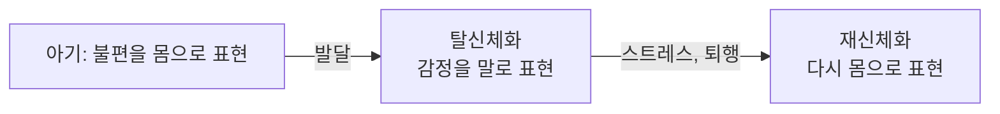



요약

몸이 실제로 아프거나 불편한데, 그 증상에 대한 걱정과 거기에 쏟는 시간이 지나쳐 삶 전체가 증상을 중심으로 돌아가는 장애다. 문제는 증상 자체보다 증상을 대하는 생각과 행동이다. 환자는 진짜로 괴롭고, 일부러 꾸미는 것이 아니다. 다만 "마음의 문제"라는 설명을 잘 받아들이지 않고 병원을 전전해서, 치료가 어렵기로 알려져 있다.

## 예시로 보기

40대 ET는 3년째 두통, 소화불량, 허리 통증을 번갈아 겪는다. 검사에서는 큰 이상이 없다고 하지만 "뭔가 놓친 게 있다"며 한 해에 병원 열 곳을 옮겨 다녔다. 하루에 몇 시간씩 증상을 검색하고, 가족에게 아프다고 말하면 가족이 집안일을 대신해 준다. ET는 속상한 일이 있어도 "속상하다"는 말 대신 "속이 쓰리다"고 말한다[^s1].

- 괴로운 신체 증상이 하나 이상 있다.
- 증상의 심각성에 대한 생각, 건강 불안, 증상에 쓰는 시간이 지나치다.
- 6개월 넘게 이어진다.
- 가족의 배려가 이차적 이득이 되고, 감정을 몸의 말로 표현한다.

## 정의

신체증상장애의 진단기준[^1]

- 고통스럽거나 일상에 지장을 주는 신체 증상이 1개 이상 있다. 대부분 통증을 비롯해 여러 증상을 호소한다.
- 신체 증상에 대한 과도한 걱정이나 건강 염려가 다음 가운데 하나 이상으로 나타난다.
    1. 증상의 심각성에 대한 과도한 생각
    2. 건강과 증상에 대한 높은 수준의 불안
    3. 증상과 건강 염려에 과도한 시간을 씀
- 신체 증상과 과도한 걱정이 6개월 이상 이어진다.

증상 하나하나가 계속 있을 필요는 없다. 증상은 바뀌어도 "증상이 있는 상태"가 6개월 넘게 이어지면 된다[^s2].

### 핵심 증상[^2]

- **다양한 신체 증상:** 가장 흔한 증상은 통증이다. 특정 부위의 통증처럼 구체적일 수도, 피로감처럼 막연할 수도 있다. 정상적인 신체 감각이나 불편감을 호소하며 걱정하는 경우도 흔하다.
- **건강에 대한 집착:** 건강 문제가 삶에서 중요한 역할을 하고, 그 사람의 정체성처럼 된다. 주변 사람과의 관계를 조종하는 기능도 한다. 여러 의사를 찾아다니는 의사쇼핑(doctor shopping)을 한다.

### 임상적 특징[^3]

- 시점 유병률 4~6%(APA, 2022).
- 여성에게 더 많고, 사회경제적·교육적 수준이 낮은 계층에 많다.
- 주로 아동·청소년기에 시작하고 만성화된다. 아동은 대개 한 가지 뚜렷한 증상을 호소한다.
- 심리적 원인을 받아들이지 않고 의사쇼핑, 병원쇼핑을 한다.
- 아시아, 아프리카 인종에게 더 흔하다.

## 원인

### 1. 생물학적 입장[^4]

유전적 요인은 불분명하거나 작다. 스트레스에 반응하는 신체 기관이나 생리적 반응이 사람마다 다르다. 어떤 사람은 스트레스를 받으면 위가, 어떤 사람은 머리가 아프다.

### 2. 정신분석적 입장[^4]

억압된 감정이 몸으로 표현된 것이다.

- **신체화(somatization):** 방어기제이자 의사소통 방식이다. 말로 할 수 없는 감정을 몸이 대신 말한다.
- **재신체화(resomatization):** 어린 시절에 익숙했던 신체 반응으로 감정을 표현하는 일종의 퇴행이다. 아기는 불편을 몸으로 드러내고, 자라면서 감정을 말과 생각으로 다루는 법을 익힌다(탈신체화, desomatization). 스트레스가 커지면 다시 몸의 표현으로 돌아간다[^s3].
- **감정표현 불능증(alexithymia):** 자신의 감정을 정확히 알아차리고 표현하지 못한다.

### 3. 행동주의적 입장[^5][^6]

신체 증상은 바깥 환경이 강화한 것이다. 관찰학습이나 모방학습으로 배우기도 한다.

| 이득 | 뜻 | 예 |
|---|---|---|
| 일차적 이득(primary gain) | 증상을 만들어 심리적 고통을 직접 덜어 내는 이득 | 불안을 증상으로 바꾸어 마음이 편해진다 |
| 이차적 이득(secondary gain) | 증상 덕분에 부수적으로 얻는 이득 | 관심, 돈, 책임 회피 같은 외부 보상 |

신체 증상을 강화하는 요인은 여섯 가지다.

1. 신체 증상으로 대신해 불쾌감을 피한다.
2. 신체 증상으로 자신의 괴로움과 분노를 남에게 전한다.
3. 다른 사람의 동정과 관심을 끌어낸다.
4. 현실적인 의무와 책임에서 벗어난다.
5. 원하는 것을 얻으려고 다른 사람을 조종한다.
6. 경제적 이득(예: 피해보상금).

### 4. 인지적 입장[^7]

- 건강에 대한 경직된 신념: "건강하려면 신체 증상이 하나도 없어야 한다."
- 주의편향(attention bias): 신체 감각에 예민하게 주의를 기울인다.
- 증폭 지각(symptom amplification): 신체 감각이나 증상을 실제보다 크게 느낀다.
- 귀인 오류(attribution error): 신체 감각의 원인을 신체 질병으로 돌린다.

이 네 가지는 서로를 키우는 고리를 이룬다[^s4].

### 5. 사회문화적 입장[^8][^9]

- **양육 방식과 환경:** 자녀가 아플 때 부모의 대응 방식(예: 부모의 과잉 반응), 건강과 질병에 대한 부모의 견해, 감정을 알아차리고 처리하지 못하는 부모, 부정적 감정 표현을 지나치게 억누르는 가정.
- **동양 문화권에서 신체화가 더 두드러진다.**
    - 몸과 마음을 하나로 보는 한국인의 견해(한의학).
    - 신체화 표현 어휘가 발달했다. 예: "배 아파"(질투), "뚜껑 열릴 것 같아"(분노)[^s7].
    - 심리적 문제보다 신체 증상에 허용적이다. "마음이 아파요"보다 "감기 걸렸어"가 말하기 쉽다.
    - 부정적 감정을 자유롭게 표현하지 못하게 하는 분위기.
    - **화병(Hwa-Byung):** 신체화, 우울, 분노가 겹친 상태다. 억눌린 분노가 가슴의 답답함과 열감 같은 몸의 증상으로 나타난다[^s5].

## 치료[^10][^11]

치료가 매우 어려운 장애로 알려져 있다. 환자가 심리적 요인을 부정해 심리치료에 저항하기 때문이다.

- **심리치료의 기본 원칙:** 신뢰관계 형성, 신체증상장애의 특성 교육, 심리적 갈등이나 부정 감정의 표현과 해소, 자기주장훈련과 대인관계훈련, 가족이나 주변 사람의 강화 방지.
- **인지행동치료가 가장 효과적이다.**
    - 신체 증상과 정서 사이의 관계를 알아차리게 한다.
    - 신체적 흥분을 줄이는 이완 훈련.
    - 신체 감각이나 통증에 대한 과도한 주의를 줄인다.
    - 증상에 대한 과장되고 왜곡된 해석 대신 대안적 해석을 찾게 한다.
    - 증상에 대한 믿음을 바꾸는 행동 실험.
    - 가족이 질병 행동을 강화하는 요인을 줄인다.

## 스스로 설명해 보기

1. "신체화는 방어기제이자 의사소통 방식이다."
   

근거

   방어기제인 이유: 받아들이기 힘든 감정을 의식하지 않고 몸의 증상으로 바꾸어 불안을 던다(일차적 이득). 의사소통인 이유: "나 힘들어"를 직접 말하지 못하는 사람이 "나 아파"로 괴로움과 분노를 전한다(강화 요인 ②).
   

2. "가족이 집안일을 대신해 주면 증상이 오래 간다."
   

근거

   책임에서 벗어나고 관심을 받는 것이 이차적 이득, 곧 강화다. 강화된 질병 행동은 늘어난다. 그래서 치료는 가족의 강화를 막고 건강한 행동을 보상한다.
   

3. "의사가 괜찮다고 해도 걱정이 줄지 않는다."
   

근거

   경직된 신념("증상이 없어야 건강")과 주의편향 때문에, 남아 있는 작은 감각이 곧 질병의 증거로 해석된다. 안심은 잠깐이고, 다음 감각이 다시 고리를 돌린다.
   

- 이 장애의 핵심 아이디어는?
  

답

  증상이 진짜인지가 아니라, 증상에 대한 생각·감정·행동이 지나친지가 핵심이다. 그 지나침은 감정을 몸으로 표현하는 방식(정신분석), 강화(행동주의), 해석의 고리(인지), 문화가 함께 만든다.
  

## 자주 하는 오해

"검사에서 아무 이상이 없으면 꾀병이다"

틀렸다. 검사가 정상이니 증상이 가짜라고 생각하기 쉽다. 하지만 신체증상장애 환자는 증상을 일부러 만들지 않고, 실제로 통증과 괴로움을 느낀다. 진단의 초점도 "의학적으로 설명되는가"가 아니라 "증상에 대한 걱정과 행동이 지나친가"다. 꾀병은 현실적 이익을 위해 의도적으로 꾸미는 것으로, 정신장애가 아니다. 확인하는 질문은 "증상을 의도적으로 만드는가, 그 목적은 무엇인가"다([인위성장애와 꾀병 비교](/Hongs_Blog/studies/abnormal-psychology/factitious-vs-malingering/)).

## 확인 문제

<b>C1</b> 신체증상장애의 진단기준 세 부분(증상, 과도한 걱정의 세 형태, 기간)을 쓰라.

**답:** 고통스럽거나 지장을 주는 신체 증상 1개 이상. 과도한 걱정은 증상의 심각성에 대한 과도한 생각, 건강과 증상에 대한 높은 불안, 증상과 건강 염려에 과도한 시간 투자 가운데 하나 이상. 6개월 이상.

<b>C2</b> 직장 상사와의 갈등으로 괴로운 EU는 출근 전마다 심한 복통이 생겨 결근한다. 복통이 생기면 상사에 대한 분노를 덜 느끼고, 결근하면 상사를 안 봐도 되며 가족이 걱정해 준다. 일차적 이득과 이차적 이득을 각각 찾으라.

**답:** 일차적 이득: 분노와 불안이 복통으로 바뀌어 심리적 고통이 직접 줄어드는 것. 이차적 이득: 결근으로 상사를 피하는 것(책임 회피), 가족의 걱정과 관심. 흔한 오답은 "결근"을 일차적 이득으로 보는 것이다. 결근은 증상 덕분에 부수적으로 얻는 외부 보상이다.

<b>C3</b> 인지적 입장에서 주의편향, 증폭 지각, 귀인 오류가 어떻게 서로를 키우는지 설명하라.

**답:** 몸에 주의를 기울이면(주의편향) 평소 모르던 감각까지 느끼고, 그 감각을 실제보다 크게 느낀다(증폭 지각). 커진 감각을 질병의 신호로 해석하면(귀인 오류) 불안해지고, 불안은 다시 몸에 주의를 쏠리게 한다. "건강하려면 증상이 없어야 한다"는 경직된 신념이 이 고리의 출발점이다.

<b>C4</b> 예시의 ET에게 인지행동치료를 적용한다. 가족 면담에서 무엇을 요청하고, ET와는 어떤 행동 실험을 할 수 있는가?

**답:** 가족에게는 아프다는 말에 집안일을 대신해 주는 대신, ET가 활동할 때 관심을 주도록 요청한다(질병 행동의 강화 감소). 행동 실험으로는 일주일 동안 증상 검색 시간을 절반으로 줄이고 증상 강도를 기록해, 주의를 덜 줄 때 증상이 어떻게 달라지는지 확인한다. 예측("검색을 안 하면 큰 병을 놓친다")과 결과를 비교해 대안적 해석을 세운다[^s6].

[^1]: 4-1학기/이상 심리학/1.수업자료/07.신체증상 및 관련 장애, 배설장애.pdf, p.6
[^2]: 4-1학기/이상 심리학/1.수업자료/07.신체증상 및 관련 장애, 배설장애.pdf, p.7
[^3]: 4-1학기/이상 심리학/1.수업자료/07.신체증상 및 관련 장애, 배설장애.pdf, p.8
[^4]: 4-1학기/이상 심리학/1.수업자료/07.신체증상 및 관련 장애, 배설장애.pdf, p.9. 신체화와 재신체화 사이의 "탈신체화"는 손글씨 필기다.
[^5]: 4-1학기/이상 심리학/1.수업자료/07.신체증상 및 관련 장애, 배설장애.pdf, p.10
[^6]: 4-1학기/이상 심리학/1.수업자료/07.신체증상 및 관련 장애, 배설장애.pdf, p.11
[^7]: 4-1학기/이상 심리학/1.수업자료/07.신체증상 및 관련 장애, 배설장애.pdf, p.12
[^8]: 4-1학기/이상 심리학/1.수업자료/07.신체증상 및 관련 장애, 배설장애.pdf, p.13. "부모의 과잉 반응"은 손글씨 필기다.
[^9]: 4-1학기/이상 심리학/1.수업자료/07.신체증상 및 관련 장애, 배설장애.pdf, p.14. "배 아파, 뚜껑 열릴 거 같아", "마음이 아파요", "감기 걸렸어"는 손글씨 필기다.
[^10]: 4-1학기/이상 심리학/1.수업자료/07.신체증상 및 관련 장애, 배설장애.pdf, p.15
[^11]: 4-1학기/이상 심리학/1.수업자료/07.신체증상 및 관련 장애, 배설장애.pdf, p.16
[^s1]: 에이전트 보충. ET의 사례는 진단기준과 원인을 보이려고 만든 가상 사례다.
[^s2]: 에이전트 보충. DSM-5-TR 기준 C는 "어느 한 증상이 계속 있지 않더라도 증상이 있는 상태가 지속된다(보통 6개월 이상)"고 적는다.
[^s3]: 에이전트 보충. 탈신체화와 재신체화의 발달 순서는 슈어(Schur, 1955)의 신체화 이론을 요약했다. 필기가 신체화와 재신체화 사이에 적은 "탈신체화"가 그 가운데 단계다.
[^s4]: 에이전트 보충. 슬라이드의 네 요인을 순환 고리로 이었다. 질병불안장애의 인지모델(p.27)과 같은 구조다.
[^s5]: 에이전트 보충. 화병의 신체 증상(가슴 답답함, 열감)은 한국의 문화 관련 증후군으로서 화병에 대한 일반적 설명이다. DSM-IV는 화병을 문화 관련 증후군 부록에 실었다.
[^s6]: 에이전트 보충. 행동 실험의 구체적 설계는 슬라이드의 CBT 요소(p.16)를 사례에 적용한 예다.
[^s7]: 에이전트 보충. 괄호 안의 뜻(질투, 분노)은 필기에 적힌 두 관용 표현의 일반적인 뜻이다.

