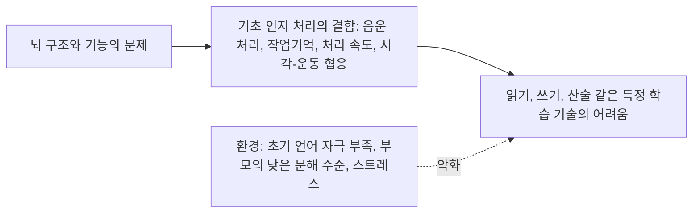



요약

지능도 괜찮고 제대로 배울 기회도 있었는데, 읽기, 쓰기, 셈하기 가운데 특정한 학습 기술만 유독 익히기 어려운 장애다. 게으르거나 머리가 나빠서가 아니라, 글자와 소리를 연결하거나 수를 처리하는 뇌의 기초 과정에 결함이 있기 때문이다. 정규 교육이 시작된 뒤에야 드러난다. 환경은 원인이라기보다 증상을 악화시키는 요인이다.

## 예시로 보기

아홉 살 JX는 지능검사에서 평균 점수가 나왔고, 말로 하는 설명은 잘 이해한다. 그런데 초등학교 3학년인데도 한 글자씩 더듬더듬 읽고, "받침"이 있는 글자를 자주 틀리며, 읽은 문장의 뜻을 놓친다. 수학은 반에서 중간이다. 반복된 실패로 "난 바보야"라고 말한다[^s1].

- 나이와 지능에 비해 읽기라는 특정 학습 기술만 어렵다: 읽기 곤란형.
- 정규 학습 과정이 시작된 뒤 드러남, 교육 기회의 부족 때문이 아님.
- 자존감 저하.

## 정의[^1][^2]

나이나 지능에 비해 읽기, 쓰기, 산술 같은 학습 기술을 배우고 쓰는 데 어려움이 있다.

| 유형 | 특징 |
|---|---|
| 읽기 곤란형 | 글을 잘못 읽거나 이해력이 부족하다 |
| 쓰기 곤란형 | 철자법이 틀리거나 문법에 어긋난 문장을 쓰고, 문장 구성이 현저히 빈약하다 |
| 산술 곤란형 | 숫자의 계산 능력에 결함이 있다 |

- 생물학적 근원이 있는 신경발달장애다. 언어적·비언어적 정보를 효과적으로 인지하고 처리하는 뇌의 능력의 문제다.
- 단어 읽기, 독해, 쓰기, 철자법, 산술 계산, 수학적 추론 같은 핵심 학업 기술을 익히기 어렵다.
- 정규 학습 과정이 시작된 뒤에 진단한다.
- 학습 기회가 부족했거나 교육이 부적절했던 결과가 아니다.

## 임상적 특징[^2]

- 학령기 아동의 5~15%. 성인은 알려진 바가 없다.
- 남아가 2~3배 많다.

## 원인과 치료[^3]

- **원인:** 신경생물학적 요인과 환경적 요인의 상호작용.
    - 신경생물학적 요인: 뇌 구조와 기능의 문제가 기초 인지 처리 과정의 결함을 낳는다. 예를 들어 언어 처리 영역의 활성 저하, 운동 계획과 언어 처리를 통합하는 영역의 기능 약화가 음운 처리 결함, 작업기억 약화, 처리 속도 저하, 시각-운동 협응 문제로 이어진다.
    - 환경적 요인은 원인보다 증상을 악화시키는 요인이다. 예: 초기 언어 자극 부족, 부모의 낮은 학력과 문해 수준, 스트레스와 정서적 불안.

실선은 원인의 길이고, 점선은 이미 생긴 어려움을 더 키우는 길이다[^s2].

- **치료의 세 요소:**
    1. 구체적 학습 기술 교육
    2. 심리적 지지를 통한 자존감과 자신감 향상
    3. 효과적인 공부법과 자기 생활 관리 지도

## 연결

- 전반적인 지적 기능이 낮을 때: [지적장애](/Hongs_Blog/studies/abnormal-psychology/intellectual-disability/)
- 부주의 때문에 학업이 떨어질 때: [주의력결핍 과잉행동장애](/Hongs_Blog/studies/abnormal-psychology/adhd/)
- 말로 하는 언어 자체의 문제: [언어장애](/Hongs_Blog/studies/abnormal-psychology/language-disorder/)

## 확인 문제

<b>C1</b> 읽기가 또래보다 크게 뒤처진 세 아이가 있다. (a) KM은 지능이 평균이고 교육을 충분히 받았다 (b) KN은 지능지수 60으로 모든 과목과 일상 기술이 전반적으로 늦다 (c) KO는 내전 지역에서 3년 동안 학교에 다니지 못했다. 특정학습장애에 해당하는 아이는?

**답:** (a) KM. (b)는 전반적인 지적 기능과 적응 기능의 결함이라 지적장애를 먼저 본다. (c)는 학습 기회의 부족으로 설명되므로 특정학습장애가 아니다.

<b>C2</b> 특정학습장애에서 환경적 요인을 "원인보다 증상을 악화시키는 요인"으로 보는 이유는?

**답:** 근본 원인은 음운 처리, 작업기억 같은 기초 인지 처리의 신경생물학적 결함이다. 초기 언어 자극 부족이나 정서적 불안은 이 결함이 있을 때 학습을 더 어렵게 만들지만, 그것만으로 특정 학습 기술의 결함이 생기지는 않는다. 또 학습 기회의 부족 자체가 원인이면 특정학습장애로 진단하지 않는다.

[^1]: 4-1학기/이상 심리학/1.수업자료/11.신경발달장애, 신경인지장애.pdf, p.46
[^2]: 4-1학기/이상 심리학/1.수업자료/11.신경발달장애, 신경인지장애.pdf, p.47
[^3]: 4-1학기/이상 심리학/1.수업자료/11.신경발달장애, 신경인지장애.pdf, p.48. 이 쪽 위의 "이렇게 단순화되어 있는 경우 다른 장애와 통합하여 출제"는 손글씨 필기다.
[^s1]: 에이전트 보충. JX의 사례는 진단 특징을 보이려고 만든 가상 사례다.
[^s2]: 에이전트 보충. 다이어그램 1개는 원본에 없다. '원인과 치료'의 신경생물학적 요인과 환경적 요인(p.48)을 그렸다.

