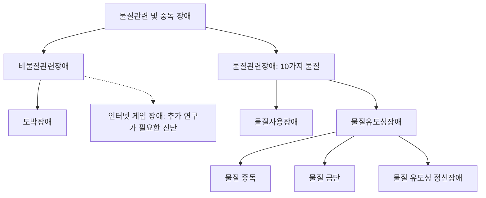



요약

술, 담배, 약물처럼 몸에 들어가 뇌에 작용하는 물질, 그리고 도박처럼 물질 없이도 같은 방식으로 사람을 붙잡는 행동의 문제를 묶은 범주다. 물질에 대한 문제는 크게 두 가지다. 문제가 생기는데도 끊지 못하고 계속 쓰는 것(사용장애)과, 물질이 몸에 들어오거나 빠져나갈 때 생기는 변화(중독, 금단, 유도성 정신장애)다. 한 사람이 두 가지를 함께 가질 수 있다.

## 예시로 보기

술 한 가지로 네 유형을 본다[^s1].

| 상황 | 유형 |
|---|---|
| 10년째 술 때문에 직장과 가정에 문제가 생기는데도 끊지 못한다 | 물질(알코올) 사용장애 |
| 어젯밤 과음해 말이 꼬이고 비틀거리며 싸움을 걸었다 | 물질(알코올) 중독 |
| 술을 끊은 다음 날 손이 떨리고 땀이 나며 잠을 못 잔다 | 물질(알코올) 금단 |
| 오래 과음한 뒤 몇 주째 우울증이 생겼다 | 물질(알코올) 유도성 정신장애 |

## 정의

### 두 무리 (DSM-5-TR)[^1]

| 유형 | 특징 |
|---|---|
| 물질관련장애 | 10가지 종류의 물질과 관련된 문제. 알코올, 카페인, 대마, 환각제, 흡입제, 아편계, 진정제·수면제·항불안제, 자극제, 담배, 기타 |
| 비물질관련장애 | 도박장애가 대표적이다(인터넷 게임 장애는 추가 연구가 필요한 진단). 개인, 가족, 직업의 문제를 낳는 지속적이고 반복적인 부적응적 도박 행동 |

### 물질을 가리키는 말[^2]

| 말 | 뜻 |
|---|---|
| medicine | 치료 목적의 약, 의약품 또는 의학 분야 |
| medication | 의사가 처방하거나 치료 계획에 포함된 약물. 투약과 복용 관리의 느낌이 강하다 |
| drug | 생체에 영향을 주는 물질. 의학적 약도 포함하지만 불법성·중독성 약의 뉘앙스가 있다 |
| substance | 약인지 아닌지 특정하지 않는 포괄적·중립적인 말. 약물 문맥에서는 약물일 수도 있는 물질 |

DSM이 "substance"를 쓰는 이유는 술, 카페인, 담배처럼 약이 아닌 것까지 가치 판단 없이 담기 위해서다[^s2].

### 물질관련장애의 유형[^3]

| 유형 | | 특징 |
|---|---|---|
| 물질사용장애(substance use disorders) | | 중요한 물질 관련 문제가 있는데도 계속 물질을 쓰고 있음을 보여 주는 인지적·행동적·생리적 증상군 |
| 물질유도성장애(substance-induced disorders) | 물질 중독(intoxication) | 최근 물질을 섭취해 생긴, 단기적이고 되돌릴 수 있는 물질 특이적 증후군. 문제적 행동 변화와 심리적 변화를 포함한다 |
| | 물질 금단(withdrawal) | 물질 사용을 중단하거나 줄여서 생기는 물질 특유의 부적응적 변화 |
| | 물질 유도성 정신장애 | 물질 때문에 생긴 정신질환 |

점선으로 이은 인터넷 게임 장애는 정식 진단이 아니다. 중독, 금단, 유도성 정신장애는 모두 물질유도성장애 한 갈래에 든다[^s3].

우리말 "중독"은 두 가지를 다 가리켜서 헷갈린다. DSM의 물질 중독(intoxication)은 "취한 상태"라는 단기적 증후군이고, 일상어의 중독(addiction)은 끊지 못하고 계속 쓰는 상태, 곧 사용장애에 가깝다[^3].

## 연결

- 가장 흔한 물질: [알코올 관련 장애](/Hongs_Blog/studies/abnormal-psychology/alcohol-related-disorders/)
- 물질 없는 중독: [도박장애](/Hongs_Blog/studies/abnormal-psychology/gambling-disorder/), [인터넷 게임 장애](/Hongs_Blog/studies/abnormal-psychology/internet-gaming-disorder/)

## 확인 문제

<b>C1</b> "물질 중독(intoxication)"과 일상어 "중독(addiction)"은 무엇이 다른가? DSM의 어느 유형이 일상어의 중독에 가까운가?

**답:** 물질 중독은 최근 섭취로 생긴 단기적이고 되돌릴 수 있는 증후군, 곧 취한 상태다. 일상어의 중독(addiction)은 문제가 생기는데도 끊지 못하고 계속 쓰는 상태로, 물질사용장애에 가깝다.

<b>C2</b> 물질관련장애의 두 큰 유형과, 물질유도성장애에 드는 세 가지를 쓰라.

**답:** 물질사용장애와 물질유도성장애. 물질유도성장애에는 물질 중독, 물질 금단, 물질 유도성 정신장애가 있다.

[^1]: 이상 심리학 10회 강의 자료 「파괴적, 충동조절 및 품행장애, 물질관련 및 중독장애」, p.43
[^2]: 이상 심리학 10회 강의 자료 「파괴적, 충동조절 및 품행장애, 물질관련 및 중독장애」, p.45
[^3]: 이상 심리학 10회 강의 자료 「파괴적, 충동조절 및 품행장애, 물질관련 및 중독장애」, p.46. 물질 중독의 "가역적" 위 "단기적"과, 오타 "Addiciton"을 지우고 "Addiction"으로 고쳐 쓴 것은 손글씨 필기다.
[^s1]: 보충 네 상황은 유형을 가르려고 만든 가상 예다.
[^s2]: 보충 substance라는 말을 쓰는 이유는 p.45의 용어 설명을 DSM의 용어 선택과 이어 해석했다.
[^s3]: 보충 다이어그램 1개는 원본에 없다. '두 무리'(p.43)와 '물질관련장애의 유형'(p.46) 표를 한 분류 나무로 그렸다.

