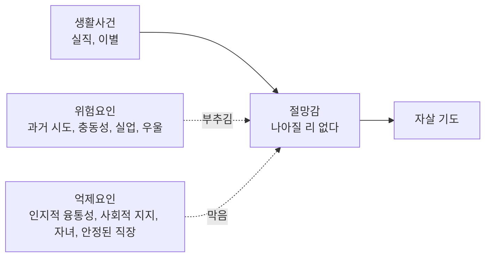
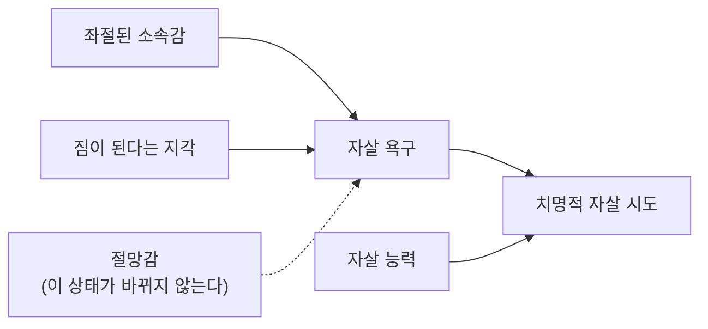



요약

자살은 대부분 정신장애, 특히 우울과 함께 오고, 그 한가운데에는 "이 고통은 나아지지 않는다"는 절망감이 있다. 나쁜 일이 방아쇠가 되지만, 누구나 그 방아쇠에 무너지지는 않는다. 위험요인과 억제요인의 균형, 그리고 "나는 혼자다", "나는 짐이다"라는 생각과 죽음에 대한 두려움이 무뎌진 정도가 결과를 가른다. 그래서 예방이 가능하고, 주변 사람이 신호를 알아채 묻고 연결하는 것만으로도 큰 차이를 만든다.

지금 도움이 필요하다면

자살을 생각하고 있거나 주변에 그런 사람이 있다면 혼자 감당하지 말고 전문 상담에 연락한다. 우리나라의 자살예방 상담전화는 109(24시간)다[^s1].

## 예시로 보기

슬라이드의 설명 모형에 한 사람의 이야기를 올려 본다[^1][^s2].

실직한 BI에게 우울장애와 과거 시도 경험(위험요인)이 있고 곁에 사람이 없으면, 실직(생활사건)이 절망감으로 번지기 쉽다. 같은 실직이라도 "다른 길도 있다"고 볼 수 있는 융통성과 도와줄 가족(억제요인)이 있으면 절망감이 커지지 않는다.

## 정의

### 특성[^2]

- 우리나라의 자살률은 OECD 34개국 가운데 1위다(질병관리청, 2023년 기준).
- 자살 사망자의 70%가 남성으로 여성보다 2~3배 많고, 자살 시도자는 여성이 남성보다 4배 많다. 남성이 더 치명적인 방법을 쓴다.
- 자살 사망자의 90%가 정신장애를 가졌고, 그 가운데 80%가 우울장애다.

### 원인[^3][^4]

| 입장 | 설명 |
|---|---|
| 정신분석 | 프로이트: 자신을 화나게 한 사람이나 상황을 향한 무의식적 적대감이 자기에게로 향한 것이다. 죽음의 본능(타나토스)이 자기를 향한, 자기혐오의 극단적 표현이다. 부모의 사망·이혼·별거, 어린 시절의 거부와 방치가 많다. 자신을 거부하고 상처 준 사람을 "처벌"하려고 자살을 감행한다고 본다 |
| 생물학 | 낮은 세로토닌 활동이 공격성과 충동성을 높여 자살 사고와 행동에 취약하게 만든다 |
| 심리 | 절망감이 가장 중요한 심리적 요인이다. 고통스러운 상황이 해결될 수 없거나 더 나빠질 것이라는 비관적인 예상이다 |
| 생활사건 | 상실, 실패, 모욕, 억울함 같은 부정적 생활사건이 자살을 촉발한다 |

### 위험요인과 억제요인[^5]

| 위험요인 | 억제요인 |
|---|---|
| 과거의 자살 기도 경험, 가족의 자살 기도 경력 | 인지적 융통성 |
| 충동성 같은 성격 요인 | 강력한 사회적 지지 |
| 이혼 상태, 실업 상태 | 자녀의 존재 |
| 정신장애(우울장애와 양극성장애가 가장 위험) | 안정된 경제 능력과 직장 |

### 자살의 대인관계 이론[^6][^s3]

조이너(Joiner)의 이론은 "죽고 싶은 마음"과 "죽을 수 있는 능력"을 나눈다.

1. **자살 욕구의 예측요인 두 가지**
    - 좌절된 소속감: "나는 혼자다"
    - 짐이 된다는 지각: "나는 짐덩어리다"
2. **자살 시도를 이끄는 요인: 자살 능력** — "나는 죽는 것이 두렵지 않다"
    - 기질적 특성: 낮은 통증 민감성, 과감성, 충동성
    - 후천적 경험: 신체적 학대나 외상, 과거의 자해나 자살 시도, 고통스러운 사건에 반복 노출된 경험
    - 실제 상황: 자살 방법에 대한 지식, 치명적인 도구에 대한 접근성

욕구만 있고 능력이 없으면 시도로 이어지기 어렵고, 둘이 겹칠 때 치명적인 시도가 된다[^7]. 과거의 자해나 시도 경험이 위험한 이유는 욕구가 아니라 능력(두려움의 둔화)을 키우기 때문이다.

### 예방[^8][^9][^10]

**세 가지 예방 프로그램**
1. 이미 가진 정신장애를 치료한다.
2. 위기개입: 문제를 푸는 데 자살보다 나은 방법이 있음을 보게 한다. 24시간 자살예방·정신건강상담 전화가 여기에 속한다.
3. 고위험 집단(사회경제적 취약계층, 따돌림당하는 청소년, 노인 등)에 예방 프로그램을 실시한다.

**위기에 처한 주변 사람 돕기 4단계:** 신호 알아차리기 → 자살 생각 물어보기 → 대화하기 → 도움 요청하기.

**피해야 할 것**
- 자살 자체나 감정의 옳고 그름을 두고 논쟁하기
- "다 잘될 거야"라고 섣불리 위로하기
- 자살 생각을 털어놓고 싶은 마음을 막아 버리기
- 비밀 보장을 약속하기(가족과 전문가에게 알리도록 설득해야 한다)
- 충격받은 듯 과잉반응하기
- 위기가 급한데 혼자 두기

## 연결

- 가장 흔한 배경: [주요우울장애](/Hongs_Blog/studies/abnormal-psychology/major-depressive-disorder/), [양극성장애](/Hongs_Blog/studies/abnormal-psychology/bipolar-disorder/)(제1형의 25% 이상 시도, 제2형은 더 많음)
- 절망감을 만드는 설명 습관: [우울증의 귀인이론](/Hongs_Blog/studies/abnormal-psychology/attribution-theory-depression/)
- 자살 능력을 키우는 경험: [비자살적 자해](/Hongs_Blog/studies/abnormal-psychology/nssi/)

## 자주 하는 오해

"자살에 대해 직접 물으면 없던 생각을 심어 줄 수 있다"

틀렸다. 금기를 건드리는 것 같아 그럴듯하다. 하지만 슬라이드의 4단계에 "자살 생각 물어보기"가 들어 있고, 피해야 할 것에 "털어놓고 싶은 마음을 막아 버리기"가 있다[^9][^10]. 직접 묻는 것은 생각을 심는 것이 아니라 말할 기회를 주는 것이고, 대화와 도움 요청의 출발점이다[^s4].

## 확인 문제

<b>C1</b> 자살의 대인관계 이론에서 자살 욕구를 예측하는 두 요인과, 자살 시도를 이끄는 요인을 쓰라.

**답:** 자살 욕구: 좌절된 소속감("나는 혼자다"), 짐이 된다는 지각("나는 짐덩어리다"). 시도를 이끄는 요인: 자살 능력("죽는 것이 두렵지 않다"). 기질(낮은 통증 민감성, 충동성), 후천적 경험(학대, 과거 자해·시도), 실제 상황(방법 지식, 도구 접근성)에서 온다.

<b>C2</b> 과거의 자살 시도가 가장 강력한 위험요인 가운데 하나인 이유를 대인관계 이론으로 설명하라.

**답:** 과거의 시도와 자해는 고통과 죽음에 대한 두려움을 무디게 해 "자살 능력"을 키운다. 욕구가 다시 생겼을 때 능력이 이미 있으므로 치명적인 시도로 이어지기 쉽다. 주요우울장애의 경과에서도 과거 자살 시도력이 가장 위험한 요인으로 꼽힌다.

<b>C3</b> 친구가 "요즘 다 끝내고 싶다. 이 얘기는 아무한테도 하지 마"라고 말했다. 슬라이드의 4단계와 피해야 할 것에 따라 어떻게 해야 하는지 쓰라.

**답:** 신호를 알아챘으니 "자살을 생각하고 있니?"라고 직접 묻고, 논쟁하거나 섣불리 "다 잘될 거야"라고 하지 않고 이야기를 들으며 대화한다. 비밀 보장은 약속하지 않고, 가족과 전문가(자살예방 상담전화 109 등)에 알리도록 설득해 도움을 요청한다. 위기가 급하면 혼자 두지 않는다.

[^1]: 4-1학기/이상 심리학/1.수업자료/03.양극성장애와 우울장애.pdf, p.65 (자살에 관한 심리학적 설명 모델)
[^2]: 4-1학기/이상 심리학/1.수업자료/03.양극성장애와 우울장애.pdf, p.61 (OECD 자살률 그래프, 질병관리청 2023년 기준)
[^3]: 4-1학기/이상 심리학/1.수업자료/03.양극성장애와 우울장애.pdf, p.62
[^4]: 4-1학기/이상 심리학/1.수업자료/03.양극성장애와 우울장애.pdf, p.63
[^5]: 4-1학기/이상 심리학/1.수업자료/03.양극성장애와 우울장애.pdf, p.64
[^6]: 4-1학기/이상 심리학/1.수업자료/03.양극성장애와 우울장애.pdf, p.66
[^7]: 4-1학기/이상 심리학/1.수업자료/03.양극성장애와 우울장애.pdf, p.67 (자살의 대인관계 이론 도식)
[^8]: 4-1학기/이상 심리학/1.수업자료/03.양극성장애와 우울장애.pdf, p.68
[^9]: 4-1학기/이상 심리학/1.수업자료/03.양극성장애와 우울장애.pdf, p.69 (위기에 처한 주변사람 돕기 4단계)
[^10]: 4-1학기/이상 심리학/1.수업자료/03.양극성장애와 우울장애.pdf, p.70 (이것만은 피하자)
[^s1]: 에이전트 보충. 보건복지부는 2024년 1월부터 자살예방 상담전화를 109로 통합해 24시간 운영한다. 슬라이드는 번호를 적지 않았다.
[^s2]: 에이전트 보충. BI의 사례는 설명 모형을 보이려고 만든 가상 사례다. 슬라이드가 성별로 든 구체적인 방법은 이 문서에 옮기지 않았다.
[^s3]: 에이전트 보충. 슬라이드의 "자살의 대인관계 이론"은 T. Joiner(2005)의 이론이다.
[^s4]: 에이전트 보충. 자살에 대해 직접 묻는 것이 자살 위험을 높이지 않는다는 것은 자살 예방 연구의 일관된 결과다.

