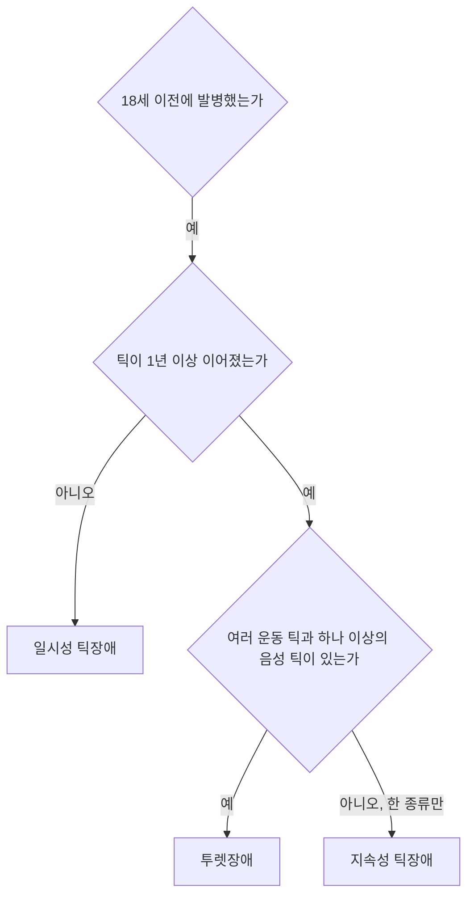



요약

눈 깜빡임, 어깨 들썩임, 킁킁거림, 헛기침처럼 갑작스럽고 빠른 동작이나 소리가 리듬 없이 되풀이되는 장애다. 틱 직전에 간질간질하거나 답답한 느낌(전조 감각)이 오고 틱을 하면 풀리므로, 완전히 저절로 일어나는 것만은 아니다. 대개 4~6세에 시작해 10~12세에 가장 심하고 점차 줄어든다. 긴장하면 심해지고, 기간과 틱의 종류로 투렛장애, 지속성 틱장애, 일시성 틱장애를 가른다.

## 예시로 보기

열 살 JY는 1년 반째 눈을 세게 깜빡이고 어깨를 들썩이며, 수시로 킁킁 소리와 헛기침을 한다. 틱의 모양은 몇 달마다 조금씩 바뀐다. 시험 기간에 심해지고, 게임에 집중할 때는 줄어든다. JY는 "코가 간질거려서 안 하면 답답해요"라고 말한다[^s1].

- 여러 운동 틱(눈 깜빡임, 어깨)과 음성 틱(킁킁, 헛기침)이 1년 넘게: 투렛장애.
- 18세 이전 발병.
- 전조 감각, 스트레스에 악화, 주의 분산에 감소, 증상의 악화와 완화.

## 정의[^1]

- **틱:** 갑작스럽고, 빠르며, 반복적이고, 리듬이 없는 동작이나 소리다.
- 운동 틱과 음성 틱, 단순 틱과 복합 틱으로 나눈다.
- 진단은 위계적 구조를 가진다. 더 심한 진단의 기준을 채우면 그 진단을 내린다.

| 진단 | 틱의 종류 | 기간 |
|---|---|---|
| 투렛장애 | 여러 운동 틱과 하나 이상의 음성 틱 | 1년 이상 |
| 지속성(만성) 틱장애 | 운동 틱 또는 음성 틱 가운데 한 종류만 | 1년 이상 |
| 일시성 틱장애 | 운동 틱이나 음성 틱 | 1년 미만 |

- 18세 이전에 발병해야 한다.

더 심한 진단의 기준을 채우면 그 진단을 내리므로, 1년 넘게 이어진 틱은 투렛장애부터 확인한다[^s2].

## 임상적 특징[^2]

- 소아청소년의 평생 유병률 약 2.4%. 남아에게 더 많다.
- 전형적으로 4~6세에 시작하고, 대개 10~12세에 가장 심하며 점점 줄어든다. 그러나 악화될 가능성도 있다.
- 성인기의 첫 발병은 드물다.
- 증상이 악화되고 완화되기를 반복한다(waxing and waning).
- 얼굴의 일시적인 운동 틱 같은 단순 틱으로 시작해 시간이 지나며 팔다리로 퍼진다.
- **전조 증상:** 국소적인 불편한 감각(전조 감각)과 틱을 하고 싶은 "충동"이 있다. 그래서 틱이 완전히 불수의적이라고 여겨지지 않을 수도 있다.

## 원인[^3]

- **유전적·신경학적 요인:**
    - 쌍둥이 연구와 직계가족의 높은 틱 유병률.
    - ADHD, 강박장애와 관련성이 높아 공통 유전 요인이 작용할 것으로 본다.
    - 대뇌 도파민계의 과다 활동: 도파민 억제제가 틱을 억제한다.
    - 기저핵의 이상.
- **심리적 스트레스:** 긴장과 불안, 흥분, 피로가 틱을 악화시킨다.

## 치료[^4]

약물치료와 행동치료를 쓴다.

- **도파민 억제제:** 중등도 이상의 틱장애에 주로 쓰는 향정신병 약물이다.
- **습관반전훈련(habit reversal training, HRT):** 행동주의 치료다. 자각 훈련과 이완 훈련으로 시작하고, 틱과 동시에 할 수 없는 경쟁 반응을 만들어 틱을 억제한다([신체중심 반복행동](/Hongs_Blog/studies/abnormal-psychology/bfrb/)의 습관 반전 훈련과 같다).
- **노출 및 반응방지 훈련:** 틱의 전조 감각을 강박사고에, 틱을 강박행동에 대응시킨다. 전조 감각을 견디며 틱을 하지 않으면 감각이 저절로 가라앉는 것을 배운다([노출 및 반응방지법](/Hongs_Blog/studies/abnormal-psychology/erp/)).
- **포괄적 행동 개입(comprehensive behavioral intervention for tics, CBIT):** 습관반전훈련을 바탕으로 한 포괄적 행동 치료로, 틱 인식 훈련, 경쟁반응훈련, 이완 훈련, 환경 조절과 부모 교육으로 이루어진다.

## 연결

- 가장 헷갈리는 짝: [틱장애와 상동증적 운동장애 비교](/Hongs_Blog/studies/abnormal-psychology/tic-vs-stereotypic/)
- 전조 감각 ≒ 강박사고, 틱 ≒ 강박행동: [강박장애](/Hongs_Blog/studies/abnormal-psychology/ocd/)
- 흔히 함께 나타나는 장애: [주의력결핍 과잉행동장애](/Hongs_Blog/studies/abnormal-psychology/adhd/)

## 확인 문제

<b>C1</b> 세 아이의 진단은? (a) KT: 눈 깜빡임과 코 찡그림만 8개월째 (b) KU: 헛기침만 2년째 (c) KV: 여러 운동 틱과 킁킁 소리가 3년째. 모두 18세 이전 발병.

**답:** (a) 일시성 틱장애(1년 미만). (b) 지속성 틱장애, 음성 틱만(1년 이상, 한 종류). (c) 투렛장애(여러 운동 틱과 음성 틱, 1년 이상).

<b>C2</b> 노출 및 반응방지 훈련을 틱에 적용할 때 강박장애의 요소와 어떻게 대응시키는지 쓰고, 이 치료가 작동하는 원리를 쓰라.

**답:** 전조 감각 ↔ 강박사고(불편한 내적 경험), 틱 ↔ 강박행동(불편을 없애는 행동), 틱 뒤의 해소감 ↔ 강박행동 뒤의 불안 감소. 틱이 전조 감각을 없애 주는 부적 강화로 유지되므로, 전조 감각에 노출된 채 틱을 참으면 감각이 시간이 지나 저절로 가라앉는다는 것을 배우고 고리가 약해진다.

[^1]: 이상 심리학 11회 강의 자료 「신경발달장애, 신경인지장애」, p.54
[^2]: 이상 심리학 11회 강의 자료 「신경발달장애, 신경인지장애」, p.56
[^3]: 이상 심리학 11회 강의 자료 「신경발달장애, 신경인지장애」, p.57
[^4]: 이상 심리학 11회 강의 자료 「신경발달장애, 신경인지장애」, p.58
[^s1]: 보충 JY의 사례는 투렛장애의 특징을 보이려고 만든 가상 사례다.
[^s2]: 보충 다이어그램 1개는 원본에 없다. '정의'의 위계적 구조와 세 진단 표(p.54)를 순서도로 옮겼다.

