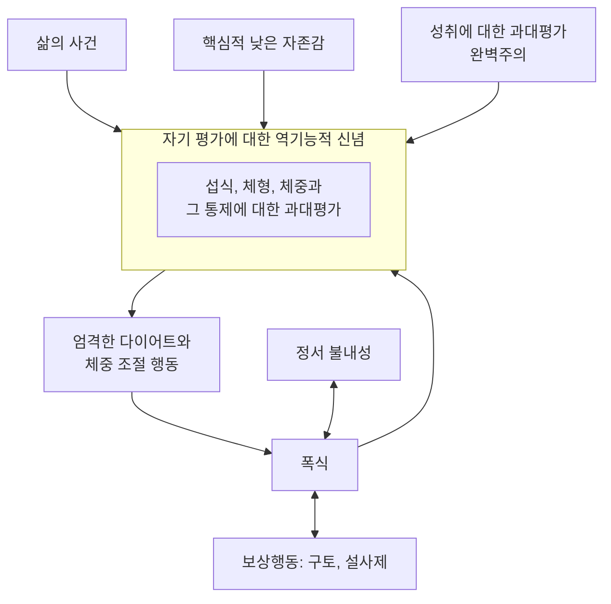



요약

식욕부진증, 폭식증, 폭식장애를 서로 다른 병으로 보지 않고, 같은 엔진이 다른 모습으로 돌아가는 것으로 보는 모델이다. 그 엔진은 "나의 가치는 체중과 체형, 그리고 그것을 통제하는 능력으로 정해진다"는 믿음이다. 이 믿음이 엄격한 다이어트를 낳고, 다이어트가 폭식을, 폭식이 보상행동을 부른다. 진단명이 바뀌어도 이 핵심을 겨냥하면 되므로, 한 가지 치료(CBT-E)로 여러 섭식장애를 다룬다.

## 예시로 보기

GG는 열여섯 살에 식욕부진증 제한형으로 진단받았다. 스무 살에는 폭식과 구토가 시작되어 신경성 폭식증으로, 스물다섯 살에는 구토를 멈췄지만 폭식이 남아 폭식장애로 진단이 바뀌었다. 세 진단 내내 GG의 일기에는 같은 문장이 있다. "살이 빠지면 나는 괜찮은 사람이다."[^s1]

- 진단은 셋이지만, 자기 평가를 체중과 체형으로 하는 핵심은 같다.
- 식욕부진증에서 폭식증으로 넘어가는 흐름은 [신경성 폭식증](/Hongs_Blog/studies/abnormal-psychology/bulimia-nervosa/)의 에디 등(2008) 추적 결과와 맞는다.

## 모델의 구조 (Fairburn, Cooper, & Shafran, 2003)[^1]

- **중심:** 자기 평가에 대한 역기능적 신념. 자기 가치를 거의 전적으로 섭식, 체형, 체중과 그 통제로 판단한다.
- **이 중심을 키우는 것:** 핵심적인 낮은 자존감, 성취에 대한 과대평가(완벽주의), 삶의 사건.
- **이어지는 행동:** 엄격한 다이어트와 체중 조절 행동 → 폭식 → 보상행동(구토, 설사제 남용).
- **정서 불내성(mood intolerance):** 부정 정서를 견디지 못해 폭식이나 보상행동으로 다스린다.
- 폭식은 다시 "나는 통제에 실패했다"는 증거가 되어 중심 신념을 강화한다.

세 장애는 이 그림에서 어느 부분이 두드러지느냐로 갈린다. 다이어트 고리만 강하면 식욕부진증 제한형, 폭식과 보상행동 고리까지 돌면 폭식증, 보상행동이 빠지면 폭식장애다[^s2].

## 활용: CBT-E[^2][^3]

**향상된 인지행동치료(Enhanced Cognitive Behavioral Therapy, CBT-E)**는 이 모델에 따라 기존 CBT를 넓힌 통합 치료로, 식욕부진증·폭식증·폭식장애에 모두 쓴다.

- **목표:** 체중, 음식, 체형에 대한 비합리적 사고와 행동 패턴을 고쳐 섭식 행동을 정상화하고, 자기 평가 방식을 바꾼다.
- **기간:** 보통 20~40회기(약 4~8개월). 체중 상태와 증상에 따라 다르다.

| 단계 | 내용 |
|---|---|
| 1단계 · 초기 참여와 동기 강화 | 식사일지로 섭식 패턴을 기록·관찰하고 치료 계획을 세운다 |
| 2단계 · 핵심 신념 파악과 인지 재구성 | "체중·체형이 나의 가치" 같은 핵심 신념을 찾아 재구성한다 |
| 3단계 · 행동 실험과 정서 조절 훈련 | 실제 상황 노출 훈련, 마음챙김과 대처 전략 같은 정서 조절 기술 |
| 4단계 · 유지와 재발 방지 | 자기 평가 체계의 변화, 스트레스 상황 대처 계획, 경과 관찰 |

| 버전 | 다루는 것 | 적용 대상 |
|---|---|---|
| CBT-Ef (focused) | 섭식장애의 핵심 병리(체형·체중 중심 자기 평가)에만 집중 | 폭식증, 폭식장애처럼 비교적 단순한 경우 |
| CBT-Eb (broad) | 핵심 병리 + 완벽주의, 낮은 자존감, 대인관계 문제, 정서 문제 | 복합적 심리 문제가 함께 있는 경우 |

두 버전의 차이는 모델 그림에 그대로 대응한다. Ef는 가운데 상자(역기능적 신념)와 그 아래 행동 고리를 다루고, Eb는 여기에 중심을 키우는 바깥 상자들(완벽주의, 낮은 자존감, 정서 불내성, 대인관계)까지 다룬다[^s3].

## 연결

- 모델이 설명하는 세 장애: [세 섭식장애 비교](/Hongs_Blog/studies/abnormal-psychology/eating-disorders-contrast/)
- 진단 범주를 넘어 공통 차원을 보는 관점: [범주적 분류와 차원적 분류 비교](/Hongs_Blog/studies/abnormal-psychology/categorical-vs-dimensional/)
- 바탕이 된 치료: [인지행동치료](/Hongs_Blog/studies/abnormal-psychology/cbt/)

## 확인 문제

<b>C1</b> 페어번의 초진단적 모델을 그림으로 그리라. 가운데 상자, 그것을 키우는 셋, 아래 행동 고리 셋을 모두 넣는다.

**답:** 가운데: 자기 평가에 대한 역기능적 신념(섭식·체형·체중과 그 통제의 과대평가). 키우는 것: 핵심적 낮은 자존감, 성취의 과대평가(완벽주의), 삶의 사건. 행동 고리: 엄격한 다이어트 → 폭식 ↔ 보상행동(구토, 설사제). 정서 불내성이 폭식과 보상행동에 이어지고, 폭식은 다시 가운데 신념을 강화한다.

<b>C2</b> "초진단적"이라는 이름이 붙은 이유와, 이 관점이 식욕부진증에서 폭식증으로 진단이 바뀌는 현상을 어떻게 설명하는지 쓰라.

**답:** 진단 범주를 가로질러(trans-) 공통 핵심 병리, 곧 체중·체형 중심의 자기 평가를 찾기 때문이다. 이 관점에서 진단이 바뀌는 것은 같은 핵심이 다른 행동 고리로 표현되는 것일 뿐이다. 엄격한 다이어트가 오래가면 굶주림과 부정 정서가 폭식을 부르고, 폭식이 보상행동을 부르면서 식욕부진증이 폭식증의 모습으로 바뀐다.

<b>C3</b> 폭식증 환자 GH는 폭식 외에도 "95점도 실패"라는 완벽주의와 심한 대인관계 갈등이 있다. CBT-Ef와 CBT-Eb 가운데 무엇이 맞고, 1단계에서 무엇부터 하는가?

**답:** CBT-Eb. 핵심 병리 밖의 완벽주의와 대인관계 문제가 중심 신념을 키우고 있어 함께 다뤄야 한다. 1단계에서는 식사일지로 섭식 패턴을 기록하게 하고 치료 동기를 높이며 치료 계획을 세운다.

[^1]: 4-1학기/이상 심리학/1.수업자료/08.급식 및 섭식장애, 수면-각성장애.pdf, p.36 (Fairburn, Cooper, & Shafran, 2003 그림). "자기평가에 대한 역기능적 신념", "체형, 체중", "완벽주의", "낮은 자존감", "폭식"은 그림 위의 손글씨 필기다.
[^2]: 4-1학기/이상 심리학/1.수업자료/08.급식 및 섭식장애, 수면-각성장애.pdf, p.37
[^3]: 4-1학기/이상 심리학/1.수업자료/08.급식 및 섭식장애, 수면-각성장애.pdf, p.38
[^s1]: 에이전트 보충. GG의 사례는 진단 이동을 보이려고 만든 가상 사례다.
[^s2]: 에이전트 보충. 세 장애를 모델의 어느 고리가 두드러지는지로 대응시킨 것은 초진단적 모델의 취지를 요약한 해석이다.
[^s3]: 에이전트 보충. Ef와 Eb를 그림의 상자에 대응시킨 것은 p.38의 두 버전 설명과 p.36 그림을 이은 해석이다. 페어번의 원래 CBT-E는 확장 모듈로 임상적 완벽주의, 핵심적 낮은 자존감, 대인관계 어려움을 다룬다.

