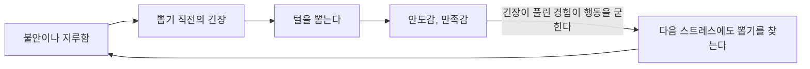



요약

머리카락, 눈썹, 속눈썹 같은 자기 몸의 털을 반복해서 뽑아 눈에 띄게 빠지는데도 멈추지 못하는 장애다. 뽑기 직전에 긴장이 오르고, 뽑고 나면 시원함이나 안도감이 온다. 그 안도감이 행동을 굳혀 스트레스를 푸는 습관이 된다. 강박장애처럼 반복하지만, 불안한 생각을 없애려는 것이 아니라 몸의 감각과 긴장을 해소하려는 행동이라는 점이 다르다.

## 예시로 보기

고등학생 DD는 시험공부를 할 때마다 정수리 머리카락을 한 올씩 뽑는다. 뽑기 전에는 두피가 간질거리는 것 같고 초조하다가, 뽑으면 "시원하다". 뽑은 머리카락을 손끝으로 만지작거린다. 정수리가 비어 모자를 쓰고 다닌다. 멈추려고 여러 번 결심했지만 실패했다[^s1].

## 정의

자기 털을 반복적으로 뽑는 행동이다[^1].

- 대상: 머리털, 눈썹, 속눈썹, 겨드랑이 털, 다른 사람의 털, 반려동물의 털 등.
- 털과 관련된 행동이나 의례가 함께 나타난다. 뽑은 뒤 털을 관찰하고, 만지고, 입으로 가지고 놀거나 삼키기도 한다.
- 불안이나 지루한 감정이 촉발하기도 한다. 뽑기 직전 잠깐 긴장감이 오르고, 뽑은 뒤 만족감, 쾌감, 안도감을 느낀다.
- 모자나 가발로 탈모를 가린다.

DSM-5-TR은 털 뽑기로 털이 빠지고, 줄이거나 멈추려는 시도가 반복해서 실패하며, 고통이나 기능 손상이 있을 것을 요구한다[^s2].

### 임상적 특징[^2]

- 매우 드문 장애로 여겨졌으나 최근 1~2%로 추정된다.
- 아동은 남녀 비율이 비슷하고, 성인은 여성이 남성보다 약 10배 많다.
- 대개 20세 이전에 시작한다. 5~8세 아동과 13세 전후의 청소년에게서 많다.

## 원인[^3]

- **유전적 취약성:** 일반 인구보다 강박장애 환자와 그 일차 친족에게서 더 많다.
- **정신분석적 입장:** 털 뽑기는 무의식적 갈등의 상징적 표현이고, 좋지 못한 대상관계의 결과다. 어린 시절의 정서적 결핍과 관련되고, 털을 뽑는 행위는 처벌적인 어머니와 다시 결합하려는 상징적 표현이라고 본다.
- **행동주의적 입장:** 털을 뽑으면 긴장이 풀리므로, 스트레스 해소법으로 잘못 학습된다(부적 강화). 뽑는 행동과 관련된 신체 감각에 대한 갈망이 조건형성된다.

뽑은 뒤의 안도감에서 다시 처음으로 돌아가는 화살표를 따라가면 된다. 긴장이 풀릴 때마다 고리가 한 바퀴 더 굳는다[^s3].

## 치료

피부뜯기장애와 함께 다룬다. 항우울제(SSRI), 습관 반전 훈련, 수용 증진 행동치료. [신체중심 반복행동](/Hongs_Blog/studies/abnormal-psychology/bfrb/)에서 설명한다.

## 연결

- 같은 계열: [피부뜯기장애](/Hongs_Blog/studies/abnormal-psychology/excoriation-disorder/), [신체중심 반복행동](/Hongs_Blog/studies/abnormal-psychology/bfrb/)
- 부적 강화의 원리: [행동주의적 입장](/Hongs_Blog/studies/abnormal-psychology/behavioral-perspective/)

## 확인 문제

<b>C1</b> 털뽑기장애에서 뽑기 전과 뽑은 뒤에 느끼는 감정, 그리고 성인의 성비를 쓰라.

**답:** 뽑기 직전 잠깐 긴장감이 오르고, 뽑은 뒤 만족감·쾌감·안도감을 느낀다. 성인은 여성이 남성보다 약 10배 많다(아동은 비슷하다).

<b>C2</b> 행동주의는 털 뽑기가 왜 스트레스를 받을 때마다 늘어난다고 설명하는가?

**답:** 털을 뽑으면 쌓인 긴장이 풀린다. 불쾌한 긴장이 사라지는 결과가 뽑는 행동을 부적 강화해, 스트레스로 긴장이 높아질 때마다 뽑는 행동이 해소법으로 튀어나온다. 뽑을 때의 신체 감각에 대한 갈망도 조건형성되어 습관이 굳는다.

[^1]: 이상 심리학 5회 강의 자료 「강박 관련 장애」, p.36
[^2]: 이상 심리학 5회 강의 자료 「강박 관련 장애」, p.37
[^3]: 이상 심리학 5회 강의 자료 「강박 관련 장애」, p.38
[^s1]: 보충 DD의 사례는 진단 특징을 보이려고 만든 가상 사례다.
[^s2]: 보충 DSM-5-TR 털뽑기장애 진단기준을 요약했다.
[^s3]: 보충 다이어그램 1개는 원본에 없다. 이 문서 `정의`의 긴장·안도 서술과 `원인`의 행동주의적 입장(부적 강화)을 근거로 그렸다. 슬라이드 p.36, p.38.

