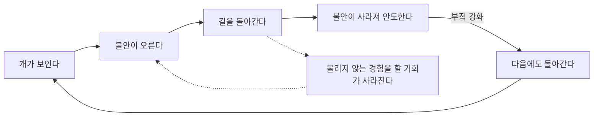
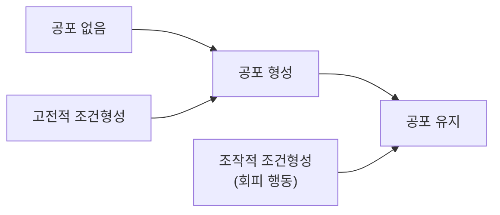



요약

공포증은 두 단계로 만들어진다는 이론이다. 먼저 어떤 대상이 무서운 일과 짝지어져 공포가 생기고(고전적 조건형성), 그다음 그 대상을 피할 때마다 안도감이 들어 피하는 행동이 굳어진다(조작적 조건형성). 두 번째 단계 때문에 공포가 사라질 기회가 없다. 그래서 치료는 피하지 않고 마주하는 노출이 된다. 다만 공포를 겪은 적 없는 사람도 공포증이 생기는 경우는 이 이론만으로 설명하기 어렵다.

## 예시로 보기

CA는 개에게 물린 뒤로 개를 피한다[^s1].

| 단계 | 일어난 일 | 원리 |
|---|---|---|
| 공포 형성 | 개(중립 자극)가 물리는 고통(무조건 자극)과 짝지어져, 개만 봐도 무섭다 | 고전적 조건형성 |
| 공포 유지 | 개가 보이면 길을 돌아간다. 돌아가면 불안이 사라진다. 불안이 사라지는 안도가 회피를 강화한다 | 조작적 조건형성(부적 강화) |

돌아갈 때마다 "개를 만났는데 물리지 않았다"는 경험을 할 기회가 사라진다. 그래서 공포가 10년이 지나도 줄지 않는다.

실선 고리는 회피가 굳어지는 길이다. 점선은 회피 때문에 "개는 위험하다"는 공포가 고쳐지지 않고 그대로 남는 길이다[^s3].

## 정의

모러의 2요인 학습이론은 공포증의 형성에는 고전적 조건형성의 원리가, 공포증의 지속에는 조작적 조건형성의 원리가 적용됨을 보여 준다[^1].

### 이론을 보완하는 두 설명[^1]

- **준비성(preparedness, Seligman, 1971):** 사람은 진화적으로 위협적이었던 대상(뱀, 거미, 높은 곳)에 공포를 더 쉽게 학습하도록 준비되어 있다. 필기의 말로 "위협적인 것들에는 공포를 느끼도록 준비되어 있다." 그래서 전기 콘센트나 자동차처럼 실제로 더 위험한 것보다 뱀과 거미에 대한 공포증이 흔하다[^s2].
- **대리학습과 정보전이:** 직접 겪지 않아도, 남이 무서워하는 모습을 보거나(대리학습, 관찰학습) "그 개는 사람을 문다" 같은 말을 듣고(정보전이) 공포가 생긴다[^s2].

두 보완 설명은 2요인 이론의 약점, 곧 "무서운 일을 직접 겪은 적 없는 사람도 공포증이 생긴다", "모든 대상에 공포증이 고르게 생기지 않는다"를 메운다.

### 이 과목에서 다시 나오는 곳

- 강박장애(5회): 회피 학습의 2요인 과정 이론으로 강박행동이 유지되는 이유를 설명한다.
- 이 고리를 끊는 치료가 노출이다: [노출치료와 체계적 둔감법](/Hongs_Blog/studies/abnormal-psychology/exposure-therapy/).

## 연결

- 두 학습 원리: [행동주의적 입장](/Hongs_Blog/studies/abnormal-psychology/behavioral-perspective/)
- 이론이 설명하는 장애: [특정공포증](/Hongs_Blog/studies/abnormal-psychology/specific-phobia/)

## 확인 문제

<b>C1</b> 모러의 2요인 이론에서 공포의 형성과 유지를 설명하는 원리를 각각 쓰라.

**답:** 형성: 고전적 조건형성(중립 자극이 혐오적 무조건 자극과 짝지어짐). 유지: 조작적 조건형성(회피가 불안을 줄여 부적 강화됨).

<b>C2</b> 2요인 이론에 따르면 회피가 공포를 "유지"시키는 이유는 무엇이며, 이것이 치료에 주는 함의는?

**답:** 회피하면 불안이 즉시 줄어 회피 행동이 강화되고, 동시에 두려운 대상을 마주했는데 나쁜 일이 일어나지 않는 경험(소거의 조건)을 할 기회가 사라진다. 그래서 치료는 회피를 막고 대상에 노출해 소거가 일어나게 한다.

<b>C3</b> 2요인 이론만으로는 설명하기 어려운 공포증 사례를 두 가지 만들고, 각각을 보완하는 설명을 쓰라.

**답:** (1) 뱀에게 물린 적도 뱀을 본 적도 없는데 뱀을 극도로 무서워한다: 직접 조건형성 경험이 없다. 준비성(진화적으로 위협적인 대상에 공포를 쉽게 학습)이나 정보전이(뱀이 위험하다는 말)로 보완한다. (2) 엄마가 비행기를 탈 때마다 공포에 떠는 모습을 보고 자란 아이가 비행기를 무서워한다: 대리학습(관찰학습)으로 보완한다.

[^1]: 4-1학기/이상 심리학/1.수업자료/04.불안장애.pdf, p.24 (모러의 2요인 학습이론 도식, 준비성, 대리학습과 정보전이). "위협적인 것들에는 공포를 느끼도록 준비되어 있다"는 손글씨 필기다.
[^s1]: 에이전트 보충. CA의 사례는 두 단계를 보이려고 만든 가상 사례다.
[^s2]: 에이전트 보충. 슬라이드는 "대리학습과 정보전이(" 뒤의 설명이 잘려 있다. 준비성의 예와 대리학습·정보전이의 뜻은 Rachman의 공포 습득 세 경로(조건형성, 대리학습, 정보전이) 등 불안장애 교재의 표준 설명을 따랐다.
[^s3]: 에이전트 보충. 다이어그램 1개는 원본에 없다. 이 문서 '예시로 보기'의 공포 유지 설명과 슬라이드 p.24의 2요인 학습이론 도식을 근거로 그렸다.

