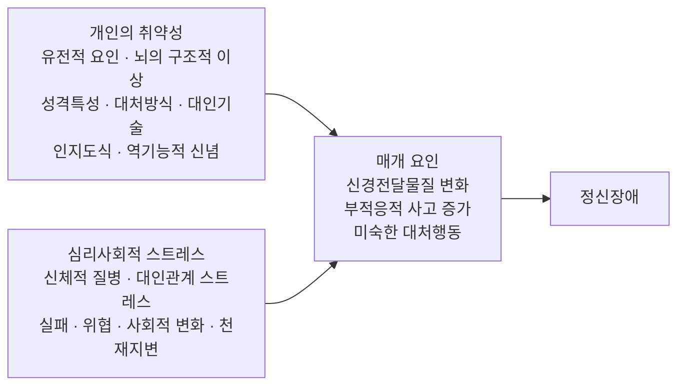



요약

정신장애는 병에 걸리기 쉬운 체질(취약성)에 스트레스가 겹칠 때 생긴다고 본다. 댐의 높이가 사람마다 다르고, 비가 많이 오면 넘친다는 비유와 같다. 취약성이 큰 사람은 작은 스트레스에도 무너지고, 취약성이 작은 사람도 아주 큰 스트레스에는 무너진다. 다만 이 모델은 틀을 줄 뿐, 어떤 취약성과 어떤 스트레스가 어떤 장애로 이어지는지는 장애마다 따로 밝혀야 한다.

## 예시로 보기

같은 회사에서 같은 날 구조조정으로 해고된 두 사람이 있다[^s1].

| | O | P |
|---|---|---|
| 취약성 | 어머니가 우울증을 앓았다. "나는 쓸모없다"는 믿음이 오래되었다. 힘들면 혼자 참는다 | 가족력이 없다. 실패를 일시적인 일로 본다. 친구에게 도움을 청한다 |
| 스트레스 | 해고 | 해고 |
| 매개 과정 | "역시 나는 쓸모없다"는 생각이 늘고, 잠을 못 자고, 사람을 피한다 | 속상하지만 친구와 이야기하고 구직을 시작한다 |
| 결과 | 우울장애 | 일시적인 슬픔 |

스트레스는 같고 결과가 다르다. 차이는 취약성에서 나왔다. 반대로 O도 해고가 없었다면 괜찮았을 수 있다. 취약성만으로도 결과가 정해지지 않는다.

비유의 한계: 댐은 높이 하나로 정해지지만 취약성은 유전, 인지, 대처방식처럼 여러 층으로 되어 있고, 경험에 따라 커지거나 작아진다.

## 정의

슬라이드의 모델은 세 칸과 결과로 되어 있다[^1].

- **개인의 취약성:** 생물학적인 것(유전적 요인, 뇌의 구조적 이상)과 심리적인 것(성격특성, 대처방식, 대인기술, 인지도식, 역기능적 신념)이 함께 들어 있다.
- **심리사회적 스트레스:** 신체적 질병, 대인관계 스트레스, 실패, 위협, 사회적 변화, 천재지변.
- **매개 요인:** 취약성과 스트레스가 만나 일어나는 변화. 신경전달물질 변화, 부적응적 사고 증가, 미숙한 대처행동.

핵심은 둘의 **상호작용**이다. 발병에 필요한 스트레스의 크기는 취약성의 크기에 따라 달라진다[^s2]. 그래서 이 모델은 통합적 입장에 속한다. 취약성 칸 하나에 [생물의학적 입장](/Hongs_Blog/studies/abnormal-psychology/biomedical-perspective/)의 원인(유전, 뇌)과 [인지적 입장](/Hongs_Blog/studies/abnormal-psychology/cognitive-perspective/)의 원인(인지도식, 역기능적 신념)이 함께 들어간다.

이 과목에서 이 모델은 여러 번 다시 나온다. 조현병의 통합적 원인(2회), 대부분의 우울장애(3회), ADHD(11회), 기면증(8회)의 설명이 이 틀을 쓴다. 기면증에서는 유전적 취약성과 스트레스를 합한 양이 첫째 문턱을 넘으면 과도한 주간 졸림, 둘째 문턱을 넘으면 기면증이 된다는 "2역치" 형태로 나온다[^2].

## 연결

- 원인 칸의 출처: [생물의학적 입장](/Hongs_Blog/studies/abnormal-psychology/biomedical-perspective/), [인지적 입장](/Hongs_Blog/studies/abnormal-psychology/cognitive-perspective/)
- 대처방식은 [방어기제](/Hongs_Blog/studies/abnormal-psychology/defense-mechanisms/)와 닿아 있다. 미숙한 대처행동이 매개 요인이다.
- 헷갈리는 짝: [생물심리사회적 모델](/Hongs_Blog/studies/abnormal-psychology/biopsychosocial-model/). 이 모델은 "언제 발병하나(두 요인의 만남)"를, 생물심리사회적 모델은 "원인이 어느 수준에 있고 무엇으로 치료하나"를 정리한다.

## 확인 문제

<b>C1</b> 취약성-스트레스 모델의 네 칸(세 가지 요인과 결과)을 쓰고, 칸마다 예를 둘씩 들라.

**답:** 개인의 취약성(유전적 요인, 역기능적 신념), 심리사회적 스트레스(실패, 대인관계 스트레스), 매개 요인(부적응적 사고 증가, 미숙한 대처행동), 결과는 정신장애.

<b>C2</b> 일란성 쌍둥이는 유전자가 같은데도, 한 명이 조현병에 걸렸을 때 다른 한 명은 걸리지 않는 경우가 많다. 이 사실이 취약성-스트레스 모델을 지지하는 이유를 쓰라.

**답:** 유전만으로 병이 정해진다면 두 사람은 늘 함께 걸려야 한다. 한 명만 걸리는 경우가 많다는 것은 유전(취약성)이 필요하지만 충분하지 않고, 두 사람이 서로 다르게 겪은 스트레스가 발병을 가른다는 뜻이다. 동시에 일란성 쌍둥이가 함께 걸리는 비율이 일반인보다 훨씬 높다는 점은 취약성의 역할을 보여 준다[^s3].

<b>C3</b> 취약성이 큰 사람과 작은 사람이 있다. 두 사람이 모두 정신장애를 겪게 되는 상황과, 한 사람만 겪게 되는 상황을 하나씩 만들라.

**답:** 둘 다: 전쟁이나 큰 재난처럼 매우 큰 스트레스를 함께 겪는다. 취약성이 작은 사람도 스트레스가 충분히 크면 발병할 수 있다. 한 사람만: 이사나 전학처럼 보통 크기의 스트레스를 겪는다. 취약성이 큰 사람만 발병 수준에 이른다. 
**이유:** 발병에 필요한 스트레스의 크기는 취약성에 따라 달라진다.

[^1]: 4-1학기/이상 심리학/1.수업자료/01.이상심리학.pdf, p.55 (통합적 입장: 취약성-스트레스 모델 그림)
[^2]: 02.조현병 스펙트럼 장애.pdf p.32(조현병의 통합적 원인), 03.양극성장애와 우울장애.pdf p.19("대부분의 정신장애는 스트레스-취약성 모델을 따름"), 11.신경발달장애, 신경인지장애.pdf p.42(ADHD), 08.급식 및 섭식장애, 수면-각성장애.pdf p.69(기면증의 2역치 다중요인 모델). 모두 4-1학기/이상 심리학/1.수업자료/ 안에 있다.
[^s1]: 에이전트 보충. 해고된 두 사람의 사례와 댐 비유는 모델을 보이려고 만든 것이다.
[^s2]: 에이전트 보충. 취약성이 클수록 발병에 필요한 스트레스가 작아진다는 상호작용은 이 모델의 표준 설명이다. 이 모델은 주빈(Zubin)과 스프링(Spring)이 1977년 조현병을 설명하려고 제안했고, 소질-스트레스 모델(diathesis-stress model)이라고도 한다.
[^s3]: 에이전트 보충. 2회 슬라이드(02.조현병 스펙트럼 장애.pdf p.21)의 고츠먼(1991) 자료에서 일란성 쌍둥이의 평생 발병 위험은 48%, 일반 인구는 1%다. 자세한 표는 [조현병](/Hongs_Blog/studies/abnormal-psychology/schizophrenia/)에 있다.

