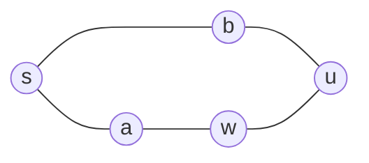


<div class="callout callout-summary" markdown="1">
<div class="callout-title callout-title--default" markdown="span">요약</div>

연못에 돌을 던지면 물결이 가까운 곳부터 둥글게 퍼진다. BFS도 출발점에서 한 걸음 거리인 곳을 모두 본 다음, 두 걸음 거리인 곳을 보는 식으로 퍼진다. 그래서 어떤 곳에 처음 닿는 순간의 걸음 수가 곧 최단 거리다. 단, 모든 한 걸음의 비용이 같을 때만 그렇다. 길마다 비용이 다르면 간선을 적게 쓴 길이 가장 싸다는 보장이 없다.

</div>


## 예시로 보기

미로에서 S(0, 0)부터 G(3, 3)까지 최단 걸음 수를 구한다. `#`은 벽이다.

```
S . # .
. . . .
# . # .
. . . G
```

[큐](/Hongs_Blog/studies/algorithms/queue-deque/)에 출발점을 넣고, 하나씩 꺼내며 아직 거리가 없는 이웃에 "내 거리 + 1"을 적고 큐 뒤에 넣는다. 이웃은 아래, 위, 오른쪽, 왼쪽 순서로 본다.

| 꺼낸 칸 | 그 칸의 거리 | 새로 거리를 적고 넣은 칸 | 큐(앞 → 뒤) |
|---|---|---|---|
| (0, 0) | 0 | (1, 0), (0, 1) | (1, 0), (0, 1) |
| (1, 0) | 1 | (1, 1) | (0, 1), (1, 1) |
| (0, 1) | 1 | 없음 | (1, 1) |
| (1, 1) | 2 | (2, 1), (1, 2) | (2, 1), (1, 2) |
| (2, 1) | 3 | (3, 1) | (1, 2), (3, 1) |
| (1, 2) | 3 | (1, 3) | (3, 1), (1, 3) |

같은 방식으로 끝까지 돌면 칸마다 거리가 채워진다(−1은 벽).

```
 0  1 -1  5
 1  2  3  4
-1  3 -1  5
 5  4  5  6
```

G까지는 6걸음이다. 큐에서 꺼내는 거리는 0, 1, 1, 2, 3, 3, …처럼 줄지 않는다. 거리 k인 칸을 모두 꺼낸 뒤에야 거리 k + 1인 칸을 꺼낸다. 이 순서가 "처음 닿은 거리 = 최단 거리"를 보장한다.

## 정의

<div class="callout callout-definition" markdown="1">
<div class="callout-title" markdown="span">입력과 출력</div>

- **입력:** 그래프 $$G = (V, E)$$(방향이 있어도 없어도 된다)와 출발점 $$s \in V$$($$\in$$은 "~에 속한다"). 간선의 비용은 모두 같다.
- **출력:** 모든 $$v \in V$$에 대해 $$dist[v] = \delta(s, v)$$. 여기서 $$\delta(s, v)$$는 $$s$$에서 $$v$$로 가는 경로의 간선 수 중 최솟값이고, 경로가 없으면 $$\infty$$(코드에서는 −1)다.

</div>


```python
from collections import deque

def bfs(graph, s):
    dist = [-1] * len(graph)       # -1: 아직 못 닿음
    dist[s] = 0
    q = deque([s])
    while q:
        v = q.popleft()
        for u in graph[v]:
            if dist[u] == -1:      # 처음 발견했을 때 바로 거리를 적는다
                dist[u] = dist[v] + 1
                q.append(u)
    return dist
```

거리를 적는 것이 곧 방문 표시다. 넣는 순간 표시하므로 한 점은 큐에 한 번만 들어간다.

## 증명

거리가 k인 점들의 모임을 $$L_k$$(k번째 층)라 하자. 층마다 차례로 발견된다는 것을 k에 대한 [수학적 귀납법](/Hongs_Blog/studies/discrete-math/induction/)으로 보인다[^1].

<div class="callout callout-theorem" markdown="1">
<div class="callout-title" markdown="span">층 순서</div>

모든 $$k \ge 0$$에 대해: $$dist$$에 $$k$$가 적히는 점은 정확히 $$L_k$$의 점이다. 그리고 $$L_k$$의 점은 모두 $$L_{k+1}$$의 어느 점보다 먼저 큐에 들어간다.

</div>


<details class="callout callout-proof" markdown="1">
<summary class="callout-title" markdown="span">증명 펼치기</summary>

1. *시작(k = 0):* $$L_0 = \{s\}$$이고, 처음에 $$dist[s] = 0$$만 적고 s만 큐에 넣는다.
2. *가정:* $$L_0, \dots, L_k$$까지 맞는다고 하자. 그러면 큐에서 $$L_0$$, $$L_1$$, …, $$L_k$$의 점이 층 순서대로 꺼내진다(큐는 넣은 순서대로 꺼내기 때문).
3. *이웃의 층:* 간선 하나로 이어진 두 점의 거리 차는 1 이하다. $$v \in L_k$$이고 $$u$$가 $$v$$의 이웃이면 $$\delta(s, u) \le k + 1$$이기 때문이다. 그래서 $$L_k$$ 점의 이웃은 $$L_{\le k}$$ 또는 $$L_{k+1}$$에 있다.
4. *새로 적히는 값:* $$L_k$$의 점을 꺼내 처리할 때, $$L_{\le k}$$의 점은 가정에 따라 이미 거리가 적혀 있다. 그러니 이때 새로 적히는 점은 모두 $$L_{k+1}$$에 있고, 적히는 값은 $$k + 1$$이다.
5. *빠짐없음:* $$u \in L_{k+1}$$이면 $$s$$에서 $$u$$로 가는 최단 경로에서 $$u$$ 바로 앞 점은 거리가 $$k$$다(최단 경로의 앞부분도 최단). 그래서 $$u$$는 $$L_k$$의 어떤 점의 이웃이고, 그 점을 처리할 때 늦어도 거리가 적힌다. $$L_k$$보다 앞 층에서는 적힐 수 없다(4단계를 $$k - 1$$에 쓴 것과 같다).
6. *순서:* $$L_{k+1}$$의 점은 $$L_k$$를 처리하는 동안 큐에 들어가고, $$L_{k+2}$$의 점은 $$L_{k+1}$$을 처리할 때 들어간다. 그래서 층 순서가 유지된다. ∎

</details>


이 정리에서 $$dist[v] = \delta(s, v)$$가 바로 나온다. 어느 층에도 없는 점(닿을 수 없는 점)은 끝까지 −1로 남는다.

### 스스로 설명해 보기

<details class="callout callout-question" markdown="1">
<summary class="callout-title" markdown="span">1. 5단계의 "최단 경로에서 u 바로 앞 점은 거리가 k"의 근거는?</summary>

최단 경로 s → … → x → u의 길이가 k + 1이면, 앞부분 s → … → x는 길이 k인 경로다. x까지 더 짧은 길이 있다면 그 길에 x → u를 붙여 u까지 k + 1보다 짧게 갈 수 있어 모순이다. 그래서 δ(s, x) = k다.

</details>


<details class="callout callout-question" markdown="1">
<summary class="callout-title" markdown="span">2. 3단계의 "이웃끼리 거리 차가 1 이하"의 근거는?</summary>

v까지 k걸음에 가는 길에 v → u 한 걸음을 붙이면 u까지 k + 1걸음에 간다. 그래서 δ(s, u) ≤ δ(s, v) + 1이다. 무방향이면 반대로도 맞아 차이가 1 이하다. 방향 그래프에서는 한쪽 부등식만 있어도 증명에 충분하다.

</details>


<details class="callout callout-question" markdown="1">
<summary class="callout-title" markdown="span">3. 큐 대신 스택을 쓰면 증명의 어느 단계가 깨지는가?</summary>

2단계의 "층 순서대로 꺼내진다"가 깨진다. 스택은 가장 나중에 넣은 점을 먼저 꺼내므로, $$L_{k+1}$$의 점을 $$L_k$$의 남은 점보다 먼저 처리할 수 있다. 그러면 4단계에서 어떤 점에 k + 1보다 큰 값이 먼저 적힐 수 있다.

</details>


<details class="callout callout-question" markdown="1">
<summary class="callout-title" markdown="span">이 증명의 핵심 아이디어는?</summary>

"가까운 층을 다 처리한 뒤에 먼 층으로 간다"는 순서다. 큐가 이 순서를 지키고, 한 걸음이 거리를 1만 바꾸니 처음 적힌 값이 최소가 된다.

</details>


<details class="callout callout-question" markdown="1">
<summary class="callout-title" markdown="span">같은 방법을 쓸 수 있는 다른 상황은?</summary>

점이 장소가 아니라 상태여도 된다. "위치와 방향", "로봇이 차지한 두 칸", "퍼즐 판의 배치"처럼 한 번의 동작이 비용 1인 상태 공간에서 최소 동작 수를 구할 때 그대로 쓴다.

</details>


<div class="callout callout-check" markdown="1">
<div class="callout-title" markdown="span">검증: 예시의 거리 표와 큐 추적 여섯 줄, 확인 문제 C1·C2·C4의 답을 확인했다. 무작위 그래프 2,000개에서 BFS 거리가 "간선마다 거리 + 1로 줄이기를 n번 되풀이한" 값과 같았고, 매 바퀴 큐 안의 거리가 줄지 않으며 차이가 1 이하였다. 오해의 반례와 점 20만 개·간선 40만 개에서의 시간도 확인했다 — [24_bfs_impl.py](/Hongs_Blog/studies/algorithms/code/24_bfs_impl/)</div>

</div>


## 활용

- **비용:** 점마다 큐에 한 번 들어가고, 점마다 이웃 목록을 한 번 훑는다. 그래서 최선·평균·최악 모두 $$O(n + m)$$이다(n은 점, m은 간선 수). 격자 R×C는 $$O(RC)$$다. 공간은 dist와 큐에 $$O(n)$$이다. 점 20만 개, 간선 40만 개로 재 보니 0.1초가 안 걸렸다.
- **여러 출발점:** 출발점을 모두 거리 0으로 큐에 넣고 한 번 돌리면, 칸마다 "가장 가까운 출발점까지의 거리"가 나온다(확인 문제 C2).
- **상태 BFS:** 같은 칸이라도 방향이나 남은 기회가 다르면 다른 점으로 본다. dist를 `dist[r][c][방향]`처럼 늘린다. [그래프 표현](/Hongs_Blog/studies/algorithms/graph-representation/)의 "상태를 점으로 보기"와 같다.
- **쓰는 곳:** 미로·게임의 최소 이동 수, 소셜 그래프의 "몇 다리 건너 아는 사이", 웹 크롤러가 가까운 링크부터 도는 것, 네트워크에서 몇 번 거쳐 닿는지 세기.
- **흔한 실수:** 꺼낼 때 방문 표시를 한다(아래 오해). 격자 범위 검사를 벽 검사보다 뒤에 해 `IndexError`가 나거나, −1 같은 음수 번호가 반대편 끝 칸을 가리켜 조용히 틀린다. 리스트의 `pop(0)`으로 큐를 만들어 느려진다. 가중치가 있는데 BFS를 쓴다(확인 문제 C4).

## 연결

- 선수: [큐와 덱](/Hongs_Blog/studies/algorithms/queue-deque/), [그래프 표현](/Hongs_Blog/studies/algorithms/graph-representation/)
- 수학 쪽: [경로와 연결성](/Hongs_Blog/studies/discrete-math/connectivity/)에서 BFS가 최단 거리와 연결 성분을 찾는 것을 그래프 이론의 말로 다룬다.
- BFS로 [이분 그래프](/Hongs_Blog/studies/discrete-math/bipartite-coloring/)인지 판정한다. 무방향 그래프에서 출발점까지의 거리가 짝수인 점과 홀수인 점을 다른 색으로 칠한다. 증명 3단계대로 간선은 같은 층이나 이웃한 층만 잇는다. 그래서 같은 층끼리 이은 간선이 없으면 이분 그래프이고, 하나라도 있으면 홀수 사이클이 있다. 연결 성분마다 따로 돌린다.
- 이웃을 훑는 일이 모두 합쳐 $$O(m)$$인 근거는 [그래프의 기초](/Hongs_Blog/studies/discrete-math/graph-basics/)의 악수 정리다. 이웃 목록 길이를 모두 더하면 무방향은 2m, 방향은 m이다.
- 일반화: 간선 비용이 서로 다르면 [다익스트라](/Hongs_Blog/studies/algorithms/dijkstra/)다. 다익스트라는 큐 대신 힙을 쓰는 BFS로 볼 수 있다.
- 연습: [블록 이동하기](/Hongs_Blog/studies/algorithms/pg60063/), [동굴 탐험](/Hongs_Blog/studies/algorithms/pg67260/), [지형 이동](/Hongs_Blog/studies/algorithms/pg62050/)

## 자주 하는 오해

<div class="callout callout-misconception" markdown="1">
<div class="callout-title" markdown="span">"방문 표시는 큐에서 꺼낼 때 해도 결과가 같다"</div>

틀렸다. 꺼낼 때 표시하면, 아직 꺼내지 않은 점이 다른 점에서 또 발견되어 큐에 여러 번 들어간다. 이때 발견할 때마다 거리를 적으면 나중에 발견한 더 큰 값이 앞의 값을 덮어쓴다. 거리가 1인 점 a, b에서 a → w → u, b → u로 이어진 그래프(s–a, s–b, a–w, b–u, w–u)가 반례다. b가 u에 2를 적지만, u를 꺼내기 전에 w(거리 2)가 u를 다시 발견해 3으로 덮어쓴다. 실제 거리는 2다. 한 점이 큐에 여러 번 들어가 시간과 메모리도 더 든다. 넣는 순간 표시하면 한 점에 한 번만 값이 적히고, 증명의 4단계대로 그 값이 최단이다.

</div>




반례 그래프다. s에서 u까지는 b를 거치는 두 걸음 길과 a, w를 거치는 세 걸음 길이 있다. 꺼낼 때 표시하면 늦게 꺼낸 w가 u에 3을 덮어쓴다[^s1].

## 확인 문제

<details class="callout callout-question" markdown="1">
<summary class="callout-title" markdown="span">**C1** 무방향 간선 1–2, 1–3, 2–4, 3–4, 3–5, 4–6, 5–6이 있다. 1에서 BFS를 할 때(이웃은 번호 순) 점 1 ~ 6의 거리와 큐에서 꺼내는 순서는?</summary>

**답:** 거리는 1: 0, 2: 1, 3: 1, 4: 2, 5: 2, 6: 3이다. 꺼내는 순서는 1, 2, 3, 4, 5, 6이다. 4는 2를 꺼낼 때 먼저 발견되어 3을 꺼낼 때는 건너뛴다. 6은 4를 꺼낼 때 3이 적힌다.

</details>


<details class="callout callout-question" markdown="1">
<summary class="callout-title" markdown="span">**C2** 다음 코드가 돌려주는 `dist[r][c]`가 무엇인지 한 문장으로 말하라.</summary>

```python
def f(maze, sources):
    dist = [[-1] * C for _ in range(R)]
    q = deque()
    for r, c in sources:
        dist[r][c] = 0
        q.append((r, c))
    while q:
        r, c = q.popleft()
        for dr, dc in ((1, 0), (-1, 0), (0, 1), (0, -1)):
            nr, nc = r + dr, c + dc
            if 0 <= nr < R and 0 <= nc < C and maze[nr][nc] != "#" and dist[nr][nc] == -1:
                dist[nr][nc] = dist[r][c] + 1
                q.append((nr, nc))
    return dist
```
**답:** 칸 (r, c)에서 가장 가까운 출발점까지의 최소 걸음 수다(닿을 수 없으면 −1). 출발점을 모두 거리 0의 첫 층으로 넣었기 때문에, 출발점마다 BFS를 따로 돌린 값 중 가장 작은 값과 같다.

</details>


<details class="callout callout-question" markdown="1">
<summary class="callout-title" markdown="span">**C3** BFS에서 어떤 점을 처음 발견한 순간 적은 거리가 최단 거리인 까닭은?</summary>

**답:** 큐가 거리 k인 점을 모두 꺼낸 뒤에야 거리 k + 1인 점을 꺼내기 때문이다. 점 u를 거리 k인 점을 처리하다 처음 발견했다고 하자. 거리 k − 1 이하인 점은 모두 먼저 처리했는데 u를 발견하지 못했으니, u는 그런 점과 이웃하지 않는다. 그래서 u까지 k걸음 이하로 갈 수 없다. 한편 거리 k인 점의 이웃이라 k + 1걸음에는 간다. 그러니 u의 거리는 정확히 k + 1이다.

</details>


<details class="callout callout-question" markdown="1">
<summary class="callout-title" markdown="span">**C4** 간선 비용이 A–B 10, A–C 1, C–B 1일 때, BFS로 찾은 A에서 B까지의 길과 실제로 가장 싼 길은?</summary>

**답:** BFS는 간선 1개짜리 A–B(비용 10)를 찾는다. 가장 싼 길은 A–C–B로 비용 2다. BFS는 간선 수만 세므로 비용이 다르면 틀린다. 이때는 다익스트라를 쓴다.

</details>


[^1]: 층 순서 증명의 구성은 Cormen 외, *Introduction to Algorithms* 3판, 22.2절 "Breadth-first search"의 정확성 증명(큐 안의 거리는 줄지 않고 차이가 1 이하)을 층 단위로 다시 쓴 것이다. 구현과 O(n + m)은 Laaksonen, *Competitive Programmer's Handbook* (2018년 7월판), 12.2 "Breadth-first search".
[^s1]: <span class="fn-tag" title="수업 자료에 없고 따로 보탠 내용">보충</span> 다이어그램 1개는 원본에 없다. '자주 하는 오해'의 반례 그래프(s–a, s–b, a–w, b–u, w–u)를 그대로 그렸다.

