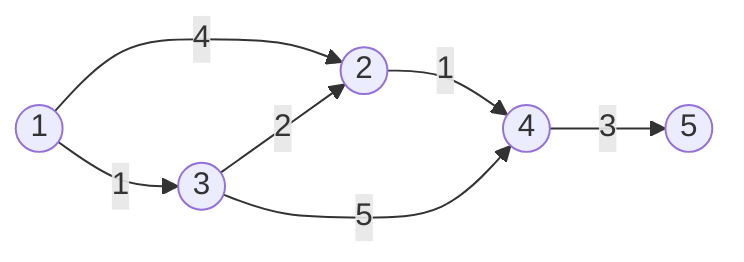
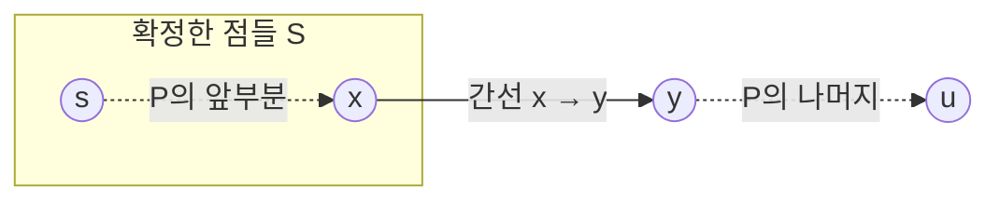


<div class="callout callout-summary" markdown="1">
<div class="callout-title callout-title--default" markdown="span">요약</div>

길마다 걸리는 시간이 다를 때, 출발점에서 가장 가까운 곳부터 하나씩 "여기까지는 이 시간이 최소"라고 확정해 나간다. 확정한 곳에서 이어진 길로 다른 곳까지의 시간을 줄여 두고, 아직 확정하지 않은 곳 중 가장 가까운 곳을 또 확정한다. 가장 가까운 곳은 힙으로 빨리 찾는다. 단, 모든 길의 비용이 0 이상일 때만 맞다. 음수인 길이 있으면 이미 확정한 곳이 나중에 더 가까워질 수 있다.

</div>


## 예시로 보기

방향 그래프 1 → 2(4), 1 → 3(1), 3 → 2(2), 2 → 4(1), 3 → 4(5), 4 → 5(3)에서 1부터의 최소 비용을 구한다. 괄호 안이 비용이다.



1에서 2로 가는 길은 바로 가는 화살표(4)와 3을 거치는 화살표 둘(1 + 2)이다. 간선 수가 적은 쪽이 더 비싸다[^s2].

[힙](/Hongs_Blog/studies/algorithms/heap/)에 (거리, 점)을 넣는다. 꺼낸 거리가 이미 적힌 거리보다 크면, 나중에 더 좋은 값이 생겨 낡은 기록이니 버린다.

| 꺼낸 (거리, 점) | 처리 | 줄어든 거리 | 힙에 남은 것 |
|---|---|---|---|
| (0, 1) | 확정 | 2 → 4, 3 → 1 | (1, 3), (4, 2) |
| (1, 3) | 확정 | 2 → 3, 4 → 6 | (3, 2), (4, 2), (6, 4) |
| (3, 2) | 확정 | 4 → 4 | (4, 2), (4, 4), (6, 4) |
| (4, 2) | 낡음(2는 이미 3) | | (4, 4), (6, 4) |
| (4, 4) | 확정 | 5 → 7 | (6, 4), (7, 5) |
| (6, 4) | 낡음(4는 이미 4) | | (7, 5) |
| (7, 5) | 확정 | | |

결과는 1: 0, 2: 3, 3: 1, 4: 4, 5: 7이다. 2까지는 직접 가는 4보다 3을 거치는 1 + 2 = 3이 싸다. [BFS](/Hongs_Blog/studies/algorithms/bfs/)였다면 간선이 하나인 1 → 2를 먼저 확정했을 것이다. 다익스트라는 "처음 발견"이 아니라 "힙에서 꺼낼 때" 확정해서 이 차이를 잡는다.

## 정의

<div class="callout callout-definition" markdown="1">
<div class="callout-title" markdown="span">입력과 출력</div>

- **입력:** 그래프 $$G = (V, E)$$, 모든 간선에 대해 $$w(u, v) \ge 0$$인 비용 $$w$$, 출발점 $$s \in V$$($$\in$$은 "~에 속한다").
- **출력:** 모든 $$v \in V$$에 대해 $$dist[v] = \delta(s, v)$$. $$\delta(s, v)$$는 $$s$$에서 $$v$$로 가는 경로의 비용 합 중 최솟값이고, 경로가 없으면 $$\infty$$다.

</div>


```python
import heapq

def dijkstra(graph, s):              # graph[v]: (이웃, 비용) 목록
    INF = float("inf")
    dist = [INF] * len(graph)
    dist[s] = 0
    heap = [(0, s)]
    while heap:
        d, v = heapq.heappop(heap)   # 가장 가까운 후보
        if d > dist[v]:              # 낡은 기록이면 버린다
            continue
        for u, w in graph[v]:
            nd = d + w
            if nd < dist[u]:         # v를 거치면 u까지 더 싸다
                dist[u] = nd
                heapq.heappush(heap, (nd, u))
    return dist
```

"v를 거치면 더 싸면 u의 거리를 줄인다"는 동작을 완화(relaxation)라 한다. 힙에서 값을 지우는 대신 새 값을 또 넣고 낡은 값은 꺼낼 때 버리는 방식은 [힙과 우선순위 큐](/Hongs_Blog/studies/algorithms/heap/)의 늦은 삭제다.

## 증명

"힙에서 낡지 않은 (d, v)를 꺼낸 순간 d = δ(s, v)"를 귀류법으로 보인다[^1]. 이렇게 꺼낸 점을 "확정한 점"이라 하고 그 모임을 S라 한다.

<div class="callout callout-theorem" markdown="1">
<div class="callout-title" markdown="span">꺼낸 거리는 최단 거리다</div>

비용이 모두 0 이상이면, 점 u를 확정하는 순간 $$dist[u] = \delta(s, u)$$다.

</div>


<details class="callout callout-proof" markdown="1">
<summary class="callout-title" markdown="span">증명 펼치기</summary>

1. *늘 크거나 같다:* dist에 적히는 값은 모두 실제로 있는 경로의 비용이다. 그래서 언제나 $$dist[v] \ge \delta(s, v)$$다.
2. *반대 가정:* u가 확정되는 순간 $$dist[u] > \delta(s, u)$$인 첫 점이라 하자. $$u \ne s$$다($$dist[s] = 0 = \delta(s, s)$$). s에서 u로 가는 최단 경로 P를 하나 잡는다.
3. *경계의 점:* P를 따라가다 처음으로 S 밖에 있는 점을 y, 그 바로 앞 점을 x라 하자(x ∈ S). s ∈ S이고 u ∉ S이니 y가 있다.
4. *y는 이미 정확하다:* x는 u보다 먼저 확정되었고, 2단계의 가정에 따라 확정될 때 $$dist[x] = \delta(s, x)$$였다. x를 처리할 때 간선 x → y를 완화했으니 $$dist[y] \le \delta(s, x) + w(x, y) = \delta(s, y)$$다. 마지막 등호는 최단 경로의 앞부분도 최단이기 때문이다. 1단계와 합치면 $$dist[y] = \delta(s, y)$$다.
5. *비용이 0 이상:* y는 P 위에서 u보다 앞에 있고, y에서 u까지 남은 간선의 비용이 모두 0 이상이다. 그래서 $$\delta(s, y) \le \delta(s, u)$$다.
6. *모순:* $$dist[y] = \delta(s, y) \le \delta(s, u) < dist[u]$$. y도 확정 전이라 힙에 (dist[y], y)가 있으니, 힙은 u보다 y를 먼저 꺼냈어야 한다. y = u라면 4단계에서 바로 $$dist[u] = \delta(s, u)$$라 역시 모순이다. ∎

</details>




증명에 나오는 점들의 자리다. 최단 경로 P는 s에서 출발해 x까지 S 안에 있다가, 간선 x → y에서 처음 S 밖으로 나간다. u는 그 뒤에 있다(y = u일 수도 있다)[^s2].

### 스스로 설명해 보기

<details class="callout callout-question" markdown="1">
<summary class="callout-title" markdown="span">1. 5단계에서 "비용이 0 이상"을 쓰지 않으면 무엇이 깨지는가?</summary>

y에서 u까지 가는 길에 음수 간선이 있으면 δ(s, y) > δ(s, u)일 수 있다. 그러면 dist[y]가 dist[u]보다 커도 되니, u를 먼저 꺼낸 것이 모순이 아니다. 확인 문제 C3이 실제로 틀리는 예다.

</details>


<details class="callout callout-question" markdown="1">
<summary class="callout-title" markdown="span">2. 4단계에서 dist[y] ≤ δ(s, x) + w(x, y)인 근거는?</summary>

x를 확정해 처리할 때 코드가 모든 간선 x → y에 대해 "d + w < dist[y]이면 dist[y] = d + w"를 했다. 그 뒤로 dist[y]는 줄기만 한다. 그래서 dist[y]는 d + w = δ(s, x) + w(x, y) 이하다.

</details>


<details class="callout callout-question" markdown="1">
<summary class="callout-title" markdown="span">3. 낡은 기록을 버리는 `if d > dist[v]: continue`가 없으면 결과가 틀리는가?</summary>

결과는 맞다. 낡은 기록으로 이웃을 완화해도 d가 더 커서 아무것도 줄지 않는다. 하지만 같은 점의 이웃 목록을 여러 번 훑어 시간이 늘어난다. 예시에서는 5번이면 될 것을 7번 훑는다. 이 줄 덕분에 점마다 이웃을 한 번만 훑는다.

</details>


<details class="callout callout-question" markdown="1">
<summary class="callout-title" markdown="span">이 증명의 핵심 아이디어는?</summary>

확정한 점들과 아직인 점들 사이의 "경계"를 본다. 최단 경로가 경계를 처음 넘는 점 y는 이미 정확한 거리를 갖고, 비용이 음수가 아니니 y가 u보다 멀 수 없다. 그래서 가장 가까운 후보를 확정해도 안전하다.

</details>


<details class="callout callout-question" markdown="1">
<summary class="callout-title" markdown="span">이 방법을 쓸 수 있는 다른 상황은?</summary>

경로의 값을 "합" 대신 "지나간 간선 중 가장 큰 값"으로 정해도, 간선을 붙일 때 값이 줄지 않는다는 성질만 있으면 같은 논리가 통한다. [등산코스 정하기](/Hongs_Blog/studies/algorithms/pg118669/)가 이 모양이다. 상태를 점으로 보면(위치 + 방향 등) 상태 그래프에서도 그대로 쓴다.

</details>


<div class="callout callout-check" markdown="1">
<div class="callout-title" markdown="span">검증: 예시 표 일곱 줄(확정·낡음, 줄어든 거리, 힙 상태), 확인 문제 C1의 거리와 확정 순서를 코드로 맞췄다. 비용이 0 이상인 무작위 그래프 2,000개에서 벨만–포드와 같은 거리를 냈고, 힙에 넣는 횟수가 간선 수 이하였다. 낡은 기록을 버리지 않아도 거리는 같고 훑는 횟수만 느는 것, 오해와 음수 간선의 반례, 점 5만 개·간선 20만 개에서의 시간도 확인했다 — [26_dijkstra_impl.py](/Hongs_Blog/studies/algorithms/code/26_dijkstra_impl/)</div>

</div>


## 활용

- **비용:** 점마다 이웃을 한 번 훑고, 간선마다 힙에 많아야 한 번 넣는다. 힙 연산 한 번이 $$O(\log m)$$이니 전체는 $$O((n + m) \log m)$$이다[^2]. 공간은 $$O(n + m)$$이다. 점 5만 개, 간선 20만 개로 재 보니 0.1초 안팎이었다. 간선이 n²에 가까운 조밀한 그래프에서는 힙 없이 매번 가장 가까운 점을 리스트에서 찾는 $$O(n^2)$$ 방식이 낫다.
- **쓰는 곳:** 지도 앱의 길 찾기, 네트워크 라우팅(OSPF 같은 링크 상태 방식은 라우터마다 다익스트라로 최단 경로 트리를 계산한다[^s1]), 게임 캐릭터의 이동 경로.
- **상태 다익스트라:** 같은 칸이라도 들어온 방향에 따라 앞으로의 비용이 다르면, (칸, 방향)을 점으로 본다. [경주로 건설](/Hongs_Blog/studies/algorithms/pg67259/)이 이 모양이다.
- **흔한 실수:** 처음 발견할 때 확정한다(아래 오해). 무방향 그래프에서 간선을 한쪽만 넣는다. 음수 간선에 쓴다. 거리 초기값을 너무 작은 수(예: 10⁹)로 잡았는데 실제 거리가 그보다 크다.

## 연결

- 선수: [힙과 우선순위 큐](/Hongs_Blog/studies/algorithms/heap/), [너비 우선 탐색(BFS)](/Hongs_Blog/studies/algorithms/bfs/)
- 특수화: 비용이 모두 같으면 BFS와 같은 순서로 확정한다.
- 가장 가까운 곳을 되돌리지 않고 확정한다는 점에서 [그리디](/Hongs_Blog/studies/algorithms/greedy/)다. 증명의 경계 논리가 그리디의 바꿔치기 역할을 한다.
- 모든 점 쌍의 거리가 필요하고 점이 수백 개 이하면 [플로이드–워셜](/Hongs_Blog/studies/algorithms/floyd-warshall/)이 더 짧다. 음수 간선이 있으면 벨만–포드를 쓴다.
- 연습: [경주로 건설](/Hongs_Blog/studies/algorithms/pg67259/), [등산코스 정하기](/Hongs_Blog/studies/algorithms/pg118669/), [미로 탈출](/Hongs_Blog/studies/algorithms/pg81304/)
- 증명 2단계에서 "처음으로 틀리게 확정된 점"을 잡는 것은 [수학적 귀납법](/Hongs_Blog/studies/discrete-math/induction/)의 정렬 원리로, 가장 작은 반례를 잡는 방법이다. 그래서 그보다 먼저 확정된 점은 모두 맞다고 쓸 수 있다. 반대를 가정해 모순을 끌어내는 틀은 [추론 규칙과 증명 방법](/Hongs_Blog/studies/discrete-math/proof-methods/)의 귀류법이다.
- [경로와 연결성](/Hongs_Blog/studies/discrete-math/connectivity/)의 거리는 건너는 간선 수다. δ(s, v)는 그 수 대신 간선 비용의 합으로 잰 거리다.
- 성공 확률이 가장 큰 경로도 다익스트라로 찾는다. 길마다 성공 확률 p가 있고 길끼리 [독립](/Hongs_Blog/studies/probability-statistics/independence/)이면, 경로의 성공 확률은 지나는 길의 p를 모두 곱한 값이다. 비용을 −ln p로 두면 곱이 가장 큰 경로가 비용 합이 가장 작은 경로가 된다. p ≤ 1이라 비용은 0 이상이고(p = 0인 길은 뺀다), 그래서 다익스트라를 그대로 쓴다.
- 한 점에서 다른 한 점으로 가는 간선이 많아야 하나면 $$m \le n^2$$이다. [로그](/Hongs_Blog/studies/college-math/logarithm/)는 늘 증가하고 $$\lg n^2 = 2\lg n$$이라 $$\lg m \le 2\lg n$$이다. 그래서 활용의 $$O((n + m)\log m)$$을 $$O((n + m)\log n)$$으로 써도 틀리지 않는다.

## 자주 하는 오해

<div class="callout callout-misconception" markdown="1">
<div class="callout-title" markdown="span">"BFS처럼 처음 발견할 때 거리를 확정해도 된다"</div>

틀렸다. BFS는 모든 걸음의 비용이 같아서 먼저 발견한 길이 곧 짧은 길이다. 비용이 다르면 먼저 발견한 길이 비쌀 수 있다. s → a(5), s → b(1), b → a(1)에서 s를 처리하면 a를 5로 먼저 발견한다. 여기서 확정하면 a의 답은 5다. 실제로는 b를 거쳐 1 + 1 = 2다. 발견할 때는 거리를 "줄여 두기"만 하고, 힙에서 꺼낼 때 확정해야 한다. 증명의 6단계가 바로 "꺼낼 때"를 쓴다.

</div>


## 확인 문제

<details class="callout callout-question" markdown="1">
<summary class="callout-title" markdown="span">**C1** 무방향 그래프 1–2(7), 1–3(9), 1–6(14), 2–3(10), 2–4(15), 3–4(11), 3–6(2), 4–5(6), 5–6(9)에서 1부터 다익스트라를 돌린다. 각 점의 최소 비용과 확정되는 순서는? (거리가 같으면 번호가 작은 점을 먼저 꺼낸다.)</summary>

**답:** 1: 0, 2: 7, 3: 9, 4: 20, 5: 20, 6: 11. 확정 순서는 1, 2, 3, 6, 4, 5다. 6은 처음에 14로 적히지만 3을 확정할 때 9 + 2 = 11로 줄고, 힙의 (14, 6)은 나중에 낡은 기록으로 버려진다. 4는 2를 거쳐 22로 적혔다가 3을 거쳐 20으로 준다.

</details>


<details class="callout callout-question" markdown="1">
<summary class="callout-title" markdown="span">**C2** 코드의 `if d > dist[v]: continue` 한 줄이 하는 일을 한 문장으로 말하라.</summary>

**답:** 힙에서 꺼낸 기록이 그 점의 지금 거리보다 크면, 이미 더 짧은 길로 처리된 낡은 기록이니 이웃을 훑지 않고 버린다. 덕분에 점마다 이웃 목록을 한 번만 훑는다.

</details>


<details class="callout callout-question" markdown="1">
<summary class="callout-title" markdown="span">**C3** 간선 s → a(2), s → b(3), b → a(−2), a → c(1)에서, "한 번 꺼낸 점은 다시 처리하지 않는" 다익스트라가 c에 적는 값과 실제 최단 비용은?</summary>

**답:** c에 3을 적는다. a를 거리 2로 먼저 확정하고 c를 2 + 1 = 3으로 줄인다. 그 뒤 b(3)를 처리하며 a가 3 − 2 = 1로 줄지만, a는 이미 처리했으니 c를 다시 줄이지 않는다. 실제 최단은 s → b → a → c로 3 − 2 + 1 = 2다. 음수 간선이 증명의 5단계("y가 u보다 멀 수 없다")를 깨뜨린다.

</details>


<details class="callout callout-question" markdown="1">
<summary class="callout-title" markdown="span">**C4** 비용이 모두 0 이상일 때, 힙에서 (낡지 않게) 꺼낸 점의 거리를 더 줄일 방법이 없는 까닭은?</summary>

**답:** 그 점 u로 가는 더 짧은 길이 있다면, 그 길은 확정한 점들 밖으로 처음 나가는 점 y를 지난다. y의 거리는 이미 정확하고, y에서 u까지 비용이 0 이상이라 y의 거리는 u의 거리보다 작거나 같다. 그렇다면 힙은 u보다 y를 먼저 꺼냈어야 하니 모순이다.

</details>


[^1]: 증명의 구조(경계의 점 y를 잡는 귀류법)는 Cormen 외, *Introduction to Algorithms* 3판, 24.3절 "Dijkstra's algorithm"의 정리 24.6을 풀어 쓴 것이다.
[^2]: Laaksonen, *Competitive Programmer's Handbook* (2018년 7월판), 13.2 "Dijkstra's algorithm": 음수 간선이 없어야 하고, 같은 점이 우선순위 큐에 여러 번 들어갈 수 있지만 가장 작은 거리의 것만 처리하며, 시간은 O(n + m log m)이다.
[^s1]: 에이전트 보충. RFC 2328(OSPF Version 2) 16.1절: "Using the Dijkstra algorithm, a tree is formed from this subset of the link state database."
[^s2]: 에이전트 보충. 다이어그램 2개는 원본에 없다. 예시로 보기의 방향 간선 여섯 개를 그대로 그렸고, '증명' 절 2~4단계의 점 s, x, y, u와 경로 P의 관계를 그림으로 옮겼다.

