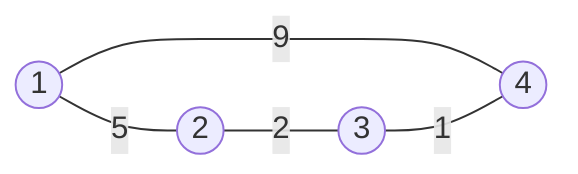


<div class="callout callout-summary" markdown="1">
<div class="callout-title callout-title--default" markdown="span">요약</div>

모든 도시 쌍 사이의 최단 거리표를 한 번에 채운다. 처음에는 바로 이어진 길만 적고, "1번 도시를 거쳐도 되면?", "1·2번까지 거쳐도 되면?"처럼 거쳐 갈 도시를 하나씩 늘리며 표를 고친다. 코드는 반복문 세 겹으로 아주 짧지만, 도시 수의 세제곱만큼 걸려 도시가 수백 개일 때까지만 쓸 수 있다. 음수인 길도 되지만, 돌수록 비용이 줄어드는 고리(음수 사이클)가 있으면 최단 거리가 없다.

</div>


## 예시로 보기

도시 1 ~ 4와 양방향 도로 1–2(5), 1–4(9), 2–3(2), 3–4(1)이 있다. D[i][j]는 "지금까지 허락한 도시만 거쳐서 i에서 j로 가는 최소 비용"이다. 처음에는 아무 도시도 거치지 못한다.



네 도시가 고리 하나로 이어져 있다. 1에서 4로 가는 길은 바로 가는 9와, 2와 3을 거쳐 도는 5 + 2 + 1 두 가지다[^s1].

| 단계 | 1행 | 2행 | 3행 | 4행 | 바뀐 칸 |
|---|---|---|---|---|---|
| 처음 | 0, 5, ∞, 9 | 5, 0, 2, ∞ | ∞, 2, 0, 1 | 9, ∞, 1, 0 | |
| 1을 거쳐도 됨 | 0, 5, ∞, 9 | 5, 0, 2, 14 | ∞, 2, 0, 1 | 9, 14, 1, 0 | 2↔4: 5 + 9 |
| 2까지 | 0, 5, 7, 9 | 5, 0, 2, 14 | 7, 2, 0, 1 | 9, 14, 1, 0 | 1↔3: 5 + 2 |
| 3까지 | 0, 5, 7, 8 | 5, 0, 2, 3 | 7, 2, 0, 1 | 8, 3, 1, 0 | 1↔4: 7 + 1, 2↔4: 2 + 1 |
| 4까지 | 그대로 | | | | |

2↔4는 1을 거치면 14였다가, 3을 거쳐도 되자 3으로 준다. 마지막 표가 모든 쌍의 최단 거리다.

## 정의

<div class="callout callout-definition" markdown="1">
<div class="callout-title" markdown="span">점화식</div>

점이 $$1, \dots, n$$인 그래프에서 $$D_k[i][j]$$를 "중간에 $$1, \dots, k$$번 점만 거쳐 i에서 j로 가는 최소 비용"이라 하자. $$D_0$$은 간선 비용($$i = j$$면 0, 간선이 없으면 $$\infty$$)이고, $$k \ge 1$$이면

$$D_k[i][j] = \min\big(D_{k-1}[i][j],\ D_{k-1}[i][k] + D_{k-1}[k][j]\big).$$

음수 사이클이 없으면 $$D_n[i][j] = \delta(i, j)$$다.

</div>


k를 쓰지 않는 최단 경로와 k를 한 번 지나는 최단 경로 중 작은 쪽이라는 뜻이다. 음수 사이클이 없으면 같은 점을 두 번 지나지 않는 최단 경로가 늘 있으니, 그런 경로가 k를 지나면 i → k와 k → j 두 부분으로 나뉘고 두 부분 모두 1 ~ k − 1만 거친다[^1].

```python
for k in range(1, n + 1):          # 거쳐 가도 되는 점을 하나씩 늘린다
    for i in range(1, n + 1):
        for j in range(1, n + 1):
            if D[i][k] + D[k][j] < D[i][j]:
                D[i][j] = D[i][k] + D[k][j]
```

음수 사이클이 없으면 표 하나를 제자리에서 고쳐도 된다. k번째 바퀴에서 D[i][k]와 D[k][j]는 바뀌지 않기 때문이다. 이때 D[k][k] = 0이라 D[i][k] + D[k][k]가 D[i][k]보다 작아질 수 없다. 음수 사이클이 k를 지나면 D[k][k]가 음수가 되어 이 값들도 바뀐다. 그때는 최단 거리가 정해지지 않으니, 아래처럼 사이클이 있는지만 판정한다.

반복이 끝난 뒤 어떤 D[i][i]가 음수면 음수 사이클이 있다는 뜻이다. i에서 출발해 i로 돌아오는 길의 비용이 0보다 작아졌기 때문이다.

<div class="callout callout-check" markdown="1">
<div class="callout-title" markdown="span">검증: 예시 표의 네 단계, 확인 문제 C1·C3의 답을 코드로 맞췄다. 음수 간선이 섞인 무작위 그래프 1,500개에서, 음수 사이클이 없으면 모든 출발점의 벨만–포드와 같은 거리를 냈고, 음수 사이클이 있는지는 "어떤 D[i][i] < 0"과 벨만–포드의 판정이 늘 같았다. n = 200에서 시간도 쟀다 — [27_floyd-warshall_verify.py](/Hongs_Blog/studies/algorithms/code/27_floyd-warshall_verify/)</div>

</div>


## 활용

- **비용:** 시간 $$O(n^3)$$, 공간 $$O(n^2)$$이다. 최선·최악의 차이가 없다. n = 200이면 800만 번이고, 재 보니 0.2초 남짓이었다.
- **고르는 기준:** 모든 쌍이 필요하고 n이 수백 이하면 플로이드–워셜이 가장 짧다. 한 출발점만 필요하거나 n이 크면 [다익스트라](/Hongs_Blog/studies/algorithms/dijkstra/)를 쓴다. 다익스트라를 n번 돌리는 것보다 코드가 짧고, 음수 간선도 다룬다.
- **쓰는 곳:** 도시 간 거리표, "a에서 b로 갈 수 있나"를 모든 쌍에 대해 구하기(비용 대신 참·거짓, 추이 폐포), [합승 택시 요금](/Hongs_Blog/studies/algorithms/pg72413/)처럼 "어느 지점에서 갈라질까"를 모든 지점에 대해 따져야 할 때.
- **흔한 실수:** k를 안쪽 반복에 둔다(확인 문제 C3). 무한대 대신 10⁹ 같은 수를 쓰는데 실제 거리가 그보다 커져, "길이 없다"와 "먼 길"을 헷갈린다. 같은 두 점 사이 간선이 여러 개인데 가장 작은 값을 남기지 않는다. D[i][i]를 0으로 두지 않는다.

## 연결

- 선수: [그래프 표현](/Hongs_Blog/studies/algorithms/graph-representation/), [경로와 연결성](/Hongs_Blog/studies/discrete-math/connectivity/)
  - 정의 아래의 "같은 점을 두 번 지나지 않는 최단 경로가 늘 있다"는 경로와 연결성의 "가장 짧은 보행은 경로다"를 비용이 있는 길로 옮긴 것이다. 같은 점을 두 번 지나는 길이면 그 사이의 고리를 잘라 낸다. 음수 사이클이 없으면 고리의 비용이 0 이상이라 잘라도 비용이 늘지 않는다.
- 비교: 한 출발점의 최단 거리는 [다익스트라](/Hongs_Blog/studies/algorithms/dijkstra/), 비용이 모두 같으면 [BFS](/Hongs_Blog/studies/algorithms/bfs/)다.
- 점화식으로 표를 채우는 모양이 [동적 계획법](/Hongs_Blog/studies/algorithms/dynamic-programming/)이다. "거쳐도 되는 점의 범위"가 상태다.
- 연습: [합승 택시 요금](/Hongs_Blog/studies/algorithms/pg72413/)
- 활용의 참·거짓 판은 [관계와 그 성질](/Hongs_Blog/studies/discrete-math/relations/)의 와셜 알고리즘이고, 결과는 추이 폐포(이행적 폐포)다. min은 "또는", +는 "그리고"로 바뀌고, 거쳐도 되는 점을 하나씩 늘리는 반복은 그대로다. 처음 표에서 D[i][i]까지 참으로 두면 한 걸음도 안 가는 짝 (i, i)가 모두 들어간다. 그래서 추이 폐포만 얻으려면 간선이 있는 칸만 참으로 둔다.
- [행렬 곱](/Hongs_Blog/studies/linear-algebra/matrix-multiplication/) $$(AB)_{ij} = \sum_k a_{ik}b_{kj}$$($$\sum$$은 차례로 모두 더한다는 기호)에서 더하기를 min으로, 곱하기를 +로 바꾸면 $$\min_k(D[i][k] + D[k][j])$$, 곧 가운데 점 하나를 거치는 가장 싼 길이 된다. 처음 표 $$D_0$$을 이 곱으로 $$t$$제곱하면 간선 $$t$$개 이하로 가는 최단 거리가 나온다. $$D_0$$의 대각선이 0이라 제자리에 머무는 걸음이 공짜여서, "정확히 $$t$$개"가 아니라 "$$t$$개 이하"다. 인접행렬의 거듭제곱이 길이 $$t$$인 보행의 수를 세는 것([인접행렬 거듭제곱 ↔ 마르코프 전이](/Hongs_Blog/studies/probability-statistics/walks-markov-bridge/))을 비용으로 바꾼 셈이다. 플로이드–워셜은 이 곱을 되풀이하지 않고, 거쳐도 되는 점을 하나씩 늘려 $$O(n^3)$$에 끝낸다.
- 함께 보면 좋은 수학: [가우스 소거법](/Hongs_Blog/studies/linear-algebra/gaussian-elimination/)(피벗 k를 바깥에 두고 행렬 칸 M[i][j]를 M[i][k], M[k][j]로 고치는 세 겹 반복이 같은 모양이다)
- 브리지: [추이 폐포 ↔ 플로이드–워셜](/Hongs_Blog/studies/algorithms/warshall-floyd/)

## 확인 문제

<details class="callout callout-question" markdown="1">
<summary class="callout-title" markdown="span">**C1** 방향 간선 1 → 2(1), 2 → 3(1), 1 → 3(5), 3 → 1(1)에서 플로이드–워셜을 끝낸 뒤의 표를 쓰라.</summary>

**답:** 1행 [0, 1, 2], 2행 [2, 0, 1], 3행 [1, 2, 0]. 1 → 3은 2를 거쳐 2로 준다. 2 → 1은 3을 거쳐 1 + 1 = 2, 3 → 2는 1을 거쳐 1 + 1 = 2다.

</details>


<details class="callout callout-question" markdown="1">
<summary class="callout-title" markdown="span">**C2** 플로이드–워셜을 돌린 뒤 다음 코드가 참을 돌려주면 무엇을 뜻하는지 한 문장으로 말하라.</summary>

```python
any(D[i][i] < 0 for i in range(1, n + 1))
```
**답:** 어떤 점에서 출발해 제자리로 돌아오는 길의 비용이 음수라는 것, 곧 그래프에 음수 사이클이 있다는 뜻이다. 그 사이클을 돌수록 비용이 줄어드니 그 근처 점들 사이의 최단 거리는 정해지지 않는다.

</details>


<details class="callout callout-question" markdown="1">
<summary class="callout-title" markdown="span">**C3** 반복 순서를 `for i: for j: for k:`로 바꾸면 틀리는 까닭을, 간선 1 → 2(4), 2 → 4(1), 4 → 3(5)로 설명하라.</summary>

**답:** 1 → 3의 최단은 1 → 2 → 4 → 3으로 10이다. 순서를 바꾸면 D[1][3]을 계산하는 순간(i = 1, j = 3)에 필요한 D[1][4]가 아직 ∞다. D[1][4]는 j = 4일 때, 즉 D[1][3]보다 뒤에 계산되기 때문이다. D[2][3]도 i = 2일 때에야 계산된다. 그래서 D[1][3]은 ∞로 남는다. k를 바깥에 두어야 "1 ~ k − 1까지 거친 값"이 모든 쌍에 대해 먼저 완성된다.

</details>


[^1]: Cormen 외, *Introduction to Algorithms* 3판, 25.2절 "The Floyd-Warshall algorithm"(중간 점을 {1, …, k}로 제한한 점화식과 O(n³)), Laaksonen, *Competitive Programmer's Handbook* (2018년 7월판), 13.3 "Floyd–Warshall algorithm".
[^s1]: <span class="fn-tag" title="수업 자료에 없고 따로 보탠 내용">보충</span> 다이어그램 1개는 원본에 없다. 예시로 보기의 양방향 도로 1–2(5), 1–4(9), 2–3(2), 3–4(1)을 그대로 그렸다.

