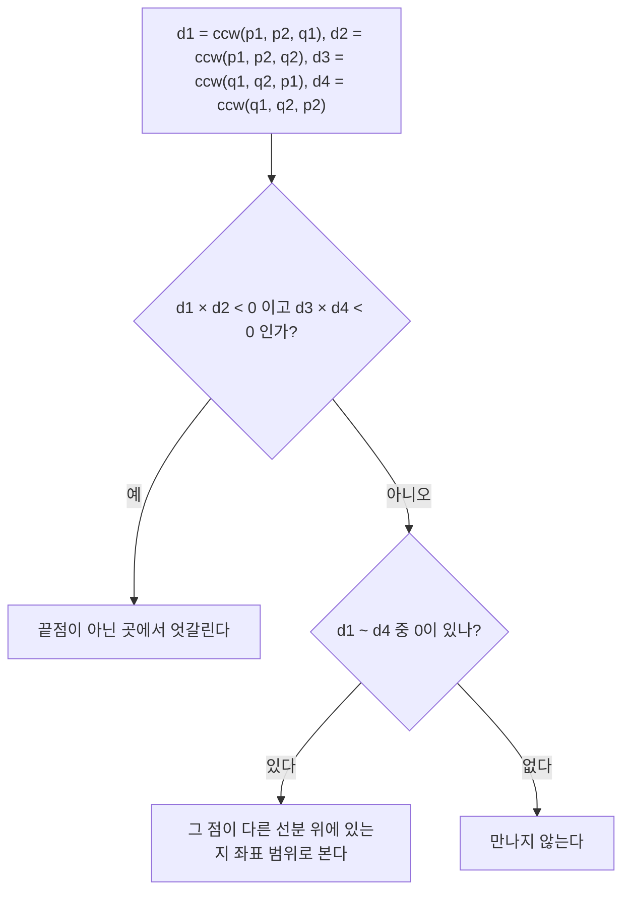


<div class="callout callout-summary" markdown="1">
<div class="callout-title callout-title--default" markdown="span">요약</div>

길을 걷다 다음 갈림길에서 왼쪽으로 꺾는지 오른쪽으로 꺾는지는 곱셈 두 번과 뺄셈 한 번으로 알 수 있다. 각도나 기울기를 계산하지 않고 정수로만 계산하니 오차가 없고, 세로선에서 0으로 나누는 일도 없다. 이 "왼쪽인가 오른쪽인가" 하나로 선분이 엇갈리는지, 점이 삼각형 안에 있는지, 점들을 각도 순으로 세우는 일을 모두 한다. 다만 세 점이 한 줄에 서는 경우(값 0)는 따로 다뤄야 해서 실수가 잦다.

</div>


## 예시로 보기

O(0, 0)에서 P(4, 1)을 본 뒤 Q(1, 3)으로 고개를 돌린다. 두 방향 (4, 1)과 (1, 3)으로 4 × 3 − 1 × 1 = 11을 계산한다. 양수라 P → Q는 반시계 방향, 곧 왼쪽으로 꺾는다. 순서를 바꿔 O, Q, P로 보면 −11이라 오른쪽이다.

11은 삼각형 OPQ 넓이의 두 배이기도 하다. 그래서 이 값은 "어느 쪽으로 도는가"와 "얼마나 넓은가"를 함께 알려 준다.

## 정의

<div class="callout callout-definition" markdown="1">
<div class="callout-title" markdown="span">외적과 CCW</div>

세 점 o, p, q에 대해

$$\operatorname{cross}(o, p, q) = (p_x - o_x)(q_y - o_y) - (p_y - o_y)(q_x - o_x).$$

값이 양수면 o → p → q가 반시계 방향(왼쪽으로 꺾음), 음수면 시계 방향(오른쪽), 0이면 세 점이 한 줄에 있다. 절댓값은 삼각형 opq 넓이의 두 배다[^1].

</div>


이 값을 바탕으로 세 가지를 판정한다.

- **선분 교차:** 선분 p₁p₂와 q₁q₂가 끝점이 아닌 곳에서 엇갈리려면, q₁과 q₂가 직선 p₁p₂의 서로 다른 쪽에 있고, p₁과 p₂도 직선 q₁q₂의 서로 다른 쪽에 있어야 한다. 곧 ccw(p₁, p₂, q₁) · ccw(p₁, p₂, q₂) < 0이고 ccw(q₁, q₂, p₁) · ccw(q₁, q₂, p₂) < 0이다. 값이 0인 쪽이 있으면 그 점이 다른 선분 위에 있는지 좌표 범위로 따로 본다[^2].



두 곱이 모두 음수일 때만 바로 "엇갈린다"로 끝낸다. 값 0이 하나라도 나오면 한 줄에 놓인 점이 있다는 뜻이라 따로 확인한다[^s2].

- **점이 삼각형 안에 있는가:** 세 변 ab, bc, ca에 대해 ccw 값의 부호가 서로 엇갈리지 않으면(양수와 음수가 함께 나오지 않으면) 안이나 변 위다.
- **각도 순 정렬:** 한 점 o에서 본 점들이 모두 반평면(180도 미만의 범위) 안에 있으면, "ccw(o, p, q) > 0이면 p가 q보다 앞"이라는 비교로 정렬한다. 파이썬에서는 `functools.cmp_to_key`로 비교 함수를 넘긴다.


왼쪽은 예시의 세 점이다. O에서 P 쪽을 보다가 Q 쪽으로 반시계 방향으로 고개를 돌리고, 색칠한 삼각형의 넓이 5.5가 외적 11의 절반이다. 오른쪽의 두 선분은 엇갈린다. 괄호 속 부호처럼 p₁과 p₂는 직선 q₁q₂의 양쪽에 하나씩, q₁과 q₂는 직선 p₁p₂의 양쪽에 하나씩 있다[^s1].

```python
def cross(o, p, q):
    return (p[0] - o[0]) * (q[1] - o[1]) - (p[1] - o[1]) * (q[0] - o[0])

def crosses(p1, p2, q1, q2):               # 끝점이 아닌 곳에서 엇갈리는가
    d1, d2 = cross(p1, p2, q1), cross(p1, p2, q2)
    d3, d4 = cross(q1, q2, p1), cross(q1, q2, p2)
    return d1 * d2 < 0 and d3 * d4 < 0
```

<div class="callout callout-check" markdown="1">
<div class="callout-title" markdown="span">검증: 예시의 값 11과 넓이 관계, 확인 문제 C1과 C3을 코드로 확인했다. 무작위 선분 쌍(좌표 −6 ~ 6)에서 끝점에 닿거나 한 줄로 겹치는 경우까지 넣어, 분수로 교점을 직접 푼 결과와 비교했다. 점-삼각형 판정은 넓이 합과, 각도 순 정렬은 atan2와 비교했다 — [35_geometry-ccw_verify.py](/Hongs_Blog/studies/algorithms/code/35_geometry-ccw_verify/)</div>

</div>


## 활용

- **비용:** 판정 하나가 곱셈 몇 번이다. 각도 순 정렬은 $$O(n \log n)$$이다.
- **알아보는 신호:** 좌표가 주어지고 "꺾임", "교차", "안쪽", "볼록"을 묻는다.
- **쓰는 곳:** 볼록 껍질, 다각형 넓이(신발끈 공식), 선분 교차, 점이 다각형 안에 있는지 판정.
- **흔한 실수:** 세 점이 한 줄(값 0)인 경우를 빠뜨린다. 한쪽 직선에 대해서만 양쪽을 확인한다(확인 문제 C3). 각도 순 정렬에서 점들이 180도를 넘게 퍼져 있으면 비교가 앞뒤가 맞지 않는다. C++이나 자바에서는 좌표가 $$10^9$$이면 곱이 int를 넘어 64비트 정수가 필요하다.

## 연결

- 선수: [파이썬 기본 문법](/Hongs_Blog/studies/algorithms/python-basics/)
- 비교 함수로 정렬하는 방법은 [정렬과 정렬 기준](/Hongs_Blog/studies/algorithms/sorting/)에 있다.
- 선을 쓸며 기하 사건을 처리할 때는 [스위핑](/Hongs_Blog/studies/algorithms/segment-tree-sweep/)과 함께 쓴다.
- cross(o, p, q)는 p − o와 q − o를 두 열로 세운 2 × 2 행렬의 [행렬식](/Hongs_Blog/studies/linear-algebra/determinant/)이다. 그 절댓값은 두 벡터가 만드는 평행사변형의 넓이이고, 삼각형 opq는 그 절반이다.
- 외적은 $$\vert op\vert  \cdot \vert oq\vert  \cdot \sin\theta$$와 같다. θ는 p − o에서 q − o로 반시계 방향으로 잰 각이다. p − o와 q − o를 각각 $$r_1(\cos\alpha, \sin\alpha)$$, $$r_2(\cos\beta, \sin\beta)$$로 쓰면 [삼각함수 항등식](/Hongs_Blog/studies/college-math/trig-identities/)의 덧셈정리로 외적이 $$r_1 r_2 \sin(\beta - \alpha)$$가 되기 때문이다. 그래서 θ가 0도와 180도 사이면 양수(왼쪽)이고, 절댓값은 [사인 법칙과 코사인 법칙](/Hongs_Blog/studies/college-math/triangle-laws/)의 삼각형 넓이 $$\tfrac12 ab\sin C$$의 두 배다.
- 각도 순 정렬은 o를 원점으로 둔 [극좌표](/Hongs_Blog/studies/college-math/polar-parametric/)의 방향각 순서로 점을 세우는 일이다. 방향각 자체는 [역삼각함수](/Hongs_Blog/studies/college-math/inverse-trig/)의 atan2로 구한다. atan2는 한 바퀴 전체를 다뤄 반평면 조건이 필요 없지만, 실수라 오차가 있다.
- 아래 오해에서 두 기울기가 모두 1.0이 되는 까닭은 [거듭제곱과 지수법칙](/Hongs_Blog/studies/college-math/exponent-laws/)의 부동소수점에 있다. 파이썬 실수(float)는 가수가 53비트라서 1 바로 다음 수가 약 1 + 2.2 × 10⁻¹⁶이다. 두 기울기는 1보다 약 10⁻¹⁷만 커서 둘 다 1.0으로 반올림된다.
- p − o, q − o를 복소수 u, v로 보면 cross(o, p, q)는 $$\bar{u}v$$의 허수부이고, 실수부는 내적이다([복소수의 극형식과 오일러 공식](/Hongs_Blog/studies/college-math/euler-formula/)).
- o를 먼저 빼는 까닭은 [벡터](/Hongs_Blog/studies/linear-algebra/vectors/)에서 위치와 이동을 구별하는 까닭과 같다. 원점을 옮기면 점 좌표는 바뀌지만 차이 p − o, q − o는 그대로다.
- 연습: [IU와 콘의 보드게임](/Hongs_Blog/studies/algorithms/pg1841/)

## 자주 하는 오해

<div class="callout callout-misconception" markdown="1">
<div class="callout-title" markdown="span">"기울기를 나눗셈으로 구해 비교하면 된다"</div>

틀렸다. 세로선은 x 차이가 0이라 나눌 수 없다. 좌표가 크면 부동소수 오차로 다른 기울기가 같게 보인다. 예를 들어 원점에서 본 $$(10^{17}, 10^{17}+1)$$과 $$(10^{17}+1, 10^{17}+2)$$의 기울기는 파이썬 실수로 둘 다 1.0이지만, 외적은 −1이라 실제로는 오른쪽으로 꺾는다. 외적은 정수 곱셈과 뺄셈뿐이라 이런 일이 없다. 검증 코드에서 두 경우를 확인했다.

</div>


## 확인 문제

<details class="callout callout-question" markdown="1">
<summary class="callout-title" markdown="span">**C1** o(1, 1), p(5, 2), q(3, −4)일 때 cross(o, p, q)와 꺾는 방향은?</summary>

**답:** p − o = (4, 1), q − o = (2, −5)라 4 × (−5) − 1 × 2 = −22다. 음수라 o → p → q는 시계 방향, 곧 오른쪽으로 꺾는다. 흔한 실수는 o를 빼지 않고 p, q 좌표를 그대로 곱하는 것이다.

</details>


<details class="callout callout-question" markdown="1">
<summary class="callout-title" markdown="span">**C2** 각도를 atan2로 구해 비교하는 대신 외적의 부호를 쓰는 까닭은?</summary>

**답:** 외적은 정수 곱셈과 뺄셈만 써서 정확하다. atan2는 실수라 오차가 있고, 아주 가까운 두 각도를 같다고 보거나 순서를 뒤집을 수 있다. 0으로 나누는 일도 없다.

</details>


<details class="callout callout-question" markdown="1">
<summary class="callout-title" markdown="span">**C3** 선분 교차를 "q₁, q₂가 직선 p₁p₂의 서로 다른 쪽에 있다"만으로 판정하면 틀리는 예를 들어라.</summary>

**답:** p₁(0, 0), p₂(2, 0)과 q₁(5, −1), q₂(5, 1). q₁은 아래, q₂는 위라 첫 조건은 맞는다. 하지만 p₁, p₂는 직선 q₁q₂(x = 5)의 같은 쪽(왼쪽)에 있어, 두 선분은 만나지 않는다. 반대쪽 조건도 함께 봐야 한다.

</details>


[^1]: Laaksonen, *Competitive Programmer's Handbook* (2018판), 29.2 "Points and lines"는 외적으로 점이 직선의 어느 쪽에 있는지와 선분 교차를 판정한다. 넓이 관계는 29.3 "Polygon area"에 있다.
[^2]: 한 줄에 놓인 경우까지 다루는 선분 교차 판정은 Cormen 외, *Introduction to Algorithms* 3판, 33.1 "Line-segment properties"에 있다.
[^s1]: <span class="fn-tag" title="수업 자료에 없고 따로 보탠 내용">보충</span> 그림은 원본에 없다. [35_geometry-ccw_plot.py](/Hongs_Blog/studies/algorithms/code/35_geometry-ccw_plot/)로 그렸고, cross(O, P, Q) = 11, cross(O, Q, P) = −11, 삼각형 넓이 5.5(헤론 공식으로 따로 계산), 오른쪽 선분 p₁(0, 0)–p₂(4, 2)와 q₁(1, 3)–q₂(3, −1)의 네 부호 값 10, −10, −10, 10을 같은 코드로 확인했다.
[^s2]: <span class="fn-tag" title="수업 자료에 없고 따로 보탠 내용">보충</span> 다이어그램 1개는 원본에 없다. '정의' 절의 선분 교차 판정 문장과 crosses 코드의 d1 ~ d4를 순서도로 옮겼다.

