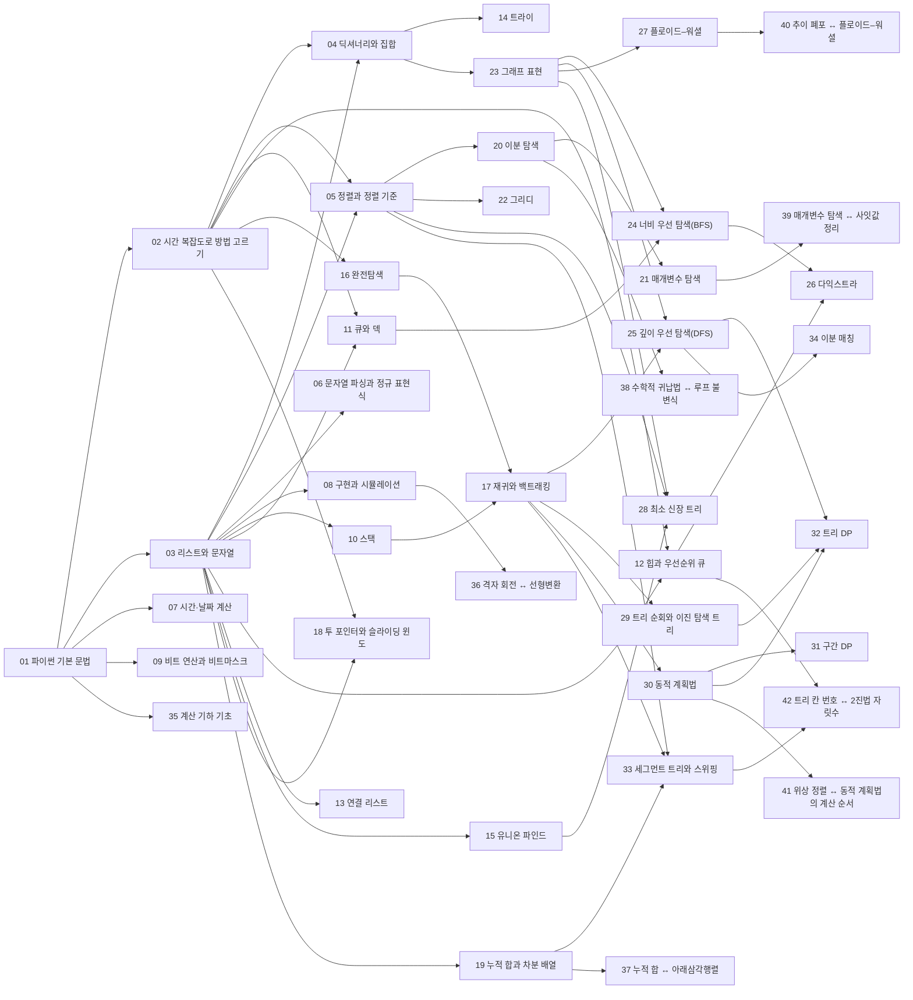


## 먼저 알아야 할 것
- [점근 표기](/Hongs_Blog/studies/discrete-math/asymptotic-notation/) (이산수학)
- [나눗셈과 합동](/Hongs_Blog/studies/discrete-math/modular-arithmetic/) (이산수학)
- [진법과 자릿수](/Hongs_Blog/studies/college-math/positional-notation/) (대학수학)
- [동치관계와 분할](/Hongs_Blog/studies/discrete-math/equivalence-relations/) (이산수학)
- [순열과 조합](/Hongs_Blog/studies/discrete-math/permutations-combinations/) (이산수학)
- [재귀적 정의와 구조적 귀납법](/Hongs_Blog/studies/discrete-math/recursive-definitions/) (이산수학)
- [수열과 합의 기호](/Hongs_Blog/studies/college-math/sequences-sigma/) (대학수학)
- [로그](/Hongs_Blog/studies/college-math/logarithm/) (대학수학)
- [그래프의 기초](/Hongs_Blog/studies/discrete-math/graph-basics/) (이산수학)
- [경로와 연결성](/Hongs_Blog/studies/discrete-math/connectivity/) (이산수학)
- [트리](/Hongs_Blog/studies/discrete-math/trees/) (이산수학)
- [선형 점화식](/Hongs_Blog/studies/discrete-math/linear-recurrences/) (이산수학)
- [이분 그래프와 그래프 색칠](/Hongs_Blog/studies/discrete-math/bipartite-coloring/) (이산수학)
- [선형변환](/Hongs_Blog/studies/linear-algebra/linear-transformations/) (선형대수학)
- [역행렬](/Hongs_Blog/studies/linear-algebra/inverse-matrix/) (선형대수학)
- [수학적 귀납법](/Hongs_Blog/studies/discrete-math/induction/) (이산수학)
- [연속과 사잇값 정리](/Hongs_Blog/studies/calculus/continuity/) (미분적분학)
- [관계와 그 성질](/Hongs_Blog/studies/discrete-math/relations/) (이산수학)
- [부분순서와 위상 정렬](/Hongs_Blog/studies/discrete-math/partial-orders/) (이산수학)

## 1단원 · 파이썬으로 문제 풀기

읽기 전에

1. `7 // 2`, `7 % 2`, `-7 // 2`의 값은 각각 무엇일까? → [파이썬 기본 문법](/Hongs_Blog/studies/algorithms/python-basics/)
2. 입력이 10만 개일 때, 모든 쌍을 비교하는 방법은 1초 안에 끝날까? → [시간 복잡도로 방법 고르기](/Hongs_Blog/studies/algorithms/complexity-budget/)
3. 이름 10만 개 중에서 한 이름이 있는지 확인하는 가장 빠른 방법은? → [딕셔너리와 집합](/Hongs_Blog/studies/algorithms/hash-dict-set/)

| 번호 | 개념 | 한 줄 | 개념 코드 | 연습 |
|---|---|---|---|---|
| 01 | [파이썬 기본 문법](/Hongs_Blog/studies/algorithms/python-basics/) | 값과 변수, 조건문, 반복문, 함수. solution 함수 하나가 답안이다 | [verify](/Hongs_Blog/studies/algorithms/code/01_python-basics_verify/) | [짝수와 홀수](/Hongs_Blog/studies/algorithms/pg12937/) ([코드](/Hongs_Blog/studies/algorithms/code/01_pg12937_p1/)) |
| 02 | [시간 복잡도로 방법 고르기](/Hongs_Blog/studies/algorithms/complexity-budget/) | 제한의 크기를 보고 연산 횟수를 어림해, 쓸 수 있는 방법을 미리 고른다 (무거움) | [bench](/Hongs_Blog/studies/algorithms/code/02_complexity-budget_bench/) · [verify](/Hongs_Blog/studies/algorithms/code/02_complexity-budget_verify/) | [시간 복잡도 어림 예제 사다리](/Hongs_Blog/studies/algorithms/complexity-ladder/) |
| 03 | [리스트와 문자열](/Hongs_Blog/studies/algorithms/list-string/) | 번호로 꺼내는 줄. 인덱스, 슬라이싱, 메서드, 컴프리헨션 | [verify](/Hongs_Blog/studies/algorithms/code/03_list-string_verify/) | [평균 구하기](/Hongs_Blog/studies/algorithms/pg12944/) ([코드](/Hongs_Blog/studies/algorithms/code/03_pg12944_p1/)), [숫자 문자열과 영단어](/Hongs_Blog/studies/algorithms/pg81301/) ([코드](/Hongs_Blog/studies/algorithms/code/03_pg81301_p1/)), [k진수에서 소수 개수 구하기](/Hongs_Blog/studies/algorithms/pg92335/) ([코드](/Hongs_Blog/studies/algorithms/code/03_pg92335_p1/)), [n진수 게임](/Hongs_Blog/studies/algorithms/pg17687/) ([코드](/Hongs_Blog/studies/algorithms/code/03_pg17687_p1/)) |
| 04 | [딕셔너리와 집합](/Hongs_Blog/studies/algorithms/hash-dict-set/) | 이름표로 바로 찾는 표(해시). 넣기·찾기가 평균 O(1) (무거움) | [impl](/Hongs_Blog/studies/algorithms/code/04_hash-dict-set_impl/) | [완주하지 못한 선수](/Hongs_Blog/studies/algorithms/pg42576/) ([코드](/Hongs_Blog/studies/algorithms/code/04_pg42576_p1/)), [성격 유형 검사하기](/Hongs_Blog/studies/algorithms/pg118666/) ([코드](/Hongs_Blog/studies/algorithms/code/04_pg118666_p1/)), [신고 결과 받기](/Hongs_Blog/studies/algorithms/pg92334/) ([코드](/Hongs_Blog/studies/algorithms/code/04_pg92334_p1/)), [가장 많이 받은 선물](/Hongs_Blog/studies/algorithms/pg258712/) ([코드](/Hongs_Blog/studies/algorithms/code/04_pg258712_p1/)), [뉴스 클러스터링](/Hongs_Blog/studies/algorithms/pg17677/) ([코드](/Hongs_Blog/studies/algorithms/code/04_pg17677_p1/)), [압축](/Hongs_Blog/studies/algorithms/pg17684/) ([코드](/Hongs_Blog/studies/algorithms/code/04_pg17684_p1/)), [오픈채팅방](/Hongs_Blog/studies/algorithms/pg42888/) ([코드](/Hongs_Blog/studies/algorithms/code/04_pg42888_p1/)) |
| 05 | [정렬과 정렬 기준](/Hongs_Blog/studies/algorithms/sorting/) | sorted와 key로 원하는 순서 만들기. 같은 값은 원래 순서를 지킨다 | [impl](/Hongs_Blog/studies/algorithms/code/05_sorting_impl/) | [K번째수](/Hongs_Blog/studies/algorithms/pg42748/) ([코드](/Hongs_Blog/studies/algorithms/code/05_pg42748_p1/)), [실패율](/Hongs_Blog/studies/algorithms/pg42889/) ([코드](/Hongs_Blog/studies/algorithms/code/05_pg42889_p1/)), [무지의 먹방 라이브](/Hongs_Blog/studies/algorithms/pg42891/) ([코드](/Hongs_Blog/studies/algorithms/code/05_pg42891_p1/)) |

떠올려 보기: 노트를 닫고 리스트·딕셔너리·정렬로 각각 무엇을 빠르게 할 수 있는지, 그 비용(빅오)과 함께 적어 본다.

## 2단원 · 구현의 기본기

읽기 전에

1. "09:05"와 "10:02" 사이는 몇 분일까? 가장 실수가 적은 계산법은? → [시간·날짜 계산](/Hongs_Blog/studies/algorithms/time-conversion/)
2. 격자에서 상하좌우 이웃을 네 개의 if 없이 돌 수 있을까? → [구현과 시뮬레이션](/Hongs_Blog/studies/algorithms/simulation/)
3. 9와 30을 이진수로 쓰고 OR 하면 무엇이 될까? → [비트 연산과 비트마스크](/Hongs_Blog/studies/algorithms/bit-operations/)

| 번호 | 개념 | 한 줄 | 개념 코드 | 연습 |
|---|---|---|---|---|
| 06 | [문자열 파싱과 정규 표현식](/Hongs_Blog/studies/algorithms/string-parsing/) | 글자를 하나씩 읽거나 규칙(정규식)으로 잘라 의미 단위로 바꾼다 | [verify](/Hongs_Blog/studies/algorithms/code/06_string-parsing_verify/) | [다트 게임](/Hongs_Blog/studies/algorithms/pg17682/) ([코드](/Hongs_Blog/studies/algorithms/code/06_pg17682_p1/)), [신규 아이디 추천](/Hongs_Blog/studies/algorithms/pg72410/) ([코드](/Hongs_Blog/studies/algorithms/code/06_pg72410_p1/)), [중요한 단어를 스포 방지](/Hongs_Blog/studies/algorithms/pg468370/) ([코드](/Hongs_Blog/studies/algorithms/code/06_pg468370_p1/)), [튜플](/Hongs_Blog/studies/algorithms/pg64065/) ([코드](/Hongs_Blog/studies/algorithms/code/06_pg64065_p1/)), [파일명 정렬](/Hongs_Blog/studies/algorithms/pg17686/) ([코드](/Hongs_Blog/studies/algorithms/code/06_pg17686_p1/)) |
| 07 | [시간·날짜 계산](/Hongs_Blog/studies/algorithms/time-conversion/) | 모든 시각을 가장 작은 단위 하나로 바꿔 빼고 더한다 | [verify](/Hongs_Blog/studies/algorithms/code/07_time-conversion_verify/) | [개인정보 수집 유효기간](/Hongs_Blog/studies/algorithms/pg150370/) ([코드](/Hongs_Blog/studies/algorithms/code/07_pg150370_p1/)), [동영상 재생기](/Hongs_Blog/studies/algorithms/pg340213/) ([코드](/Hongs_Blog/studies/algorithms/code/07_pg340213_p1/)), [주차 요금 계산](/Hongs_Blog/studies/algorithms/pg92341/) ([코드](/Hongs_Blog/studies/algorithms/code/07_pg92341_p1/)), [방금그곡](/Hongs_Blog/studies/algorithms/pg17683/) ([코드](/Hongs_Blog/studies/algorithms/code/07_pg17683_p1/)) |
| 08 | [구현과 시뮬레이션](/Hongs_Blog/studies/algorithms/simulation/) | 규칙을 그대로 한 단계씩 따라 한다. 격자와 방향 배열 | [verify](/Hongs_Blog/studies/algorithms/code/08_simulation_verify/) | [키패드 누르기](/Hongs_Blog/studies/algorithms/pg67256/) ([코드](/Hongs_Blog/studies/algorithms/code/08_pg67256_p1/)), [붕대 감기](/Hongs_Blog/studies/algorithms/pg250137/) ([코드](/Hongs_Blog/studies/algorithms/code/08_pg250137_p1/)), [프렌즈4블록](/Hongs_Blog/studies/algorithms/pg17679/) ([코드](/Hongs_Blog/studies/algorithms/code/08_pg17679_p1/)), [거리두기 확인하기](/Hongs_Blog/studies/algorithms/pg81302/) ([코드](/Hongs_Blog/studies/algorithms/code/08_pg81302_p1/)), [셔틀버스](/Hongs_Blog/studies/algorithms/pg17678/) ([코드](/Hongs_Blog/studies/algorithms/code/08_pg17678_p1/)), [기둥과 보 설치](/Hongs_Blog/studies/algorithms/pg60061/) ([코드](/Hongs_Blog/studies/algorithms/code/08_pg60061_p1/)), [블록 게임](/Hongs_Blog/studies/algorithms/pg42894/) ([코드](/Hongs_Blog/studies/algorithms/code/08_pg42894_p1/)) |
| 09 | [비트 연산과 비트마스크](/Hongs_Blog/studies/algorithms/bit-operations/) | 수를 0과 1의 칸으로 보고 칸 단위로 계산한다. 부분집합을 수 하나로 | [verify](/Hongs_Blog/studies/algorithms/code/09_bit-operations_verify/) | [비밀지도](/Hongs_Blog/studies/algorithms/pg17681/) ([코드](/Hongs_Blog/studies/algorithms/code/09_pg17681_p1/)) |

떠올려 보기: 문자열 자르기, 시간 바꾸기, 격자 이동, 비트 연산에서 각각 가장 자주 하는 실수 하나씩을 적어 본다.

## 3단원 · 기본 자료구조

읽기 전에

1. 괄호 문자열 "(()"가 짝이 맞지 않는다는 것을 어떤 자료구조로 가장 쉽게 알 수 있을까? → [스택](/Hongs_Blog/studies/algorithms/stack/)
2. 리스트의 맨 앞에서 pop(0)을 10만 번 하면 왜 느릴까? → [큐와 덱](/Hongs_Blog/studies/algorithms/queue-deque/)
3. "같은 무리인가?"라는 질문을 수백만 번 빠르게 답하려면? → [유니온 파인드](/Hongs_Blog/studies/algorithms/union-find/)

| 번호 | 개념 | 한 줄 | 개념 코드 | 연습 |
|---|---|---|---|---|
| 10 | [스택](/Hongs_Blog/studies/algorithms/stack/) | 나중에 넣은 것을 먼저 꺼내는 접시 더미 | [impl](/Hongs_Blog/studies/algorithms/code/10_stack_impl/) | [같은 숫자는 싫어](/Hongs_Blog/studies/algorithms/pg12906/) ([코드](/Hongs_Blog/studies/algorithms/code/10_pg12906_p1/)), [크레인 인형뽑기 게임](/Hongs_Blog/studies/algorithms/pg64061/) ([코드](/Hongs_Blog/studies/algorithms/code/10_pg64061_p1/)) |
| 11 | [큐와 덱](/Hongs_Blog/studies/algorithms/queue-deque/) | 먼저 온 것이 먼저 나가는 줄. 양쪽 끝을 모두 쓰면 덱 | [impl](/Hongs_Blog/studies/algorithms/code/11_queue-deque_impl/) | [캐시](/Hongs_Blog/studies/algorithms/pg17680/) ([코드](/Hongs_Blog/studies/algorithms/code/11_pg17680_p1/)), [행렬과 연산](/Hongs_Blog/studies/algorithms/pg118670/) ([코드](/Hongs_Blog/studies/algorithms/code/11_pg118670_p1/)) |
| 12 | [힙과 우선순위 큐](/Hongs_Blog/studies/algorithms/heap/) | 가장 작은 것을 늘 O(log n)에 꺼내는 자료구조 | [impl](/Hongs_Blog/studies/algorithms/code/12_heap_impl/) | — |
| 13 | [연결 리스트](/Hongs_Blog/studies/algorithms/linked-list/) | 앞뒤 이웃만 기억하는 줄. 중간 삭제·복구가 O(1) | [impl](/Hongs_Blog/studies/algorithms/code/13_linked-list_impl/) | [표 편집](/Hongs_Blog/studies/algorithms/pg81303/) ([코드](/Hongs_Blog/studies/algorithms/code/13_pg81303_p1/)) |
| 14 | [트라이](/Hongs_Blog/studies/algorithms/trie/) | 단어를 글자 단위 가지로 저장한 나무. 앞부분 검색에 강하다 | [impl](/Hongs_Blog/studies/algorithms/code/14_trie_impl/) | [자동완성](/Hongs_Blog/studies/algorithms/pg17685/) ([코드](/Hongs_Blog/studies/algorithms/code/14_pg17685_p1/)) |
| 15 | [유니온 파인드](/Hongs_Blog/studies/algorithms/union-find/) | 같은 무리인지 빠르게 묻고, 두 무리를 합친다 | [impl](/Hongs_Blog/studies/algorithms/code/15_union-find_impl/) | [호텔 방 배정](/Hongs_Blog/studies/algorithms/pg64063/) ([코드](/Hongs_Blog/studies/algorithms/code/15_pg64063_p1/)) |

떠올려 보기: 스택·큐·덱·힙·연결 리스트·트라이·유니온 파인드를 각각 한 줄로 설명하고, 대표 연산의 비용을 적어 본다.

## 4단원 · 탐색 기법

읽기 전에

1. 원소 8개로 만들 수 있는 순서는 몇 가지이고, 모두 확인해도 될까? → [완전탐색](/Hongs_Blog/studies/algorithms/brute-force/)
2. 정렬된 100만 개에서 값 하나를 찾는 데 비교가 대략 몇 번 필요할까? → [이분 탐색](/Hongs_Blog/studies/algorithms/binary-search/)
3. "가장 긴 최소 거리"처럼 최대·최소를 묻는 문제를 예/아니오 문제로 바꿀 수 있을까? → [매개변수 탐색](/Hongs_Blog/studies/algorithms/parametric-search/)

| 번호 | 개념 | 한 줄 | 개념 코드 | 연습 |
|---|---|---|---|---|
| 16 | [완전탐색](/Hongs_Blog/studies/algorithms/brute-force/) | 가능한 경우를 모두 만들어 확인한다. 경우의 수가 작을 때 가장 확실하다 | [verify](/Hongs_Blog/studies/algorithms/code/16_brute-force_verify/) | [노란불 신호등](/Hongs_Blog/studies/algorithms/pg468371/) ([코드](/Hongs_Blog/studies/algorithms/code/16_pg468371_p1/)), [메뉴 리뉴얼](/Hongs_Blog/studies/algorithms/pg72411/) ([코드](/Hongs_Blog/studies/algorithms/code/16_pg72411_p1/)), [수식 최대화](/Hongs_Blog/studies/algorithms/pg67257/) ([코드](/Hongs_Blog/studies/algorithms/code/16_pg67257_p1/)), [문자열 압축](/Hongs_Blog/studies/algorithms/pg60057/) ([코드](/Hongs_Blog/studies/algorithms/code/16_pg60057_p1/)), [후보키](/Hongs_Blog/studies/algorithms/pg42890/) ([코드](/Hongs_Blog/studies/algorithms/code/16_pg42890_p1/)), [자물쇠와 열쇠](/Hongs_Blog/studies/algorithms/pg60059/) ([코드](/Hongs_Blog/studies/algorithms/code/16_pg60059_p1/)), [외벽 점검](/Hongs_Blog/studies/algorithms/pg60062/) ([코드](/Hongs_Blog/studies/algorithms/code/16_pg60062_p1/)), [추석 트래픽](/Hongs_Blog/studies/algorithms/pg17676/) ([코드](/Hongs_Blog/studies/algorithms/code/16_pg17676_p1/)) |
| 17 | [재귀와 백트래킹](/Hongs_Blog/studies/algorithms/recursion-backtracking/) | 자기 자신을 부르는 함수로 선택을 하나씩 쌓고, 안 되면 되돌린다 (무거움) | [verify](/Hongs_Blog/studies/algorithms/code/17_recursion-backtracking_verify/) | [괄호 변환](/Hongs_Blog/studies/algorithms/pg60058/) ([코드](/Hongs_Blog/studies/algorithms/code/17_pg60058_p1/)), [양궁대회](/Hongs_Blog/studies/algorithms/pg92342/) ([코드](/Hongs_Blog/studies/algorithms/code/17_pg92342_p1/)), [불량 사용자](/Hongs_Blog/studies/algorithms/pg64064/) ([코드](/Hongs_Blog/studies/algorithms/code/17_pg64064_p1/)), [양과 늑대](/Hongs_Blog/studies/algorithms/pg92343/) ([코드](/Hongs_Blog/studies/algorithms/code/17_pg92343_p1/)), [4단 고음](/Hongs_Blog/studies/algorithms/pg1831/) ([코드](/Hongs_Blog/studies/algorithms/code/17_pg1831_p1/)), [재귀와 백트래킹 예제 사다리](/Hongs_Blog/studies/algorithms/backtracking-ladder/) |
| 18 | [투 포인터와 슬라이딩 윈도](/Hongs_Blog/studies/algorithms/two-pointers/) | 두 손가락을 한 방향으로만 움직여 구간을 O(n)에 훑는다 | [verify](/Hongs_Blog/studies/algorithms/code/18_two-pointers_verify/) | [두 큐 합 같게 만들기](/Hongs_Blog/studies/algorithms/pg118667/) ([코드](/Hongs_Blog/studies/algorithms/code/18_pg118667_p1/)), [보석 쇼핑](/Hongs_Blog/studies/algorithms/pg67258/) ([코드](/Hongs_Blog/studies/algorithms/code/18_pg67258_p1/)), [쿠키 구입](/Hongs_Blog/studies/algorithms/pg49995/) ([코드](/Hongs_Blog/studies/algorithms/code/18_pg49995_p1/)) |
| 19 | [누적 합과 차분 배열](/Hongs_Blog/studies/algorithms/prefix-sum/) | 앞에서부터 더해 둔 합으로 구간 합을 O(1)에. 구간 더하기는 차분으로 | [verify](/Hongs_Blog/studies/algorithms/code/19_prefix-sum_verify/) | [파괴되지 않은 건물](/Hongs_Blog/studies/algorithms/pg92344/) ([코드](/Hongs_Blog/studies/algorithms/code/19_pg92344_p1/)), [광고 삽입](/Hongs_Blog/studies/algorithms/pg72414/) ([코드](/Hongs_Blog/studies/algorithms/code/19_pg72414_p1/)), [지형 편집](/Hongs_Blog/studies/algorithms/pg12984/) ([코드](/Hongs_Blog/studies/algorithms/code/19_pg12984_p1/)), [문자열의 아름다움](/Hongs_Blog/studies/algorithms/pg68938/) ([코드](/Hongs_Blog/studies/algorithms/code/19_pg68938_p1/)) |
| 20 | [이분 탐색](/Hongs_Blog/studies/algorithms/binary-search/) | 정렬된 곳에서 절반씩 버리며 찾는다. O(log n) (무거움) | [impl](/Hongs_Blog/studies/algorithms/code/20_binary-search_impl/) | [순위 검색](/Hongs_Blog/studies/algorithms/pg72412/) ([코드](/Hongs_Blog/studies/algorithms/code/20_pg72412_p1/)), [가사 검색](/Hongs_Blog/studies/algorithms/pg60060/) ([코드](/Hongs_Blog/studies/algorithms/code/20_pg60060_p1/)), [문자열과 알파벳과 쿼리](/Hongs_Blog/studies/algorithms/pg389632/) ([코드](/Hongs_Blog/studies/algorithms/code/20_pg389632_p1/)) |
| 21 | [매개변수 탐색](/Hongs_Blog/studies/algorithms/parametric-search/) | "최댓값은?"을 "x가 되는가?"로 바꿔 답을 이분 탐색한다 (무거움) | [verify](/Hongs_Blog/studies/algorithms/code/21_parametric-search_verify/) | [징검다리 건너기](/Hongs_Blog/studies/algorithms/pg64062/) ([코드](/Hongs_Blog/studies/algorithms/code/21_pg64062_p1/)), [징검다리](/Hongs_Blog/studies/algorithms/pg43236/) ([코드](/Hongs_Blog/studies/algorithms/code/21_pg43236_p1/)), [재밌는 레이싱 경기장 설계하기](/Hongs_Blog/studies/algorithms/pg214292/) ([코드](/Hongs_Blog/studies/algorithms/code/21_pg214292_p1/)), [매개변수 탐색 예제 사다리](/Hongs_Blog/studies/algorithms/parametric-search-ladder/) |
| 22 | [그리디](/Hongs_Blog/studies/algorithms/greedy/) | 지금 가장 좋아 보이는 선택을 되돌리지 않고 이어 간다. 맞는지 증명이 필요하다 | [verify](/Hongs_Blog/studies/algorithms/code/22_greedy_verify/) | [미로 탈출 명령어](/Hongs_Blog/studies/algorithms/pg150365/) ([코드](/Hongs_Blog/studies/algorithms/code/22_pg150365_p1/)), [1,2,3 떨어트리기](/Hongs_Blog/studies/algorithms/pg150364/) ([코드](/Hongs_Blog/studies/algorithms/code/22_pg150364_p1/)) |

떠올려 보기: 완전탐색, 백트래킹, 투 포인터, 누적 합, 이분 탐색, 그리디를 언제 쓰는지 신호 하나씩과 함께 적어 본다.

## 5단원 · 그래프와 트리

읽기 전에

1. 미로의 최단 거리를 구할 때 BFS가 DFS보다 나은 이유는? → [너비 우선 탐색(BFS)](/Hongs_Blog/studies/algorithms/bfs/)
2. 간선 가중치에 음수가 있으면 다익스트라는 왜 틀릴 수 있을까? → [다익스트라](/Hongs_Blog/studies/algorithms/dijkstra/)
3. 도시 100개의 모든 쌍 최단 거리를 한 번에 구하는 가장 짧은 코드는? → [플로이드–워셜](/Hongs_Blog/studies/algorithms/floyd-warshall/)

| 번호 | 개념 | 한 줄 | 개념 코드 | 연습 |
|---|---|---|---|---|
| 23 | [그래프 표현](/Hongs_Blog/studies/algorithms/graph-representation/) | 점과 선을 인접 리스트나 격자로 코드에 담는다 | [verify](/Hongs_Blog/studies/algorithms/code/23_graph-representation_verify/) | [방의 개수](/Hongs_Blog/studies/algorithms/pg49190/) ([코드](/Hongs_Blog/studies/algorithms/code/23_pg49190_p1/)) |
| 24 | [너비 우선 탐색(BFS)](/Hongs_Blog/studies/algorithms/bfs/) | 가까운 곳부터 물결처럼 퍼진다. 가중치 없는 최단 거리 (무거움) | [impl](/Hongs_Blog/studies/algorithms/code/24_bfs_impl/) | [블록 이동하기](/Hongs_Blog/studies/algorithms/pg60063/) ([코드](/Hongs_Blog/studies/algorithms/code/24_pg60063_p1/)), [동굴 탐험](/Hongs_Blog/studies/algorithms/pg67260/) ([코드](/Hongs_Blog/studies/algorithms/code/24_pg67260_p1/)) |
| 25 | [깊이 우선 탐색(DFS)](/Hongs_Blog/studies/algorithms/dfs/) | 한 길로 끝까지 갔다가 돌아온다. 연결된 덩어리 찾기 | [impl](/Hongs_Blog/studies/algorithms/code/25_dfs_impl/) | [시험장 나누기](/Hongs_Blog/studies/algorithms/pg81305/) ([코드](/Hongs_Blog/studies/algorithms/code/25_pg81305_p1/)), [스마트한 프로도](/Hongs_Blog/studies/algorithms/pg1840/) ([코드](/Hongs_Blog/studies/algorithms/code/25_pg1840_p1/)) |
| 26 | [다익스트라](/Hongs_Blog/studies/algorithms/dijkstra/) | 가장 가까운 곳부터 확정하는 최단 경로. 간선 가중치가 음수가 아닐 때만 (무거움) | [impl](/Hongs_Blog/studies/algorithms/code/26_dijkstra_impl/) | [경주로 건설](/Hongs_Blog/studies/algorithms/pg67259/) ([코드](/Hongs_Blog/studies/algorithms/code/26_pg67259_p1/)), [등산코스 정하기](/Hongs_Blog/studies/algorithms/pg118669/) ([코드](/Hongs_Blog/studies/algorithms/code/26_pg118669_p1/)), [미로 탈출](/Hongs_Blog/studies/algorithms/pg81304/) ([코드](/Hongs_Blog/studies/algorithms/code/26_pg81304_p1/)) |
| 27 | [플로이드–워셜](/Hongs_Blog/studies/algorithms/floyd-warshall/) | 모든 점 쌍의 최단 거리. 거쳐 갈 점을 하나씩 늘린다 | [verify](/Hongs_Blog/studies/algorithms/code/27_floyd-warshall_verify/) | [합승 택시 요금](/Hongs_Blog/studies/algorithms/pg72413/) ([코드](/Hongs_Blog/studies/algorithms/code/27_pg72413_p1/)) |
| 28 | [최소 신장 트리](/Hongs_Blog/studies/algorithms/mst/) | 모든 점을 가장 싸게 잇는 나무. 싼 선부터 사이클 없이 고른다 | [verify](/Hongs_Blog/studies/algorithms/code/28_mst_verify/) | [지형 이동](/Hongs_Blog/studies/algorithms/pg62050/) ([코드](/Hongs_Blog/studies/algorithms/code/28_pg62050_p1/)) |
| 29 | [트리 순회와 이진 탐색 트리](/Hongs_Blog/studies/algorithms/tree-traversal-bst/) | 전위·중위·후위 순회. 왼쪽은 작고 오른쪽은 큰 나무 | [impl](/Hongs_Blog/studies/algorithms/code/29_tree-traversal-bst_impl/) | [길 찾기 게임](/Hongs_Blog/studies/algorithms/pg42892/) ([코드](/Hongs_Blog/studies/algorithms/code/29_pg42892_p1/)), [표현 가능한 이진트리](/Hongs_Blog/studies/algorithms/pg150367/) ([코드](/Hongs_Blog/studies/algorithms/code/29_pg150367_p1/)) |

떠올려 보기: BFS, DFS, 다익스트라, 플로이드–워셜, 최소 신장 트리를 쓰는 상황과 복잡도를 표로 그려 본다.

## 6단원 · 동적 계획법

읽기 전에

1. 피보나치 수를 재귀로 그대로 구하면 왜 느리고, 어떻게 빠르게 할까? → [동적 계획법](/Hongs_Blog/studies/algorithms/dynamic-programming/)
2. 식 1 − 5 − 3에서 괄호를 어떻게 쳐야 가장 클까? 부분식의 무엇을 기억해야 할까? → [구간 DP](/Hongs_Blog/studies/algorithms/interval-dp/)
3. 트리에서 자식의 답만 알면 부모의 답을 알 수 있는 문제의 예는? → [트리 DP](/Hongs_Blog/studies/algorithms/tree-dp/)

| 번호 | 개념 | 한 줄 | 개념 코드 | 연습 |
|---|---|---|---|---|
| 30 | [동적 계획법](/Hongs_Blog/studies/algorithms/dynamic-programming/) | 작은 문제의 답을 표에 적어 두고 큰 문제에서 꺼내 쓴다 (무거움) | [verify](/Hongs_Blog/studies/algorithms/code/30_dynamic-programming_verify/) | [코딩 테스트 공부](/Hongs_Blog/studies/algorithms/pg118668/) ([코드](/Hongs_Blog/studies/algorithms/code/30_pg118668_p1/)), [도둑질](/Hongs_Blog/studies/algorithms/pg42897/) ([코드](/Hongs_Blog/studies/algorithms/code/30_pg42897_p1/)), [올바른 괄호의 갯수](/Hongs_Blog/studies/algorithms/pg12929/) ([코드](/Hongs_Blog/studies/algorithms/code/30_pg12929_p1/)), [단어 퍼즐](/Hongs_Blog/studies/algorithms/pg12983/) ([코드](/Hongs_Blog/studies/algorithms/code/30_pg12983_p1/)), [튜브의 소개팅](/Hongs_Blog/studies/algorithms/pg1839/) ([코드](/Hongs_Blog/studies/algorithms/code/30_pg1839_p1/)), [네오의 귀걸이](/Hongs_Blog/studies/algorithms/pg1842/) ([코드](/Hongs_Blog/studies/algorithms/code/30_pg1842_p1/)), [동적 계획법 예제 사다리](/Hongs_Blog/studies/algorithms/dp-ladder/) |
| 31 | [구간 DP](/Hongs_Blog/studies/algorithms/interval-dp/) | 구간 [i, j]의 답을 더 짧은 구간의 답으로 만든다 | [verify](/Hongs_Blog/studies/algorithms/code/31_interval-dp_verify/) | [사칙연산](/Hongs_Blog/studies/algorithms/pg1843/) ([코드](/Hongs_Blog/studies/algorithms/code/31_pg1843_p1/)) |
| 32 | [트리 DP](/Hongs_Blog/studies/algorithms/tree-dp/) | 자식의 답으로 부모의 답을 만든다. 아래에서 위로 | [verify](/Hongs_Blog/studies/algorithms/code/32_tree-dp_verify/) | [매출 하락 최소화](/Hongs_Blog/studies/algorithms/pg72416/) ([코드](/Hongs_Blog/studies/algorithms/code/32_pg72416_p1/)) |

떠올려 보기: DP 문제를 풀 때 정하는 네 가지(상태, 점화식, 시작값, 계산 순서)를 한 예로 적어 본다.

## 7단원 · 고급 기법

읽기 전에

1. 겹치는 직사각형들의 전체 넓이를 한 번 훑어서 구할 수 있을까? → [세그먼트 트리와 스위핑](/Hongs_Blog/studies/algorithms/segment-tree-sweep/)
2. 학생과 과제를 한 명당 하나씩 최대한 많이 짝지으려면? → [이분 매칭](/Hongs_Blog/studies/algorithms/bipartite-matching/)
3. 세 점이 시계 방향으로 도는지 반시계 방향으로 도는지 곱셈 몇 번으로 알 수 있을까? → [계산 기하 기초](/Hongs_Blog/studies/algorithms/geometry-ccw/)

| 번호 | 개념 | 한 줄 | 개념 코드 | 연습 |
|---|---|---|---|---|
| 33 | [세그먼트 트리와 스위핑](/Hongs_Blog/studies/algorithms/segment-tree-sweep/) | 구간을 반씩 나눈 나무로 구간 질의와 갱신을 O(log n)에. 선을 한쪽으로 쓸며 사건을 처리 | [verify](/Hongs_Blog/studies/algorithms/code/33_segment-tree-sweep_verify/) | [직사각형의 넓이](/Hongs_Blog/studies/algorithms/pg12974/) ([코드](/Hongs_Blog/studies/algorithms/code/33_pg12974_p1/)) |
| 34 | [이분 매칭](/Hongs_Blog/studies/algorithms/bipartite-matching/) | 두 편 사이에서 겹치지 않게 가장 많은 짝을 짓는다 | [verify](/Hongs_Blog/studies/algorithms/code/34_bipartite-matching_verify/) | [신비로운 유적 탐험](/Hongs_Blog/studies/algorithms/pg1834/) ([코드](/Hongs_Blog/studies/algorithms/code/34_pg1834_p1/)) |
| 35 | [계산 기하 기초](/Hongs_Blog/studies/algorithms/geometry-ccw/) | 외적의 부호로 왼쪽·오른쪽을 판정한다(CCW). 교차와 포함 판정 | [verify](/Hongs_Blog/studies/algorithms/code/35_geometry-ccw_verify/) | [IU와 콘의 보드게임](/Hongs_Blog/studies/algorithms/pg1841/) ([코드](/Hongs_Blog/studies/algorithms/code/35_pg1841_p1/)) |

떠올려 보기: 세그먼트 트리, 이분 매칭, CCW가 각각 어떤 질문에 답하는지 한 줄씩 적어 본다.

## 8단원 · 수학과 잇기

읽기 전에

1. 이분 탐색 코드가 맞다는 것을 수학적 귀납법으로 보이려면, 무엇을 '기저'와 '귀납 단계'로 잡아야 할까? → [수학적 귀납법 ↔ 루프 불변식](/Hongs_Blog/studies/algorithms/induction-loop-invariant/)
2. 배열 [a, b, c]의 누적 합을 행렬 곱 한 번으로 쓸 수 있을까? 차분은? → [누적 합 ↔ 아래삼각행렬](/Hongs_Blog/studies/algorithms/prefix-sum-triangular/)
3. 배열로 만든 힙에서 13번 칸이 뿌리에서 어떤 길로 내려간 칸인지 2진수로 읽을 수 있을까? → [트리 칸 번호 ↔ 2진법 자릿수](/Hongs_Blog/studies/algorithms/tree-index-binary/)

| 번호 | 개념 | 한 줄 | 개념 코드 | 연습 |
|---|---|---|---|---|
| 36 | [격자 회전 ↔ 선형변환](/Hongs_Blog/studies/algorithms/grid-rotation-linear/) | 격자 뒤집기와 전치는 선형변환이다. 반사 두 번이 회전이고, 순서를 바꾸면 방향이 바뀐다 | [verify](/Hongs_Blog/studies/algorithms/code/36_grid-rotation-linear_verify/) | — |
| 37 | [누적 합 ↔ 아래삼각행렬](/Hongs_Blog/studies/algorithms/prefix-sum-triangular/) | 누적 합은 아래삼각 1 행렬을 곱하는 일, 차분은 그 역행렬을 곱하는 일이다 | [verify](/Hongs_Blog/studies/algorithms/code/37_prefix-sum-triangular_verify/) | — |
| 38 | [수학적 귀납법 ↔ 루프 불변식](/Hongs_Blog/studies/algorithms/induction-loop-invariant/) | 초기화·유지·종료는 기저·귀납 단계·결론이다 | [verify](/Hongs_Blog/studies/algorithms/code/38_induction-loop-invariant_verify/) | — |
| 39 | [매개변수 탐색 ↔ 사잇값 정리](/Hongs_Blog/studies/algorithms/parametric-search-ivt/) | 참과 거짓이 바뀌는 경계를 반씩 좁힌다. 연속이면 근, 단조면 경계를 찾는다 | [verify](/Hongs_Blog/studies/algorithms/code/39_parametric-search-ivt_verify/) | — |
| 40 | [추이 폐포 ↔ 플로이드–워셜](/Hongs_Blog/studies/algorithms/warshall-floyd/) | 경유점을 하나씩 늘리는 같은 표 채우기. 또는·그리고를 min·+로 바꾼다 | [verify](/Hongs_Blog/studies/algorithms/code/40_warshall-floyd_verify/) | — |
| 41 | [위상 정렬 ↔ 동적 계획법의 계산 순서](/Hongs_Blog/studies/algorithms/toposort-dp-order/) | 표를 채우는 순서는 칸 사이 의존 관계의 위상 정렬이다 | [verify](/Hongs_Blog/studies/algorithms/code/41_toposort-dp-order_verify/) | — |
| 42 | [트리 칸 번호 ↔ 2진법 자릿수](/Hongs_Blog/studies/algorithms/tree-index-binary/) | 배열로 만든 나무에서 칸 번호의 비트가 뿌리에서 그 칸까지의 길이다 | [verify](/Hongs_Blog/studies/algorithms/code/42_tree-index-binary_verify/) | — |

떠올려 보기: 브리지 문서 일곱 개에서 알고리즘 쪽과 수학 쪽의 짝을 하나씩 떠올려 표로 적어 본다.

## 다른 과목과의 연결
- [격자 회전 ↔ 선형변환](/Hongs_Blog/studies/algorithms/grid-rotation-linear/) (선형대수학): 격자 뒤집기와 전치는 선형변환이다. 반사 두 번이 회전이고, 순서를 바꾸면 방향이 바뀐다
- [누적 합 ↔ 아래삼각행렬](/Hongs_Blog/studies/algorithms/prefix-sum-triangular/) (선형대수학): 누적 합은 아래삼각 1 행렬을 곱하는 일, 차분은 그 역행렬을 곱하는 일이다
- [수학적 귀납법 ↔ 루프 불변식](/Hongs_Blog/studies/algorithms/induction-loop-invariant/) (이산수학): 초기화·유지·종료는 기저·귀납 단계·결론이다
- [매개변수 탐색 ↔ 사잇값 정리](/Hongs_Blog/studies/algorithms/parametric-search-ivt/) (미분적분학): 참과 거짓이 바뀌는 경계를 반씩 좁힌다. 연속이면 근, 단조면 경계를 찾는다
- [추이 폐포 ↔ 플로이드–워셜](/Hongs_Blog/studies/algorithms/warshall-floyd/) (이산수학): 경유점을 하나씩 늘리는 같은 표 채우기. 또는·그리고를 min·+로 바꾼다
- [위상 정렬 ↔ 동적 계획법의 계산 순서](/Hongs_Blog/studies/algorithms/toposort-dp-order/) (이산수학): 표를 채우는 순서는 칸 사이 의존 관계의 위상 정렬이다
- [트리 칸 번호 ↔ 2진법 자릿수](/Hongs_Blog/studies/algorithms/tree-index-binary/) (대학수학): 배열로 만든 나무에서 칸 번호의 비트가 뿌리에서 그 칸까지의 길이다

알고리즘 문서가 기대는 공학수학 개념이다. 괄호 안은 그 개념을 링크한 알고리즘 문서 수다.

| 공학수학 과목 | 개념 (문서 수) |
|---|---|
| 대학수학 | [진법과 자릿수](/Hongs_Blog/studies/college-math/positional-notation/) (17), [로그](/Hongs_Blog/studies/college-math/logarithm/) (9), [수열과 합의 기호](/Hongs_Blog/studies/college-math/sequences-sigma/) (8), [등비급수](/Hongs_Blog/studies/college-math/geometric-series/) (8), [거듭제곱과 지수법칙](/Hongs_Blog/studies/college-math/exponent-laws/) (3), [거듭제곱함수와 지수함수 비교](/Hongs_Blog/studies/college-math/power-vs-exponential/) (3), [함수의 변환과 합성](/Hongs_Blog/studies/college-math/function-transformation/) (2), [역함수](/Hongs_Blog/studies/college-math/inverse-function/) (2), [로그함수와 로그 스케일](/Hongs_Blog/studies/college-math/log-scale/) (2), [복소수의 극형식과 오일러 공식](/Hongs_Blog/studies/college-math/euler-formula/) (2), [함수](/Hongs_Blog/studies/college-math/function/) (1), [지수함수](/Hongs_Blog/studies/college-math/exponential-function/) (1), [삼각함수 항등식](/Hongs_Blog/studies/college-math/trig-identities/) (1), [역삼각함수](/Hongs_Blog/studies/college-math/inverse-trig/) (1), [사인 법칙과 코사인 법칙](/Hongs_Blog/studies/college-math/triangle-laws/) (1), [극좌표와 매개변수 곡선](/Hongs_Blog/studies/college-math/polar-parametric/) (1) |
| 이산수학 | [집합](/Hongs_Blog/studies/discrete-math/sets/) (14), [순열과 조합](/Hongs_Blog/studies/discrete-math/permutations-combinations/) (14), [재귀적 정의와 구조적 귀납법](/Hongs_Blog/studies/discrete-math/recursive-definitions/) (12), [나눗셈과 합동](/Hongs_Blog/studies/discrete-math/modular-arithmetic/) (12), [수학적 귀납법](/Hongs_Blog/studies/discrete-math/induction/) (11), [셈의 기본 법칙](/Hongs_Blog/studies/discrete-math/counting-rules/) (11), [트리](/Hongs_Blog/studies/discrete-math/trees/) (11), [동치관계와 분할](/Hongs_Blog/studies/discrete-math/equivalence-relations/) (10), [부분순서와 위상 정렬](/Hongs_Blog/studies/discrete-math/partial-orders/) (10), [경로와 연결성](/Hongs_Blog/studies/discrete-math/connectivity/) (9), [포함-배제 원리](/Hongs_Blog/studies/discrete-math/inclusion-exclusion/) (5), [선형 점화식](/Hongs_Blog/studies/discrete-math/linear-recurrences/) (5), [비둘기집 원리](/Hongs_Blog/studies/discrete-math/pigeonhole/) (4), [이분 그래프와 그래프 색칠](/Hongs_Blog/studies/discrete-math/bipartite-coloring/) (4), [추론 규칙과 증명 방법](/Hongs_Blog/studies/discrete-math/proof-methods/) (3), [불 대수와 논리 회로](/Hongs_Blog/studies/discrete-math/boolean-algebra/) (3), [함수의 성질과 집합의 크기](/Hongs_Blog/studies/discrete-math/function-properties/) (3), [관계와 그 성질](/Hongs_Blog/studies/discrete-math/relations/) (3), [합의 계산과 어림](/Hongs_Blog/studies/discrete-math/sums-asymptotics/) (3), [최대공약수와 유클리드 호제법](/Hongs_Blog/studies/discrete-math/gcd-euclid/) (3), [그래프의 기초](/Hongs_Blog/studies/discrete-math/graph-basics/) (3), [명제와 논리 연산](/Hongs_Blog/studies/discrete-math/propositional-logic/) (2), [순열·조합·중복조합 비교](/Hongs_Blog/studies/discrete-math/counting-formula-choice/) (2), [이항정리](/Hongs_Blog/studies/discrete-math/binomial-theorem/) (2), [생성함수](/Hongs_Blog/studies/discrete-math/generating-functions/) (2), [분할 정복 점화식과 마스터 정리](/Hongs_Blog/studies/discrete-math/master-theorem/) (2), [모듈러 역원과 중국인의 나머지 정리](/Hongs_Blog/studies/discrete-math/modular-inverse-crt/) (2), [논리적 동치와 정규형](/Hongs_Blog/studies/discrete-math/logical-equivalence/) (1), [술어와 한정기호](/Hongs_Blog/studies/discrete-math/predicate-logic/) (1), [중복을 허용하는 셈](/Hongs_Blog/studies/discrete-math/multiset-counting/) (1), [점근 표기](/Hongs_Blog/studies/discrete-math/asymptotic-notation/) (1), [py](/Hongs_Blog/studies/discrete-math/code/27_gcd-euclid_impl/) (1), [소수와 산술의 기본정리](/Hongs_Blog/studies/discrete-math/primes/) (1), [페르마 소정리와 오일러 정리](/Hongs_Blog/studies/discrete-math/fermat-euler/) (1) |
| 미분적분학 | [연속과 사잇값 정리](/Hongs_Blog/studies/calculus/continuity/) (6), [합 ↔ 적분](/Hongs_Blog/studies/calculus/sum-integral-bounds/) (5), [미적분의 기본정리](/Hongs_Blog/studies/calculus/ftc/) (4), [연쇄 법칙 ↔ 역전파](/Hongs_Blog/studies/calculus/backprop-bridge/) (4), [정적분과 리만 합](/Hongs_Blog/studies/calculus/riemann-integral/) (2), [중적분과 변수변환](/Hongs_Blog/studies/calculus/multiple-integrals/) (2), [극한](/Hongs_Blog/studies/calculus/limits/) (1), [수열의 극한과 e](/Hongs_Blog/studies/calculus/sequence-limits/) (1), [선형 근사와 뉴턴 방법](/Hongs_Blog/studies/calculus/linear-approx-newton/) (1), [급수의 수렴](/Hongs_Blog/studies/calculus/series-convergence/) (1), [경사 하강법](/Hongs_Blog/studies/calculus/gradient-descent/) (1), [볼록 함수와 볼록 최적화](/Hongs_Blog/studies/calculus/convexity/) (1), [푸리에 변환과 합성곱](/Hongs_Blog/studies/calculus/fourier-transform/) (1) |
| 선형대수학 | [행렬 곱셈과 전치](/Hongs_Blog/studies/linear-algebra/matrix-multiplication/) (6), [선형변환](/Hongs_Blog/studies/linear-algebra/linear-transformations/) (4), [벡터](/Hongs_Blog/studies/linear-algebra/vectors/) (3), [행렬과 행렬-벡터 곱](/Hongs_Blog/studies/linear-algebra/matrix-vector/) (3), [역행렬](/Hongs_Blog/studies/linear-algebra/inverse-matrix/) (3), [행렬식](/Hongs_Blog/studies/linear-algebra/determinant/) (3), [가우스 소거법](/Hongs_Blog/studies/linear-algebra/gaussian-elimination/) (2), [LU 분해](/Hongs_Blog/studies/linear-algebra/lu-decomposition/) (1), [부분공간, 기저와 차원](/Hongs_Blog/studies/linear-algebra/basis-dimension/) (1), [랭크와 네 부분공간](/Hongs_Blog/studies/linear-algebra/four-subspaces/) (1), [덧셈정리 ↔ 복소수 곱 ↔ 회전 행렬](/Hongs_Blog/studies/linear-algebra/rotation-bridge/) (1), [선형 점화식 ↔ 행렬 거듭제곱](/Hongs_Blog/studies/linear-algebra/recurrence-matrix-bridge/) (1), [대칭행렬과 스펙트럼 정리](/Hongs_Blog/studies/linear-algebra/spectral-theorem/) (1), [노름과 조건수](/Hongs_Blog/studies/linear-algebra/conditioning/) (1) |
| 확률과 통계 | [기술통계](/Hongs_Blog/studies/probability-statistics/descriptive-statistics/) (5), [엔트로피](/Hongs_Blog/studies/probability-statistics/entropy/) (5), [확률변수와 분포](/Hongs_Blog/studies/probability-statistics/random-variables/) (3), [인접행렬 거듭제곱 ↔ 마르코프 전이](/Hongs_Blog/studies/probability-statistics/walks-markov-bridge/) (3), [해싱과 무작위 알고리즘의 확률](/Hongs_Blog/studies/probability-statistics/randomized-analysis/) (3), [독립](/Hongs_Blog/studies/probability-statistics/independence/) (2), [기하분포](/Hongs_Blog/studies/probability-statistics/geometric-distribution/) (2), [결합분포와 조건부 기댓값](/Hongs_Blog/studies/probability-statistics/joint-distributions/) (2), [확률의 공리와 계산](/Hongs_Blog/studies/probability-statistics/probability-axioms/) (1), [조건부 확률](/Hongs_Blog/studies/probability-statistics/conditional-probability/) (1), [균등분포와 지수분포](/Hongs_Blog/studies/probability-statistics/uniform-exponential/) (1), [마르코프 연쇄](/Hongs_Blog/studies/probability-statistics/markov-chains/) (1), [PageRank](/Hongs_Blog/studies/probability-statistics/pagerank/) (1), [몬테카를로 방법](/Hongs_Blog/studies/probability-statistics/monte-carlo/) (1) |

## 프로그래머스 문제 목록
레벨별로 모은 문제 90개다. 카카오·PCCP 기출을 먼저 넣고, 모자라면 많이 푼 문제로 채웠다. 목록은 풀 문제를 고를 때, 위 표는 개념별로 모아 풀 때 쓴다.

| 레벨 | 문서 | 문제 수 | 풀이 |
|---|---|---|---|
| 1 | [프로그래머스 Level 1](/Hongs_Blog/studies/algorithms/pg-level1/) | 20 | 20개 |
| 2 | [프로그래머스 Level 2](/Hongs_Blog/studies/algorithms/pg-level2/) | 20 | 20개 |
| 3 | [프로그래머스 Level 3](/Hongs_Blog/studies/algorithms/pg-level3/) | 20 | 20개 |
| 4 | [프로그래머스 Level 4](/Hongs_Blog/studies/algorithms/pg-level4/) | 20 | 20개 |
| 5 | [프로그래머스 Level 5](/Hongs_Blog/studies/algorithms/pg-level5/) | 10 | 10개 |

## 흐름
화살표는 선수관계다. 점선 테두리는 아직 문서가 없는 개념이다.


