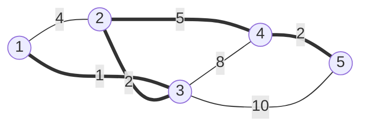


<div class="callout callout-summary" markdown="1">
<div class="callout-title callout-title--default" markdown="span">요약</div>

섬들을 다리로 모두 잇되, 다리 값의 합을 가장 적게 하고 싶다. 가장 싼 다리부터 보며, 이미 이어진 두 섬 사이의 다리면 건너뛰고 아니면 놓는다(크루스칼). 결과는 고리 없이 모든 섬을 잇는 나무가 되고, 섬이 n개면 다리는 n − 1개다. 단, 모든 섬이 이어질 수 있는 그래프여야 하고, 이렇게 만든 나무 위의 길이 두 섬 사이의 가장 짧은 길은 아니다.

</div>


## 예시로 보기

점 1 ~ 5와 간선 1–2(4), 1–3(1), 2–3(2), 2–4(5), 3–4(8), 3–5(10), 4–5(2)가 있다. 크루스칼은 간선을 비용 순으로 보며, 두 끝이 이미 같은 무리인지 [유니온 파인드](/Hongs_Blog/studies/algorithms/union-find/)로 묻는다.

| 간선 (비용) | 두 끝이 이미 이어졌나 | 한 일 | 무리 |
|---|---|---|---|
| 1–3 (1) | 아니다 | 고름 | {1, 3} |
| 2–3 (2) | 아니다 | 고름 | {1, 2, 3} |
| 4–5 (2) | 아니다 | 고름 | {1, 2, 3} {4, 5} |
| 1–2 (4) | 이어졌다 | 건너뜀(고리가 생긴다) | |
| 2–4 (5) | 아니다 | 고름 | {1, 2, 3, 4, 5} |
| 3–4 (8), 3–5 (10) | 이어졌다 | 건너뜀 | |

고른 간선 4개의 합은 1 + 2 + 2 + 5 = 10이다.



굵은 선이 고른 간선 4개이고, 가는 선이 건너뛴 간선 3개다. 가는 선을 하나라도 더하면 굵은 선과 함께 고리가 생긴다[^s1].

```python
def kruskal(n, edges):                  # edges: (a, b, w), 점은 1 ~ n
    parent = list(range(n + 1))
    def find(x):
        while parent[x] != x:
            parent[x] = parent[parent[x]]   # 가는 길에 한 칸씩 건너뛰게 줄인다
            x = parent[x]
        return x
    total = 0
    for a, b, w in sorted(edges, key=lambda e: e[2]):
        ra, rb = find(a), find(b)
        if ra != rb:                    # 다른 무리면 잇는다
            parent[rb] = ra
            total += w
    return total
```

## 맞는 이유

**자르기 성질(cut property):** 점들을 두 편으로 나눴을 때, 두 편을 잇는 간선 중 가장 싼 간선은 어떤 최소 신장 트리에 들어 있다[^1].

<details class="callout callout-proof" markdown="1">
<summary class="callout-title" markdown="span">증명 펼치기</summary>

1. 두 편을 잇는 가장 싼 간선을 e라 하자. 최소 신장 트리 T가 e를 쓰지 않는다고 하자.
2. T에 e를 더하면 고리가 하나 생긴다. 그 고리는 두 편을 오가므로, e 말고도 두 편을 잇는 간선 f를 하나 지난다.
3. f를 빼면 다시 모든 점을 잇는 나무가 된다. e는 가장 싼 간선이라 비용 합은 늘지 않는다.
4. 그래서 e를 쓰는 최소 신장 트리가 있다. ∎

</details>


크루스칼이 간선 a–b를 고르는 순간, "a의 무리"와 "나머지"로 나눈 두 편을 잇는 간선 중 a–b가 가장 싸다(더 싼 간선은 이미 다 봤고, 그중 두 편을 잇는 것은 없었다). 그래서 자르기 성질에 따라 고른 간선이 늘 안전하다. 이것은 [그리디](/Hongs_Blog/studies/algorithms/greedy/)의 바꿔치기 논증이다.

**프림:** 한 점에서 시작해, "지금까지 이은 점들"과 "아직인 점들"을 잇는 가장 싼 간선을 힙으로 골라 하나씩 붙인다. 자르기 성질을 그대로 쓴 방법이다.

<div class="callout callout-check" markdown="1">
<div class="callout-title" markdown="span">검증: 예시 표의 고름·건너뜀 순서와 합 10, 확인 문제 C1·C3의 답을 코드로 확인했다. 무작위 연결 그래프 1,500개(점 6개 이하)에서 크루스칼과 프림의 합이 "간선 n − 1개를 모두 골라 나무가 되는 것 중 가장 싼 것"과 같았다 — [28_mst_verify.py](/Hongs_Blog/studies/algorithms/code/28_mst_verify/)</div>

</div>


## 활용

- **비용:** 크루스칼은 간선 정렬 $$O(m \log m)$$ + 유니온 파인드, 프림은 힙으로 $$O(m \log m)$$이다. 간선이 적으면 크루스칼이 짧고, 격자처럼 간선을 그때그때 만들 때는 프림이 편하다.
- **쓰는 곳:** 전선·수도관·통신망을 가장 싸게 까는 설계, 비슷한 것끼리 묶기(비용이 큰 간선 몇 개를 빼면 무리가 나뉜다).
- **흔한 실수:** 무리를 확인하지 않아 고리를 만든다. 그래프가 연결되지 않았는데 결과를 그대로 쓴다(고른 간선이 n − 1개인지 확인한다). [다익스트라](/Hongs_Blog/studies/algorithms/dijkstra/)의 최단 경로 트리와 헷갈린다(확인 문제 C3).

## 연결

- 선수: [유니온 파인드](/Hongs_Blog/studies/algorithms/union-find/), [정렬과 정렬 기준](/Hongs_Blog/studies/algorithms/sorting/), [그래프 표현](/Hongs_Blog/studies/algorithms/graph-representation/), [트리](/Hongs_Blog/studies/discrete-math/trees/)
- 가장 싼 것부터 고르고 되돌리지 않는 [그리디](/Hongs_Blog/studies/algorithms/greedy/)가 맞는 대표적인 예다.
- 자르기 성질 증명의 2단계는 [트리](/Hongs_Blog/studies/discrete-math/trees/)의 동치 조건 4(트리에 없던 간선을 더하면 고리가 생긴다)다. 3단계는 동치 조건 5다. 고리 위의 f를 빼도 모두 이어져 있고 간선이 n − 1개라서 다시 트리다.
- 간선 a–b를 'a 칸 1, b 칸 −1, 나머지 0'인 벡터로 적으면, 고리가 없는 간선 모음은 선형독립이고 고리가 있는 모음은 선형종속이다. 그래서 연결 그래프의 신장 트리는 모든 간선 벡터가 만드는 공간의 기저다. 어느 신장 트리를 골라도 간선이 n − 1개인 것은 [부분공간, 기저와 차원](/Hongs_Blog/studies/linear-algebra/basis-dimension/)의 '기저의 개수는 늘 같다'와 같은 이야기다. 크루스칼의 `if ra != rb:`는 새 간선이 이미 고른 간선들과 독립인지 묻는 셈이다.
- 예시 표의 '무리'는 고른 간선으로 이어진 점끼리의 묶음이다. 아직 혼자인 점도 한 무리로 치면, 무리들은 [동치관계와 분할](/Hongs_Blog/studies/discrete-math/equivalence-relations/)의 분할이다. 간선을 하나 고를 때마다 두 무리가 하나로 합쳐진다.
- 연습: [지형 이동](/Hongs_Blog/studies/algorithms/pg62050/)

## 확인 문제

<details class="callout callout-question" markdown="1">
<summary class="callout-title" markdown="span">**C1** 간선 1–2(3), 1–3(1), 1–4(4), 2–3(2), 3–4(5)에 크루스칼을 돌린다. 고르는 간선과 비용 합은?</summary>

**답:** 1–3(1), 2–3(2)을 고르고, 1–2(3)는 1과 2가 이미 이어져 건너뛴다. 1–4(4)를 고르면 네 점이 모두 이어진다. 합은 7이다. 3–4(5)는 볼 필요도 없이 건너뛴다.

</details>


<details class="callout callout-question" markdown="1">
<summary class="callout-title" markdown="span">**C2** 크루스칼 코드에서 `if ra != rb:` 한 줄이 하는 일을 한 문장으로 말하라.</summary>

**답:** 간선의 두 끝이 이미 같은 무리(이미 이어진 상태)면 그 간선을 넣지 않아 고리가 생기지 않게 한다. 다른 무리일 때만 간선을 넣고 두 무리를 합친다.

</details>


<details class="callout callout-question" markdown="1">
<summary class="callout-title" markdown="span">**C3** 간선 A–B(2), B–C(2), A–C(3)에서 최소 신장 트리를 구하고, 그 나무 위의 A에서 C로 가는 길과 A에서 C로 가는 최단 경로를 비교하라.</summary>

**답:** 최소 신장 트리는 A–B, B–C(합 4)다. 나무 위의 A → C는 A–B–C로 4다. 최단 경로는 A–C 바로 3이다. 최소 신장 트리는 "모두 잇는 비용의 합"을, 최단 경로는 "두 점 사이 길의 비용"을 줄인다. 목적이 다르니 같은 나무가 나오지 않는다.

</details>


[^1]: 자르기 성질과 그 증명은 Cormen 외, *Introduction to Algorithms* 3판, 23.1절 "Growing a minimum spanning tree"(정리 23.1)을 풀어 쓴 것이다. 크루스칼과 프림의 구현은 Laaksonen, *Competitive Programmer's Handbook* (2018년 7월판), 15.1·15.3절.
[^s1]: 에이전트 보충. 다이어그램 1개는 원본에 없다. 예시로 보기의 간선 일곱 개와 크루스칼 표의 고름·건너뜀 결과를 그대로 그렸다.

