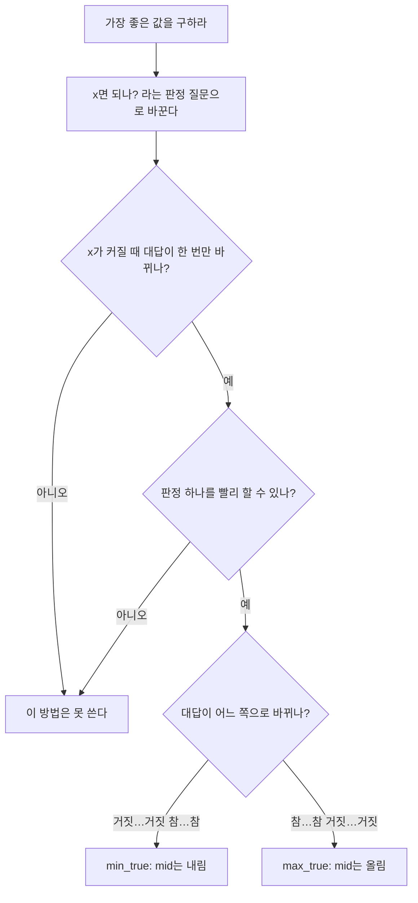


<div class="callout callout-summary" markdown="1">
<div class="callout-title callout-title--default" markdown="span">요약</div>

"가장 길게 자르면 몇 cm?"처럼 가장 좋은 값을 바로 구하기 어려우면, "7cm로 자르면 되나?"라는 예·아니오 질문으로 바꿔 묻는다. 길이를 늘리면 대답이 "된다, 된다, …, 안 된다, 안 된다"처럼 딱 한 번만 바뀌니, 바뀌는 경계를 이분 탐색으로 찾는다. 답이 1부터 10억 사이여도 질문 30번이면 된다. 단, 대답이 한 번만 바뀐다는 성질이 꼭 있어야 하고, 질문 하나에 빨리 대답할 방법이 있어야 한다.

</div>


## 예시로 보기

길이 8, 5, 11인 통나무가 있다. 모두 같은 길이 L로 잘라 토막을 5개 이상 얻고 싶다. 남는 조각은 버린다. L은 가장 길게 얼마까지 될까?

"L로 자르면 5개 이상 나오나?"를 L마다 묻는다. 통나무 하나에서 나오는 토막은 `길이 // L`개다.

| L | 1 | 2 | 3 | 4 | 5 | 6 |
|---|---|---|---|---|---|---|
| 토막 수 | 24 | 11 | 6 | 5 | 4 | 2 |
| 5개 이상? | 예 | 예 | 예 | 예 | 아니오 | 아니오 |

L이 커지면 토막 수는 줄기만 한다. 그래서 대답은 "예"가 이어지다가 한 번 "아니오"로 바뀐 뒤 다시 "예"가 되지 않는다. 답은 마지막 "예"인 4다.

이 줄을 모두 계산할 필요는 없다. 이분 탐색으로 가운데만 물어본다. 답이 있을 수 있는 범위를 [lo, hi]로 두고, lo는 "된다"가 확실한 1, hi는 가장 긴 통나무 11로 시작한다.

| lo | hi | 물어볼 L | 토막 수 | 5개 이상? | 다음 |
|---|---|---|---|---|---|
| 1 | 11 | 6 | 2 | 아니오 | 6 이상은 모두 안 된다 → hi = 5 |
| 1 | 5 | 3 | 6 | 예 | 3 이하는 모두 된다 → lo = 3 |
| 3 | 5 | 4 | 5 | 예 | lo = 4 |
| 4 | 5 | 5 | 4 | 아니오 | hi = 4 |
| 4 | 4 | | | | lo == hi → 답 4 |

11가지 L 중 네 개만 물었다. [이분 탐색](/Hongs_Blog/studies/algorithms/binary-search/)과 같은 일을 하는데, 정렬된 리스트 대신 "예·아니오의 줄"에서 경계를 찾는다.


L이 커지면 토막 수가 줄기만 한다. 그래서 5개 점선에 닿는 초록 막대와 못 닿는 주황 막대가 L = 4와 5 사이에서 딱 한 번 갈린다. 동그라미 숫자는 이분 탐색이 물은 순서이고, L = 6, 3, 4, 5 차례다[^s1].

## 정의

<div class="callout callout-definition" markdown="1">
<div class="callout-title" markdown="span">판정 함수와 두 가지 틀</div>

정수 범위 $$[lo, hi]$$ 위의 함수 $$ok(x) \in \{\text{참}, \text{거짓}\}$$을 판정 함수라 한다.
- **최소형:** $$x \le y$$이고 $$ok(x)$$가 참이면 $$ok(y)$$도 참이다(거짓…거짓 참…참). $$ok(hi)$$가 참일 때, $$ok(x)$$가 참인 가장 작은 $$x$$를 찾는다.
- **최대형:** $$x \le y$$이고 $$ok(y)$$가 참이면 $$ok(x)$$도 참이다(참…참 거짓…거짓). $$ok(lo)$$가 참일 때, $$ok(x)$$가 참인 가장 큰 $$x$$를 찾는다.

</div>


"한쪽으로 한 번만 바뀐다"를 단조성(monotonicity)이라 한다. 통나무 예시는 최대형이다.

```python
def min_true(lo, hi, ok):          # 거짓…거짓 참…참, ok(hi)는 참
    while lo < hi:
        mid = (lo + hi) // 2       # 내림
        if ok(mid): hi = mid       # mid가 답일 수 있다
        else: lo = mid + 1         # mid까지는 답이 아니다
    return lo

def max_true(lo, hi, ok):          # 참…참 거짓…거짓, ok(lo)는 참
    while lo < hi:
        mid = (lo + hi + 1) // 2   # 올림
        if ok(mid): lo = mid
        else: hi = mid - 1
    return lo
```

## 증명

최소형 틀을 루프 불변식으로 증명한다. 최대형도 방향만 바꾸면 같다[^1].

<div class="callout callout-theorem" markdown="1">
<div class="callout-title" markdown="span">불변식 (최소형)</div>

매 바퀴 시작에 다음이 참이다: $$ok(hi)$$는 참이고, 범위 안에서 $$lo$$보다 작은 $$x$$는 모두 $$ok(x)$$가 거짓이다.

</div>


<details class="callout callout-proof" markdown="1">
<summary class="callout-title" markdown="span">증명 펼치기</summary>

1. *초기화:* $$ok(hi)$$가 참인 것은 조건으로 주어진다. 처음에는 범위 안에 $$lo$$보다 작은 $$x$$가 없다.
2. *유지:* $$lo < hi$$면 내림 때문에 $$lo \le mid < hi$$다.
   - $$ok(mid)$$가 참이면 $$hi = mid$$로 바꾼다. 새 $$hi$$에서도 $$ok$$가 참이다.
   - $$ok(mid)$$가 거짓이면, 단조성의 대우에 따라 $$mid$$ 이하의 모든 $$x$$에서 $$ok(x)$$가 거짓이다. 그래서 $$lo = mid + 1$$로 바꿔도 "$$lo$$보다 작으면 거짓"이 지켜진다.
3. *끝난다:* 어느 쪽이든 $$hi - lo$$가 적어도 1 준다($$mid + 1 > lo$$, $$mid < hi$$).
4. *종료:* $$lo = hi$$가 되면 $$ok(lo)$$는 참이고 더 작은 $$x$$는 모두 거짓이다. 그래서 $$lo$$가 참인 가장 작은 $$x$$다. ∎

</details>


판정 횟수는 범위 크기가 $$m = hi - lo + 1$$일 때 많아야 $$\lceil \log_2 m \rceil$$($$\lceil\ \rceil$$는 소수점 아래를 올린 정수)번이다. 한 바퀴마다 범위가 절반 이하로 줄기 때문이다. 판정 한 번에 $$O(T)$$가 들면 전체는 $$O(T \log m)$$이다.

### 스스로 설명해 보기

<details class="callout callout-question" markdown="1">
<summary class="callout-title" markdown="span">1. 최대형에서 mid를 올림 `(lo + hi + 1) // 2`로 잡는 까닭은?</summary>

최대형은 참일 때 `lo = mid`로 옮긴다. hi = lo + 1일 때 내림을 쓰면 mid = lo라서 lo가 그대로이고, 참이 나오면 영원히 돈다. 올림을 쓰면 lo < mid ≤ hi라 늘 범위가 준다.

</details>


<details class="callout callout-question" markdown="1">
<summary class="callout-title" markdown="span">2. 최소형에서 처음 hi를 "확실히 되는 값"으로 잡아야 하는 까닭은?</summary>

불변식의 "ok(hi)는 참"이 처음부터 참이어야 끝났을 때 lo가 참인 값이라고 말할 수 있다. 되는 값이 범위에 하나도 없으면 틀은 hi를 돌려주는데, 그 hi는 답이 아니다. 확실하지 않으면 끝난 뒤 ok(lo)를 한 번 더 확인한다.

</details>


<details class="callout callout-question" markdown="1">
<summary class="callout-title" markdown="span">3. 증명의 "유지"에서 ok(mid)가 거짓일 때 mid 아래를 모두 버려도 되는 근거는?</summary>

단조성이다. "x ≤ y이고 ok(x)가 참이면 ok(y)도 참"의 대우는 "ok(y)가 거짓이면 y 이하의 x에서도 거짓"이다. y = mid로 두면 mid 이하가 모두 거짓이다.

</details>


<details class="callout callout-question" markdown="1">
<summary class="callout-title" markdown="span">이 방법의 핵심 아이디어는?</summary>

최적값을 직접 만들지 않고 "이 값이면 되나?"만 판정한다. 판정의 대답이 한 번만 바뀌니, 그 경계가 곧 최적값이다.

</details>


<details class="callout callout-question" markdown="1">
<summary class="callout-title" markdown="span">이 방법을 쓸 수 있는 다른 상황은?</summary>

답이 실수일 때도 같다. 이때는 lo와 hi가 충분히 가까워질 때까지, 예를 들어 100번 정해진 횟수만큼 돌린다. 또 "k번째로 작은 값"처럼 개수를 세는 문제도 "x 이하가 k개 이상인가?"로 바꿔 쓴다.

</details>


## 적용 조건과 알아보는 신호

- **조건 1:** 답 후보 x가 커질 때 판정의 대답이 한 번만 바뀐다(단조성).
- **조건 2:** "x면 되나?"를 빠르게, 보통 $$O(n)$$이나 $$O(n \log n)$$에 판정할 수 있다. 판정은 대개 앞에서부터 욕심껏 채우는 [그리디](/Hongs_Blog/studies/algorithms/greedy/)다.
- **신호:** "최솟값의 최댓값", "최댓값의 최솟값", "가장 긴/짧은 ~을 구하라", 그리고 답의 범위가 10⁹처럼 커서 하나씩 해 볼 수 없다.



두 조건을 모두 통과해야 틀을 고른다. 대답이 바뀌는 방향에 따라 mid를 내림으로 잡을지 올림으로 잡을지가 갈린다[^s2].
- **대표 문제:** [징검다리 건너기](/Hongs_Blog/studies/algorithms/pg64062/)는 "x명이 건널 수 있나?"를, [징검다리](/Hongs_Blog/studies/algorithms/pg43236/)는 "바위 사이 거리를 모두 x 이상으로 만들 수 있나?"를 판정한다.
- 연습 순서: [매개변수 탐색 예제 사다리](/Hongs_Blog/studies/algorithms/parametric-search-ladder/)

<div class="callout callout-check" markdown="1">
<div class="callout-title" markdown="span">검증: 예시 두 표(토막 수, lo·hi·물어본 L), 두 틀이 무작위 경계 3,000개에서 처음부터 세는 방법과 같은 답을 내고 판정을 ⌈log₂ m⌉번 이하로 하는 것, 범위 1 ~ 10억에서 판정 30번, 단조가 아니면 틀리는 예, 최대형에서 내림을 쓰면 멈추지 않는 예, 확인 문제 C1·C4의 답, 예제 사다리 네 문제의 답과 과정을 모두 계산해 확인했다 — [21_parametric-search_verify.py](/Hongs_Blog/studies/algorithms/code/21_parametric-search_verify/)</div>

</div>


## 활용

- **비용:** 판정 비용 × 약 log₂(범위 크기)다. 범위가 10억이고 판정이 $$O(n)$$, n = 20만이면 약 30 × 20만 = 600만 번이다.
- **흔한 실수:** 최대형인데 mid를 내림으로 잡아 끝나지 않는다. hi를 너무 작게 잡아 답을 범위 밖에 둔다. 답이 없을 수도 있는 문제에서 끝난 뒤 ok(lo)를 다시 확인하지 않는다. 판정이 단조인지 확인하지 않는다.

## 연결

- 선수: [이분 탐색](/Hongs_Blog/studies/algorithms/binary-search/)
- 판정 함수는 흔히 [그리디](/Hongs_Blog/studies/algorithms/greedy/)로 짠다. 판정 비용은 [시간 복잡도](/Hongs_Blog/studies/algorithms/complexity-budget/)로 어림한다.
- 판정 횟수 $$\lceil \log_2 m \rceil$$은 후보 $$m$$개를 하나가 남을 때까지 반씩 줄이는 횟수라 [로그](/Hongs_Blog/studies/college-math/logarithm/)로 센다. 범위가 10억이면 $$2^{29} < 10^9 \le 2^{30}$$이라 30번이다.
- 판정의 대답이 바뀌는 경계를 반씩 좁혀 찾는 것은 [연속과 사잇값 정리](/Hongs_Blog/studies/calculus/continuity/)의 이분법과 같은 틀이다. 답이 실수일 때 몇 번 돌지도 이분법처럼 정한다. 범위 $$10^9$$를 오차 $$10^{-6}$$까지 줄이려면 $$\lceil \log_2 10^{15} \rceil = 50$$번이면 된다.
- 증명의 유지 단계에서 쓰는 대우가 원래 명제와 같은 뜻인 까닭은 [논리적 동치와 정규형](/Hongs_Blog/studies/discrete-math/logical-equivalence/)에 있다. "$$ok(x)$$이면 $$ok(mid)$$"와 "$$ok(mid)$$가 거짓"에서 "$$ok(x)$$도 거짓"을 끌어내는 규칙은 [추론 규칙과 증명 방법](/Hongs_Blog/studies/discrete-math/proof-methods/)의 후건 부정이다.
- 브리지: [매개변수 탐색 ↔ 사잇값 정리](/Hongs_Blog/studies/algorithms/parametric-search-ivt/)
- 연습: [징검다리 건너기](/Hongs_Blog/studies/algorithms/pg64062/), [징검다리](/Hongs_Blog/studies/algorithms/pg43236/)

## 자주 하는 오해

<div class="callout callout-misconception" markdown="1">
<div class="callout-title" markdown="span">"이분 탐색은 정렬된 배열이 있어야 쓸 수 있다"</div>

틀렸다. 매개변수 탐색에는 정렬할 배열이 없다. 필요한 것은 "x = lo, lo + 1, …, hi에서 판정 결과를 늘어놓은 줄이 거짓…거짓 참…참 모양이다"라는 성질뿐이다. 정렬된 배열에서 "x 이상인 첫 칸"을 찾는 것도 사실 이 줄의 특수한 경우다. 이 줄은 실제로 만들지도 않는다. 이분 탐색이 물어보는 칸만 그때그때 판정한다. 확인하려면 통나무 예시를 보면 된다. 배열 없이 L = 6, 3, 4, 5 네 번만 판정해 답을 찾았다. 거꾸로, 배열이 정렬되어 있어도 판정이 단조가 아니면 틀린다(확인 문제 C3).

</div>


## 확인 문제

<details class="callout callout-question" markdown="1">
<summary class="callout-title" markdown="span">**C1** 통나무 [8, 5, 11]에서 토막을 6개 이상 얻는 가장 긴 L을 최대형 틀(lo = 1, hi = 11)로 찾는다. 물어보는 L의 순서와 답은?</summary>

**답:** 6(2개, 아니오 → hi = 5), 3(6개, 예 → lo = 3), 4(5개, 아니오 → hi = 3). lo = hi = 3이라 답은 3이다. 예시의 k = 5와 달리 L = 4가 "아니오"가 된다.

</details>


<details class="callout callout-question" markdown="1">
<summary class="callout-title" markdown="span">**C2** 통나무 예시에서 판정이 단조인 까닭을 한 문장으로 말하라.</summary>

**답:** L이 커지면 통나무마다 `길이 // L`이 늘지 않으니 토막 수의 합도 늘지 않는다. 그래서 L에서 "5개 이상"이 안 되면 더 큰 L에서도 안 된다.

</details>


<details class="callout callout-question" markdown="1">
<summary class="callout-title" markdown="span">**C3** x = 0 ~ 4에서 판정 값이 [거짓, 참, 거짓, 거짓, 참]일 때 최소형 틀은 무엇을 돌려주는가? 참인 가장 작은 x와 같은가?</summary>

**답:** 4를 돌려준다. mid = 2(거짓) → lo = 3, mid = 3(거짓) → lo = 4. 참인 가장 작은 x는 1이라 틀렸다. 단조가 아니어서 "mid가 거짓이면 그 아래도 모두 거짓"이 깨졌다.

</details>


<details class="callout callout-question" markdown="1">
<summary class="callout-title" markdown="span">**C4** 쪽수가 [7, 2, 5, 10, 8]인 책을 순서대로 2명에게 나눠 준다(한 사람은 연달아 놓인 책만 받는다). 가장 많이 받는 사람의 쪽수를 가장 작게 하면? 판정 질문과 범위도 함께 쓰라.</summary>

**답:** 판정 질문은 "한 사람이 많아야 x쪽까지 받으면 2명 이하로 나눌 수 있나?"이고, x가 크면 쉬워지는 최소형이다. 범위는 lo = 10(가장 두꺼운 책), hi = 32(전체 합)다. 답은 18이다. [7, 2, 5]와 [10, 8]로 나눈다. x = 17이면 앞에서부터 담아 [7, 2, 5], [10], [8]로 3명이 필요해 안 된다.

</details>


[^1]: Laaksonen, *Competitive Programmer's Handbook* (2018년 7월판), 3.3 "Binary search"의 Finding the smallest solution: ok(x)가 x < k에서 거짓, x ≥ k에서 참이면 k를 이분 탐색으로 찾고, ok를 O(log z)번 부른다. 불변식 증명의 형식은 Cormen 외, *Introduction to Algorithms* 3판 2.1절을 따랐다.
[^s1]: 에이전트 보충. 그림은 원본에 없다. [21_parametric-search_plot.py](/Hongs_Blog/studies/algorithms/code/21_parametric-search_plot/)로 그렸고, 토막 수(L = 1 ~ 6에서 24, 11, 6, 5, 4, 2), 토막 수가 L에 따라 늘지 않는다는 것, max_true 틀이 6, 3, 4, 5를 묻고 4를 돌려준다는 것을 같은 코드로 확인했다.
[^s2]: 에이전트 보충. 다이어그램 1개는 원본에 없다. '적용 조건과 알아보는 신호' 절의 조건 1·2와 '정의' 절의 최소형·최대형 틀(min_true, max_true의 mid 잡는 법)을 순서도로 옮겼다.

