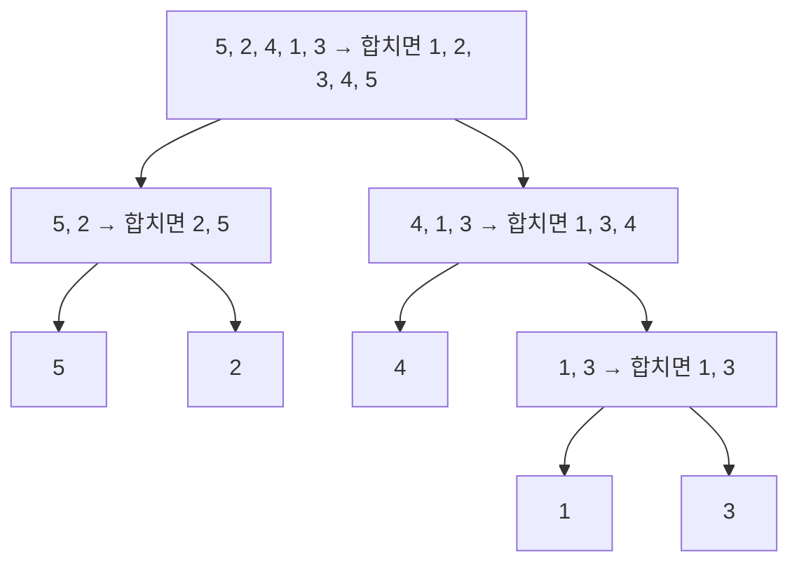


<div class="callout callout-summary" markdown="1">
<div class="callout-title callout-title--default" markdown="span">요약</div>

시험지를 점수 순으로 다시 쌓는 것처럼, 정렬은 정한 기준에 따라 줄을 다시 세운다. 파이썬에서는 "무엇을 기준으로"만 알려 주면 `sorted`가 빠르게 해 준다. 기준이 같은 것끼리는 원래 순서를 그대로 지키는데, 이 성질 덕분에 "점수 높은 순, 같으면 이름 순" 같은 여러 기준도 쉽게 만든다. 단, 숫자로 된 글자는 글자 순으로 정렬되어 `"10"`이 `"9"`보다 앞에 온다.

</div>


## 예시로 보기

학생 (이름, 점수) 목록을 점수 높은 순으로, 점수가 같으면 이름 가나다순으로 세운다.

```python
students = [("민수", 80), ("지아", 95), ("도윤", 80)]
result = sorted(students, key=lambda s: (-s[1], s[0]))
# [("지아", 95), ("도윤", 80), ("민수", 80)]
```

`key=`에는 "원소 하나를 받아, 비교할 값을 돌려주는 함수"를 넣는다. `lambda s: (-s[1], s[0])`은 이름 없이 한 줄로 만든 함수다. 원소 `s`를 받아 `(-점수, 이름)`을 돌려준다.

| 원소 | key가 만든 값 |
|---|---|
| ("민수", 80) | (−80, "민수") |
| ("지아", 95) | (−95, "지아") |
| ("도윤", 80) | (−80, "도윤") |

튜플은 앞 칸부터 비교하고, 같으면 다음 칸을 본다. 작은 것이 앞이므로 −95가 맨 앞이다. −80끼리는 둘째 칸의 이름을 비교해 "도윤"이 "민수"보다 앞이다. 점수에 −를 붙인 것은 "큰 점수가 앞"을 "작은 수가 앞"으로 바꾸기 위해서다.

## 쓰는 법

| 코드 | 하는 일 |
|---|---|
| `sorted(a)` | 정렬한 **새 리스트**를 돌려준다. `a`는 그대로 |
| `a.sort()` | `a` 자체를 정렬한다. 돌려주는 값은 `None` |
| `sorted(a, reverse=True)` | 큰 것부터 |
| `sorted(words, key=len)` | 길이 순 |
| `sorted(words, key=str.lower)` | 대소문자 무시 |
| `sorted(d.items(), key=lambda kv: kv[1])` | 딕셔너리를 값 순으로 |

비교 규칙은 이렇다.

- 숫자는 크기 순이다.
- 문자열은 앞 글자부터 글자 번호(유니코드) 순으로 비교한다. 대문자가 소문자보다 앞이고(`"B" < "a"`), 숫자 글자는 한 글자씩 비교해서 `"10" < "9"`다. 숫자 크기로 세우려면 `key=int`를 쓴다.
- 튜플과 리스트는 앞 칸부터 비교한다.

### 같은 값은 순서를 지킨다 (안정 정렬)

파이썬의 정렬은 기준 값이 같은 원소들의 원래 순서를 바꾸지 않는다고 약속한다(안정 정렬)[^1]. 위 예에서 점수만으로 정렬해도 80점끼리는 원래 순서("민수" 다음 "도윤")를 지킨다.

이 약속 덕분에 여러 기준을 두 번의 정렬로 만들 수도 있다. **덜 중요한 기준으로 먼저**, 더 중요한 기준으로 나중에 정렬한다. 문자열을 거꾸로(내림차순) 세워야 해서 `-`를 붙일 수 없을 때 쓴다.

```python
people = [("b", 2), ("a", 1), ("c", 2)]
people.sort(key=lambda p: p[0], reverse=True)   # 이름 거꾸로: c, b, a
people.sort(key=lambda p: p[1])                 # 숫자 순. 같은 숫자는 앞 순서 유지
# [("a", 1), ("c", 2), ("b", 2)]
```

## 속에서 일어나는 일

`sorted`는 병합 정렬(merge sort)을 바탕으로 한 Timsort를 쓴다[^1]. 병합 정렬의 생각은 간단하다. **반으로 나눠 각각 정렬한 뒤, 두 줄의 맨 앞을 비교하며 합친다**[^2].

`[5, 2, 4, 1, 3]`을 병합 정렬하면:

| 단계 | 상태 |
|---|---|
| 나누기 | [5, 2] [4, 1, 3] → [5] [2] [4] [1, 3] → [1] [3] |
| 합치기 1 | [5]+[2] → [2, 5], [1]+[3] → [1, 3] |
| 합치기 2 | [4]+[1, 3] → [1, 3, 4] |
| 합치기 3 | [2, 5]+[1, 3, 4] → 맨 앞끼리 비교: 1, 2, 3, 4, 5 |



위에서 아래로 내려가며 나누고, 맨 아래 한 칸짜리부터 위로 올라오며 합친다. 칸마다 화살표 뒤의 줄이 그 칸에서 합친 결과다[^s2].

반으로 나누기는 약 $$\log_2 n$$층이고, 층마다 합치는 비용이 $$n$$이라 모두 $$O(n \log n)$$이다. 크기 비교만으로 정렬하는 방법은 어떤 것이든 최악에 $$n \log n$$에 비례하는 비교가 필요하다는 것이 알려져 있어서[^2], `sorted`보다 빠른 비교 정렬을 직접 짤 일은 없다.


무작위 실수를 정렬하며 비교 횟수를 센 결과다. 가로·세로 모두 로그 눈금이라, 늘어나는 빠르기가 기울기로 보인다. 병합 정렬은 점선 $$n\log_2 n$$ 바로 아래를 따라간다. 하나씩 앞으로 끼워 넣는 정렬(삽입 정렬)은 기울기가 2라서, n이 두 배가 되면 비교가 네 배가 된다. 원소 4,096개에서 둘은 약 96배 차이다[^s1].

<div class="callout callout-check" markdown="1">
<div class="callout-title" markdown="span">검증: 병합 정렬을 직접 구현해 무작위 리스트 2,000개에서 `sorted`와 결과가 같고, 같은 키끼리 원래 순서를 지키는 것(안정성)을 확인했다. 예시, 표, 두 번 정렬 예, 확인 문제의 결과도 실행해 확인했다 — [05_sorting_impl.py](/Hongs_Blog/studies/algorithms/code/05_sorting_impl/)</div>

</div>


## 활용

- 정렬하면 쉬워지는 일: 같은 값끼리 모으기, 가장 작은 것 k개, 이웃끼리 비교하기, 이분 탐색.
- 비용은 $$O(n \log n)$$이다. n = 100만에서도 1초 안쪽이다.
- 자주 하는 실수:
  - `a = a.sort()`라고 쓰면 `a`가 `None`이 된다.
  - 숫자로 된 문자열을 그대로 정렬해 `"10"`이 `"9"`보다 앞에 온다.
  - 실수 값으로 비교할 때 계산 오차로 같아야 할 값이 달라진다. 가능하면 분수를 곱셈으로 바꿔 정수끼리 비교하거나, 원래 값을 그대로 기준으로 쓴다.

## 연결

- 선수: [리스트와 문자열](/Hongs_Blog/studies/algorithms/list-string/), [시간 복잡도로 방법 고르기](/Hongs_Blog/studies/algorithms/complexity-budget/)
- 병합 정렬의 $$O(n \log n)$$은 분할 정복 점화식 $$T(n) = 2T(n/2) + n$$의 답이다: [분할 정복 점화식과 마스터 정리](/Hongs_Blog/studies/discrete-math/master-theorem/)
- 비교 정렬이 최악에 $$n \log n$$에 비례하는 비교를 피할 수 없는 까닭은 [합의 계산과 어림](/Hongs_Blog/studies/discrete-math/sums-asymptotics/)의 예제에 있다. 비교 한 번의 결과는 둘 중 하나라서, 비교 $$k$$번으로 가를 수 있는 경우는 많아야 $$2^k$$가지다. $$n$$개를 줄 세우는 순서 $$n!$$가지를 모두 가르려면 $$k \ge \log_2 n!$$이어야 한다. [합 ↔ 적분](/Hongs_Blog/studies/calculus/sum-integral-bounds/)으로 어림하면 $$\log_2 n!$$은 약 $$n \log_2 n - 1.443n$$이고, $$n = 1000$$이면 약 8,530번이다.
- $$O(n \log n)$$은 실험으로도 읽을 수 있다. 병합 정렬의 비교 횟수를 $$n$$ = 1,000 ~ 8,000에서 세어 로그-로그 그래프에 놓으면 기울기가 약 1.14다. 역순으로 놓인 입력을 삽입 정렬하면 기울기가 2($$n^2$$)라서 두 직선이 확 갈린다([로그함수와 로그 스케일](/Hongs_Blog/studies/college-math/log-scale/)).
- 병합 정렬이 맞다는 것은 강한 귀납법으로 증명한다([수학적 귀납법](/Hongs_Blog/studies/discrete-math/induction/)). 길이 0이나 1인 배열은 이미 정렬되어 있다. 길이가 2 이상이면 두 절반은 더 짧아서, 귀납 가정으로 정렬되어 돌아온다. 정렬된 두 줄을 맨 앞끼리 비교하며 합치면 정렬된 한 줄이 된다.
- 연습: [K번째수](/Hongs_Blog/studies/algorithms/pg42748/), [실패율](/Hongs_Blog/studies/algorithms/pg42889/), [무지의 먹방 라이브](/Hongs_Blog/studies/algorithms/pg42891/)

## 확인 문제

<details class="callout callout-question" markdown="1">
<summary class="callout-title" markdown="span">**C1** `words = ["b", "A", "a", "B"]`일 때 `sorted(words)`와 `sorted(words, key=str.lower)`의 결과는?</summary>

**답:** `['A', 'B', 'a', 'b']`와 `['A', 'a', 'b', 'B']`. 그냥 정렬하면 대문자가 소문자보다 앞이다. `key=str.lower`면 기준이 a, a, b, b가 되고, 같은 기준끼리는 원래 순서를 지킨다. 원래 순서에서 "A"가 "a"보다, "b"가 "B"보다 앞이다.

</details>


<details class="callout callout-question" markdown="1">
<summary class="callout-title" markdown="span">**C2** `sorted(words, key=lambda w: (-len(w), w))`가 하는 일을 한 문장으로 말하라.</summary>

**답:** 단어를 긴 것부터 세우고, 길이가 같으면 사전순으로 세운다.

</details>


<details class="callout callout-question" markdown="1">
<summary class="callout-title" markdown="span">**C3** `sorted(["10", "9", "2"])`는 `['10', '2', '9']`다. 왜 이렇게 되고, 숫자 크기 순으로 세우려면 어떻게 하나?</summary>

**답:** 문자열은 첫 글자부터 비교한다. "1" < "2" < "9"라서 "10"이 맨 앞이다. 둘째 글자는 첫 글자가 같을 때만 본다. 숫자 크기 순으로 세우려면 `sorted(a, key=int)`로 비교할 때만 정수로 바꾼다.

</details>


[^1]: Python 3 문서 "Sorting Techniques": `sort()`와 `sorted()`는 안정 정렬이 보장되고, 여러 기준은 덜 중요한 기준부터 여러 번 정렬해 만들 수 있다("Sort Stability and Complex Sorts"). 같은 문서에서 파이썬이 Timsort를 쓴다고 밝힌다.
[^2]: Cormen·Leiserson·Rivest·Stein, *Introduction to Algorithms* 3판, 2.3 "Designing algorithms"(병합 정렬과 $$\Theta(n \lg n)$$ 분석), 8.1 "Lower bounds for sorting"(비교 정렬은 최악에 $$\Omega(n \lg n)$$ 번 비교한다).
[^s1]: 에이전트 보충. 그림은 원본에 없다. [05_sorting_plot.py](/Hongs_Blog/studies/algorithms/code/05_sorting_plot/)로 그렸고, 비교 횟수(4,096개에서 병합 정렬 43,928번, 삽입 정렬 4,210,245번), 병합 정렬이 늘 $$n\log_2 n$$ 이하라는 것, 로그-로그 기울기(병합 정렬 1.16, 삽입 정렬 2.01)를 같은 코드로 확인했다. 병합 정렬의 기울기가 1보다 조금 큰 것은 $$\log_2 n$$이 함께 자라기 때문이다.
[^s2]: 에이전트 보충. 다이어그램 1개는 원본에 없다. '속에서 일어나는 일' 절의 [5, 2, 4, 1, 3] 병합 정렬 단계 표를 나누기·합치기 나무로 옮겼다(Cormen 외 3판 2.3.1의 병합 정렬 재귀 트리 그림과 같은 모양).

