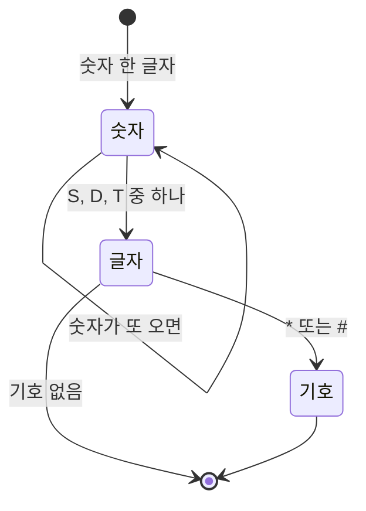


<div class="callout callout-summary" markdown="1">
<div class="callout-title callout-title--default" markdown="span">요약</div>

글을 읽을 때 띄어쓰기와 문장부호로 단어를 나누듯, 파싱은 긴 문자열을 규칙에 따라 뜻 있는 조각으로 나누는 일이다. 나누는 기호가 정해져 있으면 그 기호로 자르고, 조각의 길이가 들쭉날쭉하면 글자를 하나씩 읽으며 모은다. 모양이 복잡하면 정규 표현식이라는 "모양 설명서"로 한 번에 찾는다. 정규 표현식은 짧게 쓸 수 있지만 읽기 어려워서 작은 기호 하나 때문에 틀리기 쉽다.

</div>


## 예시로 보기

같은 일을 세 방법으로 해 본다. `"1S2D*3T"`는 "점수, 글자, 기호(있을 수도 없을 수도)"가 세 번 이어진 문자열이다. 이것을 `(1, S, 없음) (2, D, *) (3, T, 없음)`으로 나눈다.

**방법 1. 나누는 기호로 자르기.** 이 문자열에는 사이를 가르는 기호가 없어서 `split`으로는 안 된다. `"10:20"`처럼 가르는 기호(`:`)가 있을 때 쓰는 방법이다.

```python
h, m = "10:20".split(":")       # ["10", "20"]을 두 이름에 나눠 담는다
h, m = int(h), int(m)           # 글자를 수로
```

**방법 2. 한 글자씩 읽기.** 번호 `i`를 앞으로 옮기며 지금 글자가 무엇인지 보고 모은다. 숫자는 두 자리(10)일 수 있으니 "숫자가 이어지는 동안" 모은다.

```python
s, i, parts = "1S2D*3T", 0, []
while i < len(s):
    j = i
    while s[j].isdigit():       # 숫자가 이어지는 동안 j를 늘린다
        j += 1
    num, bonus = int(s[i:j]), s[j]
    j += 1
    opt = ""
    if j < len(s) and s[j] in "*#":   # 기호가 있으면 가져간다
        opt = s[j]
        j += 1
    parts.append((num, bonus, opt))
    i = j                       # 다음 조각의 시작
# parts == [(1, 'S', ''), (2, 'D', '*'), (3, 'T', '')]
```

**방법 3. 정규 표현식.** 조각의 모양을 설명서로 적고, 그 모양을 모두 찾아 달라고 한다.

```python
import re
re.findall(r"(\d+)([SDT])([*#]?)", "1S2D*3T")
# [('1', 'S', ''), ('2', 'D', '*'), ('3', 'T', '')]
```

`(\d+)([SDT])([*#]?)`는 "숫자 하나 이상, 그다음 S·D·T 중 한 글자, 그다음 `*`나 `#`이 0개나 1개"라는 뜻이다. 괄호로 묶은 세 부분이 따로 꺼내진다.



한 조각을 읽는 동안 지나는 단계다. 숫자 칸에서 제자리로 도는 화살표가 `\d+`의 "하나 이상"이고, 글자 칸에서 바로 끝으로 가는 화살표가 `[*#]?`의 "0개"다. 한 조각이 끝나면 다음 조각은 다시 처음부터 읽는다[^s1].

## 정규 표현식 기호

| 기호 | 뜻 | 예 → 맞는 것 |
|---|---|---|
| `\d` | 숫자 한 글자 | `\d\d` → "05" |
| `[abc]` | 괄호 안 글자 중 하나 | `[SDT]` → "D" |
| `[a-z]` | a부터 z까지 중 하나 | `[a-z0-9]` → "k", "7" |
| `[^a-z]` | 괄호 안이 **아닌** 글자 하나 | `[^0-9]` → "x" |
| `.` | 아무 글자 하나 | `a.c` → "abc", "a-c" |
| `\.` | 진짜 점 한 개 | `\d+\.\d+` → "3.14" |
| `+` | 앞의 것이 1번 이상 | `\d+` → "2024" |
| `*` | 앞의 것이 0번 이상 | `ab*` → "a", "abbb" |
| `?` | 앞의 것이 0번이나 1번 | `[*#]?` → "", "*" |
| `{2,}` | 앞의 것이 2번 이상 | `\.{2,}` → "..", "...." |
| `^`, `$` | 문자열의 시작, 끝 | `^\.` → 맨 앞의 점 |
| `( )` | 따로 꺼낼 부분 | `(\d+)-(\d+)` |

자주 쓰는 함수는 셋이다[^1].

| 함수 | 하는 일 |
|---|---|
| `re.findall(모양, s)` | 모양에 맞는 부분을 모두 찾아 리스트로 |
| `re.sub(모양, 바꿀 글자, s)` | 모양에 맞는 부분을 모두 바꾼 새 문자열 |
| `re.fullmatch(모양, s)` | s 전체가 모양과 맞는지 |

모양은 `r"..."`(r을 붙인 문자열)로 쓴다. 그래야 `\d`의 `\`가 파이썬 문자열의 특수 기호로 먹히지 않고 그대로 전달된다.

```python
re.sub(r"[^a-z0-9]", "", "Hi! a-1")   # 'ia1'  소문자·숫자가 아닌 글자(H, !, 빈칸, -)를 모두 지운다
re.sub(r"\.{2,}", ".", "a...b..c")    # 'a.b.c'  점이 두 개 이상 이어지면 하나로
```

<div class="callout callout-check" markdown="1">
<div class="callout-title" markdown="span">검증: 세 방법의 결과가 같다는 것, 표의 기호마다 예가 맞는다는 것, `re.sub` 예의 결과를 실행해 확인했다. 무작위로 만든 "점수·글자·기호" 문자열 1,000개에서 방법 2와 방법 3의 조각이 같았다 — [06_string-parsing_verify.py](/Hongs_Blog/studies/algorithms/code/06_string-parsing_verify/)</div>

</div>


## 활용

- 고르는 기준: 가르는 기호가 있으면 `split`, 조각 길이가 들쭉날쭉하면 한 글자씩 읽기, 같은 모양이 여러 번 나오거나 "이런 글자만 남겨라" 같은 규칙이면 정규 표현식이다.
- 한 글자씩 읽기는 규칙이 복잡해도 그대로 옮길 수 있어서, 정규 표현식이 헷갈릴 때의 안전한 길이다.
- 자주 하는 실수:
  - 숫자를 한 글자씩만 읽어 `10`을 1과 0으로 나눈다.
  - 정규 표현식에서 `.`을 진짜 점으로 쓴다. 진짜 점은 `\.`이다.
  - `"a  b".split(" ")`는 `['a', '', 'b']`로 빈 조각이 생긴다. 빈칸 여러 개를 하나로 보려면 `split()`을 쓴다.

## 연결

- 선수: [리스트와 문자열](/Hongs_Blog/studies/algorithms/list-string/)
- 시각 문자열 자르기는 [시간·날짜 계산](/Hongs_Blog/studies/algorithms/time-conversion/)에서 이어진다.
- 연습: [다트 게임](/Hongs_Blog/studies/algorithms/pg17682/), [신규 아이디 추천](/Hongs_Blog/studies/algorithms/pg72410/), [중요한 단어를 스포 방지](/Hongs_Blog/studies/algorithms/pg468370/)
- 방법 2에서 숫자 글자를 다 모은 뒤 `int(s[i:j])`로 바꾸는 대신, 읽으면서 바로 `num = num * 10 + int(s[j])`로 쌓아도 된다. 왼쪽 자리부터 "지금까지 값 × 10 + 새 숫자"를 되풀이하는 이 계산은 [진법과 자릿수](/Hongs_Blog/studies/college-math/positional-notation/)에 나오는 호너 방법이다.

## 확인 문제

<details class="callout callout-question" markdown="1">
<summary class="callout-title" markdown="span">**C1** `re.findall(r"\d+", "a12b3c045")`의 결과는?</summary>

**답:** `['12', '3', '045']`. `\d+`는 숫자가 이어진 가장 긴 덩어리를 찾는다. 결과는 글자라서 앞의 0도 남는다.

**흔한 오답:** `['1', '2', '3', …]`처럼 한 글자씩 나누는 것. `+`가 "이어지는 동안 모두"라는 뜻이다.

</details>


<details class="callout callout-question" markdown="1">
<summary class="callout-title" markdown="span">**C2** 한 글자씩 읽으며 점수를 모을 때, "숫자가 이어지는 동안 모은다"로 짜야 하는 까닭을 `"10S2D"`로 설명하라.</summary>

**답:** 점수 10은 두 글자다. 한 글자씩 수로 바꾸면 1과 0이 따로 점수가 되어 조각이 어긋난다. 숫자 글자가 끝날 때까지 모아 `int("10")`으로 바꿔야 한 조각이 된다.

</details>


<details class="callout callout-question" markdown="1">
<summary class="callout-title" markdown="span">**C3** 다음 셋에 알맞은 방법을 고르라: (가) `"2022.05.19"`에서 연·월·일 꺼내기, (나) `"...!@BaT#"`에서 소문자와 숫자만 남기기, (다) `"1S2D*3T"`를 조각내기.</summary>

**답:** (가) `split(".")`. 가르는 기호가 정해져 있다. (나) `re.sub(r"[^a-z0-9]", "", s)` 같은 정규 표현식(대문자는 먼저 소문자로 바꾼다). "이런 글자만 남긴다"는 규칙이다. (다) 한 글자씩 읽기나 정규 표현식 `(\d+)([SDT])([*#]?)`. 가르는 기호가 없고 조각 길이가 다르다.

</details>


[^1]: Python 3 표준 라이브러리 문서, "re — Regular expression operations"(기호와 `findall`, `sub`, `fullmatch`), 그리고 "Regular Expression HOWTO"(r 문자열을 쓰는 까닭, "The Backslash Plague" 절).
[^s1]: 에이전트 보충. 다이어그램 1개는 원본에 없다. 방법 3의 정규 표현식 `(\d+)([SDT])([*#]?)`과 그 뜻풀이 문장을 상태 전이도로 옮겼다. 정규 표현식과 이런 상태 전이도(유한 오토마타)가 같은 것을 나타낸다는 것은 표준 결과다(Sipser, Introduction to the Theory of Computation, 1.3).

