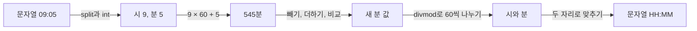


<div class="callout callout-summary" markdown="1">
<div class="callout-title callout-title--default" markdown="span">요약</div>

"9시 5분부터 10시 2분까지 몇 분?"을 시와 분으로 따로 빼면 받아내림 때문에 헷갈린다. 모든 시각을 "0시 0분부터 몇 분째"처럼 가장 작은 단위 하나로 바꾸면, 더하기·빼기·비교가 그냥 숫자 계산이 된다. 계산을 다 끝낸 뒤에만 "시:분" 모양으로 되돌린다. 되돌릴 때 `5`를 `05`로 두 자리 맞추는 것을 잊으면 틀린다.

</div>


## 예시로 보기

"09:05"부터 "10:02"까지 몇 분인지 구한다.

| 시각 | 분으로 바꾸기 | 값 |
|---|---|---|
| 09:05 | 9 × 60 + 5 | 545 |
| 10:02 | 10 × 60 + 2 | 602 |

602 − 545 = 57분이다. 시와 분을 따로 빼면 "1시간 −3분"이 나와서 받아내림을 해야 한다. 한 단위로 바꾸면 그럴 일이 없다.

## 바꾸기와 되돌리기

**문자열 → 분.** 자른 뒤 곱해서 더한다.

```python
def to_min(t):                  # "09:05" → 545
    h, m = map(int, t.split(":"))   # map(int, …): 조각마다 int를 적용
    return h * 60 + m
```

초까지 있으면 `h * 3600 + m * 60 + s`, 밀리초까지 있으면 한 번 더 1,000을 곱한다.

**분 → 문자열.** 60으로 나눈 몫이 시, 나머지가 분이다. `divmod(a, b)`는 `(a // b, a % b)`를 한 번에 돌려준다[^1].

```python
def to_str(x):                  # 545 → "09:05"
    h, m = divmod(x, 60)
    return f"{h:02d}:{m:02d}"   # 02d: 두 자리로, 모자라면 앞에 0
```

`f"{h:02d}"`의 `02d`는 "정수를 최소 두 자리로 쓰고, 모자란 자리는 0으로 채운다"는 뜻이다[^2]. `h = 9`면 `"09"`가 된다.



계산은 가운데의 분 값에서만 한다. 왼쪽 두 화살표가 `to_min`, 오른쪽 두 화살표가 `to_str`이다[^s1].

**날짜.** 날짜도 같은 생각이다. "모든 달이 28일"이라는 문제라면 날짜를 "첫날부터 며칠째"로 바꾼다.

```python
def to_day(date):               # "2022.05.19"
    y, m, d = map(int, date.split("."))
    return y * 12 * 28 + (m - 1) * 28 + d
```

달과 날이 1부터 시작하므로 `m - 1`을 곱한다. 실제 달력(달마다 날 수가 다름)이면 파이썬의 `datetime.date`로 날짜끼리 빼면 된다.

**올림.** "10분마다 요금" 같은 규칙에서 15분이면 2번을 매긴다. 나누어떨어지지 않으면 올리는 올림 나눗셈은 `(a + b - 1) // b` 또는 `-(-a // b)`다. `math.ceil(a / b)`도 되지만 큰 수에서 실수 오차가 생길 수 있어 정수 계산이 안전하다.

<div class="callout callout-check" markdown="1">
<div class="callout-title" markdown="span">검증: 0~1,439분 모두에서 문자열 → 분 → 문자열이 제자리로 돌아오고, 예시(57분), `divmod`, `02d`, 28일 달력, 올림 나눗셈(1~500, 1~60의 모든 쌍에서 `math.ceil`과 일치)을 확인했다 — [07_time-conversion_verify.py](/Hongs_Blog/studies/algorithms/code/07_time-conversion_verify/)</div>

</div>


## 활용

- 주차 요금, 영상 재생 위치, 방송 시간, 유효기간, 셔틀버스 시간표처럼 시각이 나오는 모든 문제에 쓴다.
- 자주 하는 실수:
  - 되돌릴 때 두 자리를 맞추지 않아 `"9:5"`를 돌려준다.
  - 구간 끝을 넣을지 뺄지 헷갈린다. "~까지 보관 가능"과 "~부터 파기"처럼 문제가 어느 쪽을 포함하는지 먼저 적어 둔다.
  - 문자열끼리 크기를 비교한다. `"09:05" < "10:02"`는 두 자리가 맞으면 우연히 맞지만, `"9:05" < "10:02"`는 틀린다. 수로 바꿔서 비교한다.

## 연결

- 선수: [파이썬 기본 문법](/Hongs_Blog/studies/algorithms/python-basics/)의 몫과 나머지, 수학적 바탕은 [나눗셈과 합동](/Hongs_Blog/studies/discrete-math/modular-arithmetic/)
  - 올림 나눗셈 `(a + b - 1) // b`가 맞는 까닭도 나눗셈 정리에서 나온다. $$a = bq + r$$($$0 \le r < b$$)이면 $$a + b - 1 = bq + (r + b - 1)$$이다. $$r = 0$$이면 $$r + b - 1 < b$$라 몫은 $$q$$ 그대로다. $$r \ge 1$$이면 $$b \le r + b - 1 < 2b$$라 몫은 $$q + 1$$이다.
- 연습: [개인정보 수집 유효기간](/Hongs_Blog/studies/algorithms/pg150370/), [동영상 재생기](/Hongs_Blog/studies/algorithms/pg340213/)
- `h * 60 + m`은 60진법 두 자리 수 (h, m)을 보통 수로 읽는 계산이다([진법과 자릿수](/Hongs_Blog/studies/college-math/positional-notation/)). `divmod(x, 60)`은 거꾸로 그 수를 다시 두 자리로 나눈다. 28일 달력의 `to_day`도 같은 모양이다. 날 자리는 28마다, 달 자리는 12마다 받아올린다.
- `to_min`과 `to_str`는 서로 [역함수](/Hongs_Blog/studies/college-math/inverse-function/)다. 단, "09:05"처럼 두 자리로 맞추고 분이 60 미만인 문자열에서만 그렇다. "9:05"도 545가 되지만, 되돌리면 "09:05"가 되어 제자리로 오지 않는다.

## 확인 문제

<details class="callout callout-question" markdown="1">
<summary class="callout-title" markdown="span">**C1** "23:40"부터 "00:15"(다음 날)까지는 몇 분인가? 하루를 넘는 경우를 분 단위로 어떻게 처리하는가?</summary>

**답:** 35분. "00:15"는 15분이지만 다음 날이라 24 × 60 = 1,440을 더해 1,455분이다. 1,455 − 1,420 = 35다. 차이가 음수로 나오면 하루(1,440분)를 더하면 된다.

</details>


<details class="callout callout-question" markdown="1">
<summary class="callout-title" markdown="span">**C2** 시와 분을 따로 계산하지 않고 전부 분으로 바꿔 계산하는 까닭은?</summary>

**답:** 시·분은 60마다 받아올림·받아내림이 생기는 두 자리 숫자다. 따로 계산하면 이 처리를 매번 직접 해야 해서 실수하기 쉽다. 분 하나로 바꾸면 보통 정수의 더하기·빼기·비교라서 받아올림이 저절로 처리되고, 마지막에 `divmod`로 한 번만 되돌리면 된다.

</details>


<details class="callout callout-question" markdown="1">
<summary class="callout-title" markdown="span">**C3** `h, m = divmod(125, 60)` 다음 `f"{h:02d}:{m:02d}"`의 값은?</summary>

**답:** `"02:05"`. 125 = 2 × 60 + 5라서 h = 2, m = 5다. `02d`가 둘 다 두 자리로 맞춘다.

</details>


[^1]: Python 3 표준 라이브러리 문서, Built-in Functions의 `divmod(a, b)`: 정수에서는 `(a // b, a % b)`를 돌려준다.
[^2]: Python 3 표준 라이브러리 문서, "Format Specification Mini-Language": 너비 앞의 `0`은 부호를 고려한 0 채우기를 켠다. `d`는 10진 정수다.
[^s1]: 에이전트 보충. 다이어그램 1개는 원본에 없다. '바꾸기와 되돌리기' 절의 to_min, to_str 코드와 예시 표(09:05 → 545)를 흐름도로 옮겼다.

