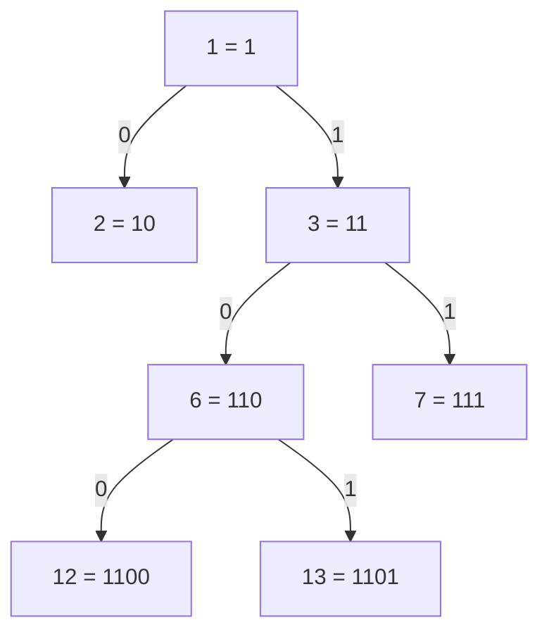


<div class="callout callout-summary" markdown="1">
<div class="callout-title callout-title--default" markdown="span">요약</div>

힙과 세그먼트 트리는 뿌리를 1번으로 두고 층마다 왼쪽부터 번호를 매겨 나무를 배열에 담는다. 이 번호를 2진수로 쓰면, 맨 앞 1 뒤의 자리들이 뿌리에서 그 칸까지 내려가는 길이다(0은 왼쪽, 1은 오른쪽). 그래서 자식은 끝에 자리를 하나 붙인 수, 부모는 끝자리를 뗀 수, 깊이는 자릿수보다 하나 적은 수다. 다만 파이썬 heapq처럼 0부터 세면 번호에 1을 더해야 맞고, 배열에 빈칸 없이 담기는 것은 위층부터, 한 층 안에서는 왼쪽부터 채운 나무뿐이다.

</div>


## 먼저 비교해 보기

표를 펼치기 전에 두 사례의 공통 구조와 대응 관계를 먼저 적어 본다. 왼쪽은 [힙](/Hongs_Blog/studies/algorithms/heap/)의 칸을 1부터 센 번호로 본 것이다. 파이썬 `heapq`로는 `h[12]`인 칸이다. 마지막 줄만 세그먼트 트리다. 오른쪽은 같은 수 13을 [진법과 자릿수](/Hongs_Blog/studies/college-math/positional-notation/)의 반복 나눗셈으로 2진수로 쓴 것이다.

| 알고리즘: 칸 13개짜리 힙의 13번 칸 | 수학: 13의 2진 표현 |
|---|---|
| 칸이 더 늘면 자식이 들어갈 자리는 26번, 27번 | $$1101_2$$ 끝에 0, 1을 붙이면 $$11010_2 = 26$$, $$11011_2 = 27$$ |
| 부모를 따라 13 → 6 → 3 → 1(뿌리). 매번 `i // 2` | $$13 = 2 \cdot 6 + 1$$, $$6 = 2 \cdot 3 + 0$$, $$3 = 2 \cdot 1 + 1$$ |
| 뿌리에서 13번까지 오른쪽, 왼쪽, 오른쪽 | 맨 앞 1 뒤의 자리 1, 0, 1 |
| 깊이 3(뿌리 0), 층은 모두 4개 | 4자리, $$\lfloor \lg 13 \rfloor = 3$$ |
| 맨 아래 층은 8 ~ 13번 칸 | 4자리 2진수는 $$1000_2 = 8$$부터 $$1111_2 = 15$$까지 |
| 13번과 7번의 가장 가까운 공통 조상은 3번 | $$1101_2$$과 $$111_2$$의 가장 긴 공통 앞부분은 $$11_2 = 3$$ |
| 칸 8개짜리 세그먼트 트리에서 5번 칸의 잎도 $$8 + 5 = 13$$번 | $$1101_2$$은 맨 앞 1 뒤에 $$5 = 101_2$$를 붙인 수 |

<details class="callout callout-info" markdown="1">
<summary class="callout-title" markdown="span">대응 관계</summary>

| 알고리즘 | 수학 | 공통 구조 |
|---|---|---|
| 1부터 센 칸 번호 $$i$$ (heapq의 칸 $$j$$는 $$i = j + 1$$) | $$i$$의 2진 표현 $$1d_1d_2 \cdots d_k$$ | 수 하나 = 자리들의 줄 |
| 자식 $$2i + d$$ (왼쪽 $$d = 0$$, 오른쪽 $$d = 1$$) | 끝에 숫자 $$d$$ 붙이기: 지금까지 값 × 2 + 새 숫자(밑이 2인 호너 방법) | 자리 하나 늘리기 |
| 부모 `i // 2` | 끝자리 떼기: 2로 나눈 몫(반복 나눗셈 한 걸음) | 자리 하나 줄이기 |
| 뿌리에서 칸 $$i$$까지 내려가는 길 | 맨 앞 1 뒤의 자리 $$d_1, \dots, d_k$$ (0은 왼쪽, 1은 오른쪽) | 자리의 줄 = 길 |
| 칸의 깊이(뿌리 0), `i.bit_length() - 1` | 자릿수 − 1 = $$\lfloor \lg i \rfloor$$ | 자릿수 공식(정리 1) |
| 칸 $$n$$개 힙의 층수 $$\lfloor \lg n \rfloor + 1$$ (마지막 칸 번호가 $$n$$) | 수 $$n$$의 2진 자릿수 | 자릿수 공식(정리 1) |
| 세그먼트 트리 잎의 깊이 $$\lg \text{size}$$ (size는 칸 수 $$n$$ 이상인 가장 작은 2의 거듭제곱) | 값 $$n$$개를 구별하는 비트 수 $$\lceil \lg n \rceil$$ | 구별에 필요한 자리 수(정리 2) |
| 칸 $$i$$의 잎 번호 $$\text{size} + i$$ | 맨 앞 1 뒤에 $$i$$를 $$\lg \text{size}$$자리로 쓴 수 | 잎까지의 길 = $$i$$의 자리 |
| 바꾸기 루프: `i //= 2`를 뿌리까지 되풀이 | 반복 나눗셈으로 끝자리를 하나씩 떼기 | 뗀 자리를 거꾸로 읽으면 뿌리에서 오는 길 |
| 두 칸의 가장 가까운 공통 조상 | 두 2진 표현의 가장 긴 공통 앞부분 | 갈라지기 전까지의 같은 길 |
| 마디 번호 1 ~ $$2 \cdot \text{size} - 1$$ (배열은 $$2 \cdot \text{size}$$칸, `t[0]`은 비움) | 1 이상이고 $$\lg \text{size} + 1$$자리 이하인 2진수 전부. 가장 큰 수는 $$11\cdots1_2$$ | $$m$$자리 가장 큰 수 $$2^m - 1$$ |

정리 1·2는 진법과 자릿수 문서의 두 정리다. 정리 1은 수 $$n$$의 자릿수 $$\lfloor \log_b n \rfloor + 1$$, 정리 2는 값 $$N$$개를 구별하는 자리 수 $$\lceil \log_b N \rceil$$이다. 자식 $$2i$$, $$2i + 1$$과 부모 $$\lfloor i/2 \rfloor$$는 힙과 세그먼트 트리의 표준 정의다[^1][^2]. 나머지 행은 이 정의를 2진 표현으로 읽은 것이다[^s1].

</details>




1부터 센 힙 칸 가운데 뿌리에서 13번까지의 길과 그 옆 칸만 그렸다. 칸마다 번호와 그 2진 표현을 적었다. 화살표 위의 0, 1을 뿌리부터 이어 읽으면 1, 0, 1이고, 맨 앞 1 뒤에 붙이면 13의 2진 표현 1101이다[^s4].

## 어디까지 같은가

- **0부터 세면 1을 더해야 맞는다.** `heapq`는 칸 $$j$$의 자식을 $$2j + 1$$, $$2j + 2$$에, 부모를 `(j - 1) // 2`에 둔다[^3]. 이 번호는 2진수로 써도 깔끔하지 않다. 칸 1($$1_2$$)의 자식 3($$11_2$$)은 끝에 1을 붙인 수지만, 4($$100_2$$)는 1에 자리 하나를 붙인 수가 아니다. $$i = j + 1$$로 바꾸면 세 식이 그대로 $$2i$$, $$2i + 1$$, `i // 2`가 된다. [세그먼트 트리와 스위핑](/Hongs_Blog/studies/algorithms/segment-tree-sweep/)의 "자식을 2i, 2i + 1로 두는 방식은 힙과 같다"는 힙을 1부터 셀 때의 말이다.
- **길 대응은 어떤 이진 트리에도 맞지만, 빈칸 없는 번호는 그렇지 않다.** 뿌리를 1로, 자식을 $$2i$$, $$2i + 1$$로 매기면 자식 = 자리 붙이기, 부모 = 자리 떼기, 깊이 = 자릿수 − 1, 공통 조상 = 공통 앞부분은 나무 모양과 상관없이 맞는다. 깨지는 것은 "번호가 1부터 빈칸 없이 이어진다"는 성질이다. 배열에 빈칸 없이 담기는 것은 위층부터, 한 층 안에서는 왼쪽부터 채운 나무뿐이다. 층수가 수 $$n$$의 자릿수라는 행도 이때만 늘 맞는다. 1, 2, …, 30을 차례로 넣은 [이진 탐색 트리](/Hongs_Blog/studies/algorithms/tree-traversal-bst/)는 오른쪽으로만 늘어진다. 마디 30개의 번호가 1, 3, 7, …, $$2^{30} - 1$$이라 배열 칸이 10억 개 넘게 든다.
- **두 n은 다른 양이다.** 힙의 $$n$$은 칸 전체 수이고, 세그먼트 트리의 $$n$$은 잎 수다. 맨 아래 깊이를 같은 기준으로 비교하면 힙은 $$\lfloor \lg n \rfloor$$, 세그먼트 트리는 $$\lceil \lg n \rceil$$이다. $$n$$이 2의 거듭제곱이면 같고, 아니면 세그먼트 트리가 한 층 더 깊다. $$n = 5$$면 2와 3이고, $$n = 8$$이면 둘 다 3이다.
- **"잎까지의 길 = 칸 번호 $$i$$의 자리"는 size를 2의 거듭제곱으로 늘린 판에서만 맞는다.** size를 $$n$$ 그대로 두어도 같은 아래에서 위로 묻기 코드는 맞는 합을 낸다. 하지만 잎의 깊이가 서로 다르다. $$n = 5$$면 0 ~ 4번 칸의 잎 번호가 $$101_2$$, $$110_2$$, $$111_2$$, $$1000_2$$, $$1001_2$$이다. 잎마다 내려가는 걸음 수가 2와 3으로 섞인다. 그래서 잎까지 가는 길을 $$i$$의 자리로 읽을 수 없다. 가운데에서 반씩 나누는 재귀 판도 같다. $$n = 5$$면 0 ~ 4번 칸의 잎이 8, 9, 5, 6, 7번이고, 배열은 $$4n$$칸으로 잡는다. 번호 = 맨 앞 1 + 길, 부모 = `i // 2`, 깊이 = 자릿수 − 1은 두 판 모두에서 맞다.
- **묻기 코드의 l은 처음 번호의 자리를 읽지 않는다.** 바꾸기 루프는 끝자리를 떼기만 한다. 그래서 뗀 자리를 모으면 처음 번호의 자리를 끝에서부터 읽은 것이 된다. 묻기 코드의 r도 같다. 홀수일 때 `r -= 1`은 끝자리 1을 0으로 바꿀 뿐이라 다음 `r //= 2`의 결과가 그대로다. 그런데 l은 홀수일 때 `l += 1`로 받아올림이 생겨 반씩 올림($$\lceil l/2 \rceil$$)된다. 예: size = 8에서 [1, 4)를 물으면 l은 $$9 = 1001_2$$에서 시작한다. `l & 1`은 1, 1로 나오지만 9의 자리는 끝에서부터 1, 0이다.
- **층 순서로 번호를 매길 때만이다.** [표현 가능한 이진트리](/Hongs_Blog/studies/algorithms/pg150367/)처럼 포화 이진 트리를 왼쪽에서 오른쪽으로(중위 순서) 1, 2, 3, …으로 매기면 길 대응이 없다. 대신 번호 끝에 붙은 0의 개수가 그 칸의 높이(잎 0)다. 칸 7개면 뿌리가 $$4 = 100_2$$이고 잎은 홀수 번호다.
- **맞는 것은 주소뿐이다.** 힙의 크기 순서나 세그먼트 트리의 구간 합처럼 칸에 든 값은 2진 표현과 상관없다.

## 이 연결로 얻는 것

**알고리즘 쪽으로.**

- **식을 외우지 않고 만든다.** 1부터 세면 "자리 붙이기, 자리 떼기"만 기억하면 된다. 0부터 세는 heapq 식은 1을 더하고, 자리를 붙이거나 떼고, 다시 1을 빼서 얻는다. $$2(j + 1) - 1 = 2j + 1$$, $$2(j + 1) + 1 - 1 = 2j + 2$$이고, `(j + 1) // 2 - 1`은 `(j - 1) // 2`와 같다.
- **깊이와 공통 조상을 비트 연산으로 구한다.** 깊이는 `i.bit_length() - 1` 한 줄이다[^3]. 공통 조상은 두 번호의 가장 긴 공통 앞부분이다. 깊이를 맞춘 뒤 XOR로 처음 다른 자리를 찾아, 그 자리부터 끝까지 떼면 된다[^s2]. `>>`와 `^`는 [비트 연산과 비트마스크](/Hongs_Blog/studies/algorithms/bit-operations/)의 연산이다. 세그먼트 트리에서 칸 $$l$$과 칸 $$r$$을 둘 다 덮는 가장 작은 마디가 `lca(size + l, size + r)`이다.
- **size는 정리 2로 잡는다.** 잎 번호의 맨 앞 1 뒤에는 값 0 ~ $$n - 1$$을 구별하는 자리가 온다. 그래서 잎의 깊이 $$\lg \text{size}$$는 수 $$n$$의 자릿수(정리 1)가 아니라 값 $$n$$개를 구별하는 자리 수(정리 2)다. 진법과 자릿수의 오해 단락에서 본 1비트 차이가 여기서는 배열 크기 차이로 나타난다.

```python
def lca(a, b):                        # 1부터 센 칸 번호
    da, db = a.bit_length(), b.bit_length()
    if da > db:
        a >>= da - db                 # 깊은 쪽을 같은 깊이로 올린다
    else:
        b >>= db - da
    return a >> (a ^ b).bit_length()  # 처음 다른 자리부터 끝까지 뗀다
```

**수학 쪽으로.**

- **자릿수 공식이 주소 계산이 된다.** 정리 1은 힙의 층수, 정리 2는 세그먼트 트리 잎의 깊이, 반복 나눗셈은 바꾸기 루프, 호너 방법의 한 걸음은 자식 번호 계산이다. 뿌리에서 길 $$d_1, \dots, d_k$$를 따라 내려가는 일은 문자열 $$1d_1 \cdots d_k$$를 호너 방법으로 수로 바꾸는 일과 같다.
- **같은 수를 두 방법으로 센다.** size가 $$2^K$$인 세그먼트 트리의 마디 수 $$2^{K+1} - 1$$은 층마다 두 배인 [등비급수](/Hongs_Blog/studies/college-math/geometric-series/) $$1 + 2 + \cdots + 2^K$$이다. 동시에 1 이상이고 $$K + 1$$자리 이하인 2진수의 개수다.
- **"비트 문자열 = 이진 나무 속 길"이라는 틀을 얻는다.** 칸 번호의 나무는 1로 시작하는 2진 문자열을 모두 담은 0·1 [트라이](/Hongs_Blog/studies/algorithms/trie/)다. 칸 번호가 곧 그 칸까지 온 앞부분이다. [엔트로피](/Hongs_Blog/studies/probability-statistics/entropy/)의 접두어 부호도 같은 틀이다. 부호는 잎까지의 길이고, 부호 길이는 그 잎의 깊이다.

## 전이 문제

(네트워크) IPv4 주소는 32비트이고, /k는 앞 k비트가 같은 주소들의 묶음(서브넷)이다[^4]. 192.168.1.130과 192.168.1.200을 함께 담는 가장 작은 묶음 192.168.1.x/k의 k를 구하라. 마지막 칸을 8자리 2진수로 써서 풀고, 그 묶음이 담는 마지막 칸의 범위도 쓰라.

<details class="callout callout-example" markdown="1">
<summary class="callout-title" markdown="span">답</summary>

$$130 = 10000010_2$$, $$200 = 11001000_2$$이다. 앞에서부터 같은 자리는 첫 자리 1 하나뿐이다. 앞 세 칸 24비트에 1비트를 더해 $$k = 25$$이고, 묶음은 192.168.1.128/25다. 마지막 칸의 범위는 $$10000000_2$$ ~ $$11111111_2$$, 곧 128 ~ 255다.

주소를 깊이 32인 2진 나무의 길로 보면 /k 묶음은 깊이 k의 마디이고, 이 문제는 두 잎의 가장 가까운 공통 조상 찾기다. 마지막 칸만 보면 잎이 256개인 세그먼트 트리에서 `lca(256 + 130, 256 + 200)`이 3번 마디($$11_2$$, 깊이 1)인 것과 같다.

흔한 오답은 두 수의 차(70)만 보고 "차가 7비트에 들어가니 뒤 7비트만 열면 된다(/25)"고 하는 것이다. 여기서는 우연히 맞는다. 하지만 127과 128은 차가 1이라 같은 셈으로는 /31이다. 실제로는 $$01111111_2$$과 $$10000000_2$$로 첫 자리부터 달라, 둘을 담는 가장 작은 묶음이 /24다[^s3].

</details>


## 확인 문제

<details class="callout callout-question" markdown="1">
<summary class="callout-title" markdown="span">**C1** 칸 16개짜리 세그먼트 트리($$\text{size} = 16$$)에서 5번 칸의 잎 번호를 2진수로 쓰고, 뿌리에서 그 잎까지 왼쪽·오른쪽 길을 읽어라.</summary>

**답:** $$16 + 5 = 21 = 10101_2$$. 맨 앞 1 뒤의 $$0101$$을 읽어 왼쪽, 오른쪽, 왼쪽, 오른쪽이다. 지나는 마디는 1 → 2 → 5 → 10 → 21번이고, 맡은 칸은 0 ~ 15 → 0 ~ 7 → 4 ~ 7 → 4 ~ 5 → 5다. 흔한 오답은 5를 $$101_2$$ 세 자리로만 써서 오른쪽, 왼쪽, 오른쪽으로 읽는 것이다. 그러면 깊이 3의 13번 마디(10 ~ 11번 칸)에서 멈춘다. 잎까지는 $$\lg 16 = 4$$걸음이라 5를 $$0101$$ 네 자리로 써야 한다.

</details>


<details class="callout callout-question" markdown="1">
<summary class="callout-title" markdown="span">**C2** 1부터 센 번호에서 부모가 왼쪽 자식이든 오른쪽 자식이든 똑같이 `i // 2`인 까닭을 2진법으로 설명하라.</summary>

**답:** 부모 $$p$$의 자식은 $$p$$의 2진 표현 끝에 숫자 $$d$$(0 또는 1)를 붙인 $$2p + d$$다. 이것을 2로 나누면 몫은 $$p$$, 나머지는 $$d$$다. 몫만 남기는 `// 2`는 붙인 끝자리를 떼는 일이라 $$d$$가 무엇이든 $$p$$로 돌아간다. 흔한 오답은 0부터 셀 때의 식 `(i - 1) // 2`를 그대로 쓰는 것이다. 1부터 센 번호에 쓰면 2번 칸의 부모가 없는 칸인 0번이 된다.

</details>


<details class="callout callout-question" markdown="1">
<summary class="callout-title" markdown="span">**C3** 세그먼트 트리의 size를 `1 << n.bit_length()`로 잡는 코드와 `1 << (n - 1).bit_length()`로 잡는 코드가 있다. $$n = 6$$과 $$n = 8$$에서 각 size를 구하고, 어느 쪽이 "$$n$$ 이상인 가장 작은 2의 거듭제곱"인지 진법과 자릿수의 두 정리로 가르라.</summary>

**답:** n = 6이면 둘 다 8이다. n = 8이면 앞쪽은 16, 뒤쪽은 8이다. 뒤쪽이 맞다. 잎 번호의 맨 앞 1 뒤에는 0 ~ n − 1을 구별하는 $$\lceil \lg n \rceil$$자리가 필요하고(정리 2), $$n - 1$$의 2진 자릿수가 바로 그 값이다. 앞쪽은 수 n 자체의 자릿수 $$\lfloor \lg n \rfloor + 1$$(정리 1)을 써서, n이 2의 거듭제곱이면 한 자리가 남는다. 두 코드 모두 합은 맞게 나온다. 앞쪽은 그때 배열만 두 배로 쓴다.

</details>


<div class="callout callout-check" markdown="1">
<div class="callout-title" markdown="span">검증: 비교 표의 13번 칸(자식, 부모 사슬, 길, 깊이, 맨 아래 층, 공통 조상, 잎 13 = 8 + 5), heapq의 0부터 센 식과 실제 heapq 불변식, 대응표 각 행($$i \le 20{,}000$$ 전수, 힙 층수 $$n \le 5{,}000$$, 잎 번호 $$n \le 3{,}000$$, 마디 수), 공통 조상 = 공통 앞부분(1 ~ 2,000에서 고른 80만 쌍과 10억 이하 무작위 2만 쌍)과 lca 코드, 두 칸을 덮는 가장 작은 마디, 무작위 나무 2,000개의 길 대응, 늘어진 이진 탐색 트리의 번호, 두 n의 맨 아래 깊이, size를 늘리지 않은 판의 합($$n \le 40$$)과 잎 깊이, 재귀 판의 잎·깊이·길, 묻기 코드의 l과 r, 중위 번호의 끝 0 개수, 두 size 코드($$n \le 10^5$$), 카드와 전이 문제, 127·128 반례(ipaddress 모듈) — [42_tree-index-binary_verify.py](/Hongs_Blog/studies/algorithms/code/42_tree-index-binary_verify/)</div>

</div>


[^1]: Cormen 외, *Introduction to Algorithms* 3판, 6.1절 "Heaps": 1부터 센 배열에서 PARENT(i) = ⌊i/2⌋, LEFT(i) = 2i, RIGHT(i) = 2i + 1이다. 2i와 ⌊i/2⌋는 i의 2진 표현을 한 자리 왼쪽·오른쪽으로 밀어 계산할 수 있다고 적는다. 칸 n개 힙의 높이가 ⌊lg n⌋이라는 것은 같은 절의 연습문제 6.1-2다.
[^2]: Laaksonen, *Competitive Programmer's Handbook* (2018년 7월판), 9.3 "Segment tree": 칸 수를 2의 거듭제곱으로 두고, k번 칸을 tree[n + k]에, 마디 k의 부모를 ⌊k/2⌋에, 자식을 2k, 2k + 1에 둔다.
[^3]: Python 3 표준 라이브러리 문서, "heapq — Heap queue algorithm": 0부터 세어 `heap[k] <= heap[2*k+1]`, `heap[k] <= heap[2*k+2]`이고, 1부터 세는 교과서 방식과 다르다고 밝힌다. `int.bit_length()`는 같은 문서 모음의 Built-in Types 항목에 있고, 부호와 앞의 0을 뺀 2진 자릿수를 돌려준다.
[^4]: RFC 4632, "Classless Inter-domain Routing (CIDR): The Internet Address Assignment and Aggregation Plan"(2006): 주소 앞부분의 비트 수를 /k로 적는 묶음 표기.
[^s1]: <span class="fn-tag" title="수업 자료에 없고 따로 보탠 내용">보충</span> 대응표에서 자식·부모 식을 뺀 나머지 행(길, 깊이, 층수, 잎 번호, 공통 조상, 마디 번호)과 '어디까지 같은가'의 반례들은 표준 정의를 2진 표현으로 읽은 것이다. 값은 모두 42_tree-index-binary_verify.py의 전수·무작위 검사와 맞는다.
[^s2]: <span class="fn-tag" title="수업 자료에 없고 따로 보탠 내용">보충</span> 공통 조상 = 가장 긴 공통 앞부분과 비트 연산 코드 lca는 출처에 없는 내용이다. 조상 목록을 직접 따라 올라가 구한 값과 82만 쌍에서 같다(42_tree-index-binary_verify.py).
[^s3]: <span class="fn-tag" title="수업 자료에 없고 따로 보탠 내용">보충</span> 서브넷 문제와 127·128 반례는 출처에 없는 예다. /25 묶음, 128 ~ 255 범위, /26 이상에는 두 주소가 함께 들지 않는다는 것은 파이썬 ipaddress 모듈의 계산과 맞는다(42_tree-index-binary_verify.py).
[^s4]: <span class="fn-tag" title="수업 자료에 없고 따로 보탠 내용">보충</span> 다이어그램 1개는 원본에 없다. '먼저 비교해 보기' 표의 13번 칸 줄(부모 13 → 6 → 3 → 1, 길 오른쪽·왼쪽·오른쪽, 자식 2i와 2i + 1)을 나무로 그렸다.

