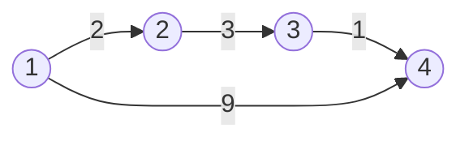



요약

이산수학에서 추이 폐포를 구하는 와셜 알고리즘과 플로이드–워셜은, 거쳐도 되는 점을 하나씩 늘리며 표를 고치는 같은 세 겹 반복이다. 와셜은 "또는·그리고"로 갈 수 있는지를, 플로이드–워셜은 "작은 쪽 고르기·더하기"로 가장 싼 비용을 적는다. 그래서 자기 자신으로 가는 칸(대각선)만 같은 약속으로 시작하면, 거리표에서 길이 있는지만 읽은 것이 곧 와셜의 표다. 다만 고리를 돌수록 값이 좋아지는 경우(음수 사이클)에는 거리 쪽만 무너진다.

## 먼저 비교해 보기

표를 펼치기 전에 두 사례의 공통 구조와 대응 관계를 먼저 적어 본다.

점 1 ~ 4와 화살표 1→2, 2→3, 3→4, 1→4가 있다. [관계와 그 성질](/Hongs_Blog/studies/discrete-math/relations/) 예제의 사슬에 지름길 1→4가 하나 붙은 모양이다. 왼쪽은 화살표들을 관계 R로 보고 와셜 알고리즘을 돌린다. 오른쪽은 화살표에 비용 2, 3, 1, 9를 차례로 달고 [플로이드–워셜](/Hongs_Blog/studies/algorithms/floyd-warshall/)을 돌린다.

화살표 위의 수가 오른쪽 열에서 쓰는 비용이다. 왼쪽 열은 수를 지우고 화살표만 본다[^s4].

| 단계 | 이산수학: R의 추이 폐포 | 알고리즘: 최단 거리 |
|---|---|---|
| 처음 | (1,2), (2,3), (3,4), (1,4) | D[1][2] = 2, D[2][3] = 3, D[3][4] = 1, D[1][4] = 9, 대각선 0, 나머지 ∞ |
| 1을 거쳐도 됨 | 그대로(1로 들어오는 화살표가 없다) | 그대로 |
| 2까지 | (1,3)이 생긴다: 1→2→3 | D[1][3] = 2 + 3 = 5 |
| 3까지 | (2,4)가 생긴다. (1,4)는 이미 참이라 그대로다 | D[2][4] = 3 + 1 = 4, D[1][4] = min(9, 5 + 1) = 6 |
| 4까지 | 그대로(4에서 나가는 화살표가 없다) | 그대로 |
| 한 칸을 고치는 식 | R[i][j] 또는 (R[i][k] 그리고 R[k][j]) | min(D[i][j], D[i][k] + D[k][j]) |
| 결과 | (1,2), (1,3), (1,4), (2,3), (2,4), (3,4)의 6쌍 | 대각선 밖에서는 그 6칸만 ∞가 아니다: 2, 5, 6, 3, 4, 1 |

대응 관계

| 알고리즘 | 수학 | 공통 구조 |
|---|---|---|
| 간선 비용 표, 간선이 없으면 ∞ | 관계 행렬 R, 짝이 없으면 거짓(0) | 두 점 사이 한 걸음 정보를 담은 n × n 표 |
| $$D_k[i][j]$$: 1 ~ k번 점만 거쳐 가는 최소 비용 | 경유점 1 ~ k를 허용한 도달 가능 표 | 거쳐도 되는 점을 하나씩 늘리는 단계 k |
| min: 두 길 중 싼 쪽 | 또는(∨): 두 길 중 하나라도 있으면 | 고르기 연산 |
| +: 앞 구간과 뒤 구간의 비용 합 | 그리고(∧): 두 구간이 다 있어야 | 잇기 연산 |
| ∞(길 없음): min(∞, a) = a | 거짓: 거짓 ∨ a = a | 고르기에서 아무 영향이 없는 값 |
| 0(제자리 비용): 0 + a = a | 참: 참 ∧ a = a | 잇기에서 아무 영향이 없는 값 |
| 대각선을 0으로 시작 → ∞가 아닌 칸 | 대각선을 참으로 시작 → 반사 추이 폐포 $$R^*$$ | 0걸음 이상으로 갈 수 있는 짝 |
| 대각선을 ∞(자기 고리가 있으면 그 비용)로 시작 → 음수 사이클이 없으면 끝난 D[i][i]는 i를 지나는 가장 싼 고리 | 대각선을 R 그대로 → $$R^+$$, 대각선이 참 ⇔ i에서 한 걸음 이상 걸어 돌아올 수 있다 | 1걸음 이상으로 갈 수 있는 짝, 대각선으로 고리 찾기 |
| for k, for i, for j(k가 바깥), $$O(n^3)$$ | 같은 반복, $$O(n^3)$$ | 같은 순서 제약 |

## 어디까지 같은가

- **길이 있는지만 보면 같다.** 거리표의 칸을 "∞가 아니면 참, ∞면 거짓"으로 바꿔 읽는다. min(a, b)는 a나 b 하나만 유한해도 유한하다. 이것이 "또는"이다. a + b는 둘 다 유한해야 유한하다. 이것이 "그리고"다. 그래서 처음 표를 이 규칙대로 맞춰 두면, 플로이드–워셜의 갱신 하나하나가 와셜의 갱신이 된다. 음수 사이클이 있어도, 표 하나를 제자리에서 고쳐도 바퀴마다 맞는다. 플로이드–워셜의 워셜과 와셜 알고리즘의 와셜은 같은 사람(Warshall)이다. 그가 1962년에 낸 논문의 제목도 "A theorem on Boolean matrices"(불 행렬에 관한 정리)다[^3].
- **대각선 약속이 두 가지다.** $$R^+$$에 모든 (a, a)를 더한 관계를 반사 추이 폐포 $$R^*$$라 한다. 0걸음도 "갈 수 있다"로 치는 셈이다. 거리표의 대각선 0에 맞춰 대각선을 참으로 시작하면 $$R^*$$가 나오고, 관계 행렬 그대로 시작하면 $$R^+$$가 나온다. 교재도 갈린다. CLRS는 대각선을 1로 두고[^1], 로젠의 와셜은 관계 행렬 그대로 시작한다[^2]. 자기 자신에게 돌고 돌아 다시 의존하는지(순환 의존) 찾을 때는 $$R^+$$ 쪽을 써야 한다. 대각선이 처음부터 참이면 고리가 없는 점도 자기에게 닿아 가려낼 수 없다.
- **음수 사이클에서 깨진다.** 고리 하나의 값을 c라 하자. 와셜에서 고리를 안 도는 길은 이미 참이라 참 ∨ c = 참이다. 고리는 아무것도 보태지 못한다. 거리에서는 안 돌면 0, 한 바퀴 돌면 c를 더하니 min(0, c) = 0은 c ≥ 0일 때만 맞다. c < 0이면 돌 때마다 c + c = 2c처럼 값이 더 줄어 최단 거리가 없다. 그래서 플로이드–워셜의 정당성에는 "음수 사이클이 없으면 같은 점을 두 번 지나지 않는 최단 경로가 있다"가 필요하다. 와셜 쪽의 같은 자리에는 [경로와 연결성](/Hongs_Blog/studies/discrete-math/connectivity/)의 "보행이 있으면 경로도 있다"가 오고, 이 정리는 아무 조건 없이 참이다. 그 문서는 방향 없는 그래프로 적지만, 두 번 나온 점 사이를 잘라 내는 증명은 화살표에도 그대로 통한다.
- **같은 틀에 다른 연산 짝을 넣어도 된다.** 고르기와 잇기의 짝이 두 조건을 지키면 같은 세 겹 반복이 맞는다. 하나는 바로 위에서 본 고리 조건이다. 제자리 값과 고리 값 중에서 고르면 제자리 값이 남아야 한다(아래 표의 마지막 칸). 다른 하나는 잇기가 고르기에 나눠 들어가는 것(분배법칙)이다. 예를 들어 a + min(b, c) = min(a + b, a + c)라서, 앞 구간과 뒤 구간의 최선을 따로 골라 이어도 된다. 다만 고르기가 +인 길의 수에는 조건이 하나 더 붙는다(표 아래)[^s1]. 이런 연산 짝을 수학에서는 반환(半環, semiring)이라 부른다.

| 문제 | 고르기 | 잇기 | 길 없음 | 제자리(0걸음) | 고리 값 c를 붙여도 안 나아지나 |
|---|---|---|---|---|---|
| 갈 수 있나(와셜) | 또는 | 그리고 | 거짓 | 참 | 늘 그렇다: 참 ∨ c = 참 |
| 최단 거리(플로이드–워셜) | min | + | ∞ | 0 | c ≥ 0일 때만: min(0, c) = 0 |
| 가장 긴 구간의 최소([등산코스 정하기](/Hongs_Blog/studies/algorithms/pg118669/)의 intensity) | min | max | ∞ | 0 | 시간이 모두 양수라 늘 그렇다: min(0, c) = 0 |
| 길의 수 | + | × | 0 | 1 | 고리가 없을 때만: 1 + c = 1 ⇔ c = 0 |

- **길의 수에는 탈이 하나 더 있다.** 또는·min·max는 같은 것을 두 번 골라도 그대로다(a ∨ a = a, min(a, a) = a). 그래서 "k를 안 거치는 길"과 "k를 거치는 길"이 겹쳐도 괜찮다. +는 두 번 더하면 두 배가 되어 겹친 길을 두 번 센다. 그래서 길의 수는 대각선을 제자리 값 1이 아니라 처음 표 그대로(0)로 두어야 하고, 고리가 없는 그래프에서만 맞다. 같은 (+, ×)로 길을 세는 [인접행렬 거듭제곱 ↔ 마르코프 전이](/Hongs_Blog/studies/probability-statistics/walks-markov-bridge/)의 $$A^k$$에서 k는 걸음 수이고, 여기서 k는 거쳐도 되는 점의 마지막 번호다. 걸음 수를 정해 두면 고리가 있어도 셀 수 있다.
- **제자리 갱신이 맞는 까닭이 다르다.** 와셜은 k번째 바퀴에서 k행과 k열이 늘 그대로다. R[i][k] ∨ (R[i][k] ∧ R[k][k]) = R[i][k](흡수 법칙)라서 R[k][k]가 무엇이든 상관없다. 플로이드–워셜은 그 바퀴를 시작할 때 D[k][k] ≥ 0일 때만 그렇다. 음수 사이클 1→2(1), 2→3(−3), 3→1(1)에서는 셋째 바퀴를 시작할 때 D[3][3] = −1이고, 그 바퀴 안에서 D[1][3]이 −2에서 −3으로 바뀐다.

## 이 연결로 얻는 것

**수학에서 알고리즘으로**

- **추이성은 거리에서 삼각 부등식이 된다.** 추이적 관계는 "R[i][k]와 R[k][j]가 참이면 R[i][j]도 참"이다. 거리로 옮기면 D[i][j] ≤ D[i][k] + D[k][j]다. 음수 사이클이 없으면 플로이드–워셜이 끝난 표는 이 부등식을 모든 i, j, k에서 지킨다.
- **"가장 작은 추이적 관계"도 옮겨진다.** 음수 사이클이 없으면 최단 거리표는 "삼각 부등식을 지키고, 칸마다 처음 표(간선 비용, 대각선 0)를 넘지 않는 표" 가운데 칸마다 가장 큰 표다. 그런 표 d가 있으면, i에서 j로 가는 아무 길을 골라 칸마다 삼각 부등식을 쓴다. 그러면 d[i][j]가 그 길의 비용 이하다. 그래서 d[i][j]는 최단 거리 이하다. 최단 거리표 자신도 두 조건을 지키니 가장 큰 표가 된다. 거리에서는 값이 작을수록 "더 잘 이어진" 것이라, $$R^+$$의 "가장 작은"이 여기서는 "가장 큰"으로 뒤집힌다[^s2].

**알고리즘에서 수학으로**

- **정당성 증명.** 와셜이 맞는 까닭도 플로이드–워셜의 "k를 안 거치거나, 한 번 거치거나" 논증으로 보인다. 1 ~ k만 거쳐 i에서 j로 가는 보행이 k를 지나면, k를 처음 만난 곳과 마지막으로 만난 곳에서 자른다. 앞 조각과 뒤 조각은 1 ~ k − 1만 거친다. 가운데를 버려도 "갈 수 있다"는 그대로라 조건이 필요 없다.
- **반복 순서.** 플로이드–워셜의 확인 문제 C3 반례가 와셜에도 통한다. 화살표 1→2, 2→4, 4→3에서 k를 가장 안쪽에 두면 R[1][3]이 거짓으로 남는다.
- **비트로 n칸을 한 번에.** 와셜은 i행 전체를 정수 하나의 비트로 담을 수 있다. 그러면 "R[i][k]가 참이면 i행 \|= k행" 한 줄이 j 반복을 통째로 대신한다([비트 연산과 비트마스크](/Hongs_Blog/studies/algorithms/bit-operations/)). 간선이 적으면 점마다 [BFS](/Hongs_Blog/studies/algorithms/bfs/)나 DFS를 돌려 $$O(n(n + m))$$에 같은 표를 얻는다.

## 전이 문제

서버 1 ~ 4가 양방향 링크로 이어져 있다. 링크마다 제대로 동작할 확률이 있고, 링크끼리는 [독립](/Hongs_Blog/studies/probability-statistics/independence/)이다. 1–2는 0.9, 2–3은 0.9, 1–3은 0.7, 3–4는 0.8, 2–4는 0.5다. 한 경로가 동작할 확률은 지나는 링크 확률의 곱이다. 모든 서버 쌍에 대해 가장 믿을 만한 경로의 확률을 같은 세 겹 반복으로 구하려 한다.

1. 고르기, 잇기, 길 없음, 제자리 칸에 각각 무엇을 넣는가? 왜 그대로 맞는가?
2. 1에서 4로 가는 답은 얼마인가?
3. 값이 확률이 아니라 환율이라 1보다 클 수 있다면 무엇이 깨지는가? 끝난 표의 어디를 보면 알 수 있는가?

답

1. 고르기는 max, 잇기는 ×, 길 없음은 0, 제자리는 1이다. 고리 값 c는 확률의 곱이라 1 이하이고, max(1, c) = 1이니 고리를 돌아 나아질 수 없다. 확률이 0 이상이라 a × max(b, c) = max(a × b, a × c)도 맞는다.
2. 0.648이다. 1–2–3–4가 0.9 × 0.9 × 0.8 = 0.648로, 1–3–4(0.7 × 0.8 = 0.56)와 1–2–4(0.9 × 0.5 = 0.45)보다 높다. 링크를 더 많이 거치는 길이 이긴다.
3. 곱이 1보다 큰 고리(차익 거래)가 있으면 돌 때마다 값이 커져 답이 없다. 음수 사이클과 같은 자리다. 끝난 표에서 어떤 P[i][i]가 1보다 크면 그런 고리가 있다. 예를 들어 1→2 환율이 2, 2→1 환율이 0.6이면 한 바퀴에 1.2배가 되고, 끝난 표의 P[1][1]이 1.2다. 값마다 −ln을 씌우면 곱이 합으로 바뀌어 최단 거리 문제가 된다. 확률이면 비용이 0 이상이고([다익스트라](/Hongs_Blog/studies/algorithms/dijkstra/)의 성공 확률 경로와 같은 바꾸기다), 곱이 1보다 큰 고리는 비용이 음수인 고리가 된다[^s3].

## 확인 문제

**C1** 와셜에는 음수 사이클 같은 걱정이 없다. 그 까닭을 "또는은 몇 번 해도 같다(a ∨ a = a)"로 설명하면 왜 틀렸고, 진짜 까닭은 무엇인가?

**답:** min도 min(a, a) = a라서 이 성질로는 둘을 가르지 못한다. 진짜 차이는 고리를 붙인 길이 안 붙인 길보다 나을 수 있느냐다. 갈 수 있는지만 보면 고리를 안 돌아도 이미 참이라 참 ∨ c = 참이고, 고리는 아무것도 보태지 못한다. 거리에서는 min(0, c)가 c < 0일 때 c라서, 고리를 돌 때마다 값이 더 줄어든다. 그래서 플로이드–워셜에만 "음수 사이클이 없다"는 조건이 붙는다.

**C2** 화살표 1→2(비용 1), 2→1(4), 2→3(2)가 있다. 관계 R = {(1,2), (2,1), (2,3)}의 $$R^+$$를 쓰고, 대각선을 ∞로 시작한 플로이드–워셜의 끝난 표와 대응시켜라.

**답:** $$R^+$$ = {(1,1), (1,2), (1,3), (2,1), (2,2), (2,3)}이다. 끝난 표는 1행 [5, 1, 3], 2행 [4, 5, 2], 3행 [∞, ∞, ∞]이고, ∞가 아닌 칸이 정확히 $$R^+$$의 짝이다. 대각선 5는 1과 2를 지나는 고리 1→2→1의 비용이다. 3에서는 나가는 화살표가 없어 D[3][3] = ∞이고, (3,3)도 $$R^+$$에 없다. 흔한 실수는 대각선을 0으로 시작하는 것이다. 그러면 (3,3)까지 들어간 반사 추이 폐포 $$R^*$$와 대응한다.

**C3** 같은 세 겹 반복에서 고르기를 +, 잇기를 ×로 바꾸고 처음 표를 간선 1, 나머지 0으로 두면 "i에서 j로 가는 길의 수"를 셀 것 같다. 이 생각이 틀렸음을 보이는 그래프를 들고, 고리가 없으면 맞는 까닭을 말하라.

**답:** 화살표 1→2, 2→1이면 반복이 끝난 표는 1행 [1, 2], 2행 [2, 2]다. 1에서 2로 가는 경로(같은 점을 두 번 지나지 않는 길)는 1→2 하나뿐이다. 보행으로 세면 1→2, 1→2→1→2, …로 끝이 없다. 어느 쪽으로 읽어도 2는 틀렸다. 고리 1→2→1의 값이 1 × 1 = 1이라 1 + c = 2가 되어 고리 조건이 깨진다. 고리가 없으면 i에서 k로 가는 길과 k에서 j로 가는 길을 이은 것은 늘 같은 점을 두 번 지나지 않는 길이다. 겹치는 점이 있다면 그 사이가 고리이기 때문이다. 그래서 "k를 안 거침"과 "k를 한 번 거침"이 겹치지 않고 빠짐없이 나뉘어, 두 경우의 수를 더하면 맞다.

검증: 비교 표의 바퀴별 변화, 무작위 그래프 1,500개에서 "∞가 아닌 칸 = 와셜의 표"(음수 사이클·제자리 갱신 포함, 바퀴마다, 대각선 약속 두 가지), $$R^+$$·$$R^*$$·"대각선 = 가장 싼 고리"(브루트포스 대조), 삼각 부등식과 "칸마다 가장 큰 표"(점 3개에서 전수), 음수 사이클에서 셋째 바퀴에 바뀌는 칸, 흡수 법칙, 반복 순서 반례, 비트 묶음 와셜, 연산 짝 표의 네 줄(점마다 탐색·벨만–포드·모든 경로 세기와 대조)과 분배법칙, 전이 문제의 확률·환율 고리·−ln 바꾸기, 카드 답 — [40_warshall-floyd_verify.py](/Hongs_Blog/studies/algorithms/code/40_warshall-floyd_verify/)

[^1]: Cormen 외, *Introduction to Algorithms* 3판, 25.2절 "The Floyd-Warshall algorithm" 안의 "Transitive closure of a directed graph". 같은 점화식을 ∨, ∧로 쓰고, 처음 표에서 i = j인 칸을 1로 둔다.
[^2]: Rosen, *Discrete Mathematics and Its Applications* 7판, 9.4절 "Closures of Relations". 와셜 알고리즘은 관계 행렬 그대로 시작한다. 로젠은 한 걸음 이상 가는 짝의 모음(이 문서의 $$R^+$$)을 연결 관계라 부르고 $$R^*$$로 쓰니, 기호가 이 문서와 다르다.
[^3]: S. Warshall, "A theorem on Boolean matrices", *Journal of the ACM* 9(1), 11–12쪽, 1962.
[^s1]: 에이전트 보충. 연산 짝 표, 고리 조건(제자리 값과 고리 값 중 고르면 제자리 값이 남는다), 분배법칙, 길의 수의 겹침 문제는 원본에 없다. 40_warshall-floyd_verify.py에서 무작위 그래프로 네 줄을 대조했다(실험으로 확인). 갈 수 있나는 점마다 탐색한 결과와, 최단 거리는 벨만–포드와, 나머지 두 줄은 모든 경로를 센 결과와 맞췄다. 같은 반복이 맞는 까닭은 본문의 "k를 안 거치거나 한 번 거치거나" 논증이다.
[^s2]: 에이전트 보충. "삼각 부등식 + 처음 표 이하인 표 가운데 가장 큰 표" 성질과 그 두 줄 증명은 원본에 없다. 점 3개짜리 무작위 그래프 12개에서 대각선 밖 칸에 −1 ~ 4와 ∞를 넣은 표를 모두 훑어 확인했다. 대각선은 따로 훑지 않아도 된다. 삼각 부등식 d[i][i] ≤ d[i][i] + d[i][i]에서 d[i][i] ≥ 0이고, 처음 표에서 d[i][i] ≤ 0이라 0으로 정해진다.
[^s3]: 에이전트 보충. 전이 문제는 원본 범위 밖이다. 확률 경로의 답은 분수로 모든 경로를 세어 맞췄고, 환율 고리는 무작위 그래프 400개에서 "곱이 1보다 큰 고리가 있다 ⇔ 어떤 P[i][i] > 1"을 확인했다. 차익 거래를 음수 사이클 찾기로 바꾸는 문제는 Cormen 외, *Introduction to Algorithms* 3판, 24장 문제 24-3 "Arbitrage"에 있다.
[^s4]: 에이전트 보충. 다이어그램 1개는 원본에 없다. '먼저 비교해 보기'의 화살표 1→2, 2→3, 3→4, 1→4와 비용 2, 3, 1, 9를 그대로 그렸다.

