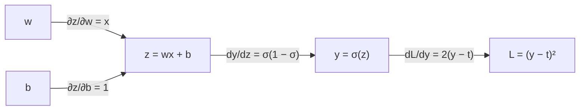



요약

함수 안에 함수가 든 합성함수는 안쪽과 바깥쪽의 변화율을 곱해서 미분한다. 맞물린 톱니바퀴에서 전체 회전 비가 각 톱니 쌍의 비를 곱한 것과 같다. 신경망의 학습(역전파)과 자동미분은 이 규칙을 수백만 번 적용하는 일이다. 다만 바깥 함수의 도함수는 안쪽 함수의 **값**에서 계산해야 한다.

## 예시로 보기

톱니바퀴 A가 1바퀴 돌면 B가 3바퀴, B가 1바퀴 돌면 C가 2바퀴 돈다. A가 1바퀴 돌면 C는 $$3 \times 2 = 6$$바퀴다. 변화율이 곱해진다.

$$y = \sin(x^2)$$에서 안쪽 $$u = x^2$$은 $$x$$가 조금 늘 때 $$2x$$배로 변하고, 바깥 $$y = \sin u$$는 $$u$$가 조금 늘 때 $$\cos u$$배로 변한다. 그래서 $$y$$는 $$x$$에 대해 $$\cos u \cdot 2x = 2x\cos(x^2)$$배로 변한다. 안쪽 함수가 아래 정리의 $$g$$, 바깥 함수가 $$f$$, 톱니 B가 중간 변수 $$u$$다.

## 정의

연쇄 법칙

$$g$$가 $$x$$에서 미분 가능하고 $$f$$가 $$g(x)$$에서 미분 가능하면, $$f \circ g$$($$\circ$$는 합성. $$g \circ f$$는 $$f$$를 먼저, $$g$$를 나중에 한다)는 $$x$$에서 미분 가능하고

$$(f \circ g)'(x) = f'\big(g(x)\big) \cdot g'(x)$$

이다. $$y = f(u)$$, $$u = g(x)$$로 쓰면 $$\dfrac{dy}{dx} = \dfrac{dy}{du}\cdot\dfrac{du}{dx}$$[^1].

**가정.** (1) 안쪽 $$g$$가 $$x$$에서 미분 가능하다. (2) 바깥 $$f$$가 **$$g(x)$$에서** 미분 가능하다. 두 가정은 충분조건이지 필요조건은 아니다(역은 맞지 않는다).
- (2)가 깨지면 결론도 깨질 수 있다: $$f(u) = \vert u\vert $$, $$g(x) = x$$이면 $$f \circ g = \vert x\vert $$는 0에서 미분 불가능이다.
- 가정이 깨져도 결론이 맞을 수 있다: $$f(u) = u^2$$, $$g(x) = \vert x\vert $$이면 $$g$$는 0에서 미분 불가능이지만 $$f \circ g = x^2$$은 미분 가능하다.

연쇄 법칙에서 따라 나오는 도구들이다.

| 도구 | 식 | 쓰는 곳 |
|---|---|---|
| 역함수의 미분 | $$(f^{-1})'(y) = \dfrac{1}{f'(x)}$$, $$y = f(x)$$ | $$(\ln x)' = 1/x$$, $$(\arctan x)' = \frac{1}{1 + x^2}$$ |
| 음함수 미분 | 양변을 $$x$$로 미분하고 $$y' = \frac{dy}{dx}$$에 대해 푼다 | 원 $$x^2 + y^2 = 1$$의 접선 |
| 로그 미분법 | $$y = f(x)$$의 로그를 취해 미분: $$\frac{y'}{y} = (\ln f)'$$ | $$x^x$$, 거듭제곱이 많은 곱 |
| 실수 지수 | $$x^r = e^{r\ln x}$$ | $$(x^r)' = r x^{r-1}$$ |

## 증명

증명 펼치기 [증명 스케치]

[도함수](/Hongs_Blog/studies/calculus/derivative/)의 동치 정의(선형 근사)를 쓴다. $$u = g(x)$$로 두면
1. $$g(x + h) = u + g'(x)h + r_1(h)$$, $$r_1(h)/h \to 0$$. — $$g$$가 $$x$$에서 미분 가능
2. $$f(u + k) = f(u) + f'(u)k + r_2(k)$$, $$r_2(k)/k \to 0$$. — $$f$$가 $$u$$에서 미분 가능
3. 2에 $$k = g(x+h) - u = g'(x)h + r_1(h)$$를 넣으면 $$f(g(x+h)) = f(u) + f'(u)g'(x)h + [f'(u)r_1(h) + r_2(k)]$$.
4. 대괄호 안을 $$h$$로 나눈 것이 0으로 가면 끝이다. 첫 항은 1로 0에 간다. 둘째 항은 $$k \to 0$$이고 $$\vert k\vert  \le C\vert h\vert $$ 꼴이라 역시 0에 간다($$k = 0$$인 경우는 $$r_2(0) = 0$$으로 따로 처리).

흔히 보는 "$$\frac{\Delta y}{\Delta x} = \frac{\Delta y}{\Delta u}\cdot\frac{\Delta u}{\Delta x}$$에서 극한"은 $$\Delta u = 0$$이 되는 $$h$$가 있으면 나눗셈이 안 돼 그대로는 증명이 아니다. 선형 근사로 쓰면 이 문제를 피한다. ∎

**역함수의 미분:** $$f(f^{-1}(y)) = y$$의 양변을 $$y$$로 미분하면 연쇄 법칙으로 $$f'(f^{-1}(y)) \cdot (f^{-1})'(y) = 1$$. 예: $$e^{\ln x} = x$$에서 $$e^{\ln x}(\ln x)' = 1$$, 즉 $$(\ln x)' = 1/x$$.

### 스스로 설명해 보기

1. 4단계에서 k를 h의 상수배 이하로 묶을 수 있는 근거는?

$$k = g'(x)h + r_1(h)$$이고 $$r_1(h)/h \to 0$$이므로, $$h$$가 충분히 작으면 $$\vert k\vert  \le (\vert g'(x)\vert  + 1)\vert h\vert $$다.

2. $$(\ln x)' = \frac1x$$ 증명에서 $$e^{\ln x}$$의 도함수가 $$e^{\ln x}\cdot(\ln x)'$$가 되는 이유는?

바깥 함수 $$e^u$$의 도함수가 $$e^u$$이고, 이를 안쪽의 값 $$u = \ln x$$에서 계산한 뒤 안쪽의 도함수를 곱했다. 그리고 $$e^{\ln x} = x$$라 $$(\ln x)' = 1/x$$다.

이 정리의 핵심 아이디어는?

가까이서 보면 모든 매끄러운 함수는 직선(곱하기)이다. 직선들을 이어 붙인 것은 기울기를 곱한 직선이다.

같은 아이디어를 쓰는 다른 상황은?

다변수 함수에서는 기울기가 행렬(야코비)이 되고, 연쇄 법칙은 행렬 곱이 된다([다변수 연쇄 법칙과 야코비 행렬](/Hongs_Blog/studies/calculus/multivariable-chain-rule/)). 역전파는 이 곱을 출력 쪽에서부터 계산하는 순서다.

## 예제

**소프트플러스와 시그모이드.** $$f(x) = \ln(1 + e^x)$$를 미분한다.

1. *구조:* 바깥 $$\ln u$$, 안쪽 $$u = 1 + e^x$$.
2. *바깥의 도함수를 안쪽 값에서:* $$\frac{1}{1 + e^x}$$.
3. *안쪽의 도함수를 곱하기:* $$\frac{1}{1 + e^x} \cdot e^x = \frac{e^x}{1 + e^x} = \frac{1}{1 + e^{-x}} = \sigma(x)$$.
4. *해석:* 소프트플러스의 도함수가 시그모이드 $$\sigma$$다. $$\sigma$$ 자신의 도함수는 $$\sigma(1 - \sigma)$$다(같은 방법으로 확인).

파란 곡선의 기울기를 점마다 재면 주황 곡선의 높이가 되고, 주황 곡선의 기울기는 초록 곡선의 높이가 된다. 초록 곡선은 $$x = 0$$에서 가장 높아도 $$\frac14$$이고, $$x$$가 0에서 멀어지면 거의 0이다(아래 기울기 소실)[^s2].

**뉴런 하나의 학습 기울기.** 출력 $$y = \sigma(wx + b)$$, 손실 $$L = (y - t)^2$$일 때 가중치 $$w$$에 대한 기울기는 바깥에서부터 곱해 나간다.

$$\frac{\partial L}{\partial w} = \underbrace{2(y - t)}_{dL/dy}\cdot\underbrace{\sigma(1 - \sigma)}_{dy/dz}\cdot\underbrace{x}_{dz/dw}, \qquad z = wx + b$$

화살표는 계산이 흐르는 방향이고, 화살표 위의 식은 그 한 칸의 도함수다. $$L$$에서 $$w$$까지 거꾸로 가며 화살표 위의 식을 곱하면 위 식이 된다. $$b$$로 가는 길에서는 마지막에 $$x$$ 대신 1을 곱한다[^s3].

연습: [미분 계산 예제 사다리](/Hongs_Blog/studies/calculus/differentiation-ladder/)

검증: 예시·예제·사다리의 도함수를 무작위 점에서 중앙 차분과 비교, $$(\ln x)'$$와 $$(x^x)'$$, 뉴런 기울기 2,000개, 가정의 두 반례, 오해의 수치 — [06_chain-rule_verify.py](/Hongs_Blog/studies/calculus/code/06_chain-rule_verify/)

## 활용

- **역전파와 자동미분.** 신경망은 층을 합성한 함수다. 출력에서 입력 쪽으로 각 층의 도함수를 곱해 내려가며 모든 가중치의 기울기를 한 번에 구한다. [퍼셉트론](/Hongs_Blog/studies/human-interface-media/perceptron/)에 시그모이드를 씌우고 이 규칙으로 학습하면 여러 층으로 쌓을 수 있다.
- **기울기 소실.** 시그모이드의 도함수 $$\sigma(1 - \sigma)$$는 최대 $$1/4$$이다. 층이 깊으면 이런 수가 여러 번 곱해져 앞쪽 층의 기울기가 0에 가까워진다. ReLU를 쓰는 이유 중 하나다[^s1].
- **단위 변환.** 물리량의 변화율을 다른 단위로 바꿀 때(초당 → 분당) 곱하는 환산 계수도 연쇄 법칙이다.

## 연결

- 선수: [미분 법칙](/Hongs_Blog/studies/calculus/differentiation-rules/), [함수의 변환과 합성](/Hongs_Blog/studies/college-math/function-transformation/)
- 이어지는 개념: [도함수의 활용과 최적화](/Hongs_Blog/studies/calculus/curve-analysis/), [치환적분](/Hongs_Blog/studies/calculus/substitution/)(연쇄 법칙의 역), [다변수 연쇄 법칙](/Hongs_Blog/studies/calculus/multivariable-chain-rule/)과 [역전파 브리지](/Hongs_Blog/studies/calculus/backprop-bridge/)

## 자주 하는 오해

"(f(g(x)))' = f'(g'(x))"

틀렸다. "함수 안에 함수"니 도함수도 안에 넣으면 될 것 같다. 실제로는 바깥 도함수를 안쪽 **값**에서 계산하고 안쪽 **도함수를 곱한다**: $$f'(g(x)) \cdot g'(x)$$. $$\sin(x^2)$$을 잘못된 방식으로 하면 $$\cos(2x)$$가 되어 $$x = 1$$에서 $$-0.416$$이지만, 올바른 값은 $$2\cos 1 \approx 1.081$$이다. 수치 미분으로 확인하면 1.081이 나온다.

## 확인 문제

**C1** 연쇄 법칙을 쓰고, 바깥 함수의 도함수를 어디서 계산하는지 밝혀라.

**답:** $$(f \circ g)'(x) = f'(g(x))\,g'(x)$$. 바깥의 도함수 $$f'$$은 $$x$$가 아니라 안쪽 값 $$g(x)$$에서 계산한다.

**C2** 소프트플러스 $$\ln(1 + e^x)$$와 시그모이드 $$\sigma(x) = \frac{1}{1 + e^{-x}}$$를 각각 미분하라.

**답:** $$(\ln(1 + e^x))' = \frac{e^x}{1 + e^x} = \sigma(x)$$. $$\sigma'(x) = \frac{e^{-x}}{(1 + e^{-x})^2} = \sigma(x)(1 - \sigma(x))$$.

**C3** $$e^{\ln x} = x$$에서 $$(\ln x)' = \frac1x$$를 끌어내라. 각 단계의 근거는?

**답:** 양변을 $$x$$로 미분한다. 왼쪽은 연쇄 법칙으로 $$e^{\ln x}\cdot(\ln x)'$$, 오른쪽은 1. $$e^{\ln x} = x$$(로그의 정의)이므로 $$x(\ln x)' = 1$$, 즉 $$(\ln x)' = 1/x$$.

**C4** 연쇄 법칙의 가정 "f가 g(x)에서 미분 가능"이 깨져 합성이 미분 불가능한 예와, 가정이 깨졌는데도 합성은 미분 가능한 예를 하나씩 들라.

**답:** $$f(u) = \vert u\vert $$, $$g(x) = x$$이면 $$f \circ g = \vert x\vert $$는 0에서 미분 불가능. $$f(u) = u^2$$, $$g(x) = \vert x\vert $$이면 $$g$$는 0에서 미분 불가능이지만 $$f \circ g = x^2$$은 미분 가능. 가정은 충분조건일 뿐이다.

[^1]: OpenStax, *Calculus Volume 1*, 3.6절 "The Chain Rule", 3.7절 "Derivatives of Inverse Functions", 3.8절 "Implicit Differentiation", 3.9절 "Derivatives of Exponential and Logarithmic Functions"(로그 미분법)
[^s1]: 에이전트 보충. 기울기 소실 문제와 ReLU의 도입은 딥러닝의 표준 서술이다(Goodfellow·Bengio·Courville, *Deep Learning*, 6장).
[^s2]: 에이전트 보충. 그림은 원본에 없다. [06_chain-rule_plot.py](/Hongs_Blog/studies/calculus/code/06_chain-rule_plot/)로 그렸고, 세 곡선이 차례로 도함수 관계인 것(중앙 차분, $$-5 \le x \le 5$$)과 $$\sigma(1 - \sigma)$$의 최댓값이 $$x = 0$$의 $$\frac14$$인 것을 같은 코드로 확인했다.
[^s3]: 에이전트 보충. 다이어그램 1개는 원본에 없다. 예제의 뉴런 하나의 학습 기울기 식을 계산 그래프로 옮겼다. $$\frac{\partial z}{\partial b} = 1$$은 $$z = wx + b$$에서 바로 나온다.

