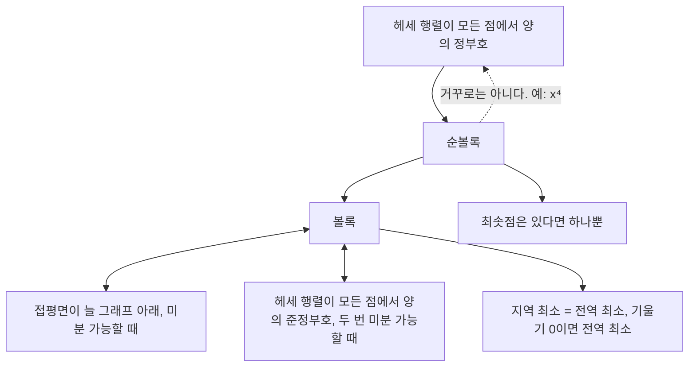



요약

그래프가 그릇 모양인 함수다. 그래프 위의 두 점을 줄로 이으면 그 줄이 늘 그래프보다 위(또는 같은 높이)에 있다. 이런 함수에는 움푹한 곳이 하나뿐이라, 어디서 내려가기 시작하든 가장 낮은 바닥에 닿는다. 그래서 볼록인지 확인하는 것이 곧 "경사 하강법 결과를 믿어도 되는가"에 대한 답이다. 신경망의 손실 함수는 볼록이 아니라서 이 보장이 없다.

## 예시로 보기

$$f(x) = x^2$$ 위의 두 점 $$(0, 0)$$과 $$(2, 4)$$를 잇는 줄의 가운데 높이는 $$\frac{0 + 4}{2} = 2$$다. 그 자리의 그래프 높이 $$f(1) = 1$$은 줄보다 낮다. 어느 두 점을 골라도, 두 점 사이 어느 비율의 자리에서도 이렇다. 이것이 아래 정의의 부등식이다. 구간에서 $$t$$는 "$$x$$ 쪽으로 얼마나 가까운가"의 비율이다.

왼쪽에서 파란 줄은 두 점 사이 어디서나 회색 그래프보다 위에 있다. 오른쪽은 아래 예제의 곱 $$x^2(x - 1)^2$$이다. 0과 1을 잇는 줄(높이 0)이 가운데에서 그래프(0.0625)보다 아래로 들어가서 볼록이 아니다[^s1].

| 함수 | 볼록? | 이유 |
|---|---|---|
| $$x^2$$, $$e^x$$ | 예 | 2차 도함수가 늘 양수 |
| $$\lvert x\rvert$$, $$\max(x, 0)$$ | 예 | 꺾이지만 줄이 늘 위에 있다(미분 가능하지 않아도 된다) |
| $$-\ln x$$ ($$x > 0$$) | 예 | 2차 도함수 $$\frac{1}{x^2} > 0$$ |
| $$\ln x$$ | 아니오(오목) | 줄이 그래프 **아래**에 있다 |
| $$x^3$$, $$\sin x$$ | 아니오 | 볼록한 곳과 오목한 곳이 섞여 있다 |

## 정의

정의

집합 $$C \subseteq \mathbb{R}^n$$이 **볼록 집합**이라는 것은 $$C$$의 두 점을 잇는 선분이 늘 $$C$$ 안에 있다는 뜻이다. 볼록 집합 $$C$$ 위의 함수 $$f$$가 **볼록**이라는 것은 모든 $$\mathbf{x}, \mathbf{y} \in C$$($$\in$$은 "~에 속한다")와 $$t \in [0, 1]$$에 대해

$$f(t\mathbf{x} + (1 - t)\mathbf{y}) \le t f(\mathbf{x}) + (1 - t)f(\mathbf{y})$$

가 맞는다는 뜻이다. $$\mathbf{x} \ne \mathbf{y}$$, $$0 < t < 1$$에서 늘 등호 없이 $$<$$이면 **순볼록**, $$-f$$가 볼록이면 $$f$$는 **오목**이다[^1].

**동치 조건.** $$C$$가 열린 볼록 집합일 때 다음이 같다.

1. *1계 조건:* $$f$$가 미분 가능하면, 볼록 ⇔ 모든 점의 접평면이 그래프 아래에 있다. $$f(\mathbf{y}) \ge f(\mathbf{x}) + \nabla f(\mathbf{x})\cdot(\mathbf{y} - \mathbf{x})$$($$\nabla f$$는 편미분을 모은 벡터(그래디언트)).
2. *2계 조건:* $$f$$가 두 번 미분 가능하면, 볼록 ⇔ 모든 점에서 헤세 행렬이 [양의 준정부호](/Hongs_Blog/studies/linear-algebra/positive-definite/)(고윳값이 모두 0 이상)다. 헤세 행렬이 모든 점에서 양의 정부호이면 순볼록이다(역은 아니다: $$x^4$$은 순볼록인데 0에서 $$f'' = 0$$).

지역 최소 = 전역 최소

볼록 함수 $$f$$의 지역 최솟점은 전역 최솟점이다. $$f$$가 미분 가능하면 $$\nabla f(\mathbf{x}^*) = \mathbf{0}$$인 점은 모두 전역 최솟점이다. 순볼록이면 최솟점은 (있다면) 하나뿐이다[^1].

양쪽 화살표로 이은 셋은 같은 조건을 다르게 쓴 것이다. 한쪽 화살표는 그 방향으로만 맞고, 점선은 거꾸로 가면 깨지는 곳이다[^s2].

## 증명

증명 펼치기

1. *지역 = 전역 (귀류법):* $$\mathbf{x}$$가 지역 최솟점인데 $$f(\mathbf{y}) < f(\mathbf{x})$$인 $$\mathbf{y}$$가 있다고 하자. 선분 위의 점 $$\mathbf{z}_t = (1 - t)\mathbf{x} + t\mathbf{y}$$에 볼록성을 쓰면 $$f(\mathbf{z}_t) \le (1 - t)f(\mathbf{x}) + t f(\mathbf{y}) < f(\mathbf{x})$$ ($$0 < t \le 1$$). $$t$$를 0에 가깝게 하면 $$\mathbf{z}_t$$는 $$\mathbf{x}$$에 얼마든지 가까우면서 값이 더 작다. 지역 최소라는 가정에 모순이다.
2. *기울기 0이면 전역 최소:* 1계 조건에 $$\nabla f(\mathbf{x}^*) = \mathbf{0}$$을 넣으면 모든 $$\mathbf{y}$$에서 $$f(\mathbf{y}) \ge f(\mathbf{x}^*)$$.
3. *순볼록이면 하나뿐:* 서로 다른 최솟점 $$\mathbf{x}, \mathbf{y}$$가 있고 최솟값이 $$m$$이면 중점에서 $$f\left(\frac{\mathbf{x} + \mathbf{y}}{2}\right) < \frac{m + m}{2} = m$$. 최솟값보다 작은 값이라 모순이다. ∎

순볼록이 아니면 최솟점이 여럿일 수 있다. $$f(x, y) = x^2$$은 볼록이지만 직선 $$x = 0$$ 전체가 최솟점이다.

## 예제

**볼록 함수를 알아보는 요령.** 정의를 직접 쓰기보다 볼록성을 지키는 연산으로 조립한다[^1].

- 볼록 함수들의 음이 아닌 가중합, 최댓값은 볼록이다.
- 볼록 함수에 일차식을 넣은 $$f(A\mathbf{x} + \mathbf{b})$$는 볼록이다.
- 곱은 볼록성을 지키지 **않는다**. $$x^2$$과 $$(x - 1)^2$$은 볼록이지만 곱 $$x^2(x - 1)^2$$은 $$x = 0, 1$$에서 0, 가운데 $$x = \frac12$$에서 $$0.0625$$라 현 부등식을 어긴다.

이 규칙으로 기계학습의 대표 손실이 볼록임을 바로 안다.

| 손실 | 볼록인 이유 |
|---|---|
| 최소제곱 $$\lVert A\mathbf{x} - \mathbf{b}\rVert^2$$ | 헤세 행렬 $$2A^\top A$$가 준정부호 |
| 로지스틱 회귀의 교차 엔트로피 | 헤세 행렬 $$X^\top DX$$, $$D = \operatorname{diag}(p_i(1 - p_i))$$, 대각 성분이 양수라 준정부호 |
| SVM의 힌지 손실 $$\max(0, 1 - y\,\mathbf{w}^\top\mathbf{x})$$ | 일차식 두 개의 최댓값 |
| 릿지 정칙화 $$+\lambda\lVert\mathbf{w}\rVert^2$$ | 볼록 함수에 순볼록 함수를 더해 순볼록 |

**볼록이 아니면 시작점에 따라 답이 다르다.** $$f(x) = x^4 - 3x^2 + x$$에 경사 하강법을 쓰면, $$x_0 = 2$$에서는 지역 최솟점 $$x \approx 1.131$$(값 $$\approx -1.070$$)에, $$x_0 = -2$$에서는 전역 최솟점 $$x \approx -1.301$$(값 $$\approx -3.514$$)에 멈춘다. 두 점 모두 $$f' = 0$$, $$f'' > 0$$이라 [2계 판정](/Hongs_Blog/studies/calculus/hessian/)으로는 구별되지 않는다.

점은 처음 25걸음의 위치이고, 별은 멈춘 곳이다. 오른쪽에서 출발한 파란 점들은 가운데 언덕을 넘지 못하고 얕은 골짜기에 멈춘다. 왼쪽에서 출발한 주황 점들만 더 깊은 골짜기에 닿는다[^s1].

검증: 표의 볼록·비볼록 판정(무작위 현 부등식 4,000회), 접선 부등식과 헤세 조건(무작위 이차함수와 log-sum-exp), 볼록 함수에서 다섯 시작점의 경사 하강 결과 일치, 사차함수의 두 최솟점, 로지스틱·최소제곱 헤세의 준정부호, 곱의 반례, 카드의 고윳값 — [27_convexity_verify.py](/Hongs_Blog/studies/calculus/code/27_convexity_verify/)

## 활용

- **믿을 수 있는 최적화.** 선형 회귀, 릿지, 로지스틱 회귀, SVM은 볼록 문제라 [경사 하강법](/Hongs_Blog/studies/calculus/gradient-descent/)이 시작점과 상관없이 최적해로 간다. 신경망은 볼록이 아니어서 초기화와 학습률에 따라 결과가 달라진다.
- **문제를 볼록하게 바꾸기.** 풀기 어려운 제약을 볼록한 것으로 완화하거나, 볼록 정칙화 항을 더해 해를 하나로 만든다.
- **옌센 부등식.** 볼록 함수에서는 평균의 함숫값이 함숫값의 평균 이하다. 정의의 부등식을 여러 점으로 늘린 것이며, 확률에서 $$f(\mathbb{E}[X]) \le \mathbb{E}[f(X)]$$($$\mathbb{E}[\cdot]$$은 평균(기댓값))로 쓰인다. [엔트로피](/Hongs_Blog/studies/probability-statistics/entropy/)의 상한 증명이 한 예다.
- 알고리즘에서: 블록 하나를 더하는 비용이 $$P$$, 빼는 비용이 $$Q$$일 때 모든 칸을 높이 $$t$$로 맞추는 [지형 편집](/Hongs_Blog/studies/algorithms/pg12984/)의 비용은, 높이 $$h$$인 칸마다 $$P\max(t - h, 0) + Q\max(h - t, 0)$$을 더한 값이다. 칸마다 한 번 꺾인 볼록 함수이고 그 합도 볼록이라, $$t$$를 1 올릴 때의 비용 변화가 처음으로 0 이상이 되는 높이가 가장 싸다. $$P = Q$$면 그 높이는 칸 높이들의 중앙값이다.

## 연결

- 선수: [헤세 행렬과 극값 판정](/Hongs_Blog/studies/calculus/hessian/), [양의 정부호 행렬](/Hongs_Blog/studies/linear-algebra/positive-definite/)
- 쓰는 곳: [경사 하강법](/Hongs_Blog/studies/calculus/gradient-descent/)의 수렴 보장, [최소제곱법](/Hongs_Blog/studies/linear-algebra/least-squares/)의 해가 전역 최소인 이유

## 확인 문제

**C1** $$f(x, y) = x^2 + xy + y^2$$은 볼록인가? 순볼록인가?

**답:** 헤세 행렬 $$\begin{pmatrix}2 & 1\\ 1 & 2\end{pmatrix}$$의 고윳값이 3과 1로 모두 양수다. 모든 점에서 양의 정부호라 순볼록이고, 최솟점은 $$(0, 0)$$ 하나다.

**C2** 볼록 함수의 지역 최솟점이 왜 전역 최솟점인지, 선분을 써서 설명하라.

**답:** 지역 최솟점 $$\mathbf{x}$$보다 값이 작은 $$\mathbf{y}$$가 있다면, 두 점을 잇는 선분 위에서 볼록성 때문에 함숫값이 줄보다 낮다. 줄은 $$f(\mathbf{x})$$에서 $$f(\mathbf{y})$$로 내려가므로, $$\mathbf{x}$$ 바로 옆의 점들도 $$f(\mathbf{x})$$보다 작다. 지역 최소와 모순이다.

**C3** 실수 전체에서 다음 중 볼록 함수를 모두 고르라: $$e^x$$, $$\ln x$$ ($$x > 0$$), $$x^3$$, $$\lvert x\rvert$$, $$\max(x, 0)$$.

**답:** $$e^x$$, $$\lvert x\rvert$$, $$\max(x, 0)$$. $$\ln x$$는 오목이고, $$x^3$$은 $$x < 0$$에서 오목이다. 
**흔한 오답:** 꺾인 점에서 미분이 안 되니 $$\lvert x\rvert$$와 ReLU $$\max(x, 0)$$는 볼록이 아니라고 보는 것. 볼록의 정의는 미분을 요구하지 않는다.

[^1]: Boyd, Vandenberghe, *Convex Optimization*, 2.1절(볼록 집합), 3.1절(볼록 함수의 정의, 1계·2계 조건, 옌센 부등식), 3.2절(볼록성을 보존하는 연산), 4.2.2절 "Local and global optima".
[^s1]: 보충 그림 두 장은 원본에 없다. [27_convexity_plot.py](/Hongs_Blog/studies/calculus/code/27_convexity_plot/)로 그렸다. 경사 하강법의 학습률은 0.01로 잡았다. 현의 가운데 값 2와 $$f(1) = 1$$, 곱의 가운데 값 0.0625, 두 최솟점 $$x \approx 1.131$$(값 $$-1.070$$)과 $$x \approx -1.301$$(값 $$-3.514$$)에서 $$f' = 0$$, $$f'' > 0$$인 것을 같은 코드로 확인했다.
[^s2]: 보충 다이어그램 1개는 원본에 없다. 정의 절의 동치 조건(1계, 2계)과 정리(지역 최소 = 전역 최소, 순볼록이면 하나뿐)를 근거로 그렸다.

