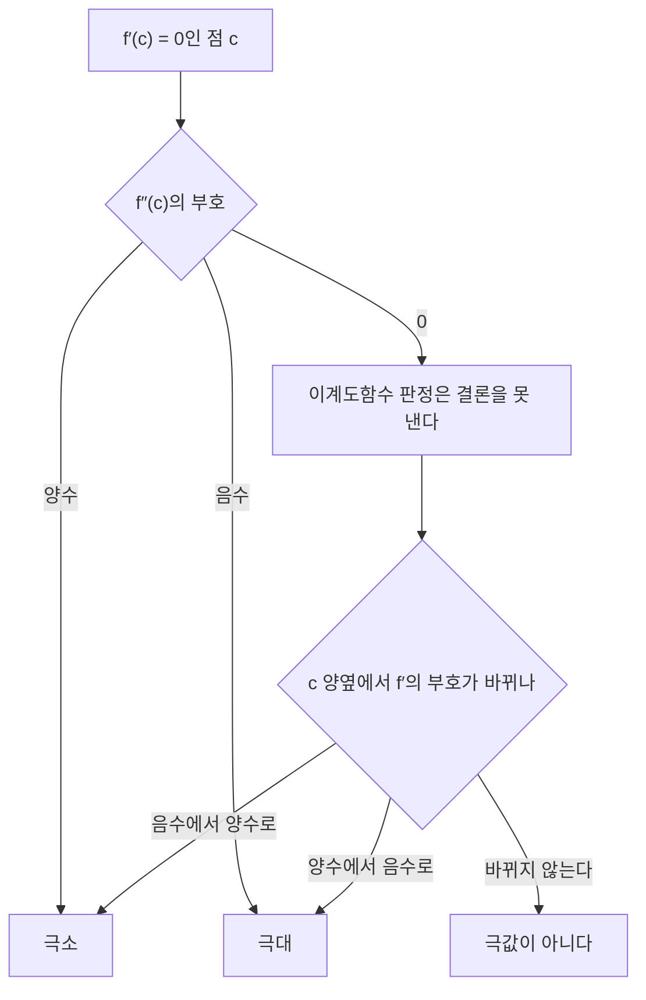



요약

도함수의 부호가 함수가 오르는지 내리는지 알려 주고, 도함수가 0이 되는 곳이 봉우리나 골짜기의 후보다. 이계도함수는 곡선이 그릇 모양인지 뒤집힌 그릇 모양인지 알려 준다. 이 둘로 "비용은 가장 작게, 이익은 가장 크게" 하는 값을 찾는다. 다만 도함수가 0인 곳이 늘 최대·최소는 아니고, 구간의 끝이나 꺾인 곳도 후보라서 함께 따져야 한다.

## 예시로 보기

한 변이 12 cm인 정사각형 철판의 네 귀퉁이에서 한 변 $$x$$인 정사각형을 잘라 내고 접어 뚜껑 없는 상자를 만든다. 부피는 $$V(x) = x(12 - 2x)^2$$이고, $$0 < x < 6$$이다.

| $$x$$ (cm) | 1 | 2 | 3 | 4 | 5 |
|---|---|---|---|---|---|
| $$V(x)$$ (cm³) | 100 | **128** | 108 | 64 | 20 |

너무 조금 잘라도, 너무 많이 잘라도 부피가 작다. 가장 큰 곳에서 그래프는 평평해진다. 도함수 $$V'(x) = (12 - 2x)(12 - 6x)$$는 $$x = 2$$에서 0이고, 그 왼쪽에서 양수(오름), 오른쪽에서 음수(내림)다. 부피가 아래의 목적함수, $$x = 2$$가 임계점이다.

점은 표의 다섯 값이다. 초록 칸에서는 곡선이 오르고 주황 칸에서는 내린다. 두 칸이 바뀌는 $$x = 2$$에서 접선이 수평(점선)이 된다[^s2].

## 정의

정의

- $$f'(c) = 0$$이거나 $$f'(c)$$가 없는 정의역 안의 점 $$c$$를 **임계점**이라 한다[^1].
- 이계도함수 $$f''$$가 양수인 구간에서 그래프는 아래로 볼록(위로 열린 그릇, concave up), 음수이면 위로 볼록(concave down)이다. 볼록성이 바뀌는 점이 변곡점이다.

정리

1. **페르마 정리:** $$f$$가 내부의 점 $$c$$에서 극값을 갖고 미분 가능하면 $$f'(c) = 0$$이다.
2. **증감 판정:** 구간에서 $$f' > 0$$이면 증가, $$f' < 0$$이면 감소한다.
3. **이계도함수 판정:** $$f'(c) = 0$$이고 $$f''(c) > 0$$이면 극소, $$f''(c) < 0$$이면 극대다. $$f''(c) = 0$$이면 판정하지 못한다.
4. **닫힌 구간의 최대·최소:** $$[a, b]$$에서 연속인 $$f$$의 최댓값·최솟값은 임계점과 두 끝점 중에서 나온다[^1].

이계도함수가 0이면 판정을 미루고, 도함수의 좌우 부호로 돌아가 다시 가른다[^s3].

증명

1. 극대라 하자. $$h > 0$$이면 $$f(c + h) - f(c) \le 0$$이라 $$\frac{f(c+h) - f(c)}{h} \le 0$$, $$h < 0$$이면 같은 몫이 $$\ge 0$$이다. 두 한쪽 극한이 모두 $$f'(c)$$이므로 $$f'(c) \le 0$$이고 $$f'(c) \ge 0$$, 즉 $$f'(c) = 0$$.
2. [평균값 정리](/Hongs_Blog/studies/calculus/mean-value-theorem/)로 증명한다: $$x_1 < x_2$$이면 $$f(x_2) - f(x_1) = f'(c)(x_2 - x_1) > 0$$.
3. $$f'(c) = 0$$이고 $$f'' > 0$$이면 $$c$$ 근처에서 $$f'$$이 증가하므로 $$c$$ 왼쪽에서 음수, 오른쪽에서 양수다. 2로 $$f$$가 내려갔다 올라가 극소다.
4. [최대·최소 정리](/Hongs_Blog/studies/calculus/continuity/)로 최댓값이 어딘가에서 나온다. 내부의 점이면 1에 따라 임계점이고, 아니면 끝점이다. ∎

**이 기법을 알아보는 신호.** "가장 크게/작게", "최적", "비용을 최소화", 그리고 두 비용이 서로 반대로 움직이는 상충 관계(하나를 늘리면 다른 하나가 준다)가 보이면 목적함수를 세워 미분한다.

### 스스로 설명해 보기

1. 페르마 정리 증명에서 두 한쪽 극한의 부호가 반대인데 f'(c)는 왜 하나의 값인가?

미분 가능하다고 가정했으므로 두 한쪽 극한이 같은 값 $$f'(c)$$로 수렴한다. 한쪽은 0 이하, 다른 쪽은 0 이상이니 그 값은 0뿐이다.

2. 정리 4에서 끝점을 꼭 확인해야 하는 이유는?

페르마 정리는 **내부**의 점에만 적용된다. 끝점에서는 한쪽에서만 다가가므로 도함수가 0이 아니어도 최대·최소일 수 있다. $$x^2 - 2x$$를 $$[0, 3]$$에서 보면 최댓값 3은 끝점 $$x = 3$$에서 나온다.

이 기법의 핵심 아이디어는?

최댓값·최솟값 후보를 무한히 많은 점에서 유한 개(임계점과 끝점)로 줄이고, 그것들만 비교한다.

같은 방법을 쓰는 다른 상황은?

다변수 함수에서는 그래디언트가 0인 점이 후보가 된다([그래디언트와 방향도함수](/Hongs_Blog/studies/calculus/gradient/), [헤세 행렬과 극값 판정](/Hongs_Blog/studies/calculus/hessian/)). 제약이 있으면 [라그랑주 승수법](/Hongs_Blog/studies/calculus/lagrange-multipliers/)으로 후보를 찾는다.

## 예제

**체크포인트 간격.** 긴 계산을 $$T$$분마다 저장(비용 $$C$$분)한다. 평균 $$M$$분마다 고장이 나면, 고장 때 잃는 계산은 평균 $$T/2$$분이다. 시간당 낭비율은 대략 $$W(T) = \frac{C}{T} + \frac{T}{2M}$$이다[^s1].

1. *목적함수와 범위:* $$W(T)$$, $$T > 0$$.
2. *임계점:* $$W'(T) = -\frac{C}{T^2} + \frac{1}{2M} = 0$$에서 $$T^* = \sqrt{2CM}$$.
3. *판정:* $$W''(T) = \frac{2C}{T^3} > 0$$이라 극소이고, 임계점이 하나뿐이라 최소다.
4. *해석:* $$C = 5$$분, $$M = 1440$$분(하루)이면 $$T^* = \sqrt{14400} = 120$$분. 저장이 싸거나 고장이 잦을수록 자주 저장한다.

주황 곡선(저장 비용)은 $$T$$가 커질수록 줄고, 초록 직선(잃는 계산)은 커질수록 는다. 둘을 더한 파란 곡선은 두 선이 만나는 $$T = 120$$에서 가장 낮다[^s2].

연습: [최적화 문제 예제 사다리](/Hongs_Blog/studies/calculus/optimization-ladder/)

검증: 상자의 최댓값 128을 격자 탐색으로, $$T^* = 120$$, $$x^3$$의 반례, 울타리·원통·$$a/n + bn$$의 최적값, 끝점이 최대인 예 — [07_curve-analysis_verify.py](/Hongs_Blog/studies/calculus/code/07_curve-analysis_verify/)

## 활용

- **상충 관계의 균형.** "고정 비용 ÷ 크기 + 크기에 비례하는 비용" 꼴 $$\frac{a}{n} + bn$$은 $$n = \sqrt{a/b}$$에서 최소다. 체크포인트 간격, 묶음(batch) 크기, 캐시 교체 주기 같은 문제가 이 모양이다.
- **머신러닝.** 손실 함수의 최솟값을 찾는 것이 학습이다. 변수가 수백만 개라 방정식 $$f' = 0$$을 직접 풀지 않고, 도함수 방향으로 조금씩 움직이는 [경사 하강법](/Hongs_Blog/studies/calculus/gradient-descent/)을 쓴다.
- **그래프 그리기.** 증감표(도함수의 부호)와 볼록성(이계도함수의 부호)으로 그래프의 모양을 계산 없이 그린다.

## 연결

- 선수: [연쇄 법칙](/Hongs_Blog/studies/calculus/chain-rule/), [연속과 사잇값 정리](/Hongs_Blog/studies/calculus/continuity/)(최대·최소 정리)
- 이어지는 개념: [평균값 정리](/Hongs_Blog/studies/calculus/mean-value-theorem/)(증감 판정의 증명), [헤세 행렬](/Hongs_Blog/studies/calculus/hessian/)과 [경사 하강법](/Hongs_Blog/studies/calculus/gradient-descent/)

## 자주 하는 오해

"f'(x) = 0이면 그 점은 극값이다"

틀렸다. 봉우리와 골짜기에서 그래프가 평평해지니 거꾸로도 될 것 같다. 페르마 정리는 "극값이면 $$f' = 0$$"이지 그 역이 아니다. $$f(x) = x^3$$은 $$f'(0) = 0$$이지만 0 왼쪽에서도 오른쪽에서도 오르기만 해서 극값이 아니다. 도함수가 0인 점은 후보일 뿐이고, 좌우 부호 변화나 이계도함수로 판정해야 한다.

## 과목별 관점

**수치해석 (2-2학기).** 최적화를 "함수의 극대·극소를 찾는 방법"으로 시작한다. $$x = p$$를 포함하는 열린 구간이 있어 그 안의 모든 $$x$$에서 $$f(x) \ge f(p)$$이면 $$f(p)$$가 극솟값이다. 극대도 같은 방식이다[^n1]. 극값이 생기는 곳은 $$f'(p) = 0$$이거나 $$f'$$이 없는 점이고, 1계 도함수 판정(부호가 바뀌는지)과 2계 도함수 판정($$f'(p) = 0$$이고 $$f''(p) > 0$$이면 극소, $$f''(p) < 0$$이면 극대)으로 가른다[^n2].

슬라이드의 예 $$f(x) = x^3 + x^2 - x + 1$$($$[-2, 2]$$)은 $$f'(x) = (3x - 1)(x + 1)$$, $$f''(x) = 6x + 2$$다. $$x = \frac13$$에서 $$f'' = 4 > 0$$이라 극소, $$x = -1$$에서 $$f'' = -4 < 0$$이라 극대다[^n3]. 극솟값 $$\frac{22}{27}$$이 구간 전체의 최솟값은 아니다. 끝점 $$f(-2) = -1$$이 더 작다[^sn1].

도함수를 쓸 수 없거나 계산하기 어려울 때는 함수 값만 비교해 구간을 좁히는 방법을 쓴다([황금분할 탐색](/Hongs_Blog/studies/numerical-analysis/golden-section-search/), [피보나치 탐색](/Hongs_Blog/studies/numerical-analysis/fibonacci-search/))[^n4].

## 확인 문제

**C1** 닫힌 구간 [a, b]에서 연속함수의 최댓값·최솟값을 찾는 절차를 쓰라.

**답:** (1) 구간 안의 임계점($$f' = 0$$이거나 $$f'$$이 없는 점)을 찾는다. (2) 임계점과 두 끝점에서 함숫값을 계산한다. (3) 그중 가장 큰 값이 최댓값, 가장 작은 값이 최솟값이다.

**C2** 한 변 12 cm인 정사각형 철판의 귀퉁이에서 한 변 x인 정사각형을 잘라 만든 뚜껑 없는 상자의 부피를 최대로 하는 x와 그 부피는?

**답:** $$V = x(12 - 2x)^2$$, $$V' = (12 - 2x)(12 - 6x) = 0$$에서 $$x = 2$$($$x = 6$$은 부피 0인 끝). $$V(2) = 128$$ cm³.

**C3** 도함수가 0이지만 극값이 아닌 점의 예를 들고, 어떻게 확인하는지 쓰라.

**답:** $$x^3$$의 $$x = 0$$. 0 근처 왼쪽에서 $$f < 0$$, 오른쪽에서 $$f > 0$$이라 봉우리도 골짜기도 아니다. 도함수 $$3x^2$$의 부호가 0을 지나도 바뀌지 않는다(늘 0 이상).

**C4** f(x) = x² − 2x의 [0, 3]에서의 최댓값을 구하라. 임계점만 보면 왜 틀리는가?

**답:** 임계점 $$x = 1$$에서 $$-1$$, 끝점에서 $$f(0) = 0$$, $$f(3) = 3$$. 최댓값은 끝점의 3이다. 임계점 $$x = 1$$은 최솟값이다. 페르마 정리는 내부 점에만 해당해서, 끝점의 최대는 도함수가 0이 아니어도 생긴다.

**C5** $$f(x) = x^3 - 3x$$의 임계점을 2계 도함수 판정으로 분류하라.

**답:** $$f'(x) = 3x^2 - 3 = 0$$에서 $$x = \pm1$$. $$f''(x) = 6x$$라 $$f''(1) = 6 > 0$$으로 극소($$f(1) = -2$$), $$f''(-1) = -6 < 0$$으로 극대($$f(-1) = 2$$)[^sn1].

[^1]: OpenStax, *Calculus Volume 1*, 4.3절 "Maxima and Minima"(임계점, 페르마 정리, 닫힌 구간 방법), 4.5절 "Derivatives and the Shape of a Graph"(증감·볼록성·이계도함수 판정), 4.7절 "Applied Optimization Problems"
[^s1]: 보충 이 비용 모형과 최적 간격 $$\sqrt{2CM}$$은 Young, "A first order approximation to the optimum checkpoint interval", *Communications of the ACM* 17(9), 1974의 결과다. 고장이 드물고 저장 비용이 작을 때의 1차 근사다.
[^n1]: 수치해석 14회 강의 자료 「na14_optimization」, p.2~4
[^n2]: 같은 자료, p.5~7
[^n3]: 같은 자료, p.8
[^n4]: 같은 자료, p.9
[^sn1]: 보충 끝점 값과 비교, 카드 C5는 원본에 없다. 07_curve-analysis_verify.py로 확인했다.
[^s2]: 보충 그림 두 장은 원본에 없다. [07_curve-analysis_plot.py](/Hongs_Blog/studies/calculus/code/07_curve-analysis_plot/)로 그렸고, 표의 부피 100, 128, 108, 64, 20, 격자 탐색으로 찾은 최댓값 128($$x = 2$$), 도함수의 부호, $$C = 5$$, $$M = 1440$$에서 $$T^* = 120$$을 같은 코드로 확인했다.
[^s3]: 보충 다이어그램 1개는 원본에 없다. 정리 2(증감 판정), 정리 3(이계도함수 판정), 자주 하는 오해의 "좌우 부호 변화나 이계도함수로 판정", 과목별 관점의 1계 도함수 판정을 근거로 그렸다.

