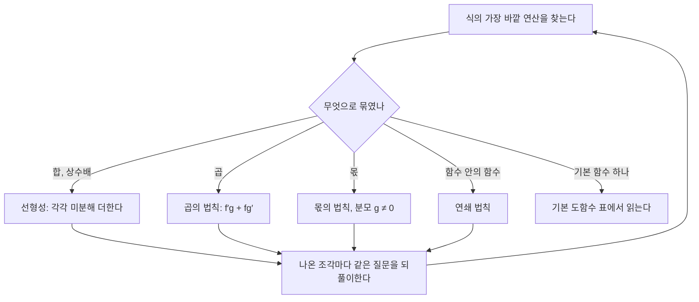



요약

모든 함수를 극한의 정의로 미분할 필요는 없다. 거듭제곱·지수·로그·삼각함수 몇 가지의 도함수와, 합·곱·몫을 미분하는 규칙만 있으면 대부분의 식을 기계적으로 미분한다. 이 규칙들이 컴퓨터가 식을 자동으로 미분하는 방법의 기본 부품이다. 다만 곱의 미분은 각 도함수의 곱이 아니다.

## 예시로 보기

$$x^2 e^x$$을 미분한다. 두 함수의 곱이라 곱의 미분법을 쓴다. "앞을 미분하고 뒤는 그대로" 더하기 "앞은 그대로 뒤를 미분"이다.

$$(x^2 e^x)' = (x^2)'\,e^x + x^2\,(e^x)' = 2x e^x + x^2 e^x = (2x + x^2)e^x$$

넓이로 보면 이해가 쉽다. 가로 $$f$$, 세로 $$g$$인 직사각형의 넓이 $$fg$$가 조금 변할 때, 가로가 늘어 생긴 띠 $$f'g$$와 세로가 늘어 생긴 띠 $$fg'$$가 더해진다. 모서리의 작은 조각은 $$h^2$$ 크기라 극한에서 사라진다.

입력이 $$h$$만큼 늘면 가로는 $$\Delta f \approx f'h$$, 세로는 $$\Delta g \approx g'h$$만큼 는다. 늘어난 넓이를 $$h$$로 나누면 주황 띠는 $$f'g$$, 초록 띠는 $$fg'$$로 남고, 보라 모서리만 0으로 줄어든다[^s1].

## 정의

기본 도함수와 법칙

| 함수 | 도함수 | 조건 |
|---|---|---|
| $$c$$ (상수) | $$0$$ | |
| $$x^r$$ | $$r x^{r-1}$$ | $$r$$은 실수, $$x > 0$$ (정수 $$r$$이면 모든 $$x$$) |
| $$e^x$$ | $$e^x$$ | |
| $$a^x$$ | $$a^x \ln a$$ | $$a > 0$$ |
| $$\ln x$$ | $$1/x$$ | $$x > 0$$ |
| $$\sin x$$, $$\cos x$$ | $$\cos x$$, $$-\sin x$$ | $$x$$는 **라디안** |
| $$\tan x$$ | $$\sec^2 x = 1/\cos^2 x$$ | $$\cos x \ne 0$$ |

**법칙**[^1]: $$(af + bg)' = af' + bg'$$ (선형성), $$\ (fg)' = f'g + fg'$$ (곱), $$\ \left(\dfrac{f}{g}\right)' = \dfrac{f'g - fg'}{g^2}$$ ($$g \ne 0$$, 몫)

증명

1. *거듭제곱(양의 정수 $$n$$):* $$(x+h)^n = x^n + n x^{n-1}h + (h^2 \text{ 이상의 항})$$(이항정리)이므로 몫은 $$n x^{n-1} + (h \text{를 곱한 항}) \to n x^{n-1}$$.
2. *곱:* $$f(x+h)g(x+h) - f(x)g(x) = [f(x+h) - f(x)]g(x+h) + f(x)[g(x+h) - g(x)]$$. $$h$$로 나누고 극한을 취하면 $$g(x+h) \to g(x)$$(미분 가능하면 연속)라서 $$f'g + fg'$$.
3. *$$e^x$$:* $$\frac{e^{x+h} - e^x}{h} = e^x \cdot \frac{e^h - 1}{h}$$이고 $$\frac{e^h - 1}{h} \to 1$$이다. 이것이 [지수함수](/Hongs_Blog/studies/college-math/exponential-function/)에서 본 "$$e$$는 $$x = 0$$에서 기울기가 1인 밑"이라는 성질이다.
4. *$$\sin x$$:* 덧셈정리로 $$\frac{\sin(x+h) - \sin x}{h} = \sin x \cdot \frac{\cos h - 1}{h} + \cos x \cdot \frac{\sin h}{h} \to \sin x \cdot 0 + \cos x \cdot 1$$. 두 극한은 $$h$$가 라디안일 때의 값이다.
5. *$$\ln x$$와 $$a^x$$, 실수 지수, 몫:* [연쇄 법칙](/Hongs_Blog/studies/calculus/chain-rule/)에서 증명한다. ∎

## 예제

$$\left(\dfrac{x + 1}{x - 1}\right)'$$을 구한다.

1. *구조 보기:* 몫이다. $$f = x + 1$$, $$g = x - 1$$.
2. *각각 미분:* $$f' = 1$$, $$g' = 1$$.
3. *몫의 법칙:* $$\dfrac{1 \cdot (x - 1) - (x + 1) \cdot 1}{(x - 1)^2} = \dfrac{-2}{(x - 1)^2}$$.
4. *확인:* 함수가 $$x > 1$$에서 줄어드는 모양($$x = 2$$에서 3, $$x = 3$$에서 2)과 도함수가 음수인 것이 맞는다.

예제의 1단계 "구조 보기"가 맨 위 질문이다. 법칙을 한 번 쓰면 더 작은 조각의 도함수가 필요해진다. 조각마다 같은 질문을 던지다 보면 결국 기본 도함수 표에 닿는다[^s2].

검증: 기본 도함수 7가지와 곱·몫 법칙, 두 예제를 무작위 3,000점에서 중앙 차분과 비교(실험으로 확인됨. 증명은 위), 도 단위 사인의 도함수, 세 기본 극한 — [05_differentiation-rules_verify.py](/Hongs_Blog/studies/calculus/code/05_differentiation-rules_verify/)

## 활용

- **자동미분의 부품.** 딥러닝 라이브러리는 덧셈, 곱셈, `exp`, `log`, `sin` 같은 기본 연산마다 이 표의 도함수를 구현해 두고, 복잡한 식은 [연쇄 법칙](/Hongs_Blog/studies/calculus/chain-rule/)으로 조립한다.
- **왜 라디안인가.** 각을 도로 재면 $$\frac{d}{dx}\sin(x°) = \frac{\pi}{180}\cos(x°)$$로 성가신 상수가 붙는다. 라디안에서만 $$\sin' = \cos$$이 깔끔하다. 수학 라이브러리가 라디안을 쓰는 이유다([각과 라디안](/Hongs_Blog/studies/college-math/radian/)).
- **기호 미분.** SymPy 같은 기호 계산 도구는 이 표와 법칙을 식에 규칙적으로 적용해 도함수 식을 만든다.

## 연결

- 선수: [도함수](/Hongs_Blog/studies/calculus/derivative/), [로그](/Hongs_Blog/studies/college-math/logarithm/), [삼각함수 항등식](/Hongs_Blog/studies/college-math/trig-identities/)(사인의 도함수 증명)
- 이어지는 개념: [연쇄 법칙](/Hongs_Blog/studies/calculus/chain-rule/)

## 자주 하는 오해

"(fg)' = f'g'"

틀렸다. 합의 미분이 $$(f + g)' = f' + g'$$라서 곱도 같은 모양일 것 같다. $$f = g = x$$이면 $$(x \cdot x)' = (x^2)' = 2x$$인데 $$f'g' = 1 \cdot 1 = 1$$이다. 직사각형 넓이의 변화를 떠올리면, 가로와 세로가 **각각** 늘어난 두 띠를 더해야 한다: $$(fg)' = f'g + fg'$$.

## 확인 문제

**C1** 곱의 미분법과 몫의 미분법을 쓰라.

**답:** $$(fg)' = f'g + fg'$$, $$\left(\frac{f}{g}\right)' = \frac{f'g - fg'}{g^2}$$.

**흔한 오답:** 몫의 법칙 분자의 순서를 바꿔 $$fg' - f'g$$로 쓰는 것. $$f = x$$, $$g = 1$$로 확인하면 $$1$$이 나와야 한다.

**C2** (a) x² eˣ (b) (x + 1)/(x − 1)을 미분하라.

**답:** (a) $$(2x + x^2)e^x$$. (b) $$\frac{-2}{(x-1)^2}$$.

**C3** sin x의 도함수가 cos x가 되려면 x를 왜 라디안으로 재야 하는가?

**답:** 증명에 쓰는 극한 $$\frac{\sin h}{h} \to 1$$이 $$h$$가 라디안일 때의 값이다. 도로 재면 $$\sin(h°) = \sin(\frac{\pi h}{180})$$이라 극한이 $$\frac{\pi}{180}$$이 되고, 도함수에 그 상수가 붙는다.

[^1]: OpenStax, *Calculus Volume 1*, 3.3절 "Differentiation Rules", 3.5절 "Derivatives of Trigonometric Functions", 3.9절 "Derivatives of Exponential and Logarithmic Functions"
[^s1]: 보충 그림은 원본에 없다. [05_differentiation-rules_plot.py](/Hongs_Blog/studies/calculus/code/05_differentiation-rules_plot/)로 그렸다. 늘어난 양은 잘 보이게 크게 잡았다. 늘어난 넓이가 두 띠와 모서리의 합인 것, $$f = x^2$$, $$g = e^x$$, $$x = 1$$에서 모서리를 $$h$$로 나눈 값이 0으로 가는 것, $$(x^2e^x)' = (2x + x^2)e^x$$를 같은 코드로 확인했다.
[^s2]: 보충 다이어그램 1개는 원본에 없다. 정의 절의 기본 도함수 표와 법칙, 예제의 풀이 순서, [연쇄 법칙](/Hongs_Blog/studies/calculus/chain-rule/)을 근거로 그렸다.

