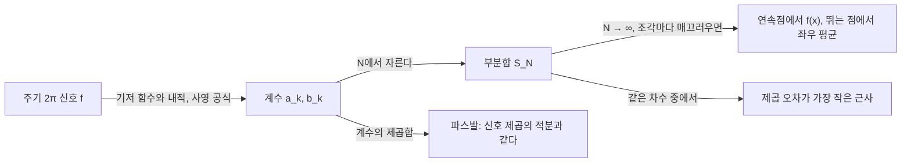



요약

반복되는 신호는 아무리 모양이 복잡해도, 기본 주파수와 그 정수배 주파수 사인파들을 알맞은 세기로 더해 만들 수 있다. 각 사인파의 세기는 신호가 그 사인파와 "얼마나 닮았는가"로 구하는데, 벡터를 서로 수직인 축들로 분해할 때 축마다 그림자 길이를 재는 것과 똑같은 계산이다. 신호에 뚝 끊기는 점이 있으면 항을 아무리 늘려도 그 근처에서 약 9%만큼 튀어 오르는 흔적(깁스 현상)이 남는다.

## 예시로 보기

주기가 $$2\pi$$이고, 반 주기는 $$+1$$, 반 주기는 $$-1$$인 사각파를 사인파로 만든다.

$$\text{사각파} = \frac{4}{\pi}\left(\sin x + \frac{\sin 3x}{3} + \frac{\sin 5x}{5} + \cdots\right).$$

| 더한 항 | 모양 |
|---|---|
| $$\frac4\pi\sin x$$ | 둥근 물결, 높이 약 1.27 |
| $$+\frac{4}{3\pi}\sin 3x$$ | 꼭대기가 눌리며 평평해지기 시작 |
| 홀수 항 수십 개 | 거의 사각형. 모서리 옆에 작은 뿔이 남는다 |

사인파 $$\sin kx$$가 아래 정의의 기저 함수, 앞의 수 $$\frac{4}{\pi k}$$가 푸리에 계수 $$b_k$$다. 짝수 번째 계수는 모두 0이다. 사각파는 $$x$$를 $$\pi$$만큼 옮기면 부호만 바뀌는데, 짝수 주파수 사인파는 그렇지 않아 닮은 정도가 0이기 때문이다.

파랑(첫 항 하나)은 둥근 물결로 높이 1.27까지 넘친다. 주황(두 항)은 꼭대기가 눌려 두 봉우리로 갈라진다. 초록(26항)은 거의 사각형인데, 뛰는 점 0과 $$\pm\pi$$ 바로 옆에 작은 뿔이 남는다[^s2].

## 정의

[벡터의 내적](/Hongs_Blog/studies/linear-algebra/orthogonal-projection/)을 함수로 넓혀, 주기 $$2\pi$$인 두 함수의 내적을 $$\langle f, g\rangle = \int_{-\pi}^{\pi}f(x)g(x)\,dx$$($$\int$$는 넓이를 구하는 적분 기호)로 둔다. 그러면 $$1, \cos x, \sin x, \cos 2x, \sin 2x, \dots$$는 서로 수직이다. 서로 다른 둘의 내적은 0이고, $$\langle\sin kx, \sin kx\rangle = \langle\cos kx, \cos kx\rangle = \pi$$ ($$k \ge 1$$), $$\langle 1, 1\rangle = 2\pi$$다[^1].

정의

구간 $$[-\pi, \pi]$$에서 적분 가능한 주기 $$2\pi$$ 함수 $$f$$의 **푸리에 계수**는

$$a_0 = \frac{1}{2\pi}\int_{-\pi}^{\pi}f\,dx,\qquad a_k = \frac1\pi\int_{-\pi}^{\pi}f(x)\cos kx\,dx,\qquad b_k = \frac1\pi\int_{-\pi}^{\pi}f(x)\sin kx\,dx\quad(k \ge 1)$$

이고, **푸리에 급수**는 $$a_0 + \sum_{k=1}^{\infty}(a_k\cos kx + b_k\sin kx)$$다. 계수는 사영 공식 $$\frac{\langle f, \sin kx\rangle}{\langle\sin kx, \sin kx\rangle}$$ 그대로다. [오일러 공식](/Hongs_Blog/studies/college-math/euler-formula/)으로 묶으면 $$f \sim \sum_{k=-\infty}^{\infty}c_k e^{ikx}$$($$\sim$$는 "$$f$$를 오른쪽 급수로 나타낸다"는 뜻이다. 등호와 달리 모든 점에서 값이 같다는 보장은 없다), $$c_k = \frac{1}{2\pi}\int_{-\pi}^{\pi}f(x)e^{-ikx}dx$$로도 쓴다.

수렴과 파스발 항등식

1. **점별 수렴(디리클레):** $$f$$가 조각마다 매끄러우면(유한 개의 점을 빼면 $$f$$와 $$f'$$이 연속이고 그 점들에서 좌우 극한이 있으면), 푸리에 급수는 $$f$$가 연속인 점에서 $$f(x)$$로, 뛰는 점에서 좌우 극한의 평균 $$\frac{f(x^-) + f(x^+)}{2}$$로 수렴한다.
2. **파스발 항등식:** $$\int_{-\pi}^{\pi}f^2$$이 유한하면 $$\frac1\pi\int_{-\pi}^{\pi}f(x)^2\,dx = 2a_0^2 + \sum_{k=1}^{\infty}(a_k^2 + b_k^2)$$.
3. **최선 근사:** 차수 $$N$$ 이하 삼각다항식 가운데 $$\int_{-\pi}^{\pi}(f - p)^2$$을 가장 작게 하는 $$p$$는 급수를 $$N$$에서 자른 것이다.

[증명 생략: Stein·Shakarchi 2~3장.] 3은 [직교 사영](/Hongs_Blog/studies/linear-algebra/orthogonal-projection/)이 가장 가까운 점이라는 사실을 함수 공간에서 쓴 것이다[^2].

왼쪽에서 오른쪽으로 가며 신호를 계수로 나누고, 계수로 다시 쌓는다. 정리의 세 항목이 각각 화살표 하나에 붙어 있다[^s3].

## 예제

**톱니파와 바젤 문제.** $$f(x) = x$$ ($$-\pi < x < \pi$$)를 주기적으로 이은 톱니파.

1. *계수:* $$f$$가 홀함수라 $$a_k = 0$$. [부분적분](/Hongs_Blog/studies/calculus/integration-by-parts/)으로 $$\int_{-\pi}^{\pi}x\sin kx\,dx = \frac{2\pi(-1)^{k+1}}{k}$$이니 $$b_k = \frac{2(-1)^{k+1}}{k}$$.
2. *급수:* $$x = 2\left(\sin x - \frac{\sin 2x}{2} + \frac{\sin 3x}{3} - \cdots\right)$$ ($$-\pi < x < \pi$$).
3. *파스발:* 좌변 $$\frac1\pi\int_{-\pi}^{\pi}x^2dx = \frac{2\pi^2}{3}$$, 우변 $$\sum_k\frac{4}{k^2}$$.
4. *결론:* $$\sum_{k=1}^{\infty}\frac{1}{k^2} = \frac{\pi^2}{6}$$. [급수의 수렴](/Hongs_Blog/studies/calculus/series-convergence/)에서 값만 소개한 바젤 문제의 답이다.

**깁스 현상.** 사각파의 부분합은 뛰는 점 바로 옆에서 최댓값이 약 $$1.179$$다. $$\sin kx$$를 $$k = 51, 201, 801$$까지(0이 아닌 항 26개, 101개, 401개) 더해도 봉우리 높이는 그대로이고 폭만 좁아진다. 뛰는 폭 2의 약 9%를 넘어서는 셈이다[^s1]. 점별로는 수렴하지만(각 점을 고정하면 봉우리가 결국 지나간다), 모든 점에서 한꺼번에 가까워지지는 않는다.

뛰는 점 0의 오른쪽을 크게 확대했다. $$k$$를 51, 201, 801까지 더한 세 부분합의 첫 봉우리가 모두 점선 1.179에 닿는다. 차수를 올리면 봉우리가 0 쪽으로 좁게 밀려날 뿐 낮아지지 않는다[^s2].

검증: 삼각함수의 직교성($$m, n \le 6$$), 사각파와 톱니파의 계수, 연속점과 뛰는 점에서의 부분합, 깁스 봉우리 $$\approx 1.179$$(항 51·201·801개), 파스발에서 바젤 값, 라이프니츠 급수, 잘라낸 급수가 최선 제곱 근사임(계수를 흔들면 오차 증가) — [30_fourier-series_verify.py](/Hongs_Blog/studies/calculus/code/30_fourier-series_verify/)

## 활용

- **음향.** 악기 소리의 음색은 기본음 위에 얹힌 배음(정수배 주파수)의 세기 분포다. 신시사이저는 사인파를 더해 소리를 만들고, 이퀄라이저는 대역별 세기를 바꾼다.
- **압축.** JPEG는 $$8 \times 8$$ 블록마다 코사인만 쓰는 변형(이산 코사인 변환)으로 계수를 구하고 높은 주파수 계수를 거칠게 저장한다. MP3도 비슷한 코사인 변환(MDCT)을 쓴다. 대부분의 에너지가 낮은 주파수 몇 개에 몰린다는 것이 파스발 항등식으로 본 압축의 근거다[^s1].
- **계산.** 실제 데이터는 표본이 유한하므로 적분 대신 합을 쓰는 [이산 푸리에 변환](/Hongs_Blog/studies/linear-algebra/dft/)을 FFT로 계산한다.
- **흔한 실수.** 주기가 $$2\pi$$가 아닌 신호에 공식을 그대로 쓰는 것. 주기 $$T$$면 $$\sin\frac{2\pi k x}{T}$$로 바꾸고 계수 앞의 $$\frac1\pi$$도 $$\frac2T$$로 바꾼다.

## 연결

- 선수: [직교 사영](/Hongs_Blog/studies/linear-algebra/orthogonal-projection/)(계수 = 사영), [사인파](/Hongs_Blog/studies/college-math/sinusoid/), [부분적분](/Hongs_Blog/studies/calculus/integration-by-parts/)(계수 계산)
- 이산판: [이산 푸리에 변환과 FFT](/Hongs_Blog/studies/linear-algebra/dft/)
- 이어지는 개념: 주기가 없는 신호로 넓힌 [푸리에 변환과 합성곱](/Hongs_Blog/studies/calculus/fourier-transform/)

## 확인 문제

**C1** $$0 < x < \pi$$에서 1, $$-\pi < x < 0$$에서 $$-1$$인 사각파의 푸리에 계수 $$a_k$$, $$b_k$$를 구하라.

**답:** 홀함수라 $$a_k = 0$$. $$b_k = \frac2\pi\int_0^\pi\sin kx\,dx = \frac{2(1 - \cos k\pi)}{\pi k}$$. $$k$$가 홀수면 $$\frac{4}{\pi k}$$, 짝수면 0.

**C2** 계수 $$b_k$$를 구할 때 다른 모든 항이 사라지고 $$\sin kx$$의 계수만 남는 이유를 설명하라.

**답:** 급수 전체에 $$\sin kx$$를 곱해 $$[-\pi, \pi]$$에서 적분하면, 직교성 때문에 $$\sin kx$$와 다른 모든 항의 적분은 0이고 $$\sin kx \cdot \sin kx$$만 $$\pi$$로 남는다. 그래서 $$\int f\sin kx = \pi b_k$$다. 직교 기저에서 한 축의 좌표를 내적 한 번으로 읽는 것과 같다.

**C3** 톱니파 급수 $$x = 2\left(\sin x - \frac{\sin 2x}{2} + \frac{\sin 3x}{3} - \cdots\right)$$에 $$x = \frac\pi2$$를 넣어 $$1 - \frac13 + \frac15 - \cdots$$의 값을 구하라.

**답:** $$\sin\frac{k\pi}{2}$$는 $$k = 1, 3, 5, 7, \dots$$에서 $$1, -1, 1, -1, \dots$$이고 짝수 $$k$$에서 0이다. 그래서 $$\frac\pi2 = 2\left(1 - \frac13 + \frac15 - \cdots\right)$$, 곧 $$1 - \frac13 + \frac15 - \cdots = \frac\pi4$$(라이프니츠 급수). $$\frac\pi2$$는 연속점이라 급수가 함숫값으로 수렴한다.

[^1]: Strang, *Introduction to Linear Algebra* 5판, 10.5절 "Fourier Series: Linear Algebra for Functions"(함수의 내적, 직교성, 계수 = 사영).
[^2]: Stein, Shakarchi, *Fourier Analysis: An Introduction*, 2장 "Basic Properties of Fourier Series", 3장 "Convergence of Fourier Series"(평균제곱 수렴, 파스발 항등식, 최선 근사).
[^s1]: 보충 깁스 봉우리의 극한은 $$\frac2\pi\int_0^\pi\frac{\sin t}{t}dt \approx 1.17898$$이고, 30_fourier-series_verify.py로 부분합의 최댓값과 함께 계산했다. JPEG의 $$8 \times 8$$ 이산 코사인 변환은 JPEG 표준(ITU-T T.81)에, MP3의 MDCT는 MPEG-1 Audio Layer III 표준에 정의되어 있다.
[^s2]: 보충 그림 두 장은 원본에 없다. [30_fourier-series_plot.py](/Hongs_Blog/studies/calculus/code/30_fourier-series_plot/)로 그렸고, 첫 항의 높이 $$\frac4\pi \approx 1.27$$, 깁스 상수 1.17898, $$k \le 51, 201, 801$$인 부분합의 봉우리가 모두 그 값에서 0.005 안인 것, $$x = \frac\pi2$$에서 부분합이 1로 가는 것을 같은 코드로 확인했다.
[^s3]: 보충 다이어그램 1개는 원본에 없다. 정의 절의 계수 공식(사영 공식)과 정리의 세 항목(점별 수렴, 파스발 항등식, 최선 근사)을 근거로 그렸다.

