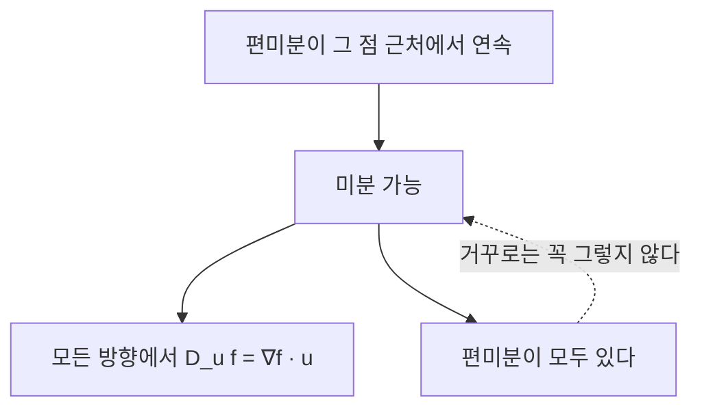



요약

편미분들을 한데 모은 화살표가 그래디언트다. 이 화살표는 산에서 가장 가파르게 오르는 방향을 가리키고, 그 길이가 그 방향의 기울기다. 다른 방향으로 갈 때의 기울기는 그 방향과 그래디언트의 내적으로 바로 계산되고, 그래디언트는 늘 등고선과 수직이다. 그래서 반대 방향으로 조금씩 내려가는 것이 기계학습의 경사 하강법이다. 다만 이 모든 성질은 함수가 매끄러울(미분 가능할) 때만 맞고, 편미분이 있다는 것만으로는 부족하다.

## 예시로 보기

높이가 $$f(x, y) = 10 - x^2 - 2y^2$$인 언덕의 점 $$(1, 1)$$에 서 있다(높이 7). 편미분은 $$f_x = -2x = -2$$, $$f_y = -4y = -4$$이라 그래디언트는 $$\nabla f(1, 1) = (-2, -4)$$다.

| 가는 방향(단위벡터) | 기울기 $$\nabla f \cdot \mathbf{u}$$ |
|---|---|
| 동쪽 $$(1, 0)$$ | $$-2$$ (내려감) |
| 북쪽 $$(0, 1)$$ | $$-4$$ |
| $$\nabla f$$ 방향 $$\frac{1}{\sqrt5}(-1, -2)$$ | $$\sqrt{20} \approx 4.47$$ (가장 가파르게 오름) |
| 등고선 방향 $$\frac{1}{\sqrt5}(2, -1)$$ | $$0$$ (높이 그대로) |

그래디언트 방향이 정상(원점) 쪽을 가리키고, 그와 수직인 방향은 등고선 $$x^2 + 2y^2 = 3$$을 따라간다. 방향 $$\mathbf{u}$$가 아래 정의의 방향도함수의 방향이다.

초록 굵은 선이 $$(1, 1)$$이 놓인 높이 7의 등고선이다. 주황 화살표($$\nabla f$$ 방향)는 그 선에 수직으로 안쪽을 향한다. 정상을 곧장 겨누지는 않고, 등고선이 더 촘촘한 $$y$$ 쪽으로 더 기운다. 초록 화살표 두 개(등고선 방향)로 걸으면 높이가 그대로다[^s2].

## 정의

정의

- $$f: \mathbb{R}^n \to \mathbb{R}$$($$\mathbb{R}$$은 실수 전체, $$\mathbb{R}^n$$은 실수 $$n$$개짜리 목록 전체)의 **그래디언트**는 편미분을 모은 벡터 $$\nabla f = \left(\frac{\partial f}{\partial x_1}, \dots, \frac{\partial f}{\partial x_n}\right)$$이다.
- 단위벡터 $$\mathbf{u}$$ 방향의 **방향도함수**는 $$D_{\mathbf{u}}f(\mathbf{a}) = \lim_{h \to 0}\frac{f(\mathbf{a} + h\mathbf{u}) - f(\mathbf{a})}{h}$$($$\lim$$은 한없이 가까이 갈 때 다가가는 값(극한))이다.
- $$f$$가 $$\mathbf{a}$$에서 **미분 가능**하다는 것은 $$f(\mathbf{a} + \mathbf{h}) = f(\mathbf{a}) + \nabla f(\mathbf{a})\cdot\mathbf{h} + r(\mathbf{h})$$로 쓸 때 $$\frac{r(\mathbf{h})}{\Vert \mathbf{h}\Vert } \to 0$$($$\mathbf{h} \to \mathbf{0}$$)이라는 뜻이다. 한 점에서 편미분들이 모두 연속이면 미분 가능하다[^1].

미분 가능성은 [한 변수 도함수](/Hongs_Blog/studies/calculus/derivative/)의 "선형 근사가 잘 맞는다"를 여러 변수로 옮긴 것이다. 그래프에서는 그 점에 접평면이 있다는 뜻이다.

그래디언트의 성질

$$f$$가 $$\mathbf{a}$$에서 미분 가능하면
1. 모든 단위벡터 $$\mathbf{u}$$에 대해 $$D_{\mathbf{u}}f(\mathbf{a}) = \nabla f(\mathbf{a})\cdot\mathbf{u}$$.
2. $$\nabla f(\mathbf{a}) \ne \mathbf{0}$$이면 방향도함수가 가장 큰 방향은 $$\frac{\nabla f}{\Vert \nabla f\Vert }$$이고 그 값은 $$\Vert \nabla f\Vert $$, 가장 작은 방향은 $$-\frac{\nabla f}{\Vert \nabla f\Vert }$$이고 값은 $$-\Vert \nabla f\Vert $$다.
3. $$\nabla f(\mathbf{a})$$는 $$\mathbf{a}$$를 지나는 등고선(등위면)에 수직이다.

## 증명

미분 가능성의 선형 근사에 $$\mathbf{h} = t\mathbf{u}$$를 넣고, 내적의 기하적 의미를 쓴다.

증명 펼치기

1. *방향도함수:* $$\mathbf{h} = t\mathbf{u}$$로 두면 $$\frac{f(\mathbf{a} + t\mathbf{u}) - f(\mathbf{a})}{t} = \nabla f\cdot\mathbf{u} + \frac{r(t\mathbf{u})}{t}$$. $$\Vert t\mathbf{u}\Vert  = \vert t\vert $$라 마지막 항의 크기는 $$\frac{\vert r(t\mathbf{u})\vert }{\Vert t\mathbf{u}\Vert } \to 0$$이다.
2. *가장 가파른 방향:* [내적](/Hongs_Blog/studies/linear-algebra/dot-product/)으로 $$\nabla f\cdot\mathbf{u} = \Vert \nabla f\Vert \Vert \mathbf{u}\Vert \cos\theta = \Vert \nabla f\Vert \cos\theta$$. $$\cos\theta$$는 $$\theta = 0$$(같은 방향)에서 1로 가장 크고, $$\theta = \pi$$에서 $$-1$$로 가장 작다.
3. *등고선과 수직:* 등고선 위를 움직이는 곡선 $$\mathbf{c}(t)$$에서 $$f(\mathbf{c}(t)) = $$ 일정이다. 미분하면([다변수 연쇄 법칙](/Hongs_Blog/studies/calculus/multivariable-chain-rule/)) $$\nabla f\cdot\mathbf{c}'(t) = 0$$이라, 그래디언트가 등고선의 접선 방향과 수직이다. ∎

### 스스로 설명해 보기

1. 1단계에서 미분 가능성의 조건 $$\frac{r(\mathbf{h})}{\Vert \mathbf{h}\Vert } \to 0$$이 필요한 이유는?

나머지 $$r$$이 $$\mathbf{h}$$보다 빨리 0으로 가야 $$\frac{r(t\mathbf{u})}{t}$$가 사라진다. 편미분이 있다는 것은 축 방향 $$\mathbf{u} = \mathbf{e}_i$$에서만 이것을 보장하고, 다른 방향은 보장하지 않는다.

2. 2단계에서 $$\Vert \mathbf{u}\Vert  = 1$$이 왜 중요한가?

방향도함수는 "한 걸음(길이 1) 갈 때의 변화"라 방향벡터의 길이를 1로 맞춘다. 길이가 2인 벡터를 넣으면 기울기가 두 배로 나와 방향끼리 공정하게 비교할 수 없다.

이 정리의 핵심 아이디어는?

미분 가능한 함수는 가까이서 보면 평면(선형 함수)이고, 선형 함수의 방향별 기울기는 한 벡터와의 내적이다. 내적은 같은 방향일 때 가장 크다.

같은 아이디어를 쓰는 다른 상황은?

[퍼셉트론](/Hongs_Blog/studies/human-interface-media/perceptron/)의 $$\mathbf{w}^\top\mathbf{x} + b$$는 선형 함수라 그래디언트가 $$\mathbf{w}$$이고, 결정 경계(등고선 $$= 0$$)와 $$\mathbf{w}$$가 수직이다.

## 가정이 필요한 이유

| 가정 | 없으면 | 예 |
|---|---|---|
| 미분 가능(편미분의 존재보다 강함) | $$D_{\mathbf{u}}f \ne \nabla f\cdot\mathbf{u}$$일 수 있다 | $$f = \frac{x^2y}{x^2 + y^2}$$, $$f(0, 0) = 0$$: 원점의 편미분은 0이라 $$\nabla f = \mathbf{0}$$인데, 대각 방향 $$\mathbf{u} = \frac{1}{\sqrt2}(1, 1)$$의 방향도함수는 $$\frac{1}{2\sqrt2} \ne 0$$ |

**충분조건.** 편미분이 그 점 근처에서 연속이면 미분 가능하다. 위 예의 편미분은 원점에서 연속이 아니다[^1].

실선은 늘 맞는 방향이다. 편미분이 있다는 것만으로는 점선을 거슬러 올라갈 수 없다(표의 반례). 그래서 공식을 쓰기 전에 맨 위 상자, 곧 편미분의 연속을 확인한다[^s3].

## 예제

**이미지 윤곽의 방향.** 밝기가 $$i(x, y) = 3x + 4y$$로 변하는 이미지 조각이 있다.

1. *그래디언트:* $$\nabla i = (3, 4)$$, 크기 5.
2. *의미:* 밝기는 $$(3, 4)$$ 방향으로 가장 빨리(한 픽셀에 5씩) 밝아진다.
3. *윤곽선:* 밝기가 같은 선(등고선)은 그래디언트와 수직인 $$(4, -3)$$ 방향이다. 윤곽 검출은 $$\Vert \nabla i\Vert $$가 큰 곳을 찾고, 그 선의 방향은 그래디언트에 수직으로 정한다([이미지 함수](/Hongs_Blog/studies/human-interface-media/image-function/)).

검증: 예시 표의 네 방향도함수(극한을 수치로)와 등고선 방향, 무작위 매끄러운 함수·점·방향에서 $$D_{\mathbf{u}}f = \nabla f\cdot\mathbf{u}$$, 무작위 방향 수천 개 중 그래디언트 방향이 가장 가파름, 등고선 위 곡선에서 $$\nabla f$$ 수직, 가정의 반례($$\frac{1}{2\sqrt2}$$), 예제의 이미지 — [20_gradient_verify.py](/Hongs_Blog/studies/calculus/code/20_gradient_verify/)

## 활용

- **경사 하강법.** 손실을 줄이려면 $$-\nabla L$$ 방향으로 조금씩 움직인다. 신경망 학습의 기본이다([경사 하강법](/Hongs_Blog/studies/calculus/gradient-descent/)).
- **윤곽 검출.** 소벨·캐니 같은 윤곽 검출기는 이미지의 그래디언트 크기와 방향을 계산한다[^s1].
- **법선 벡터.** 곡면 $$F(x, y, z) = 0$$의 법선은 $$\nabla F$$라, 3D 그래픽스의 조명 계산(내적으로 밝기)에 쓴다.

## 연결

- 선수: [다변수 함수와 편미분](/Hongs_Blog/studies/calculus/partial-derivatives/), [내적과 노름](/Hongs_Blog/studies/linear-algebra/dot-product/)
- 이어지는 개념: [다변수 연쇄 법칙과 야코비 행렬](/Hongs_Blog/studies/calculus/multivariable-chain-rule/), [헤세 행렬과 극값 판정](/Hongs_Blog/studies/calculus/hessian/)
- 다른 과목: [이미지 함수](/Hongs_Blog/studies/human-interface-media/image-function/)의 $$\nabla i$$

## 자주 하는 오해

"편미분이 모두 있으면 어느 방향의 기울기든 그래디언트와의 내적으로 구할 수 있다"

틀렸다. 한 변수에서는 "도함수가 있다 = 미분 가능"이라 여러 변수에서도 편미분만 확인하면 될 것 같다. 하지만 편미분은 축 방향의 단면만 본다. $$f = \frac{x^2y}{x^2 + y^2}$$는 원점에서 두 편미분이 0이라 $$\nabla f\cdot\mathbf{u} = 0$$이지만, 대각 방향 실제 기울기는 $$\frac{1}{2\sqrt2} \approx 0.354$$다. 공식을 쓰려면 미분 가능성(예: 편미분이 연속)을 먼저 확인한다.

## 확인 문제

**C1** $$f(x, y) = x^2y$$의 점 $$(1, 2)$$에서 그래디언트와, 방향 $$\left(\frac35, \frac45\right)$$의 방향도함수를 구하라.

**답:** $$\nabla f = (2xy, x^2) = (4, 1)$$. $$D_{\mathbf{u}}f = 4 \cdot \frac35 + 1 \cdot \frac45 = \frac{16}{5} = 3.2$$.

**C2** 그래디언트 방향이 가장 가파르게 오르는 방향인 이유를 내적으로 설명하라.

**답:** $$D_{\mathbf{u}}f = \nabla f\cdot\mathbf{u} = \Vert \nabla f\Vert \cos\theta$$이고, $$\Vert \mathbf{u}\Vert  = 1$$이라 방향에 따라 바뀌는 것은 $$\cos\theta$$뿐이다. $$\theta = 0$$, 곧 $$\mathbf{u}$$가 $$\nabla f$$와 같은 방향일 때 가장 크다.

**C3** 편미분이 모두 있는데 $$D_{\mathbf{u}}f = \nabla f\cdot\mathbf{u}$$가 틀리는 함수를 들라.

**답:** $$f = \frac{x^2y}{x^2 + y^2}$$, $$f(0, 0) = 0$$. 원점에서 $$\nabla f = (0, 0)$$이지만 $$\mathbf{u} = \frac{1}{\sqrt2}(1, 1)$$이면 $$f(t\mathbf{u}) = \frac{t}{2\sqrt2}$$라 방향도함수가 $$\frac{1}{2\sqrt2}$$다.

**C4** 그래디언트가 등고선과 수직인 이유는?

**답:** 등고선을 따라 움직이면 $$f$$의 값이 변하지 않으므로 그 방향의 방향도함수가 0이다. $$\nabla f\cdot\mathbf{u} = 0$$이라 등고선의 방향 $$\mathbf{u}$$와 $$\nabla f$$가 수직이다.

[^1]: OpenStax, *Calculus Volume 3*, 4.4절 "Tangent Planes and Linear Approximations"(미분 가능성, 편미분이 연속이면 미분 가능), 4.6절 "Directional Derivatives and the Gradient"(방향도함수 = 그래디언트와의 내적, 가장 가파른 방향, 등고선과 수직).
[^s1]: 보충 캐니 윤곽 검출기(Canny, 1986)는 그래디언트의 크기와 방향으로 윤곽을 찾는 표준 알고리즘이다.
[^s2]: 보충 그림은 원본에 없다. [20_gradient_plot.py](/Hongs_Blog/studies/calculus/code/20_gradient_plot/)로 그렸다. 화살표 길이는 같게 줄였다. 표의 네 방향도함수($$-2$$, $$-4$$, $$\sqrt{20}$$, 0)를 중앙 차분으로, 그래디언트와 등고선 방향이 수직인 것을 같은 코드로 확인했다.
[^s3]: 보충 다이어그램 1개는 원본에 없다. 정의 절의 미분 가능성과 충분조건, 정리 1, 가정이 필요한 이유의 표를 근거로 그렸다.

