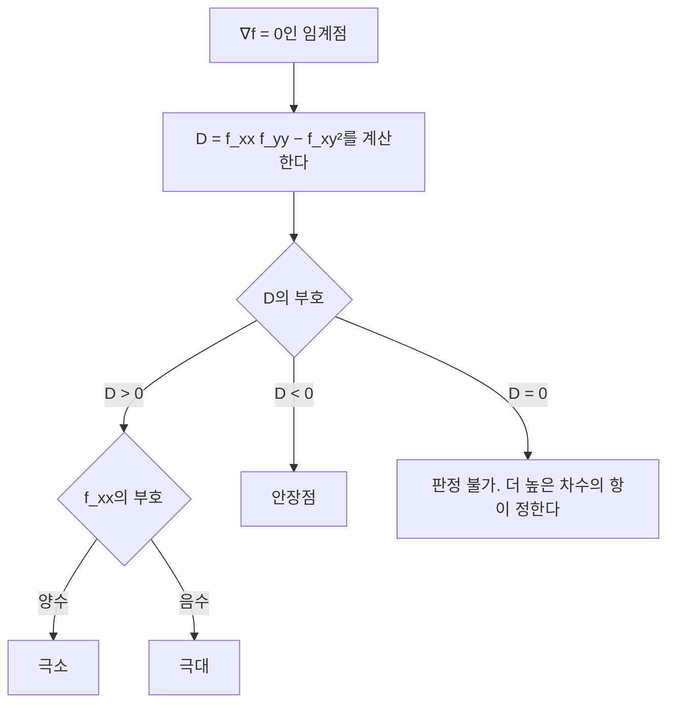



요약

기울기가 0인 곳(평지)은 산꼭대기일 수도, 골짜기 바닥일 수도, 말안장처럼 한쪽으로는 오르고 다른 쪽으로는 내리는 곳일 수도 있다. 2계 편미분을 모은 헤세 행렬이 어느 쪽인지 알려 준다. 모든 방향으로 위로 휘면(양의 정부호) 바닥, 모든 방향으로 아래로 휘면 꼭대기, 방향에 따라 다르면 안장점이다. 신경망 학습의 "평지"는 대부분 안장점이라는 관찰도 이 판정으로 설명한다. 다만 휘는 정도가 0인 방향이 있으면 이 판정으로는 결론을 내리지 못한다.

## 예시로 보기

원점에서 기울기가 0인 세 함수를 본다.

| 함수 | 헤세 행렬 | 모양 | 원점은 |
|---|---|---|---|
| $$x^2 + y^2$$ | $$\begin{pmatrix}2 & 0\\ 0 & 2\end{pmatrix}$$ | 그릇 | 극소 |
| $$-x^2 - y^2$$ | $$\begin{pmatrix}-2 & 0\\ 0 & -2\end{pmatrix}$$ | 뒤집은 그릇 | 극대 |
| $$x^2 - y^2$$ | $$\begin{pmatrix}2 & 0\\ 0 & -2\end{pmatrix}$$ | 말안장 | 안장점 |

셋째는 $$x$$ 방향으로는 오르고 $$y$$ 방향으로는 내린다. 기울기만 보면 셋이 똑같이 평지지만, 휘는 방향이 다르다. 2계 편미분 행렬이 아래 정의의 $$H$$다.

주황 실선은 원점보다 높은 곳, 파란 점선은 낮은 곳의 등고선이다. 극소는 사방이 주황, 극대는 사방이 파랑이다. 안장점은 좌우(가로축 방향)로 가면 주황, 위아래로 가면 파랑이라, 원점에서 등고선이 X자로 갈린다[^s2].

## 정의

정의

$$f: \mathbb{R}^n \to \mathbb{R}$$($$\mathbb{R}$$은 실수 전체, $$\mathbb{R}^n$$은 실수 $$n$$개짜리 목록 전체)의 **헤세 행렬**은 2계 편미분을 모은 $$n \times n$$ 행렬 $$H_{ij} = \frac{\partial^2 f}{\partial x_i\partial x_j}$$이다. 2계 편미분이 연속이면 [클레로 정리](/Hongs_Blog/studies/calculus/partial-derivatives/)로 대칭이다. $$\nabla f(\mathbf{a}) = \mathbf{0}$$인 점을 **임계점**이라 한다[^1].

2계 도함수 판정

$$f$$의 2계 편미분이 연속이고 $$\mathbf{a}$$가 임계점일 때
1. $$H(\mathbf{a})$$가 양의 정부호이면 $$\mathbf{a}$$는 극소점이다.
2. 음의 정부호이면 극대점이다.
3. 양의 고윳값과 음의 고윳값이 모두 있으면 안장점이다.
4. 0인 고윳값이 있고 나머지가 한쪽 부호뿐이면(준정부호) 판정할 수 없다.

두 변수에서는 $$D = f_{xx}f_{yy} - f_{xy}^2$$로 판정한다. $$D > 0$$이고 $$f_{xx} > 0$$이면 극소, $$D > 0$$이고 $$f_{xx} < 0$$이면 극대, $$D < 0$$이면 안장점, $$D = 0$$이면 판정 불가다.

$$D$$는 헤세 행렬의 행렬식, 곧 두 고윳값의 곱이다. $$D > 0$$이면 두 고윳값의 부호가 같고, $$D < 0$$이면 다르다. 그래서 부호가 같을 때만 $$f_{xx}$$로 위아래를 가린다[^s3].

증명 스케치

1. *2차 근사:* 임계점 근처에서 [테일러 전개](/Hongs_Blog/studies/calculus/taylor-series/)로 $$f(\mathbf{a} + \mathbf{h}) = f(\mathbf{a}) + \nabla f\cdot\mathbf{h} + \frac12\mathbf{h}^\top H\mathbf{h} + (\text{더 작은 항})$$이고, $$\nabla f = \mathbf{0}$$이다.
2. *이차형식이 결정:* $$H$$가 양의 정부호이면 [이차형식](/Hongs_Blog/studies/linear-algebra/positive-definite/) $$\mathbf{h}^\top H\mathbf{h} \ge \lambda_{\min}\Vert \mathbf{h}\Vert ^2 > 0$$이라, 작은 $$\mathbf{h}$$에서 나머지 항을 이겨 $$f(\mathbf{a} + \mathbf{h}) > f(\mathbf{a})$$다.
3. *안장점:* 양·음 고윳값의 고유벡터 방향으로 가면 각각 오르고 내린다.
4. *판정 불가:* 고윳값 0의 방향에서는 2차 항이 0이라 더 높은 차수의 항이 결정한다. ∎

## 예제

$$f(x, y) = x^3 - 3x + y^2$$의 임계점을 분류한다.

1. *임계점:* $$f_x = 3x^2 - 3 = 0$$, $$f_y = 2y = 0$$에서 $$(1, 0)$$, $$(-1, 0)$$.
2. *헤세 행렬:* $$f_{xx} = 6x$$, $$f_{yy} = 2$$, $$f_{xy} = 0$$.
3. *$$(1, 0)$$:* $$H = \operatorname{diag}(6, 2)$$, 양의 정부호라 극소. 값은 $$-2$$.
4. *$$(-1, 0)$$:* $$H = \operatorname{diag}(-6, 2)$$, 부호가 섞여 안장점. $$x$$ 방향으로는 꼭대기, $$y$$ 방향으로는 바닥이다.

초록 점 둘레는 닫힌 고리가 겹겹이 감싼 골짜기 바닥이다. 주황 네모에서는 높이 2인 등고선이 X자로 엇갈린다. 같은 "기울기 0"이라도 둘레의 등고선 모양이 전혀 다르다[^s2].

**판정 불가의 예.** $$x^4 + y^4$$와 $$x^4 - y^4$$는 원점에서 헤세 행렬이 모두 영행렬이다. 앞의 것은 극소, 뒤의 것은 안장점이다. 2차 근사만으로는 둘을 구별할 수 없다.

검증: 예시 세 함수의 헤세 행렬(수치 2계 차분)과 원점 주변 값 비교, 예제의 임계점과 분류(주변 무작위 점과 비교), $$D$$ 판정과 고윳값 판정의 일치(무작위 2차식), 판정 불가 예 두 개, 무작위 고차원 대칭 행렬에서 양·음 고윳값이 섞인 비율 — [23_hessian_verify.py](/Hongs_Blog/studies/calculus/code/23_hessian_verify/)

## 활용

- **최적화의 안장점.** 차원이 높으면 임계점의 헤세 행렬이 모든 방향에서 같은 부호일 가능성이 작아, 대부분의 임계점이 안장점이다. 신경망 학습이 멈춘 듯 느려지는 평지의 상당수가 이런 안장점이라는 연구가 있다[^s1]. 무작위 대칭 행렬 실험에서도 차원이 커질수록 고윳값 부호가 한쪽으로만 나오는 경우가 급격히 드물어진다.
- **뉴턴 방법.** 2차 근사의 바닥으로 한 번에 가는 $$\mathbf{x} \leftarrow \mathbf{x} - H^{-1}\nabla f$$가 최적화의 뉴턴 방법이다([한 변수판](/Hongs_Blog/studies/calculus/linear-approx-newton/)). 헤세 행렬을 만들고 푸는 비용이 커서 큰 모형에서는 근사를 쓴다.
- **곡률과 학습률.** 헤세 행렬의 고윳값이 큰 방향은 가파르게 휘어, 경사 하강법의 걸음이 너무 크면 튕겨 나간다(경사 하강법, 다음 단원).

## 연결

- 선수: [그래디언트](/Hongs_Blog/studies/calculus/gradient/), [양의 정부호 행렬](/Hongs_Blog/studies/linear-algebra/positive-definite/)
- 한 변수판: [2계 도함수 판정](/Hongs_Blog/studies/calculus/curve-analysis/)
- 이어지는 개념: 볼록 함수(헤세가 늘 준정부호), [경사 하강법](/Hongs_Blog/studies/calculus/gradient-descent/)

## 과목별 관점

**수치해석 (2-2학기).** 두 변수 함수의 판정을 헤세 행렬의 행렬식 $$\vert H\vert  = \frac{\partial^2 f}{\partial x^2}\frac{\partial^2 f}{\partial y^2} - \left(\frac{\partial^2 f}{\partial x\,\partial y}\right)^2$$으로 쓴다. 임계점에서 $$\vert H\vert  > 0$$이고 $$\frac{\partial^2 f}{\partial x^2} > 0$$이면 극소, $$\vert H\vert  > 0$$이고 $$\frac{\partial^2 f}{\partial x^2} < 0$$이면 극대, $$\vert H\vert  < 0$$이면 안장점이다[^n1].

$$x$$ 방향과 $$y$$ 방향의 2계 도함수만 보면 안 된다. $$f = xy$$는 $$x$$축과 $$y$$축을 따라 보면 평평하지만, 대각선 $$y = x$$를 따라서는 올라가고 $$y = -x$$를 따라서는 내려간다. 그래서 섞인 편도함수 $$\frac{\partial^2 f}{\partial x\,\partial y}$$까지 넣은 $$\vert H\vert $$로 판정한다[^n2].

편도함수를 식으로 구하기 어려우면 중심 차분으로 근사한다[^n3].

$$\frac{\partial f}{\partial x} \approx \frac{f(x + \delta x, y) - f(x - \delta x, y)}{2\delta x}, \qquad \frac{\partial^2 f}{\partial x^2} \approx \frac{f(x + \delta x, y) - 2f(x, y) + f(x - \delta x, y)}{\delta x^2}$$

$$\frac{\partial^2 f}{\partial x\,\partial y} \approx \frac{f(x + \delta x, y + \delta y) - f(x + \delta x, y - \delta y) - f(x - \delta x, y + \delta y) + f(x - \delta x, y - \delta y)}{4\,\delta x\,\delta y}$$

## 확인 문제

**C1** $$f(x, y) = x^3 - 3x + y^2$$의 임계점을 모두 찾아 분류하라.

**답:** $$(1, 0)$$: $$H = \operatorname{diag}(6, 2)$$라 극소. $$(-1, 0)$$: $$H = \operatorname{diag}(-6, 2)$$라 안장점.

**C2** 원점에서 헤세 행렬이 같은데(영행렬) 한쪽은 극소, 다른 쪽은 안장점인 두 함수를 들라.

**답:** $$x^4 + y^4$$(극소)와 $$x^4 - y^4$$(안장점). 2차 항이 모두 0이라 헤세 판정은 결론을 내리지 못하고 4차 항이 모양을 정한다.

**C3** 임계점에서 헤세 행렬이 양의 정부호이면 극소인 이유를 2차 근사로 설명하라.

**답:** 임계점에서 기울기가 0이라 $$f(\mathbf{a} + \mathbf{h}) \approx f(\mathbf{a}) + \frac12\mathbf{h}^\top H\mathbf{h}$$다. 양의 정부호면 $$\mathbf{h} \ne \mathbf{0}$$인 모든 방향에서 $$\mathbf{h}^\top H\mathbf{h} > 0$$이라, 조금이라도 움직이면 값이 커진다.

**C4** $$f(x, y) = x^2y$$의 $$\frac{\partial^2 f}{\partial x\,\partial y}$$를 $$(1, 1)$$에서 $$\delta x = \delta y = 0.1$$인 중심 차분으로 근사하고 참값과 비교하라.

**답:** $$\frac{1.331 - 1.089 - 0.891 + 0.729}{0.04} = \frac{0.08}{0.04} = 2$$. 참값 $$2x = 2$$와 같다. $$x^2y$$에서는 이 공식의 오차가 정확히 0이다[^sn1].

[^1]: OpenStax, *Calculus Volume 3*, 4.7절 "Maxima/Minima Problems"(임계점, 2계 도함수 판정 $$D = f_{xx}f_{yy} - f_{xy}^2$$, 안장점). Strang, *Introduction to Linear Algebra* 5판, 6.5절(양의 정부호와 최솟점, 2차 근사).
[^s1]: 에이전트 보충. Dauphin et al., "Identifying and attacking the saddle point problem in high-dimensional non-convex optimization", *NeurIPS* 2014. 23_hessian_verify.py의 무작위 대칭 행렬 실험은 이 관찰의 단순한 모형일 뿐 신경망 손실 곡면 자체를 보인 것은 아니다.
[^n1]: 2-2학기/수치해석/1.수업자료/15.na15_multiop.pdf, p.11, p.15~16
[^n2]: 같은 자료, p.12~14
[^n3]: 같은 자료, p.17
[^sn1]: 에이전트 보충. 카드 C4는 원본에 없다. 23_hessian_verify.py로 확인했다.
[^s2]: 에이전트 보충. 그림 두 장은 원본에 없다. [23_hessian_plot.py](/Hongs_Blog/studies/calculus/code/23_hessian_plot/)로 그렸고, 예제의 값 $$f(1, 0) = -2$$, $$f(-1, 0) = 2$$, $$(1, 0)$$ 둘레 무작위 점 1,000개가 모두 $$-2$$보다 높은 것, $$(-1, 0)$$에서 $$x$$ 방향은 내려가고 $$y$$ 방향은 올라가는 것, 예시 세 함수의 원점 둘레 부호를 같은 코드로 확인했다.
[^s3]: 에이전트 보충. 다이어그램 1개는 원본에 없다. 정리의 두 변수 판정을 그렸다. $$D$$가 $$2 \times 2$$ 헤세 행렬의 행렬식이고 행렬식이 고윳값의 곱이라는 것은 선형대수의 표준 사실이다.

