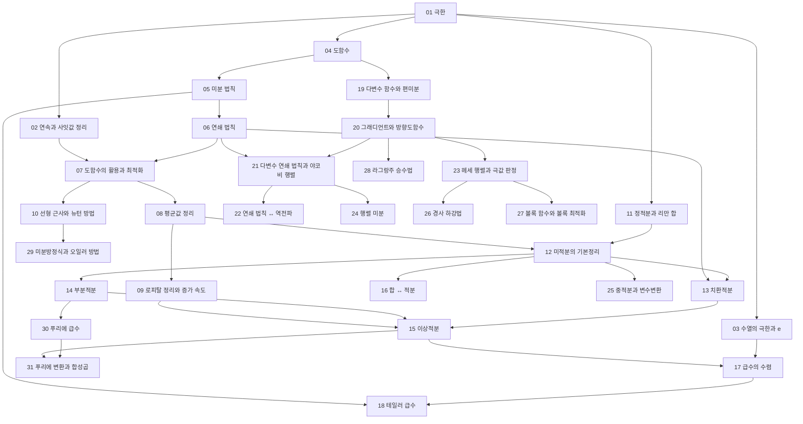


> 교재: OpenStax *Calculus Volume 1–3* (공개 교재)

## 먼저 알아야 할 것
- [함수](/Hongs_Blog/studies/college-math/function/) (대학수학) → 극한
- [함수의 변환과 합성](/Hongs_Blog/studies/college-math/function-transformation/) (대학수학) → 연쇄 법칙
- [지수함수](/Hongs_Blog/studies/college-math/exponential-function/) (대학수학) → 수열의 극한과 e, 미분방정식과 오일러 방법
- [로그](/Hongs_Blog/studies/college-math/logarithm/) (대학수학) → 미분 법칙
- [사인파](/Hongs_Blog/studies/college-math/sinusoid/) (대학수학) → 푸리에 급수
- [삼각함수 항등식](/Hongs_Blog/studies/college-math/trig-identities/) (대학수학) → 미분 법칙
- [극좌표와 매개변수 곡선](/Hongs_Blog/studies/college-math/polar-parametric/) (대학수학) → 중적분과 변수변환
- [복소수의 극형식과 오일러 공식](/Hongs_Blog/studies/college-math/euler-formula/) (대학수학) → 푸리에 변환과 합성곱
- [수열과 합의 기호](/Hongs_Blog/studies/college-math/sequences-sigma/) (대학수학) → 수열의 극한과 e, 정적분과 리만 합
- [등비급수](/Hongs_Blog/studies/college-math/geometric-series/) (대학수학) → 급수의 수렴
- [합의 계산과 어림](/Hongs_Blog/studies/discrete-math/sums-asymptotics/) (이산수학) → 합 ↔ 적분
- [벡터](/Hongs_Blog/studies/linear-algebra/vectors/) (선형대수학) → 다변수 함수와 편미분
- [내적과 노름](/Hongs_Blog/studies/linear-algebra/dot-product/) (선형대수학) → 그래디언트와 방향도함수
- [행렬 곱셈과 전치](/Hongs_Blog/studies/linear-algebra/matrix-multiplication/) (선형대수학) → 다변수 연쇄 법칙과 야코비 행렬
- [행렬식](/Hongs_Blog/studies/linear-algebra/determinant/) (선형대수학) → 중적분과 변수변환
- [직교성과 직교 사영](/Hongs_Blog/studies/linear-algebra/orthogonal-projection/) (선형대수학) → 푸리에 급수
- [최소제곱법](/Hongs_Blog/studies/linear-algebra/least-squares/) (선형대수학) → 행렬 미분
- [양의 정부호 행렬과 이차형식](/Hongs_Blog/studies/linear-algebra/positive-definite/) (선형대수학) → 헤세 행렬과 극값 판정

## 1단원 · 극한과 연속

읽기 전에

1. (x² − 1)/(x − 1)은 x = 1에서 값이 없다. 그 근처에서는 어떤 값에 가까워질까? → [극한](/Hongs_Blog/studies/calculus/limits/)
2. x³ − x − 2 = 0의 근이 1과 2 사이에 있다는 것을 근을 구하지 않고 어떻게 알 수 있을까? → [연속과 사잇값 정리](/Hongs_Blog/studies/calculus/continuity/)
3. 걸음 폭이 점점 작아지면 결국 어딘가에 멈출까? → [수열의 극한과 e](/Hongs_Blog/studies/calculus/sequence-limits/)

| 번호 | 개념 | 한 줄 | 개념 코드 | 연습 |
|---|---|---|---|---|
| 01 | [극한](/Hongs_Blog/studies/calculus/limits/) | 한없이 다가갈 때 가까워지는 값. ε-δ 정의 (무거움) | [그림1](/Hongs_Blog/assets/notes/calculus/01_limits_fig1.svg) · [그림2](/Hongs_Blog/assets/notes/calculus/01_limits_fig2.svg) · [그림 코드](/Hongs_Blog/studies/calculus/code/01_limits_plot/) · [검증](/Hongs_Blog/studies/calculus/code/01_limits_verify/) | — |
| 02 | [연속과 사잇값 정리](/Hongs_Blog/studies/calculus/continuity/) | 부호가 바뀌면 그 사이에 근이 있다 | [그림1](/Hongs_Blog/assets/notes/calculus/02_continuity_fig1.svg) · [그림 코드](/Hongs_Blog/studies/calculus/code/02_continuity_plot/) · [검증](/Hongs_Blog/studies/calculus/code/02_continuity_verify/) | — |
| 03 | [수열의 극한과 e](/Hongs_Blog/studies/calculus/sequence-limits/) | 수열의 수렴, 단조 유계 수렴, (1 + 1/n)^n → e | [그림1](/Hongs_Blog/assets/notes/calculus/03_sequence-limits_fig1.svg) · [그림2](/Hongs_Blog/assets/notes/calculus/03_sequence-limits_fig2.svg) · [그림 코드](/Hongs_Blog/studies/calculus/code/03_sequence-limits_plot/) · [검증](/Hongs_Blog/studies/calculus/code/03_sequence-limits_verify/) | — |

떠올려 보기: 노트를 닫고 함수의 극한과 수열의 극한을 ε으로 쓴 두 정의를 나란히 적고, 연속의 세 조건과 이분법이 사잇값 정리에 기대는 이유를 덧붙인다.

## 2단원 · 미분

읽기 전에

1. 수치 미분에서 h를 1e-15처럼 아주 작게 하면 더 정확해질까? → [도함수](/Hongs_Blog/studies/calculus/derivative/)
2. sin(x²)를 미분하면 cos(2x)일까? → [연쇄 법칙](/Hongs_Blog/studies/calculus/chain-rule/)
3. 도함수가 0인 점은 늘 봉우리나 골짜기일까? → [도함수의 활용과 최적화](/Hongs_Blog/studies/calculus/curve-analysis/)

| 번호 | 개념 | 한 줄 | 개념 코드 | 연습 |
|---|---|---|---|---|
| 04 | [도함수](/Hongs_Blog/studies/calculus/derivative/) | 순간 변화율 = 접선의 기울기 (무거움) | [그림1](/Hongs_Blog/assets/notes/calculus/04_derivative_fig1.svg) · [그림2](/Hongs_Blog/assets/notes/calculus/04_derivative_fig2.svg) · [그림 코드](/Hongs_Blog/studies/calculus/code/04_derivative_plot/) · [검증](/Hongs_Blog/studies/calculus/code/04_derivative_verify/) | — |
| 05 | [미분 법칙](/Hongs_Blog/studies/calculus/differentiation-rules/) | 합·곱·몫, e^x·ln x·sin x의 도함수 | [그림1](/Hongs_Blog/assets/notes/calculus/05_differentiation-rules_fig1.svg) · [그림 코드](/Hongs_Blog/studies/calculus/code/05_differentiation-rules_plot/) · [검증](/Hongs_Blog/studies/calculus/code/05_differentiation-rules_verify/) | — |
| 06 | [연쇄 법칙](/Hongs_Blog/studies/calculus/chain-rule/) | 합성함수의 변화율은 변화율들의 곱. 역함수·음함수 미분 (무거움) | [그림1](/Hongs_Blog/assets/notes/calculus/06_chain-rule_fig1.svg) · [그림 코드](/Hongs_Blog/studies/calculus/code/06_chain-rule_plot/) · [검증](/Hongs_Blog/studies/calculus/code/06_chain-rule_verify/) | [미분 계산 예제 사다리](/Hongs_Blog/studies/calculus/differentiation-ladder/) |
| 07 | [도함수의 활용과 최적화](/Hongs_Blog/studies/calculus/curve-analysis/) | 증가·감소, 극값, 볼록성으로 최대·최소를 찾는다 (무거움) | [그림1](/Hongs_Blog/assets/notes/calculus/07_curve-analysis_fig1.svg) · [그림2](/Hongs_Blog/assets/notes/calculus/07_curve-analysis_fig2.svg) · [그림 코드](/Hongs_Blog/studies/calculus/code/07_curve-analysis_plot/) · [검증](/Hongs_Blog/studies/calculus/code/07_curve-analysis_verify/) | [최적화 문제 예제 사다리](/Hongs_Blog/studies/calculus/optimization-ladder/) |
| 08 | [평균값 정리](/Hongs_Blog/studies/calculus/mean-value-theorem/) | 평균 변화율과 같은 순간 변화율이 어딘가에 있다 | [그림1](/Hongs_Blog/assets/notes/calculus/08_mean-value-theorem_fig1.svg) · [그림 코드](/Hongs_Blog/studies/calculus/code/08_mean-value-theorem_plot/) · [검증](/Hongs_Blog/studies/calculus/code/08_mean-value-theorem_verify/) | — |
| 09 | [로피탈 정리와 증가 속도](/Hongs_Blog/studies/calculus/lhopital-growth/) | 0/0, ∞/∞ 꼴 극한. log ≪ 다항 ≪ 지수 | [그림1](/Hongs_Blog/assets/notes/calculus/09_lhopital-growth_fig1.svg) · [그림 코드](/Hongs_Blog/studies/calculus/code/09_lhopital-growth_plot/) · [검증](/Hongs_Blog/studies/calculus/code/09_lhopital-growth_verify/) | — |
| 10 | [선형 근사와 뉴턴 방법](/Hongs_Blog/studies/calculus/linear-approx-newton/) | 곡선을 접선으로 근사하고, 접선의 영점으로 근을 빨리 찾는다 | [그림1](/Hongs_Blog/assets/notes/calculus/10_linear-approx-newton_fig1.svg) · [그림2](/Hongs_Blog/assets/notes/calculus/10_linear-approx-newton_fig2.svg) · [구현](/Hongs_Blog/studies/calculus/code/10_linear-approx-newton_impl/) · [그림 코드](/Hongs_Blog/studies/calculus/code/10_linear-approx-newton_plot/) · [검증](/Hongs_Blog/studies/calculus/code/10_linear-approx-newton_verify/) | — |

떠올려 보기: 미분 법칙표를 빈 종이에 다시 쓰고, 연쇄 법칙으로 시그모이드의 도함수를 유도한 뒤, 최적화 문제의 네 하위목표를 적어 본다.

## 3단원 · 적분

읽기 전에

1. 속도계 기록만 있다면 이동 거리를 어떻게 구할까? → [정적분과 리만 합](/Hongs_Blog/studies/calculus/riemann-integral/)
2. 배열의 누적합과 미분·적분은 어떻게 닮았을까? → [미적분의 기본정리](/Hongs_Blog/studies/calculus/ftc/)
3. ∫₁^∞ 1/x dx와 ∫₁^∞ 1/x² dx 중 넓이가 유한한 것은? → [이상적분](/Hongs_Blog/studies/calculus/improper-integrals/)

| 번호 | 개념 | 한 줄 | 개념 코드 | 연습 |
|---|---|---|---|---|
| 11 | [정적분과 리만 합](/Hongs_Blog/studies/calculus/riemann-integral/) | 잘게 나눈 직사각형 넓이 합의 극한 = 누적량 (무거움) | [그림1](/Hongs_Blog/assets/notes/calculus/11_riemann-integral_fig1.svg) · [그림2](/Hongs_Blog/assets/notes/calculus/11_riemann-integral_fig2.svg) · [구현](/Hongs_Blog/studies/calculus/code/11_riemann-integral_impl/) · [그림 코드](/Hongs_Blog/studies/calculus/code/11_riemann-integral_plot/) · [검증](/Hongs_Blog/studies/calculus/code/11_riemann-integral_verify/) | — |
| 12 | [미적분의 기본정리](/Hongs_Blog/studies/calculus/ftc/) | 적분과 미분은 서로를 되돌린다 (무거움) | [그림1](/Hongs_Blog/assets/notes/calculus/12_ftc_fig1.svg) · [그림 코드](/Hongs_Blog/studies/calculus/code/12_ftc_plot/) · [검증](/Hongs_Blog/studies/calculus/code/12_ftc_verify/) | — |
| 13 | [치환적분](/Hongs_Blog/studies/calculus/substitution/) | 연쇄 법칙을 거꾸로 쓴다 | [그림1](/Hongs_Blog/assets/notes/calculus/13_substitution_fig1.svg) · [그림 코드](/Hongs_Blog/studies/calculus/code/13_substitution_plot/) · [검증](/Hongs_Blog/studies/calculus/code/13_substitution_verify/) | — |
| 14 | [부분적분](/Hongs_Blog/studies/calculus/integration-by-parts/) | 곱의 미분을 거꾸로 쓴다 | [그림1](/Hongs_Blog/assets/notes/calculus/14_integration-by-parts_fig1.svg) · [그림 코드](/Hongs_Blog/studies/calculus/code/14_integration-by-parts_plot/) · [검증](/Hongs_Blog/studies/calculus/code/14_integration-by-parts_verify/) | [적분 계산 예제 사다리](/Hongs_Blog/studies/calculus/integration-ladder/) |
| 15 | [이상적분](/Hongs_Blog/studies/calculus/improper-integrals/) | 무한 구간과 무한 값을 극한으로 다룬다 | [그림1](/Hongs_Blog/assets/notes/calculus/15_improper-integrals_fig1.svg) · [그림 코드](/Hongs_Blog/studies/calculus/code/15_improper-integrals_plot/) · [검증](/Hongs_Blog/studies/calculus/code/15_improper-integrals_verify/) | — |
| 16 | [합 ↔ 적분](/Hongs_Blog/studies/calculus/sum-integral-bounds/) | 넓이로 합을 위아래에서 끼운다. H_n ≈ ln n, ln n! ≈ n ln n − n | [그림1](/Hongs_Blog/assets/notes/calculus/16_sum-integral-bounds_fig1.svg) · [그림 코드](/Hongs_Blog/studies/calculus/code/16_sum-integral-bounds_plot/) · [검증](/Hongs_Blog/studies/calculus/code/16_sum-integral-bounds_verify/) | — |

떠올려 보기: 노트를 닫고 리만 합의 정의, 기본정리의 두 부분, 치환과 부분적분을 가르는 신호를 적고, 조화수를 적분으로 끼우는 그림을 그려 본다.

## 4단원 · 급수

읽기 전에

1. 항이 0으로 가면 무한히 더한 값은 늘 유한할까? → [급수의 수렴](/Hongs_Blog/studies/calculus/series-convergence/)
2. 계산기는 e^x나 sin x를 어떻게 계산할까? → [테일러 급수](/Hongs_Blog/studies/calculus/taylor-series/)

| 번호 | 개념 | 한 줄 | 개념 코드 | 연습 |
|---|---|---|---|---|
| 17 | [급수의 수렴](/Hongs_Blog/studies/calculus/series-convergence/) | 무한히 더해도 유한한 조건. 비교·비·적분 판정 | [그림1](/Hongs_Blog/assets/notes/calculus/17_series-convergence_fig1.svg) · [그림 코드](/Hongs_Blog/studies/calculus/code/17_series-convergence_plot/) · [검증](/Hongs_Blog/studies/calculus/code/17_series-convergence_verify/) | — |
| 18 | [테일러 급수](/Hongs_Blog/studies/calculus/taylor-series/) | 한 점의 미분 정보로 함수를 다항식으로 근사. 오차 한계 (무거움) | [그림1](/Hongs_Blog/assets/notes/calculus/18_taylor-series_fig1.svg) · [그림2](/Hongs_Blog/assets/notes/calculus/18_taylor-series_fig2.svg) · [구현](/Hongs_Blog/studies/calculus/code/18_taylor-series_impl/) · [그림 코드](/Hongs_Blog/studies/calculus/code/18_taylor-series_plot/) · [검증](/Hongs_Blog/studies/calculus/code/18_taylor-series_verify/) | — |

떠올려 보기: 판정법 다섯 가지를 언제 쓰는지와 함께 적고, e^x·sin x·cos x·ln(1+x)의 급수와 성립 범위, 테일러 나머지 한계를 써 본다.

## 5단원 · 다변수 미분

읽기 전에

1. 산 위에서 가장 가파르게 오르는 방향은 어떻게 알 수 있을까? → [그래디언트와 방향도함수](/Hongs_Blog/studies/calculus/gradient/)
2. 신경망은 수백만 개 가중치의 기울기를 왜 한 번의 역방향 계산으로 다 얻을까? → [연쇄 법칙 ↔ 역전파](/Hongs_Blog/studies/calculus/backprop-bridge/)
3. 기울기가 0인 점은 늘 꼭대기나 바닥일까? → [헤세 행렬과 극값 판정](/Hongs_Blog/studies/calculus/hessian/)

| 번호 | 개념 | 한 줄 | 개념 코드 | 연습 |
|---|---|---|---|---|
| 19 | [다변수 함수와 편미분](/Hongs_Blog/studies/calculus/partial-derivatives/) | 다른 변수는 고정하고 한 방향으로만 미분 | [그림1](/Hongs_Blog/assets/notes/calculus/19_partial-derivatives_fig1.svg) · [그림2](/Hongs_Blog/assets/notes/calculus/19_partial-derivatives_fig2.svg) · [그림 코드](/Hongs_Blog/studies/calculus/code/19_partial-derivatives_plot/) · [검증](/Hongs_Blog/studies/calculus/code/19_partial-derivatives_verify/) | — |
| 20 | [그래디언트와 방향도함수](/Hongs_Blog/studies/calculus/gradient/) | 가장 가파르게 오르는 방향과 그 기울기 (무거움) | [그림1](/Hongs_Blog/assets/notes/calculus/20_gradient_fig1.svg) · [그림 코드](/Hongs_Blog/studies/calculus/code/20_gradient_plot/) · [검증](/Hongs_Blog/studies/calculus/code/20_gradient_verify/) | — |
| 21 | [다변수 연쇄 법칙과 야코비 행렬](/Hongs_Blog/studies/calculus/multivariable-chain-rule/) | 변환의 미분은 행렬이고, 합성은 야코비의 곱 (무거움) | [그림1](/Hongs_Blog/assets/notes/calculus/21_multivariable-chain-rule_fig1.svg) · [그림 코드](/Hongs_Blog/studies/calculus/code/21_multivariable-chain-rule_plot/) · [검증](/Hongs_Blog/studies/calculus/code/21_multivariable-chain-rule_verify/) | — |
| 22 | [연쇄 법칙 ↔ 역전파](/Hongs_Blog/studies/calculus/backprop-bridge/) | 계산 그래프를 거꾸로 훑으며 야코비를 곱하는 것이 역전파 | [구현](/Hongs_Blog/studies/calculus/code/22_backprop-bridge_impl/) · [검증](/Hongs_Blog/studies/calculus/code/22_backprop-bridge_verify/) | — |
| 23 | [헤세 행렬과 극값 판정](/Hongs_Blog/studies/calculus/hessian/) | 2차 도함수 행렬의 부호로 최소·최대·안장점을 가린다 | [그림1](/Hongs_Blog/assets/notes/calculus/23_hessian_fig1.svg) · [그림2](/Hongs_Blog/assets/notes/calculus/23_hessian_fig2.svg) · [그림 코드](/Hongs_Blog/studies/calculus/code/23_hessian_plot/) · [검증](/Hongs_Blog/studies/calculus/code/23_hessian_verify/) | — |
| 24 | [행렬 미분](/Hongs_Blog/studies/calculus/matrix-calculus/) | ∇(xᵀAx) = (A + Aᵀ)x 같은 규칙으로 벡터식을 한 번에 미분 | [그림1](/Hongs_Blog/assets/notes/calculus/24_matrix-calculus_fig1.svg) · [그림 코드](/Hongs_Blog/studies/calculus/code/24_matrix-calculus_plot/) · [검증](/Hongs_Blog/studies/calculus/code/24_matrix-calculus_verify/) | — |
| 25 | [중적분과 변수변환](/Hongs_Blog/studies/calculus/multiple-integrals/) | 넓이 위의 누적. 좌표를 바꾸면 야코비안만큼 보정. 가우스 적분 | [그림1](/Hongs_Blog/assets/notes/calculus/25_multiple-integrals_fig1.svg) · [그림 코드](/Hongs_Blog/studies/calculus/code/25_multiple-integrals_plot/) · [검증](/Hongs_Blog/studies/calculus/code/25_multiple-integrals_verify/) | — |

떠올려 보기: 노트를 닫고 편미분·그래디언트·야코비 행렬·헤세 행렬이 각각 무엇의 모음인지 적고, 연쇄 법칙이 행렬 곱이 되는 이유와 극좌표 적분에 r이 붙는 이유를 한 줄씩 붙인다.

## 6단원 · 최적화

읽기 전에

1. 학습률을 두 배로 키우면 학습도 두 배 빨라질까? → [경사 하강법](/Hongs_Blog/studies/calculus/gradient-descent/)
2. 경사 하강법이 멈춘 곳이 가장 낮은 곳이라고 언제 믿을 수 있을까? → [볼록 함수와 볼록 최적화](/Hongs_Blog/studies/calculus/convexity/)
3. 둘레가 정해진 울타리로 가장 넓은 땅을 두르려면, 제약을 어떻게 식에 넣을까? → [라그랑주 승수법](/Hongs_Blog/studies/calculus/lagrange-multipliers/)

| 번호 | 개념 | 한 줄 | 개념 코드 | 연습 |
|---|---|---|---|---|
| 26 | [경사 하강법](/Hongs_Blog/studies/calculus/gradient-descent/) | 기울기 반대로 조금씩 내려간다. 학습률이 성패를 가른다 (무거움) | [그림1](/Hongs_Blog/assets/notes/calculus/26_gradient-descent_fig1.svg) · [그림2](/Hongs_Blog/assets/notes/calculus/26_gradient-descent_fig2.svg) · [구현](/Hongs_Blog/studies/calculus/code/26_gradient-descent_impl/) · [그림 코드](/Hongs_Blog/studies/calculus/code/26_gradient-descent_plot/) · [검증](/Hongs_Blog/studies/calculus/code/26_gradient-descent_verify/) | [경사 하강법 예제 사다리](/Hongs_Blog/studies/calculus/gradient-descent-ladder/) |
| 27 | [볼록 함수와 볼록 최적화](/Hongs_Blog/studies/calculus/convexity/) | 그릇 모양 함수에서는 지역 최소 = 전역 최소 | [그림1](/Hongs_Blog/assets/notes/calculus/27_convexity_fig1.svg) · [그림2](/Hongs_Blog/assets/notes/calculus/27_convexity_fig2.svg) · [그림 코드](/Hongs_Blog/studies/calculus/code/27_convexity_plot/) · [검증](/Hongs_Blog/studies/calculus/code/27_convexity_verify/) | — |
| 28 | [라그랑주 승수법](/Hongs_Blog/studies/calculus/lagrange-multipliers/) | 제약 위 최적점에서는 두 그래디언트가 평행하다 | [그림1](/Hongs_Blog/assets/notes/calculus/28_lagrange-multipliers_fig1.svg) · [그림 코드](/Hongs_Blog/studies/calculus/code/28_lagrange-multipliers_plot/) · [검증](/Hongs_Blog/studies/calculus/code/28_lagrange-multipliers_verify/) | — |

떠올려 보기: 노트를 닫고 경사 하강법의 갱신 식과 학습률의 안정 조건, 볼록 함수의 정의와 판정법, 라그랑주 조건을 적고, 셋이 '기울기가 0인 점' 이야기로 어떻게 이어지는지 한 문단으로 쓴다.

## 7단원 · 미분방정식과 푸리에

읽기 전에

1. 게임은 매 프레임 물체 위치를 어떻게 계산할까? 프레임 간격이 커지면 무슨 일이 생길까? → [미분방정식과 오일러 방법](/Hongs_Blog/studies/calculus/ode-euler/)
2. 뚝 끊기는 사각파를 매끄러운 사인파만으로 만들 수 있을까? → [푸리에 급수](/Hongs_Blog/studies/calculus/fourier-series/)
3. 여러 통화를 전선 하나로 동시에 보내도 섞이지 않는 이유는? → [푸리에 변환과 합성곱](/Hongs_Blog/studies/calculus/fourier-transform/)

| 번호 | 개념 | 한 줄 | 개념 코드 | 연습 |
|---|---|---|---|---|
| 29 | [미분방정식과 오일러 방법](/Hongs_Blog/studies/calculus/ode-euler/) | 변화의 규칙에서 미래를 계산한다. 작은 걸음으로 시뮬레이션 | [그림1](/Hongs_Blog/assets/notes/calculus/29_ode-euler_fig1.svg) · [그림2](/Hongs_Blog/assets/notes/calculus/29_ode-euler_fig2.svg) · [그림 코드](/Hongs_Blog/studies/calculus/code/29_ode-euler_plot/) · [검증](/Hongs_Blog/studies/calculus/code/29_ode-euler_verify/) | — |
| 30 | [푸리에 급수](/Hongs_Blog/studies/calculus/fourier-series/) | 주기 신호 = 사인파들의 합. 계수는 내적(사영)으로 구한다 | [그림1](/Hongs_Blog/assets/notes/calculus/30_fourier-series_fig1.svg) · [그림2](/Hongs_Blog/assets/notes/calculus/30_fourier-series_fig2.svg) · [그림 코드](/Hongs_Blog/studies/calculus/code/30_fourier-series_plot/) · [검증](/Hongs_Blog/studies/calculus/code/30_fourier-series_verify/) | — |
| 31 | [푸리에 변환과 합성곱](/Hongs_Blog/studies/calculus/fourier-transform/) | 신호를 주파수별 세기로. 합성곱은 곱이 된다 | [그림1](/Hongs_Blog/assets/notes/calculus/31_fourier-transform_fig1.svg) · [그림2](/Hongs_Blog/assets/notes/calculus/31_fourier-transform_fig2.svg) · [그림 코드](/Hongs_Blog/studies/calculus/code/31_fourier-transform_plot/) · [검증](/Hongs_Blog/studies/calculus/code/31_fourier-transform_verify/) | — |

떠올려 보기: 오일러 방법의 한 걸음과 안정 조건, 푸리에 계수 공식과 그것이 사영인 이유, 합성곱 정리와 변조 성질을 빈 종이에 쓰고, 경사 하강법과 오일러 방법이 같은 식인 이유를 덧붙인다.

## 다른 과목과의 연결
- [합 ↔ 적분](/Hongs_Blog/studies/calculus/sum-integral-bounds/) (미분적분학): 넓이로 합을 위아래에서 끼운다. H_n ≈ ln n, ln n! ≈ n ln n − n
- [연쇄 법칙 ↔ 역전파](/Hongs_Blog/studies/calculus/backprop-bridge/) (미분적분학): 계산 그래프를 거꾸로 훑으며 야코비를 곱하는 것이 역전파
- [정적분과 리만 합](/Hongs_Blog/studies/calculus/riemann-integral/) ↔ [삼색 이론](/Hongs_Blog/studies/human-interface-media/trichromatic-theory/) (4-1학기 휴먼 인터페이스 미디어): 추상체 반응 r_k = ∫ i(λ) σ_k(λ) dλ
- [그래디언트와 방향도함수](/Hongs_Blog/studies/calculus/gradient/) ↔ [이미지 함수](/Hongs_Blog/studies/human-interface-media/image-function/) (4-1학기 휴먼 인터페이스 미디어): 이미지 기울기 ∇i
- [푸리에 변환과 합성곱](/Hongs_Blog/studies/calculus/fourier-transform/) ↔ [주파수 분할 다중화](/Hongs_Blog/studies/computer-communication/frequency-division-multiplexing/) (4-1학기 컴퓨터 통신): 주파수 대역 나누기
- [연속과 사잇값 정리](/Hongs_Blog/studies/calculus/continuity/) ↔ [매개변수 탐색 ↔ 사잇값 정리](/Hongs_Blog/studies/algorithms/parametric-search-ivt/) (알고리즘 3.개념집): 참과 거짓이 바뀌는 경계를 반씩 좁힌다(이분법)

## 흐름
점선 테두리는 아직 작성하지 않은 개념이다.

## 시험 대비
- 아직 없다.

