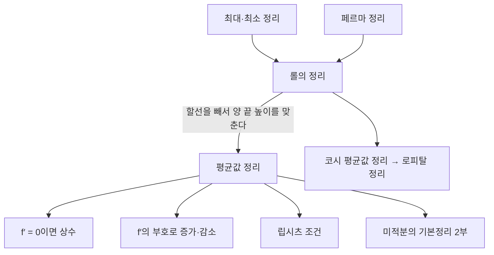



요약

10 km 구간을 5분에 지났다면 평균 시속이 120 km이고, 그렇다면 어느 한 순간 속도계는 정확히 120을 가리켰다. 매끄러운 함수에서는 평균 변화율과 똑같은 순간 변화율을 갖는 점이 반드시 있다는 정리다. "도함수가 양수면 증가한다", "도함수가 0이면 상수다" 같은 당연해 보이는 사실이 모두 이 정리로 증명된다. 구간 안에 꺾이거나 끊긴 점이 있으면 맞지 않는다.

## 예시로 보기

고속도로의 구간단속 카메라는 두 지점의 통과 시각만 잰다. 두 카메라 사이 10 km를 5분(1/12시간)에 지나면 평균 시속 $$10 \div \frac{1}{12} = 120$$ km다. 제한 속도가 100 km이면 "어느 순간 100을 넘었다"를 따로 찍지 않고도 알 수 있다. 위치가 시간에 대해 매끄럽게 변한다면, 평균 속도 120과 같은 순간 속도를 낸 때가 반드시 있기 때문이다.

위치 함수가 아래 정리의 $$f$$, 두 카메라의 통과 시각이 $$a$$와 $$b$$, 그 순간이 $$c$$다.

## 정의

평균값 정리

$$f$$가 닫힌 구간 $$[a, b]$$에서 연속이고 열린 구간 $$(a, b)$$에서 미분 가능하면

$$f'(c) = \frac{f(b) - f(a)}{b - a}$$

인 $$c \in (a, b)$$($$\in$$은 "~에 속한다")가 있다. 특히 $$f(a) = f(b)$$이면 $$f'(c) = 0$$인 $$c$$가 있다(롤의 정리)[^1].

그래프로는 두 끝점을 잇는 할선과 평행한 접선이 구간 안 어딘가에 있다는 뜻이다.

왼쪽에서 $$x^2$$의 $$c = 1$$ 접선(주황 점선)은 할선(파랑)과 기울기가 2로 같다. 오른쪽 $$\vert x\vert $$는 할선이 수평인데, 그래프의 기울기는 꺾인 점 양쪽에서 $$-1$$과 1뿐이라 수평인 접선이 없다(아래 가정의 필요성)[^s2].

증명

1. *롤의 정리:* $$f(a) = f(b)$$라 하자. [최대·최소 정리](/Hongs_Blog/studies/calculus/continuity/)로 $$f$$는 $$[a, b]$$에서 최댓값과 최솟값을 가진다. 둘 다 끝점에서만 나오면 $$f$$는 상수라 모든 점에서 $$f' = 0$$이다. 아니면 둘 중 하나가 내부 점 $$c$$에서 나오고, [페르마 정리](/Hongs_Blog/studies/calculus/curve-analysis/)로 $$f'(c) = 0$$이다.
2. *평균값 정리:* 할선을 빼서 양 끝 높이를 맞춘다. $$g(x) = f(x) - \frac{f(b) - f(a)}{b - a}(x - a)$$로 두면 $$g(a) = g(b) = f(a)$$다. 롤의 정리로 $$g'(c) = 0$$인 $$c$$가 있고, $$g'(c) = f'(c) - \frac{f(b) - f(a)}{b - a}$$이다. ∎

**가정의 필요성.** $$\vert x\vert $$를 $$[-1, 1]$$에서 보면 평균 변화율은 $$\frac{1 - 1}{2} = 0$$인데 도함수는 $$\pm 1$$뿐이라 0인 점이 없다. $$x = 0$$에서 미분 불가능이라 가정이 깨졌다. 끝점에서 연속이 아니어도 깨진다.

따름정리

구간에서
1. $$f' = 0$$이면 $$f$$는 상수다.
2. $$f' > 0$$이면 증가, $$f' < 0$$이면 감소한다.
3. $$\vert f'\vert  \le M$$이면 $$\vert f(x) - f(y)\vert  \le M\vert x - y\vert $$다(립시츠 조건).

세 가지 모두 두 점 $$x < y$$에 평균값 정리를 쓰면 $$f(y) - f(x) = f'(c)(y - x)$$에서 바로 나온다.

위쪽 두 정리가 롤의 정리를 받치고, 평균값 정리는 롤의 정리에서 바로 나온다. 아래 줄의 결과들은 이 두 정리를 다른 문제에 가져다 쓴 것이다[^s3].

## 예제

$$f(x) = x^2$$을 $$[0, 2]$$에서 볼 때 정리의 $$c$$를 구한다.

1. *평균 변화율:* $$\frac{4 - 0}{2 - 0} = 2$$.
2. *순간 변화율과 같게:* $$f'(c) = 2c = 2$$에서 $$c = 1$$.
3. *확인:* $$c = 1$$은 $$(0, 2)$$ 안에 있다.

검증: 예제의 $$c = 1$$과 $$\sqrt{x}$$의 $$c = 1$$, 무작위 매끄러운 함수와 구간 300개에서 $$c$$의 존재(격자 탐색), $$\vert x\vert $$의 반례, $$\vert \sin x - \sin y\vert  \le \vert x - y\vert $$를 2만 쌍에서, 구간단속 계산 — [08_mean-value-theorem_verify.py](/Hongs_Blog/studies/calculus/code/08_mean-value-theorem_verify/)

## 활용

- **오차 한계.** $$\vert \sin' x\vert  = \vert \cos x\vert  \le 1$$이므로 $$\vert \sin x - \sin y\vert  \le \vert x - y\vert $$다. 입력의 오차가 출력에서 커지지 않는다는 보장이다. 수치 계산에서 입력 오차가 결과로 얼마나 퍼지는지를 이렇게 도함수의 크기로 묶는다.
- **립시츠 조건과 학습.** 신경망 학습에서 기울기의 크기를 제한하거나(gradient clipping) 함수의 립시츠 상수를 제한하면 출력이 입력의 작은 변화에 크게 흔들리지 않는다[^s1].
- **구간단속.** 평균 속도가 제한을 넘으면 어느 순간 제한을 넘었다는 결론이 이 정리다.

## 연결

- 선수: [도함수의 활용과 최적화](/Hongs_Blog/studies/calculus/curve-analysis/)(페르마 정리)
- 이어지는 개념: [로피탈 정리](/Hongs_Blog/studies/calculus/lhopital-growth/), [미적분의 기본정리](/Hongs_Blog/studies/calculus/ftc/)

## 확인 문제

**C1** 평균값 정리를 가정까지 포함해 쓰라.

**답:** $$f$$가 $$[a, b]$$에서 연속이고 $$(a, b)$$에서 미분 가능하면, $$f'(c) = \frac{f(b) - f(a)}{b - a}$$인 $$c \in (a, b)$$가 있다.

**C2** f(x) = √x를 [0, 4]에서 볼 때 평균값 정리의 c를 구하라.

**답:** 평균 변화율 $$\frac{2 - 0}{4} = \frac12$$. $$f'(c) = \frac{1}{2\sqrt c} = \frac12$$에서 $$c = 1$$.

**C3** 평균값 정리의 결론이 맞지 않는 함수와 구간을 들고, 어느 가정이 깨졌는지 쓰라.

**답:** $$\vert x\vert $$를 $$[-1, 1]$$에서 보면 평균 변화율이 0인데 도함수가 0인 점이 없다. $$x = 0$$에서 미분 가능하지 않아 "$$(a, b)$$에서 미분 가능"이 깨졌다.

[^1]: OpenStax, *Calculus Volume 1*, 4.4절 "The Mean Value Theorem"(롤의 정리, 평균값 정리, 따름정리)
[^s1]: 에이전트 보충. 립시츠 연속성은 학습의 안정성과 적대적 견고성 연구에서 쓰는 조건이다. 기울기 자르기는 순환 신경망 학습의 표준 기법이다.
[^s2]: 에이전트 보충. 그림은 원본에 없다. [08_mean-value-theorem_plot.py](/Hongs_Blog/studies/calculus/code/08_mean-value-theorem_plot/)로 그렸고, $$x^2$$의 평균 변화율 2와 $$c = 1$$, $$\vert x\vert $$의 평균 변화율 0과 도함수 $$\pm 1$$을 같은 코드로 확인했다.
[^s3]: 에이전트 보충. 다이어그램 1개는 원본에 없다. 이 문서의 증명과 따름정리, [로피탈 정리](/Hongs_Blog/studies/calculus/lhopital-growth/)의 증명(코시 평균값 정리를 롤의 정리로 얻는다), [미적분의 기본정리](/Hongs_Blog/studies/calculus/ftc/) 2부의 증명을 근거로 그렸다.

