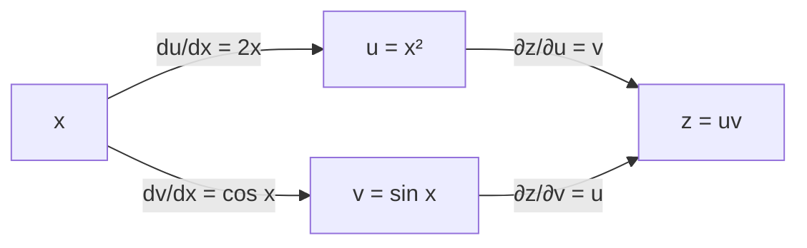



요약

여러 입력, 여러 출력의 함수도 아주 가까이서 보면 선형 변환이고, 그 변환의 행렬이 야코비 행렬이다. 함수를 이어 붙이면 가까이서 본 선형 변환도 이어 붙여지므로, 합성 함수의 미분은 야코비 행렬의 곱이다. 한 변수 연쇄 법칙을 "영향이 흐르는 모든 길을 따라 곱하고 더한다"로 넓힌 것이고, 신경망의 역전파가 정확히 이 계산이다. 다만 한 경로만 따라가고 다른 경로를 빠뜨리면 틀리며, 편미분만 있고 미분 가능하지 않으면 공식이 맞지 않는다.

## 예시로 보기

$$z = uv$$이고 $$u = x^2$$, $$v = \sin x$$라 하자. $$x$$가 $$z$$에 영향을 주는 길은 두 개다. $$u$$를 거치는 길과 $$v$$를 거치는 길이다.

- $$u$$를 거치는 길: $$\frac{\partial z}{\partial u}\frac{du}{dx} = v \cdot 2x$$($$\partial$$는 다른 변수는 그대로 두고 한 변수로만 미분한다는 기호).
- $$v$$를 거치는 길: $$\frac{\partial z}{\partial v}\frac{dv}{dx} = u \cdot \cos x$$.
- 합: $$\frac{dz}{dx} = 2x\sin x + x^2\cos x$$. 곱의 미분 $$(x^2\sin x)'$$과 같다.

$$x$$에서 $$z$$로 가는 길이 두 갈래다. 길마다 화살표 위의 식을 곱하고, 두 길의 곱을 더하면 위의 합이 된다[^s3].

두 길을 행과 열로 정리하면 $$\begin{pmatrix}\frac{\partial z}{\partial u} & \frac{\partial z}{\partial v}\end{pmatrix}\begin{pmatrix}\frac{du}{dx}\\ \frac{dv}{dx}\end{pmatrix}$$, 곧 행렬 곱이다. 이 행과 열이 아래 정리의 야코비 행렬이다.

## 정의

정의

$$\mathbf{f}: \mathbb{R}^n \to \mathbb{R}^m$$($$\mathbb{R}$$은 실수 전체, $$\mathbb{R}^n$$은 실수 $$n$$개짜리 목록 전체), $$\mathbf{f} = (f_1, \dots, f_m)$$의 **야코비 행렬**은 $$m \times n$$ 행렬

$$J_{\mathbf{f}} = \begin{pmatrix}\frac{\partial f_1}{\partial x_1} & \cdots & \frac{\partial f_1}{\partial x_n}\\ \vdots & & \vdots\\ \frac{\partial f_m}{\partial x_1} & \cdots & \frac{\partial f_m}{\partial x_n}\end{pmatrix}$$

이다. $$i$$번째 행은 $$f_i$$의 [그래디언트](/Hongs_Blog/studies/calculus/gradient/)다. $$\mathbf{f}$$가 미분 가능하면 $$\mathbf{f}(\mathbf{a} + \mathbf{h}) \approx \mathbf{f}(\mathbf{a}) + J_{\mathbf{f}}(\mathbf{a})\mathbf{h}$$(오차는 $$\Vert \mathbf{h}\Vert $$보다 빨리 0으로)다[^1]. $$m = n$$이면 $$\det J_{\mathbf{f}}$$를 야코비 행렬식이라 한다.

다변수 연쇄 법칙

$$\mathbf{f}$$가 $$\mathbf{a}$$에서, $$\mathbf{g}$$가 $$\mathbf{f}(\mathbf{a})$$에서 미분 가능하면 $$\mathbf{g} \circ \mathbf{f}$$($$\circ$$는 합성. $$g \circ f$$는 $$f$$를 먼저, $$g$$를 나중에 한다)도 $$\mathbf{a}$$에서 미분 가능하고

$$J_{\mathbf{g}\circ\mathbf{f}}(\mathbf{a}) = J_{\mathbf{g}}(\mathbf{f}(\mathbf{a}))\,J_{\mathbf{f}}(\mathbf{a}).$$

성분으로 쓰면 $$\frac{\partial (g \circ \mathbf{f})}{\partial x_j} = \sum_k \frac{\partial g}{\partial y_k}\frac{\partial f_k}{\partial x_j}$$($$\sum$$은 차례로 모두 더한다는 기호), 곧 모든 중간 변수 $$y_k$$를 거치는 길의 곱을 더한 것이다.

**가정 목록.** 두 함수가 해당 점에서 미분 가능(편미분의 존재보다 강함). 행렬의 크기는 $$(p \times m)(m \times n) = p \times n$$으로 맞는다.

## 증명

"가까이서 보면 선형"을 두 번 쓰면 선형 변환의 합성이 되고, 선형 변환의 합성은 [행렬 곱](/Hongs_Blog/studies/linear-algebra/matrix-multiplication/)이다.

증명 펼치기 [증명 스케치]

$$\mathbf{b} = \mathbf{f}(\mathbf{a})$$, $$A = J_{\mathbf{f}}(\mathbf{a})$$, $$B = J_{\mathbf{g}}(\mathbf{b})$$로 둔다.
1. *안쪽:* $$\mathbf{f}(\mathbf{a} + \mathbf{h}) = \mathbf{b} + A\mathbf{h} + \mathbf{r}_1(\mathbf{h})$$, $$\frac{\Vert \mathbf{r}_1\Vert }{\Vert \mathbf{h}\Vert } \to 0$$.
2. *바깥쪽:* $$\mathbf{k} = A\mathbf{h} + \mathbf{r}_1(\mathbf{h})$$로 두면 $$\mathbf{g}(\mathbf{b} + \mathbf{k}) = \mathbf{g}(\mathbf{b}) + B\mathbf{k} + \mathbf{r}_2(\mathbf{k})$$, $$\frac{\Vert \mathbf{r}_2\Vert }{\Vert \mathbf{k}\Vert } \to 0$$.
3. *합치기:* $$\mathbf{g}(\mathbf{f}(\mathbf{a} + \mathbf{h})) = \mathbf{g}(\mathbf{b}) + BA\mathbf{h} + \big(B\mathbf{r}_1(\mathbf{h}) + \mathbf{r}_2(\mathbf{k})\big)$$.
4. *나머지가 작다:* $$\Vert B\mathbf{r}_1\Vert  \le \Vert B\Vert \Vert \mathbf{r}_1\Vert $$은 $$\Vert \mathbf{h}\Vert $$보다 빨리 0으로 간다. $$\Vert \mathbf{k}\Vert  \le (\Vert A\Vert  + 1)\Vert \mathbf{h}\Vert $$(작은 $$\mathbf{h}$$에서)라 $$\mathbf{r}_2(\mathbf{k})$$도 그렇다. 그래서 선형 부분 $$BA$$가 합성의 야코비 행렬이다. ∎

### 스스로 설명해 보기

1. 3단계의 선형 부분이 $$AB$$가 아니라 $$BA$$인 이유는?

$$\mathbf{h}$$에 먼저 $$A$$(안쪽 함수의 선형 근사)가 작용하고 그 결과에 $$B$$가 작용한다. 행렬은 오른쪽부터 벡터에 작용하므로 $$BA\mathbf{h}$$다. 합성 $$\mathbf{g} \circ \mathbf{f}$$의 순서와 같다.

2. 4단계에서 $$\Vert \mathbf{k}\Vert  \le (\Vert A\Vert  + 1)\Vert \mathbf{h}\Vert $$가 필요한 이유는?

$$\mathbf{r}_2$$는 $$\Vert \mathbf{k}\Vert $$에 비해 작다는 것만 알려 준다. $$\Vert \mathbf{h}\Vert $$에 비해 작음을 보이려면 $$\Vert \mathbf{k}\Vert $$가 $$\Vert \mathbf{h}\Vert $$의 상수배로 묶여야 한다.

이 정리의 핵심 아이디어는?

미분은 "가장 잘 맞는 선형 근사"이고, 선형 근사끼리의 합성은 행렬 곱이다. 한 변수의 $$f'(g(x))g'(x)$$는 $$1 \times 1$$ 행렬의 곱인 특수한 경우다.

같은 아이디어를 쓰는 다른 상황은?

[중적분의 변수변환](/Hongs_Blog/studies/calculus/multiple-integrals/)에서 좌표를 바꿀 때 넓이의 배율이 야코비 행렬식이다. 로봇 팔의 관절 각도 → 끝점 위치의 야코비 행렬은 관절 속도를 끝점 속도로 바꾼다.

## 가정이 필요한 이유

| 가정 | 없으면 | 예 |
|---|---|---|
| 바깥 함수가 미분 가능 | 편미분으로 만든 공식이 틀린다 | $$g(x, y) = \frac{x^2y}{x^2 + y^2}$$($$g(0, 0) = 0$$), $$\mathbf{f}(t) = (t, t)$$. 공식은 $$\nabla g(0, 0)\cdot\mathbf{f}'(0) = 0$$을 주지만 $$g(\mathbf{f}(t)) = \frac t2$$라 실제 도함수는 $$\frac12$$ |
| 모든 길을 더함 | 영향의 일부를 빠뜨린다 | 예시에서 $$u$$ 길만 쓰면 $$2x\sin x$$로, $$x^2\cos x$$가 빠진다 |

## 예제

**극좌표의 야코비 행렬.** $$(r, \theta) \mapsto (x, y) = (r\cos\theta, r\sin\theta)$$.

1. *편미분:* $$x_r = \cos\theta$$, $$x_\theta = -r\sin\theta$$, $$y_r = \sin\theta$$, $$y_\theta = r\cos\theta$$.
2. *행렬:* $$J = \begin{pmatrix}\cos\theta & -r\sin\theta\\ \sin\theta & r\cos\theta\end{pmatrix}$$.
3. *행렬식:* $$r\cos^2\theta + r\sin^2\theta = r$$. 작은 극좌표 사각형 $$dr \times d\theta$$가 넓이 약 $$r\,dr\,d\theta$$인 조각이 된다([중적분과 변수변환](/Hongs_Blog/studies/calculus/multiple-integrals/)).
4. *연쇄 법칙으로 확인:* 원 위를 도는 $$r = 2$$, $$\theta = t$$에서 속도는 $$J\begin{pmatrix}0\\ 1\end{pmatrix} = (-2\sin t, 2\cos t)$$로, 직접 미분한 $$(2\cos t, 2\sin t)' $$와 같다.

점 $$(r, \theta) = (2, \frac{\pi}{6})$$ 둘레의 작은 사각형(왼쪽)을 극좌표 함수로 보내면, 오른쪽의 살짝 휜 조각(파랑)이 된다. 야코비 행렬이 보낸 평행사변형(주황 점선)이 그 조각과 거의 겹친다. 사각형을 작게 잡을수록 둘의 어긋남은 사각형 크기보다 더 빨리 줄어든다. 두 넓이는 모두 $$r \cdot dr \cdot d\theta = 2 \times 0.4 \times 0.3 = 0.24$$다[^s2].

검증: 예시의 두 길의 합 = 곱의 미분, 무작위 합성 함수($$\mathbb{R}^2 \to \mathbb{R}^3 \to \mathbb{R}^2$$ 등)에서 $$J_{\mathbf{g}\circ\mathbf{f}} = J_{\mathbf{g}}J_{\mathbf{f}}$$(수치 야코비), 선형 근사 오차가 $$\Vert \mathbf{h}\Vert $$보다 빨리 줄어듦, 가정의 반례($$\frac12$$ 대 0), 극좌표 야코비와 행렬식 $$r$$, 신경망 한 층의 야코비 $$\operatorname{diag}(\sigma')W$$, 카드의 값 — [21_multivariable-chain-rule_verify.py](/Hongs_Blog/studies/calculus/code/21_multivariable-chain-rule_verify/)

## 활용

- **신경망의 기울기.** 층 $$\mathbf{y} = \sigma(W\mathbf{x})$$의 야코비 행렬은 $$\operatorname{diag}(\sigma'(W\mathbf{x}))W$$다. 층을 쌓은 네트워크의 기울기는 이 행렬들의 곱이고, 오른쪽이 아니라 왼쪽(출력 쪽)부터 곱하는 것이 역전파다([연쇄 법칙 ↔ 역전파](/Hongs_Blog/studies/calculus/backprop-bridge/)).
- **로봇과 그래픽스.** 관절 각도에서 손끝 위치로 가는 함수의 야코비 행렬로, 손끝을 원하는 방향으로 움직일 관절 속도를 구한다(역기구학)[^s1].
- **흔한 실수.** 여러 길 중 하나만 따라가기, 행렬 곱의 순서를 거꾸로 쓰기. 크기(행 × 열)를 맞춰 보면 순서가 드러난다.

## 연결

- 선수: [그래디언트](/Hongs_Blog/studies/calculus/gradient/), [한 변수 연쇄 법칙](/Hongs_Blog/studies/calculus/chain-rule/), [행렬 곱셈](/Hongs_Blog/studies/linear-algebra/matrix-multiplication/)
- 이어지는 개념: [연쇄 법칙 ↔ 역전파](/Hongs_Blog/studies/calculus/backprop-bridge/), [행렬 미분](/Hongs_Blog/studies/calculus/matrix-calculus/), [중적분과 변수변환](/Hongs_Blog/studies/calculus/multiple-integrals/)
- 같은 생각: [선형변환](/Hongs_Blog/studies/linear-algebra/linear-transformations/)의 합성 = 행렬 곱

## 자주 하는 오해

"연쇄 법칙은 바깥 함수와 안쪽 함수를 한 줄로 곱하면 끝난다"

틀렸다. 한 변수에서는 영향이 흐르는 길이 하나뿐이라 곱 하나로 끝났다. 여러 변수에서는 입력이 여러 중간 변수를 거쳐 출력에 닿고, **모든 길의 곱을 더해야** 한다. $$z = uv$$, $$u = x^2$$, $$v = \sin x$$에서 $$u$$ 길만 쓰면 $$2x\sin x$$가 나오지만, 실제 도함수는 $$v$$ 길의 $$x^2\cos x$$까지 더한 값이다. 행렬 곱의 "행 × 열"이 바로 이 합이다.

## 확인 문제

**C1** 다변수 연쇄 법칙을 야코비 행렬로 쓰고, 행렬의 크기를 밝혀라.

**답:** $$\mathbf{f}: \mathbb{R}^n \to \mathbb{R}^m$$, $$\mathbf{g}: \mathbb{R}^m \to \mathbb{R}^p$$일 때 $$J_{\mathbf{g}\circ\mathbf{f}}(\mathbf{a}) = J_{\mathbf{g}}(\mathbf{f}(\mathbf{a}))J_{\mathbf{f}}(\mathbf{a})$$. 크기는 $$(p \times m)(m \times n) = p \times n$$.

**C2** $$z = x^2y$$, $$x = \cos t$$, $$y = \sin t$$일 때 $$\frac{dz}{dt}$$를 연쇄 법칙으로 구하라.

**답:** $$z_x x' + z_y y' = 2xy(-\sin t) + x^2\cos t = -2\cos t\sin^2 t + \cos^3 t$$.

**C3** 성분 공식 $$\frac{\partial z}{\partial x} = \sum_k \frac{\partial z}{\partial y_k}\frac{\partial y_k}{\partial x}$$에서 합이 나타나는 이유를 설명하라.

**답:** $$x$$가 조금 변하면 모든 중간 변수 $$y_k$$가 각각 $$\frac{\partial y_k}{\partial x}dx$$만큼 변하고, 그 변화 하나하나가 $$z$$를 $$\frac{\partial z}{\partial y_k}$$배로 바꾼다. 선형 근사에서는 이 기여들이 더해진다. 행렬 곱에서 행과 열의 내적이 이 합이다.

**C4** 극좌표 변환 $$(r, \theta) \mapsto (r\cos\theta, r\sin\theta)$$의 야코비 행렬식을 구하라.

**답:** $$\det\begin{pmatrix}\cos\theta & -r\sin\theta\\ \sin\theta & r\cos\theta\end{pmatrix} = r$$.

[^1]: OpenStax, *Calculus Volume 3*, 4.5절 "The Chain Rule"(여러 변수의 연쇄 법칙, 나무 그림으로 길 세기). Strang, *Introduction to Linear Algebra* 5판, 8.1절(선형 변환의 합성과 행렬 곱).
[^s1]: 에이전트 보충. 야코비 행렬을 이용한 역기구학은 로봇공학 교재(예: Craig, *Introduction to Robotics*)의 표준 내용이다.
[^s2]: 에이전트 보충. 그림은 원본에 없다. [21_multivariable-chain-rule_plot.py](/Hongs_Blog/studies/calculus/code/21_multivariable-chain-rule_plot/)로 그렸다. 사각형은 $$dr = 0.4$$, $$d\theta = 0.3$$으로 잘 보이게 크게 잡았다. $$\det J = 2$$, 평행사변형 넓이 0.24, 실제 조각의 넓이 $$\int\!\!\int r\,dr\,d\theta = 0.24$$(신발끈 공식으로도)를 같은 코드로 확인했다.
[^s3]: 에이전트 보충. 다이어그램 1개는 원본에 없다. 예시로 보기의 두 길을 그래프로 옮겼다.

