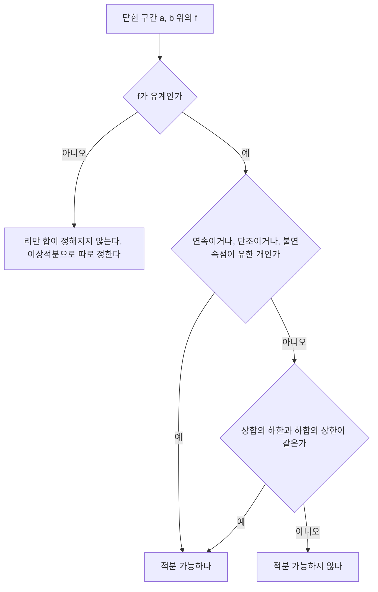



요약

속도계 기록만으로 이동 거리를 구하려면, 짧은 시간마다 "그때 속도 × 시간"을 더하면 된다. 시간을 잘게 나눌수록 이 합은 참값에 다가가고, 그 극한이 정적분이다. 거리, 넓이, 누적 사용량처럼 "변하는 양을 쌓은 것"을 모두 이 방법으로 정의한다. 다만 값이 아래로 내려가면 음수로 쌓여 넓이와 다를 수 있고, 너무 들쭉날쭉한 함수는 이 극한이 정해지지 않는다.

## 예시로 보기

자동차의 속도가 $$t$$초에 $$v(t) = t^2$$ m/s라 하자. 0초부터 3초까지 간 거리를 구한다. 3초를 $$n$$칸으로 나눠, 칸마다 왼쪽 끝(또는 오른쪽 끝)의 속도로 그 칸 내내 달렸다고 친다.

| 칸 수 $$n$$ | 왼쪽 끝 합 $$L_n$$ | 오른쪽 끝 합 $$R_n$$ |
|---|---|---|
| 3 | $$0 + 1 + 4 = 5$$ | $$1 + 4 + 9 = 14$$ |
| 6 | 6.875 | 11.375 |
| 30 | 8.555 | 9.455 |
| 300 | 8.95505 | 9.04505 |

속도가 계속 커지므로 왼쪽 끝 합은 모자라고 오른쪽 끝 합은 넘친다. 두 합이 함께 9로 모이므로 거리는 9 m다. 그래프로 보면 곡선 $$y = t^2$$ 아래 $$[0, 3]$$ 구간의 넓이다. 속도 함수가 아래 정의의 $$f$$, 칸의 폭이 $$\Delta x$$, 칸마다 고른 시각이 $$x_i^*$$다.

표의 $$n = 6$$ 줄이다. 왼쪽은 막대마다 곡선 아래에 틈이 남고, 오른쪽은 막대가 곡선 위로 삐져나온다. 두 그림에서 막대와 곡선이 어긋난 부분이 칸을 잘게 할수록 함께 줄어든다[^s1].

## 정의

정의

$$f$$가 $$[a, b]$$에서 정의된 함수라 하자. 구간을 $$a = x_0 < x_1 < \cdots < x_n = b$$로 나누고(분할), 각 칸 $$[x_{i-1}, x_i]$$에서 점 $$x_i^*$$를 골라 만든

$$S = \sum_{i=1}^{n} f(x_i^*)\,\Delta x_i \qquad (\Delta x_i = x_i - x_{i-1})$$

를 **리만 합**이라 한다. 가장 넓은 칸의 폭 $$\max_i \Delta x_i$$가 0으로 갈 때, 점을 어떻게 고르든 $$S$$가 같은 수 $$I$$로 다가가면 $$f$$는 **적분 가능**하고 $$\int_a^b f(x)\,dx = I$$라 쓴다[^1]. 
엄밀히는: $$\forall \varepsilon > 0\ \exists \delta > 0$$($$\forall$$은 "모든"), 폭이 모두 $$\delta$$ 미만인 모든 분할과 점 선택에서 $$\vert S - I\vert  < \varepsilon$$.

$$\int$$는 합(Sum)의 S를 늘인 기호이고, $$dx$$는 $$\Delta x$$가 한없이 작아진 것을 나타낸다. $$b < a$$이면 $$\int_a^b f = -\int_b^a f$$로, $$\int_a^a f = 0$$으로 약속한다.

**설계 이유.** "점을 어떻게 고르든"을 요구하는 이유는 결과가 자르는 방식에 따라 달라지면 안 되기 때문이다. 그래서 칸 안에서 가장 큰 값을 골라도(넘치는 합), 가장 작은 값을 골라도(모자라는 합) 같은 극한이어야 한다. $$f$$가 음수인 곳은 음수로 더해진다. 속도가 음수면 뒤로 간 것이므로, "순 이동 거리"로 읽으면 자연스럽다.

**동치인 다른 정의.** 칸마다 가장 큰 값으로 만든 **상합** $$U$$와 가장 작은 값으로 만든 **하합** $$L$$을 쓰면, 유계인 $$f$$는 $$\inf U = \sup L$$일 때 그리고 그때만 적분 가능하다(다르부 판정)[^2]. 예시의 $$R_n$$, $$L_n$$이 증가함수의 상합과 하합이다.

**적분 가능한 것.** 닫힌 구간에서 연속인 함수는 적분 가능하다[^1]. 단조 함수(아래 증명)와 불연속점이 유한 개인 유계 함수도 적분 가능하다[^2]. 예: $$[0, 3]$$에서 $$x^2$$ (값 9), $$[0, \pi]$$에서 $$\sin x$$ (값 2), $$[0, 3]$$에서 계단 함수 $$\lfloor x \rfloor$$ (값 $$0 + 1 + 2 = 3$$).

**적분 가능하지 않은 것.** 유리수에서 1, 무리수에서 0인 디리클레 함수는 어떤 칸에도 두 종류의 수가 다 있어 상합은 늘 1, 하합은 늘 0이다. $$(0, 1]$$의 $$\frac1x$$처럼 값이 한없이 커지는 함수도 리만 합이 정해지지 않는다. 이런 경우는 [이상적분](/Hongs_Blog/studies/calculus/improper-integrals/)에서 극한으로 따로 다룬다.

가운데 질문은 빨리 판정하는 지름길이고, 마지막 질문(다르부 판정)이 정의와 같은 기준이다. 지름길에 걸리지 않는 함수라도 마지막 질문에서 적분 가능으로 판정될 수 있다[^s2].

**기본 성질.** 적분은 선형이다($$\int (cf + g) = c\int f + \int g$$). 구간을 나눠 더할 수 있다($$\int_a^b = \int_a^c + \int_c^b$$). $$f \le g$$이면 $$\int f \le \int g$$이다.

## 증명

증가함수가 적분 가능함을 상합과 하합의 차이로 보인다.

증명 펼치기

$$f$$가 $$[a, b]$$에서 증가한다고 하자. $$n$$등분하고 $$\Delta x = \frac{b - a}{n}$$이라 하자.
1. *상합과 하합:* 증가함수라 칸의 가장 큰 값은 오른쪽 끝, 가장 작은 값은 왼쪽 끝이다. 그래서 $$U_n = R_n$$, $$L_n$$은 왼쪽 끝 합이다.
2. *차이가 한 줄로 줄어든다:* $$R_n - L_n = \sum_{i=1}^{n} \big(f(x_i) - f(x_{i-1})\big)\Delta x = \big(f(b) - f(a)\big)\Delta x$$. 가운데 항들이 서로 지워진다(망원 합).
3. *0으로 간다:* $$f(b) - f(a)$$는 고정된 수이고 $$\Delta x \to 0$$이라 차이가 0으로 간다.
4. *끼우기:* 어떤 점을 골라도 리만 합은 $$L_n$$과 $$R_n$$ 사이에 있으므로 모두 같은 극한으로 간다. ∎

연속함수의 경우는 "닫힌 구간의 연속함수는 고르게 연속"이라는 사실이 필요해 [증명 생략: 해석학 교재의 리만 적분 장].

### 스스로 설명해 보기

1. 증명 2단계의 합이 f(b) − f(a)만 남는 이유는?

$$\big(f(x_1) - f(x_0)\big) + \big(f(x_2) - f(x_1)\big) + \cdots$$에서 $$f(x_1)$$, $$f(x_2)$$, …가 한 번은 더해지고 한 번은 빼져 지워진다. 남는 것은 $$f(x_n) - f(x_0)$$이다.

2. 증명 4단계에서 "모든 리만 합이 L_n과 R_n 사이"인 이유는?

칸 안의 어떤 점 $$x_i^*$$에서도 $$f(x_{i-1}) \le f(x_i^*) \le f(x_i)$$이다(증가함수). 칸마다 이 부등식에 $$\Delta x$$를 곱해 더하면 된다.

이 증명의 핵심 아이디어는?

모자라는 합과 넘치는 합으로 참값을 끼우고, 두 합의 차이가 0으로 가는지만 본다. 참값을 모르면서도 존재를 보일 수 있다.

같은 방법을 쓸 수 있는 다른 상황은?

이산수학의 [조화수 어림](/Hongs_Blog/studies/discrete-math/sums-asymptotics/)처럼 합을 위아래로 끼우는 모든 곳, 그리고 [이분법](/Hongs_Blog/studies/calculus/continuity/)이 구간을 좁혀 근을 끼우는 방식이다.

## 예제

$$\int_0^1 x\,dx$$를 정의대로 구한다.

1. *분할:* $$n$$등분, $$\Delta x = \frac1n$$, 오른쪽 끝 $$x_i = \frac in$$.
2. *합:* $$R_n = \sum_{i=1}^{n}\frac in \cdot \frac1n = \frac{1}{n^2}\cdot\frac{n(n+1)}{2} = \frac{n + 1}{2n}$$.
3. *극한:* $$n \to \infty$$이면 $$\frac12$$. 밑변 1, 높이 1인 삼각형의 넓이와 같다.

검증: 예시 표의 $$L_n$$, $$R_n$$, 예제의 $$\frac{n+1}{2n}$$, 카드 C2의 값, 증가함수에서 $$R_n - L_n = (f(b) - f(a))\Delta x$$, 계단 함수의 값 3, 디리클레 함수의 상합·하합(유리수 점과 무리수 점을 골라 계산), 수치 적분 규칙의 오차 차수(실험) — [11_riemann-integral_verify.py](/Hongs_Blog/studies/calculus/code/11_riemann-integral_verify/)

## 활용

- **수치 적분.** 원시함수를 모르는 함수(예: $$e^{-x^2}$$)는 리만 합으로 계산한다. 칸 수 $$n$$을 두 배로 할 때 오차가 왼쪽 끝 합은 약 절반, 사다리꼴 규칙은 약 $$\frac14$$, 심프슨 규칙은 약 $$\frac{1}{16}$$로 준다(매끄러운 함수)[^3]. 구현: [11_riemann-integral_impl.py](/Hongs_Blog/studies/calculus/code/11_riemann-integral_impl/).

$$\int_0^1 e^x\,dx$$를 세 방법으로 계산한 오차다. 두 눈금이 모두 로그라 세 선이 곧게 내려가고, 기울기가 가파를수록 칸을 늘릴 때 오차가 빨리 준다. 심프슨 규칙은 칸 512개면 오차가 $$10^{-12}$$ 아래다[^s1].
- **누적량.** 전력(W)을 시간에 대해 적분하면 에너지(J), 네트워크 전송률을 적분하면 보낸 데이터 양이다. 로그가 일정 간격으로 찍힌 측정값이면 그 자체가 리만 합이다.
- **확률.** 연속 확률변수의 확률은 확률밀도 함수 아래 넓이다([연속 확률변수와 확률밀도](/Hongs_Blog/studies/probability-statistics/continuous-rv/)).
- **흔한 실수.** 넓이를 구하면서 $$x$$축 아래 부분을 음수로 더하는 것. 넓이는 $$\int \vert f\vert $$다.
- 알고리즘에서: [직사각형의 넓이](/Hongs_Blog/studies/algorithms/pg12974/)는 세로로 덮인 길이를 $$x$$에 대해 적분해 넓이를 구한다. 이 길이는 직사각형이 들어오고 나가는 $$x$$에서만 바뀌는 계단 함수라, 그 $$x$$들로 나눈 리만 합이 근삿값이 아니라 참값이다.

## 연결

- 선수: [극한](/Hongs_Blog/studies/calculus/limits/), [수열과 합의 기호](/Hongs_Blog/studies/college-math/sequences-sigma/)
- 계산 도구: [미적분의 기본정리](/Hongs_Blog/studies/calculus/ftc/)가 리만 합의 극한을 원시함수의 차로 바꾼다.
- 거꾸로 된 연산: [도함수](/Hongs_Blog/studies/calculus/derivative/)는 차이의 비의 극한, 적분은 곱의 합의 극한이다.
- 다른 과목: [삼색 이론](/Hongs_Blog/studies/human-interface-media/trichromatic-theory/)은 눈의 추상체 반응을 빛의 스펙트럼과 감도 곡선을 곱해 적분한 $$r_k = \int i(\lambda)\sigma_k(\lambda)\,d\lambda$$로 쓴다. 파장을 잘게 나눠 곱해 더하는 리만 합과 같은 구조다.

## 자주 하는 오해

"정적분은 곡선 아래의 넓이다"

틀렸다. 첫 예제들이 모두 양수 함수라 넓이로 배우기 쉽다. 하지만 정적분은 부호가 있는 누적량이다. $$\int_0^{2\pi}\sin x\,dx = 0$$이지만 곡선과 $$x$$축 사이의 넓이는 4다. 위아래 넓이가 2씩 있어서 서로 지워진다. 넓이가 필요하면 $$\int_0^{2\pi}\vert \sin x\vert \,dx = 4$$처럼 절댓값을 적분한다.

## 확인 문제

**C1** 리만 합과 정적분의 정의를 쓰라. "점을 어떻게 고르든"이라는 조건이 왜 들어가는지도 한 줄로 쓰라.

**답:** 분할 $$a = x_0 < \cdots < x_n = b$$와 점 $$x_i^* \in [x_{i-1}, x_i]$$로 만든 $$\sum f(x_i^*)\Delta x_i$$가 리만 합이다. 칸의 최대 폭이 0으로 갈 때 점 선택과 상관없이 같은 극한 $$I$$로 가면 $$\int_a^b f = I$$다. 점 선택을 묶는 이유는 값이 자르는 방식에 따라 달라지지 않게 하기 위해서다.

**C2** f(x) = x²을 [0, 2]에서 4등분해 왼쪽 끝 합과 오른쪽 끝 합을 구하고, 참값과 비교하라.

**답:** $$\Delta x = 0.5$$. 왼쪽 $$0.5(0 + 0.25 + 1 + 2.25) = 1.75$$, 오른쪽 $$0.5(0.25 + 1 + 2.25 + 4) = 3.75$$. 참값 $$\frac83 \approx 2.667$$이 그 사이에 있다. 두 합의 차는 $$(f(2) - f(0)) \times 0.5 = 2$$다.

**C3** 유계인데 리만 적분 가능하지 않은 함수를 들고 이유를 쓰라.

**답:** 디리클레 함수(유리수에서 1, 무리수에서 0). 어떤 칸에도 유리수와 무리수가 모두 있어, 점을 유리수로 고르면 리만 합이 늘 $$b - a$$, 무리수로 고르면 늘 0이다. 칸을 아무리 잘게 해도 한 값으로 모이지 않는다.

**C4** 증가함수에서 n등분한 오른쪽 끝 합과 왼쪽 끝 합의 차가 (f(b) − f(a))(b − a)/n인 이유를 설명하라.

**답:** 칸마다 차이가 $$(f(x_i) - f(x_{i-1}))\Delta x$$이고, 더하면 가운데 값들이 지워져 $$(f(b) - f(a))\Delta x$$만 남는다(망원 합). $$\Delta x = \frac{b - a}{n}$$이다.

[^1]: OpenStax, *Calculus Volume 1*, 5.1절 "Approximating Areas"(왼쪽·오른쪽 끝 합, 상합·하합), 5.2절 "The Definite Integral"(정의, 적분 가능성, 성질).
[^2]: 보충 다르부 판정과 "불연속점이 유한 개인 유계 함수는 적분 가능"은 해석학 교재의 리만 적분 장에 있는 표준 결과다. 이 문서에서는 증가함수의 경우만 증명했다. 계단 함수의 값 3은 11_riemann-integral_verify.py에서 확인했다.
[^3]: OpenStax, *Calculus Volume 2*, 3.6절 "Numerical Integration"(중점·사다리꼴·심프슨 규칙과 오차 한계). 오차 비율은 11_riemann-integral_verify.py에서 실험으로 확인했다.
[^s1]: 보충 그림 두 장은 원본에 없다. [11_riemann-integral_plot.py](/Hongs_Blog/studies/calculus/code/11_riemann-integral_plot/)로 그렸고, 표의 $$L_6 = 6.875$$, $$R_6 = 11.375$$와, $$n$$을 64에서 128로 늘릴 때 오차 비율이 왼쪽 끝 합 약 2, 사다리꼴 약 4, 심프슨 약 16인 것을 같은 코드로 확인했다.
[^s2]: 보충 다이어그램 1개는 원본에 없다. 정의 절의 동치인 정의(다르부 판정), 적분 가능한 것과 적분 가능하지 않은 것을 근거로 그렸다.

