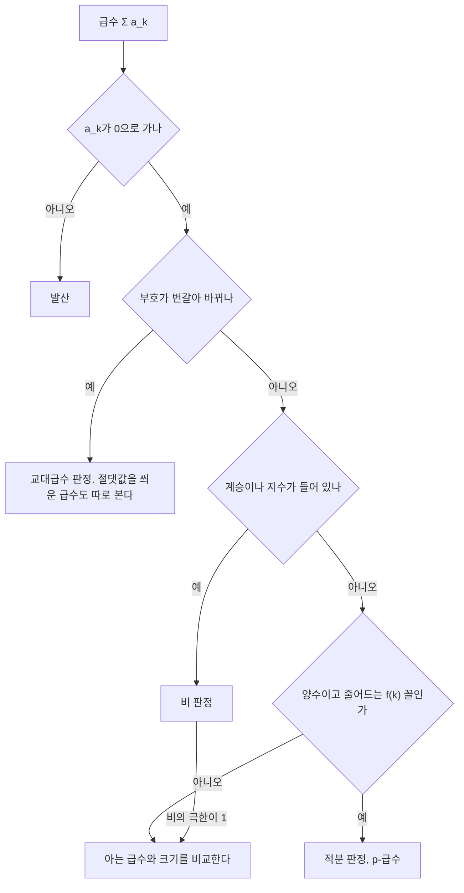



요약

무한히 많은 수를 더해도 결과가 유한한 값에 머무는지를 따진다. 앞에서부터 더한 합이 어떤 값에 다가가면 수렴이다. 항이 0으로 가는 것은 필요하지만 충분하지 않다. 1, 2분의 1, 3분의 1, …을 차례로 더한 합은 항이 0으로 가도 끝없이 커진다. 그래서 등비급수, 적분, 이웃 항의 비와 비교하는 판정법을 쓴다. 또 음수 항이 섞여 겨우 수렴하는 급수는 더하는 순서를 바꾸면 합이 달라질 수 있다.

## 예시로 보기

같은 "0으로 가는 항"이라도 결과가 다르다. 처음 $$n$$개를 더한 값(부분합)을 본다.

| $$n$$ | $$\sum \frac1k$$ | $$\sum \frac{1}{k^2}$$ | $$\sum \frac{(-1)^{k+1}}{k}$$ |
|---|---|---|---|
| 10 | 2.929 | 1.550 | 0.6456 |
| 1,000 | 7.485 | 1.6439 | 0.6926 |
| $$10^6$$ | 14.39 | 1.644933 | 0.693147 |
| 극한 | 발산 | $$\frac{\pi^2}{6} \approx 1.644934$$ | $$\ln 2 \approx 0.693147$$ |

첫 열은 로그처럼 느리게 끝없이 자란다([합 ↔ 적분](/Hongs_Blog/studies/calculus/sum-integral-bounds/)). 둘째 열은 항이 더 빨리 줄어 수렴한다. 셋째 열은 첫 열과 크기가 같은 항에 부호만 번갈아 붙였는데 수렴한다. 부분합의 열이 아래 정의의 $$S_n$$이다.

가로축이 로그 눈금이라, 파란 선이 곧게 오른다는 것은 항을 10배 더할 때마다 같은 폭씩 커진다는 뜻이다. 주황 선은 점선 $$\frac{\pi^2}{6}$$에 붙는다. 초록 선은 위아래로 번갈아 튀면서 그 폭이 줄어들어 점선 $$\ln 2$$로 모인다[^s3].

## 정의

정의

급수 $$\sum_{k=1}^{\infty} a_k$$의 **부분합**은 $$S_n = a_1 + \cdots + a_n$$이다. 수열 $$S_n$$이 유한한 극한 $$S$$로 가면 급수가 **수렴**하고 합이 $$S$$라 한다. 아니면 **발산**한다. $$\sum\vert a_k\vert $$가 수렴하면 **절대수렴**, $$\sum a_k$$는 수렴하지만 $$\sum \vert a_k\vert $$는 발산하면 **조건수렴**이라 한다[^1].

판정법

1. **발산 판정.** $$a_k \not\to 0$$이면 발산한다. 역은 맞지 않는다.
2. **적분 판정.** $$f$$가 $$[1, \infty)$$에서 양수이고 연속이며 줄어들기만 하고 $$a_k = f(k)$$이면, $$\sum a_k$$와 $$\int_1^\infty f$$($$\int$$는 넓이를 구하는 적분 기호)는 함께 수렴하거나 함께 발산한다. 그래서 p-급수 $$\sum\frac{1}{k^p}$$는 $$p > 1$$일 때만 수렴한다.
3. **비교 판정.** $$0 \le a_k \le b_k$$이고 $$\sum b_k$$가 수렴하면 $$\sum a_k$$도 수렴한다.
4. **비 판정.** $$L = \lim\left\vert \frac{a_{k+1}}{a_k}\right\vert $$($$\lim$$은 한없이 가까이 갈 때 다가가는 값(극한))이 $$L < 1$$이면 절대수렴, $$L > 1$$이면 발산, $$L = 1$$이면 판정할 수 없다.
5. **교대급수 판정.** $$b_k > 0$$이 줄어들며 0으로 가면 $$\sum(-1)^{k+1}b_k$$는 수렴하고, $$n$$개까지 더한 오차는 다음 항 $$b_{n+1}$$ 이하다.
6. **절대수렴이면 수렴한다.** 절대수렴하는 급수는 순서를 바꿔 더해도 합이 같다. 조건수렴하는 급수는 순서를 바꾸면 합이 달라질 수 있다(리만 재배열 정리).

발산 판정은 맨 먼저 하는 값싼 확인이다. 통과해도 수렴이 정해지지는 않아서, 급수의 모양을 보고 아래 판정 중 하나로 간다. 이 순서는 흔히 쓰는 요령일 뿐 규칙은 아니다[^s4].

증명

1. 수렴하면 $$a_n = S_n - S_{n-1} \to S - S = 0$$. 이것의 대우다.
2. [합 ↔ 적분](/Hongs_Blog/studies/calculus/sum-integral-bounds/)의 끼우기 $$\int_1^{n+1}f \le S_n \le f(1) + \int_1^n f$$에서, 적분이 유한하면 늘어나기만 하는 $$S_n$$이 위로 막혀 수렴하고, 적분이 무한대면 $$S_n$$도 무한대로 간다. p-급수는 [p-적분](/Hongs_Blog/studies/calculus/improper-integrals/)에 대응한다.
3. $$\sum a_k$$의 부분합은 늘어나기만 하고 $$\sum b_k$$ 이하라 위로 막혀 있다(단조 수렴).
4. $$L < r < 1$$인 $$r$$을 잡으면 충분히 큰 $$k$$부터 $$\vert a_{k+1}\vert  \le r\vert a_k\vert $$라, 그 뒤의 항은 공비 $$r$$인 [등비급수](/Hongs_Blog/studies/college-math/geometric-series/)로 위가 막힌다. 3을 쓴다. $$L > 1$$이면 항이 커져 1을 쓴다. 
5·6. [증명 생략: OpenStax *Calculus Volume 2* 5.5절(교대급수, 재배열)]. ∎

## 예제

$$\sum_{k=1}^{\infty}\frac{k^2}{2^k}$$이 수렴하는지 본다.

1. *알맞은 판정 고르기:* 다항식 ÷ 지수 꼴이라 이웃 항의 비가 간단하다. 비 판정.
2. *비 계산:* $$\frac{a_{k+1}}{a_k} = \frac{(k+1)^2}{k^2}\cdot\frac12 \to \frac12$$.
3. *결론:* $$\frac12 < 1$$이라 수렴한다. 실제 합은 6이다.

검증: 예시 표의 부분합, 적분 판정의 끼우기, $$\sum\frac{k^2}{2^k} = 6$$과 $$\sum\frac{k}{2^k} = 2$$, $$\sum\frac{1}{k!} = e - 1$$, 교대급수의 오차 한계($$n \le 1000$$), 재배열 $$1 + \frac13 - \frac12 + \frac15 + \frac17 - \frac14 + \cdots \to \frac32\ln 2$$, 부동소수점 덧셈 순서의 차이 — [17_series-convergence_verify.py](/Hongs_Blog/studies/calculus/code/17_series-convergence_verify/). 바젤 문제의 값 $$\frac{\pi^2}{6}$$의 증명은 이 문서 범위 밖이고[^s2], 여기서는 부분합이 그 값으로 가는 것만 확인했다.

## 활용

- **근사의 오차 예산.** 무한급수로 정의된 값(예: $$e = \sum\frac{1}{k!}$$)을 계산할 때 몇 항에서 멈출지 정한다. 교대급수는 "다음 항"이 오차의 상한이라 멈출 곳을 바로 안다. [테일러 급수](/Hongs_Blog/studies/calculus/taylor-series/)가 대표적인 예다.
- **알고리즘 비용.** 힙 만들기의 $$\sum\frac{h}{2^h} < 2$$처럼 무한급수의 수렴이 "총비용은 선형"을 보장한다([합의 계산과 어림](/Hongs_Blog/studies/discrete-math/sums-asymptotics/)).
- **부동소수점 덧셈의 순서.** 컴퓨터의 덧셈은 결합법칙이 정확히 맞지 않아, 같은 항을 다른 순서로 더하면 결과의 끝자리가 달라진다. 작은 항부터 더하거나 보정 덧셈(카한 합)을 쓰면 오차가 준다[^s1]. 수학의 재배열 정리와는 원인이 다르지만 "순서가 결과를 바꿀 수 있다"는 경고는 같다.
- 알고리즘에서: 파이썬 `heapq.heapify`가 리스트를 $$O(n)$$에 힙으로 바꾸는 것이 위 힙 만들기의 실제 예다. 높이 $$h$$인 노드는 약 $$n/2^{h+1}$$개이고 각자 많아야 $$h$$층 내려가서, 총비용이 대략 $$n\sum_{h\ge0}\frac{h}{2^{h+1}} = n$$이다([힙과 우선순위 큐](/Hongs_Blog/studies/algorithms/heap/)).

## 연결

- 선수: [수열의 극한과 e](/Hongs_Blog/studies/calculus/sequence-limits/), [이상적분](/Hongs_Blog/studies/calculus/improper-integrals/), [등비급수](/Hongs_Blog/studies/college-math/geometric-series/)
- 이어지는 개념: [테일러 급수](/Hongs_Blog/studies/calculus/taylor-series/)(함수를 급수로)

## 확인 문제

**C1** 다음 중 수렴하는 것을 모두 고르고 판정법을 쓰라. (가) $$\sum\frac1k$$ (나) $$\sum\frac{1}{k^2}$$ (다) $$\sum\frac{1}{\sqrt k}$$ (라) $$\sum\frac{(-1)^{k+1}}{k}$$ (마) $$\sum\frac{k}{k+1}$$

**답:** (나) p-급수 $$p = 2 > 1$$. (라) 교대급수 판정. (가)와 (다)는 p-급수 $$p \le 1$$이라 발산, (마)는 항이 1로 가서 발산 판정으로 발산한다.

**C2** 항이 0으로 가는데 발산하는 급수를 들고, 발산하는 이유를 한 가지 방법으로 보여라.

**답:** 조화급수 $$\sum\frac1k$$. 적분 판정으로 $$\int_1^\infty\frac{dx}{x} = \infty$$라 발산한다. 또는 $$\frac12$$, $$\frac13 + \frac14$$, $$\frac15 + \cdots + \frac18$$처럼 묶으면 묶음마다 $$\frac12$$ 이상이라 끝없이 커진다.

**C3** $$\sum_{k\ge1}\frac{k!}{k^k}$$의 수렴을 비 판정으로 보여라.

**답:** $$\frac{a_{k+1}}{a_k} = \frac{(k+1)!}{(k+1)^{k+1}}\cdot\frac{k^k}{k!} = \left(\frac{k}{k+1}\right)^k = \frac{1}{(1 + 1/k)^k} \to \frac1e < 1$$. 수렴한다.

[^1]: OpenStax, *Calculus Volume 2*, 5.2절 "Infinite Series", 5.3절 "The Divergence and Integral Tests", 5.4절 "Comparison Tests", 5.5절 "Alternating Series"(절대·조건수렴, 재배열), 5.6절 "Ratio and Root Tests".
[^s1]: 보충 부동소수점 덧셈이 결합법칙을 만족하지 않는다는 것과 카한 보정 덧셈은 수치 해석의 표준 내용이다. 17_series-convergence_verify.py에서 같은 항을 큰 것부터와 작은 것부터 더한 결과가 다름을 확인했다.
[^s2]: 보충 $$\sum\frac{1}{k^2} = \frac{\pi^2}{6}$$은 오일러가 구한 값(바젤 문제)이다. 푸리에 급수의 파르스발 등식으로 증명할 수 있어 미분적분학의 [푸리에 급수](/Hongs_Blog/studies/calculus/fourier-series/)에서 다룬다.
[^s3]: 보충 그림은 원본에 없다. [17_series-convergence_plot.py](/Hongs_Blog/studies/calculus/code/17_series-convergence_plot/)로 그렸고, 예시 표의 부분합($$n = 10$$, 1,000, $$10^6$$)을 같은 코드로 확인했다.
[^s4]: 보충 다이어그램 1개는 원본에 없다. 정리의 여섯 판정법과 예제의 "알맞은 판정 고르기"(다항식 ÷ 지수 꼴이라 비 판정)를 근거로 그렸다. 모양을 보고 판정을 고르는 순서는 판정법들의 조건에서 나온 요령이다.

