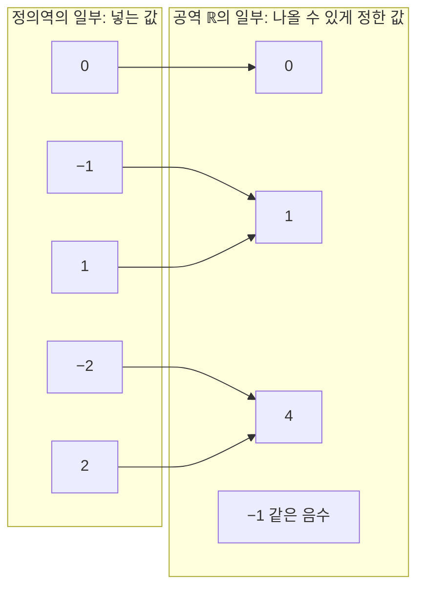



요약

함수는 자판기와 같다. 버튼 하나를 누르면 음료가 정확히 하나 나온다. 여러 버튼이 같은 음료를 내는 것은 괜찮지만, 같은 버튼에서 매번 다른 음료가 나오면 함수가 아니다. 그리고 함수를 말할 때는 어떤 입력을 받는지도 함께 정해야 한다.

## 예시로 보기

학번을 넣으면 이름이 나오는 대응은 함수다. 학번마다 이름이 하나뿐이다. 거꾸로 이름을 넣으면 학번이 나오는 대응은 함수가 아닐 수 있다. 동명이인이 있으면 한 이름에 학번이 둘이다.

$$f(x) = x^2$$에서는 $$-2$$와 $$2$$가 모두 $$4$$로 간다. 서로 다른 입력이 같은 출력을 내는 것은 허용된다. 실제로 나오는 출력은 $$0$$ 이상의 실수뿐이다.

| 입력 $$x$$ | $$-2$$ | $$-1$$ | $$0$$ | $$1$$ | $$2$$ |
|---|---|---|---|---|---|
| 출력 $$f(x)$$ | $$4$$ | $$1$$ | $$0$$ | $$1$$ | $$4$$ |

자판기의 버튼 전체가 아래 정의의 정의역, 자판기에 넣을 수 있게 정해 둔 음료 종류가 공역, 실제로 나오는 음료가 치역이다. 자판기에는 품절이 있지만 함수에는 없다. 정의역의 모든 입력에는 반드시 출력이 있다.

왼쪽의 입력마다 화살표가 정확히 하나씩 나간다. 오른쪽의 1과 4에는 화살표가 둘씩 들어오고, 음수에는 하나도 들어오지 않는다. 화살표가 실제로 닿는 0, 1, 4가 치역에 들어간다[^s3].

그래프로는 세로선을 그어 판정한다. 어디에 그어도 그래프와 두 번 이상 만나지 않으면 함수의 그래프다(수직선 판정). 원 $$x^2 + y^2 = 1$$은 세로선 $$x = 0$$과 $$(0, 1)$$, $$(0, -1)$$ 두 점에서 만난다. 그래서 원 전체는 $$y$$를 $$x$$의 함수로 나타내지 않는다.

왼쪽 원은 세로선 $$x = 0$$과 두 점에서 만나서 함수의 그래프가 아니다. 오른쪽 포물선은 어디에 세로선을 그어도 한 점에서만 만난다[^s2].

## 정의

$$x \in X$$는 "$$x$$가 집합 $$X$$의 원소"라는 뜻이다.

정의

집합 $$X$$, $$Y$$에 대해, $$X$$의 **각** 원소 $$x$$에 $$Y$$의 원소 $$f(x)$$를 **정확히 하나씩** 대응시키는 규칙을 함수 $$f: X \to Y$$라 한다[^1].
- 정의역(domain) $$X$$: 입력으로 받는 값 전체
- 공역(codomain) $$Y$$: 출력이 속하도록 정해 둔 집합
- 치역(range, image) $$f(X) = \{ f(x) : x \in X \}$$: 실제로 나오는 출력 전체. 늘 $$f(X) \subseteq Y$$($$\subseteq$$는 "~에 모두 들어 있다(부분집합)")다.
- 두 함수가 같다는 것은 정의역과 공역이 같고, 정의역의 모든 $$x$$에서 출력이 같다는 뜻이다.

식만 주고 정의역을 말하지 않으면, 식이 실수 값을 갖는 모든 실수를 정의역으로 본다. 이것을 자연 정의역이라 한다[^2]. 걸리는 곳은 대개 두 군데다. 분모가 $$0$$이 되는 곳과, 짝수 제곱근 안이 음수가 되는 곳이다.

## 예제

$$f(x) = \dfrac{\sqrt{x - 1}}{x - 3}$$의 자연 정의역을 구한다.

1. *제곱근 조건:* $$x - 1 \ge 0$$이므로 $$x \ge 1$$.
2. *분모 조건:* $$x - 3 \ne 0$$이므로 $$x \ne 3$$.
3. *합치기:* $$[1, 3) \cup (3, \infty)$$. 구간 $$[1, 3)$$은 $$1 \le x < 3$$을 뜻한다.

그래프는 $$x = 1$$에서 값 0으로 시작하고, 그 왼쪽(회색)에는 없다. $$x = 3$$에서는 분모가 0이라 그래프가 끊기고, 3에 다가갈수록 위아래로 한없이 뻗는다[^s2].

검증: $$-5 \le x \le 10$$을 0.01 간격으로 나눈 1,501점에서 파이썬으로 실제 계산되는 점이 정확히 $$[1, 3) \cup (3, \infty)$$. 카드 C2의 판정과 오해의 $$x^2$$ 예도 확인 — [01_function_verify.py](/Hongs_Blog/studies/college-math/code/01_function_verify/)

## 활용

- 프로그래밍 언어의 타입 표기 `f: int -> str`는 정의역과 공역을 적은 것이다.
- 해시 함수는 같은 키에 늘 같은 값을 내야 한다. 함수의 조건 그대로다. 서로 다른 키가 같은 값을 내는 충돌은 함수의 정의상 허용된다.
- 같은 인자에 늘 같은 값을 돌려주고 바깥 상태를 바꾸지 않는 코드를 순수 함수라 한다[^s1]. `random.random()`처럼 부를 때마다 값이 바뀌는 코드는 수학의 함수가 아니다.
- 정의역 밖의 입력은 실행 오류가 된다. 파이썬에서 `1/0`은 `ZeroDivisionError`, `math.sqrt(-1)`은 `ValueError`다. 계산 전에 정의역을 따지면 이런 오류를 미리 막는다.
- 알고리즘에서: 파이썬의 `dict`와 `set`은 해시 함수로 키가 들어갈 칸을 정하는 해시 테이블이다([딕셔너리와 집합](/Hongs_Blog/studies/algorithms/hash-dict-set/)). 리스트는 넣은 뒤에도 내용이 바뀔 수 있어서, 내용으로 해시값을 내면 같은 리스트가 때에 따라 다른 값을 내게 된다. 그래서 파이썬은 리스트를 키로 받지 않고(`TypeError`), 바뀌지 않는 튜플은 받는다.

## 연결

- 이어지는 개념: [함수의 변환과 합성](/Hongs_Blog/studies/college-math/function-transformation/), [역함수](/Hongs_Blog/studies/college-math/inverse-function/)
- 일대일 함수와 위로의 함수, 그리고 함수로 집합의 크기를 비교하는 방법은 이산수학의 [함수의 성질과 집합의 크기](/Hongs_Blog/studies/discrete-math/function-properties/)에서 다룬다.

## 자주 하는 오해

"함수는 곧 식이다"

틀렸다. 교과서의 함수가 대부분 $$f(x) = x^2$$ 같은 식으로 나와서 그렇게 느껴진다. 실제로 함수를 정하는 것은 대응 규칙과 정의역이다. 표나 프로그램으로 주어져도 함수이고, 같은 식이라도 정의역이 다르면 다른 함수다. $$x^2$$은 정의역이 실수 전체이면 $$f(-2) = f(2)$$라서 출력에서 입력을 되찾을 수 없다. 정의역을 $$x \ge 0$$으로 줄이면 되찾을 수 있다. 성질이 다르니 다른 함수다.

## 확인 문제

**C1** 함수를 정의역·공역·치역이라는 말을 써서 정의하고, 공역과 치역이 다른 예를 하나 들라.

**답:** 정의역 $$X$$의 각 원소에 공역 $$Y$$의 원소를 정확히 하나씩 대응시키는 규칙이다. 치역은 실제로 나오는 출력의 집합으로, 공역의 부분집합이다. 예: $$f: \mathbb{R} \to \mathbb{R}$$, $$f(x) = x^2$$의 공역은 실수 전체이고 치역은 $$[0, \infty)$$다.

**흔한 오답:** "입력 하나에 출력 하나"만 쓰고, 정의역의 **모든** 입력에 출력이 있어야 한다는 조건을 빠뜨리는 것.

**C2** 함수인 것과 아닌 것을 고르고 이유를 쓰라. (a) 사람 → 그 사람의 생일 (b) 날짜 → 그날 태어난 사람 (c) 실수 x → x² + y² = 1을 만족하는 y (d) 파이썬 `def g(x): return random.random() + x`

**답:** (a) 함수다. 사람마다 생일은 하나다. (b) 아니다. 한 날짜에 여러 명이 태어나기도 하고, 아무도 태어나지 않은 날짜도 있다. (c) 아니다. $$x = 0$$이면 $$y = \pm 1$$로 둘이고, $$\vert x\vert  > 1$$이면 $$y$$가 없다. (d) 수학의 함수가 아니다. 같은 $$x$$에도 부를 때마다 다른 값이 나온다.

**흔한 오답:** (a)를 "생일이 같은 사람이 있으니 함수가 아니다"라고 하는 것. 서로 다른 입력이 같은 출력을 내는 것은 허용된다.

**C3** f(x) = √(x−1) / (x−3)의 자연 정의역을 구하라.

**답:** $$[1, 3) \cup (3, \infty)$$. 제곱근에서 $$x \ge 1$$, 분모에서 $$x \ne 3$$이다.

**흔한 오답:** $$x > 1$$로 쓰는 것($$\sqrt{0} = 0$$이므로 $$x = 1$$도 된다), 또는 $$x \ne 3$$을 빠뜨리는 것.

[^1]: OpenStax, *Precalculus 2e*, 1.1절 "Functions and Function Notation"
[^2]: OpenStax, *Precalculus 2e*, 1.2절 "Domain and Range"
[^s1]: 에이전트 보충. 순수 함수는 함수형 프로그래밍의 용어다. 수학의 함수와 코드의 함수가 어디서 갈리는지 보이려고 넣었다.
[^s2]: 에이전트 보충. 그림 두 장은 원본에 없다. [01_function_plot.py](/Hongs_Blog/studies/college-math/code/01_function_plot/)로 그렸고, 그림에 쓴 값(원 위 $$x = 0$$의 두 점 $$(0, \pm 1)$$, $$f(1) = 0$$, $$f(2) = -1$$, $$f(5) = 1$$, $$x = 0.5$$와 $$x = 3$$에서 계산이 안 됨)을 같은 코드로 확인했다.
[^s3]: 에이전트 보충. 다이어그램 1개는 원본에 없다. `예시로 보기`의 $$x^2$$ 값 표와 `정의`의 정의역·공역·치역을 근거로, 공역을 실수 전체로 두고 그렸다(OpenStax, *Precalculus 2e*, 1.1절).

