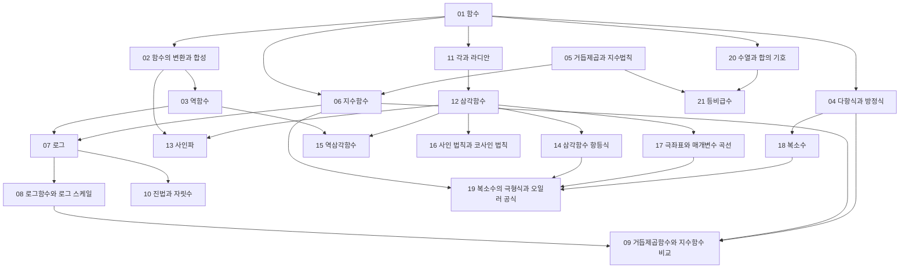


> 교재: OpenStax *Precalculus 2e*, *College Algebra 2e* (공개 교재)

## 먼저 알아야 할 것
- 없다. 공학수학의 시작점이다.

## 1단원 · 함수

읽기 전에

1. 같은 식 $$x^2$$인데 한쪽은 출력에서 입력을 되찾을 수 있고 다른 쪽은 없다. 두 함수는 무엇이 다를까? → [역함수](/Hongs_Blog/studies/college-math/inverse-function/)
2. $$f(x - 3)$$의 그래프는 $$f(x)$$보다 왼쪽에 있을까, 오른쪽에 있을까? → [함수의 변환과 합성](/Hongs_Blog/studies/college-math/function-transformation/)
3. 3차 방정식은 근을 몇 개까지 가질 수 있을까? 그 이유는? → [다항식과 방정식](/Hongs_Blog/studies/college-math/polynomial/)

| 번호 | 개념 | 한 줄 | 개념 코드 | 연습 |
|---|---|---|---|---|
| 01 | [함수](/Hongs_Blog/studies/college-math/function/) | 입력 하나에 출력 하나를 짝짓는 규칙. 정의역·공역·치역 | [그림1](/Hongs_Blog/assets/notes/college-math/01_function_fig1.svg) · [그림2](/Hongs_Blog/assets/notes/college-math/01_function_fig2.svg) · [그림 코드](/Hongs_Blog/studies/college-math/code/01_function_plot/) · [검증](/Hongs_Blog/studies/college-math/code/01_function_verify/) | — |
| 02 | [함수의 변환과 합성](/Hongs_Blog/studies/college-math/function-transformation/) | 그래프를 옮기고 늘이고 뒤집기, 함수를 이어 붙이기 | [그림1](/Hongs_Blog/assets/notes/college-math/02_function-transformation_fig1.svg) · [그림2](/Hongs_Blog/assets/notes/college-math/02_function-transformation_fig2.svg) · [그림 코드](/Hongs_Blog/studies/college-math/code/02_function-transformation_plot/) · [검증](/Hongs_Blog/studies/college-math/code/02_function-transformation_verify/) | — |
| 03 | [역함수](/Hongs_Blog/studies/college-math/inverse-function/) | 출력에서 입력을 되찾는 함수. 일대일일 때만 있다 | [그림1](/Hongs_Blog/assets/notes/college-math/03_inverse-function_fig1.svg) · [그림 코드](/Hongs_Blog/studies/college-math/code/03_inverse-function_plot/) · [검증](/Hongs_Blog/studies/college-math/code/03_inverse-function_verify/) | — |
| 04 | [다항식과 방정식](/Hongs_Blog/studies/college-math/polynomial/) | 인수정리와 근의 공식. n차 방정식의 근은 n개 이하 | [그림1](/Hongs_Blog/assets/notes/college-math/04_polynomial_fig1.svg) · [그림2](/Hongs_Blog/assets/notes/college-math/04_polynomial_fig2.svg) · [그림 코드](/Hongs_Blog/studies/college-math/code/04_polynomial_plot/) · [검증](/Hongs_Blog/studies/college-math/code/04_polynomial_verify/) | — |

떠올려 보기: 노트를 닫고 함수·합성·역함수의 정의를 쓴 뒤, 역함수가 없는 함수를 고쳐 역함수를 만드는 예를 하나 적어 본다.

## 2단원 · 지수와 로그

읽기 전에

1. 두께 0.1 mm 종이를 42번 접으면 두께가 책상 높이, 63빌딩, 달까지의 거리 중 어디에 가까울까? → [지수함수](/Hongs_Blog/studies/college-math/exponential-function/)
2. 정렬된 10억 개 자료에서 이진 탐색은 대략 몇 번 비교할까? → [로그](/Hongs_Blog/studies/college-math/logarithm/)
3. 입력을 두 배로 늘렸더니 실행 시간이 네 배가 됐다. 입력을 열 배로 늘리면 시간은 몇 배일까? → [로그함수와 로그 스케일](/Hongs_Blog/studies/college-math/log-scale/)

| 번호 | 개념 | 한 줄 | 개념 코드 | 연습 |
|---|---|---|---|---|
| 05 | [거듭제곱과 지수법칙](/Hongs_Blog/studies/college-math/exponent-laws/) | 곱은 지수의 합, 거듭제곱은 지수의 곱. 크기 어림 | [검증](/Hongs_Blog/studies/college-math/code/05_exponent-laws_verify/) | — |
| 06 | [지수함수](/Hongs_Blog/studies/college-math/exponential-function/) | 일정 비율로 거듭 곱해지는 성장. 자연상수 e (무거움) | [그림1](/Hongs_Blog/assets/notes/college-math/06_exponential-function_fig1.svg) · [그림2](/Hongs_Blog/assets/notes/college-math/06_exponential-function_fig2.svg) · [그림 코드](/Hongs_Blog/studies/college-math/code/06_exponential-function_plot/) · [검증](/Hongs_Blog/studies/college-math/code/06_exponential-function_verify/) | — |
| 07 | [로그](/Hongs_Blog/studies/college-math/logarithm/) | 몇 번 곱해야 하는지 답하는 수. 곱을 합으로 바꾼다 (무거움) | [검증](/Hongs_Blog/studies/college-math/code/07_logarithm_verify/) | [로그 계산 예제 사다리](/Hongs_Blog/studies/college-math/logarithm-ladder/) |
| 08 | [로그함수와 로그 스케일](/Hongs_Blog/studies/college-math/log-scale/) | 아주 느리게 자라는 함수. 비율을 등간격으로 보는 눈금 | [그림1](/Hongs_Blog/assets/notes/college-math/08_log-scale_fig1.svg) · [그림2](/Hongs_Blog/assets/notes/college-math/08_log-scale_fig2.svg) · [그림 코드](/Hongs_Blog/studies/college-math/code/08_log-scale_plot/) · [검증](/Hongs_Blog/studies/college-math/code/08_log-scale_verify/) | — |
| 09 | [거듭제곱함수와 지수함수 비교](/Hongs_Blog/studies/college-math/power-vs-exponential/) | 가르는 질문: 변수가 밑에 있는가, 지수에 있는가 | [그림1](/Hongs_Blog/assets/notes/college-math/09_power-vs-exponential_fig1.svg) · [그림 코드](/Hongs_Blog/studies/college-math/code/09_power-vs-exponential_plot/) · [검증](/Hongs_Blog/studies/college-math/code/09_power-vs-exponential_verify/) | — |
| 10 | [진법과 자릿수](/Hongs_Blog/studies/college-math/positional-notation/) | 2진·16진 변환. n의 자릿수는 ⌊log_b n⌋ + 1 | [그림1](/Hongs_Blog/assets/notes/college-math/10_positional-notation_fig1.svg) · [그림 코드](/Hongs_Blog/studies/college-math/code/10_positional-notation_plot/) · [검증](/Hongs_Blog/studies/college-math/code/10_positional-notation_verify/) | — |

떠올려 보기: 지수법칙 네 개를 쓰고 각각이 어느 로그 법칙이 되는지 짝지은 뒤, "변수가 밑에 있는가, 지수에 있는가"로 가르는 예를 두 개씩 든다.

## 3단원 · 삼각함수

읽기 전에

1. `math.sin(30)`을 실행하면 0.5가 나올까? → [각과 라디안](/Hongs_Blog/studies/college-math/radian/)
2. 직각삼각형에는 120°인 각이 없는데, sin 120°라는 값은 있을까? → [삼각함수](/Hongs_Blog/studies/college-math/trig-functions/)
3. 소리를 1초에 8,000번 재서 저장하면 7,000 Hz 소리는 어떻게 들릴까? → [사인파](/Hongs_Blog/studies/college-math/sinusoid/)

| 번호 | 개념 | 한 줄 | 개념 코드 | 연습 |
|---|---|---|---|---|
| 11 | [각과 라디안](/Hongs_Blog/studies/college-math/radian/) | 반지름 길이의 호가 만드는 각이 1라디안 | [그림1](/Hongs_Blog/assets/notes/college-math/11_radian_fig1.svg) · [그림 코드](/Hongs_Blog/studies/college-math/code/11_radian_plot/) · [검증](/Hongs_Blog/studies/college-math/code/11_radian_verify/) | — |
| 12 | [삼각함수](/Hongs_Blog/studies/college-math/trig-functions/) | 단위원 위 점의 좌표가 (cos, sin). 2π마다 반복 (무거움) | [그림1](/Hongs_Blog/assets/notes/college-math/12_trig-functions_fig1.svg) · [그림 코드](/Hongs_Blog/studies/college-math/code/12_trig-functions_plot/) · [검증](/Hongs_Blog/studies/college-math/code/12_trig-functions_verify/) | — |
| 13 | [사인파](/Hongs_Blog/studies/college-math/sinusoid/) | 진폭·주파수·위상 세 수로 순수한 진동을 나타낸다 | [그림1](/Hongs_Blog/assets/notes/college-math/13_sinusoid_fig1.svg) · [그림2](/Hongs_Blog/assets/notes/college-math/13_sinusoid_fig2.svg) · [그림 코드](/Hongs_Blog/studies/college-math/code/13_sinusoid_plot/) · [검증](/Hongs_Blog/studies/college-math/code/13_sinusoid_verify/) | — |
| 14 | [삼각함수 항등식](/Hongs_Blog/studies/college-math/trig-identities/) | 덧셈정리 하나에서 배각·반각·곱→합 공식이 모두 나온다 (무거움) | [그림1](/Hongs_Blog/assets/notes/college-math/14_trig-identities_fig1.svg) · [그림2](/Hongs_Blog/assets/notes/college-math/14_trig-identities_fig2.svg) · [그림 코드](/Hongs_Blog/studies/college-math/code/14_trig-identities_plot/) · [검증](/Hongs_Blog/studies/college-math/code/14_trig-identities_verify/) | [삼각함수 항등식 예제 사다리](/Hongs_Blog/studies/college-math/trig-identities-ladder/) |
| 15 | [역삼각함수](/Hongs_Blog/studies/college-math/inverse-trig/) | 비율에서 각을 되찾는다. 정의역을 잘라야 함수가 된다. atan2 | [그림1](/Hongs_Blog/assets/notes/college-math/15_inverse-trig_fig1.svg) · [그림2](/Hongs_Blog/assets/notes/college-math/15_inverse-trig_fig2.svg) · [그림 코드](/Hongs_Blog/studies/college-math/code/15_inverse-trig_plot/) · [검증](/Hongs_Blog/studies/college-math/code/15_inverse-trig_verify/) | — |
| 16 | [사인 법칙과 코사인 법칙](/Hongs_Blog/studies/college-math/triangle-laws/) | 직각이 아닌 삼각형의 변과 각. 코사인 법칙은 피타고라스의 일반화 | [그림1](/Hongs_Blog/assets/notes/college-math/16_triangle-laws_fig1.svg) · [그림 코드](/Hongs_Blog/studies/college-math/code/16_triangle-laws_plot/) · [검증](/Hongs_Blog/studies/college-math/code/16_triangle-laws_verify/) | — |

떠올려 보기: 노트를 닫고 단위원 그림 하나에 sin, cos, tan을 표시한 뒤, 덧셈정리에서 배각 공식과 곱→합 공식을 끌어내 본다.

## 4단원 · 평면과 복소수

읽기 전에

1. 복소수 i를 거듭 곱하면 평면에서 점이 어떻게 움직일까? → [복소수의 극형식과 오일러 공식](/Hongs_Blog/studies/college-math/euler-formula/)
2. √(−4)·√(−9)는 6일까, −6일까? → [복소수](/Hongs_Blog/studies/college-math/complex-numbers/)
3. 같은 원을 식 하나로 쓸 때와 시각 t의 함수로 쓸 때, 무엇이 다를까? → [극좌표와 매개변수 곡선](/Hongs_Blog/studies/college-math/polar-parametric/)

| 번호 | 개념 | 한 줄 | 개념 코드 | 연습 |
|---|---|---|---|---|
| 17 | [극좌표와 매개변수 곡선](/Hongs_Blog/studies/college-math/polar-parametric/) | 점을 (거리, 각)으로, 곡선을 시간에 따른 점의 이동으로 | [그림1](/Hongs_Blog/assets/notes/college-math/17_polar-parametric_fig1.svg) · [그림2](/Hongs_Blog/assets/notes/college-math/17_polar-parametric_fig2.svg) · [그림 코드](/Hongs_Blog/studies/college-math/code/17_polar-parametric_plot/) · [검증](/Hongs_Blog/studies/college-math/code/17_polar-parametric_verify/) | — |
| 18 | [복소수](/Hongs_Blog/studies/college-math/complex-numbers/) | i² = −1을 더한 수. 평면 위의 점 | [그림1](/Hongs_Blog/assets/notes/college-math/18_complex-numbers_fig1.svg) · [그림 코드](/Hongs_Blog/studies/college-math/code/18_complex-numbers_plot/) · [검증](/Hongs_Blog/studies/college-math/code/18_complex-numbers_verify/) | — |
| 19 | [복소수의 극형식과 오일러 공식](/Hongs_Blog/studies/college-math/euler-formula/) | e^{iθ} = cos θ + i sin θ. 복소수 곱은 회전과 확대 (무거움) | [그림1](/Hongs_Blog/assets/notes/college-math/19_euler-formula_fig1.svg) · [그림2](/Hongs_Blog/assets/notes/college-math/19_euler-formula_fig2.svg) · [그림 코드](/Hongs_Blog/studies/college-math/code/19_euler-formula_plot/) · [검증](/Hongs_Blog/studies/college-math/code/19_euler-formula_verify/) | — |

떠올려 보기: 복소수 곱셈을 전개(대수)와 늘이기·돌리기(기하) 두 가지로 설명하고, 오일러 공식에서 덧셈정리가 나오는 과정을 적어 본다.

## 5단원 · 수열과 합

읽기 전에

1. 1 + 2 + … + 100을 하나씩 더하지 않고 구하는 방법은? → [수열과 합의 기호](/Hongs_Blog/studies/college-math/sequences-sigma/)
2. 꽉 차면 두 배로 늘리는 배열에 원소 1,000개를 넣으면 복사는 모두 몇 번일까? → [등비급수](/Hongs_Blog/studies/college-math/geometric-series/)

| 번호 | 개념 | 한 줄 | 개념 코드 | 연습 |
|---|---|---|---|---|
| 20 | [수열과 합의 기호](/Hongs_Blog/studies/college-math/sequences-sigma/) | 등차·등비수열과 Σ 기호 다루기 | [그림1](/Hongs_Blog/assets/notes/college-math/20_sequences-sigma_fig1.svg) · [그림 코드](/Hongs_Blog/studies/college-math/code/20_sequences-sigma_plot/) · [검증](/Hongs_Blog/studies/college-math/code/20_sequences-sigma_verify/) | — |
| 21 | [등비급수](/Hongs_Blog/studies/college-math/geometric-series/) | 1 + r + … + r^{n−1}의 닫힌 꼴. \|r\| < 1이면 무한합이 수렴 | [그림1](/Hongs_Blog/assets/notes/college-math/21_geometric-series_fig1.svg) · [그림2](/Hongs_Blog/assets/notes/college-math/21_geometric-series_fig2.svg) · [그림 코드](/Hongs_Blog/studies/college-math/code/21_geometric-series_plot/) · [검증](/Hongs_Blog/studies/college-math/code/21_geometric-series_verify/) | — |

떠올려 보기: 등차·등비수열의 합 공식을 증명(짝 맞추기, rS − S)과 함께 쓰고, 각각 반복문 비용과 동적 배열 비용에 연결해 본다.

## 다른 과목과의 연결
- [덧셈정리 ↔ 복소수 곱 ↔ 회전 행렬](/Hongs_Blog/studies/linear-algebra/rotation-bridge/) (선형대수학): 세 가지 모두 '각을 더하면 회전이 합성된다'를 다른 언어로 쓴 것
- [사인파](/Hongs_Blog/studies/college-math/sinusoid/) ↔ [파동과 빛](/Hongs_Blog/studies/human-interface-media/wave-and-light/) (4-1학기 휴먼 인터페이스 미디어): 빛의 파동 s(t) = A sin(2πft + φ)
- [거듭제곱함수와 지수함수 비교](/Hongs_Blog/studies/college-math/power-vs-exponential/) ↔ [점대점 링크](/Hongs_Blog/studies/computer-communication/point-to-point-link/) (4-1학기 컴퓨터 통신): 완전 연결 링크 수 n(n−1)/2는 거듭제곱 증가
- [사인 법칙과 코사인 법칙](/Hongs_Blog/studies/college-math/triangle-laws/) ↔ [양안 시차](/Hongs_Blog/studies/human-interface-media/binocular-disparity/) (4-1학기 휴먼 인터페이스 미디어): 시차각과 거리의 삼각법
- [로그함수와 로그 스케일](/Hongs_Blog/studies/college-math/log-scale/) ↔ [휘도와 조도](/Hongs_Blog/studies/human-interface-media/luminance-and-illuminance/) (4-1학기 휴먼 인터페이스 미디어): 웨버 대비와 비율로 느끼는 감각
- [진법과 자릿수](/Hongs_Blog/studies/college-math/positional-notation/) ↔ [트리 칸 번호 ↔ 2진법 자릿수](/Hongs_Blog/studies/algorithms/tree-index-binary/) (알고리즘 3.개념집): 배열 트리에서 칸 번호의 비트가 뿌리에서 그 칸까지의 길

## 흐름
점선 테두리는 아직 작성하지 않은 개념이다.

## 시험 대비
- 아직 없다.

