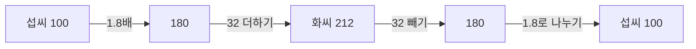



요약

역함수는 암호를 푸는 열쇠처럼 출력에서 입력을 되찾는 함수다. 서로 다른 두 입력이 같은 출력을 내면 원래 어느 쪽이었는지 알 수 없으므로, 그런 함수에는 역함수가 없다. 그럴 때는 입력 범위를 잘라서 역함수를 만든다. 이 자르기가 제곱근, 로그, 아크사인에서 계속 나온다.

## 예시로 보기

섭씨를 화씨로 바꾸는 함수 $$F = 1.8C + 32$$는 되돌릴 수 있다. $$32$$를 빼고 $$1.8$$로 나누면 $$C = (F - 32)/1.8$$이다. $$100$$°C는 $$212$$°F가 되고, $$212$$°F는 다시 $$100$$°C가 된다. 원래 함수가 "1.8배 한 뒤 32 더하기"이니, 역함수는 "32 빼고 1.8로 나누기"로 순서와 연산이 모두 거꾸로다.

위로 가는 길이 $$F = 1.8C + 32$$, 아래로 돌아오는 길이 역함수다. 돌아올 때는 마지막에 한 조작부터 거꾸로 풀어서, 가운데 값 180을 똑같이 지난다[^s3].

$$x^2$$은 되돌릴 수 없다. 출력 $$9$$를 보고 입력이 $$3$$이었는지 $$-3$$이었는지 알 수 없다. 입력을 $$x \ge 0$$으로 제한하면 답이 하나로 정해지고, 그 역함수가 $$\sqrt{x}$$다.

그래프에서 역함수는 $$x$$와 $$y$$를 바꾼 것이다. $$(a, b)$$가 $$f$$ 위에 있으면 $$(b, a)$$가 $$f^{-1}$$ 위에 있다. 그래서 두 그래프는 직선 $$y = x$$에 대해 대칭이다. 섭씨-화씨 그래프의 점 $$(0, 32)$$는 역함수 그래프의 점 $$(32, 0)$$이 된다.

굵은 파란 선($$x \ge 0$$인 $$x^2$$)과 주황 선($$\sqrt{x}$$)은 점선 $$y = x$$를 거울로 두고 서로 비친 모양이다. 잘라 낸 $$x < 0$$ 쪽(점선)까지 두면 $$(-2, 4)$$와 $$(2, 4)$$가 둘 다 높이 4라서 4를 보고 입력을 되찾을 수 없다[^s2].

## 정의

정의

함수 $$f: X \to Y$$가 **일대일**(one-to-one, injective)이라는 것은 $$f(x_1) = f(x_2)$$이면 $$x_1 = x_2$$라는 뜻이다. 서로 다른 입력은 서로 다른 출력을 낸다.

$$f$$가 일대일이면 치역 $$f(X)$$의 각 $$y$$에 대해 $$f(x) = y$$인 $$x$$가 정확히 하나 있다. 이 $$x$$를 $$f^{-1}(y)$$로 쓰고, $$f^{-1}: f(X) \to X$$를 $$f$$의 **역함수**라 한다[^1]. 이때

$$f^{-1}(f(x)) = x \quad (x \in X), \qquad f(f^{-1}(y)) = y \quad (y \in f(X))$$

이다. $$f^{-1}$$의 $$-1$$은 지수가 아니다. $$f^{-1}(x)$$와 $$\dfrac{1}{f(x)}$$는 다르다.

정리

1. $$f$$가 치역 위에서 역함수를 가질 필요충분조건은 $$f$$가 일대일인 것이다.
2. 정의역에서 늘 증가하거나(순증가) 늘 감소하는(순감소) 함수는 일대일이다.

증명

1. (⇐) 정의에서 보인 대로 각 $$y$$에 $$x$$가 하나뿐이므로 $$f^{-1}(y)$$가 정해진다. (⇒) 역함수 $$f^{-1}$$가 있다고 하자. $$f(x_1) = f(x_2) = y$$이면 $$x_1 = f^{-1}(f(x_1)) = f^{-1}(y) = f^{-1}(f(x_2)) = x_2$$다.
2. 순증가라 하자. $$x_1 \ne x_2$$이면 둘 중 작은 쪽을 $$x_1$$로 두어 $$x_1 < x_2$$로 쓸 수 있다. 순증가의 정의로 $$f(x_1) < f(x_2)$$이므로 $$f(x_1) \ne f(x_2)$$다. 대우를 취하면 일대일의 정의다. 순감소도 같다. ∎

그래프에서는 가로선으로 판정한다. 어떤 가로선도 그래프와 두 번 이상 만나지 않으면 일대일이다(수평선 판정)[^1].

## 예제

$$f(x) = \dfrac{2x + 1}{x - 3}$$의 역함수를 구한다.

1. *출력을 $$y$$로 두기:* $$y = \dfrac{2x + 1}{x - 3}$$.
2. *$$x$$에 대해 풀기:* 양변에 $$x - 3$$을 곱하면 $$yx - 3y = 2x + 1$$. $$x$$가 있는 항을 모으면 $$x(y - 2) = 3y + 1$$. $$y \ne 2$$이면 $$x = \dfrac{3y + 1}{y - 2}$$.
3. *빠진 값 확인:* $$y = 2$$이면 $$2x + 1 = 2x - 6$$, 즉 $$1 = -6$$이 되어 해가 없다. $$2$$는 $$f$$의 치역에 없다.
4. *이름 바꾸기:* $$f^{-1}(x) = \dfrac{3x + 1}{x - 2}$$, 정의역은 $$x \ne 2$$.
5. *되돌려 보기:* $$f(0) = -\tfrac13$$이고 $$f^{-1}(-\tfrac13) = \dfrac{-1 + 1}{-\tfrac13 - 2} = 0$$이다.

검증: 무작위 유리수 5,000쌍에서 $$f^{-1}(f(x)) = x$$와 $$f(f^{-1}(y)) = y$$를 정확히 확인, 섭씨-화씨 왕복, 카드 C3과 오해의 수치 — [03_inverse-function_verify.py](/Hongs_Blog/studies/college-math/code/03_inverse-function_verify/)

## 활용

- 암호화와 복호화, 압축과 해제, 실행 취소(undo)는 모두 "되돌릴 수 있는 함수"를 요구한다. 되돌릴 수 있으려면 일대일이어야 한다.
- 그래픽에서 월드 좌표를 화면 좌표로 바꾸는 변환의 역함수로, 마우스로 클릭한 화면 위치가 월드의 어디인지 찾는다.
- 암호학적 해시는 일부러 되돌리기 어렵게 만든 함수다. 입력의 종류가 출력보다 훨씬 많아 애초에 일대일일 수 없다[^s1].
- [로그](/Hongs_Blog/studies/college-math/logarithm/)는 지수함수의 역함수다. 아크사인은 사인의 입력을 $$[-\pi/2, \pi/2]$$로 잘라 만든 역함수다([역삼각함수](/Hongs_Blog/studies/college-math/inverse-trig/)).
- 알고리즘에서: 시각 문자열을 '0시부터 몇 분째'로 바꾸는 함수는 '09:05'처럼 두 자리로 맞추고 분이 60 미만인 문자열에서만 일대일이라 되돌릴 수 있다. '9:05'와 '08:65'도 '09:05'와 같은 545로 가기 때문이다([시간·날짜 계산](/Hongs_Blog/studies/algorithms/time-conversion/)). [연결 리스트](/Hongs_Blog/studies/algorithms/linked-list/)가 지운 칸을 지운 역순으로 되살리는 것은 여러 단계를 마지막 단계부터 되돌리는 것과 같다($$g \circ f$$의 역함수는 $$f^{-1} \circ g^{-1}$$).

## 연결

- 선수: [함수의 변환과 합성](/Hongs_Blog/studies/college-math/function-transformation/). $$f^{-1} \circ f$$는 아무것도 바꾸지 않는 함수 $$x \mapsto x$$다.
- 이어지는 개념: [로그](/Hongs_Blog/studies/college-math/logarithm/)
- 입력과 출력의 개수를 비교해 일대일이 불가능함을 보이는 방법은 이산수학의 [비둘기집 원리](/Hongs_Blog/studies/discrete-math/pigeonhole/)다.

## 자주 하는 오해

"f⁻¹(x)는 1/f(x)다"

틀렸다. $$x^{-1} = 1/x$$라는 지수 표기와 모양이 같아서 그럴듯하다. 실제로 $$f^{-1}$$은 "되돌리는 함수"라는 이름표이고 역수와 무관하다. $$f(x) = x + 1$$이면 $$f^{-1}(x) = x - 1$$이다. $$x = 1$$에서 $$f^{-1}(1) = 0$$이지만 $$1/f(1) = 1/2$$다.

## 확인 문제

**C1** 함수가 역함수를 가질 조건은 무엇이고, 그 조건이 왜 필요한가?

**답:** 일대일이어야 한다(치역 위에서). 서로 다른 두 입력 $$x_1 \ne x_2$$가 같은 출력 $$y$$를 내면, $$f^{-1}(y)$$를 $$x_1$$과 $$x_2$$ 중 하나로 정할 수 없다. 함수는 입력마다 출력이 하나여야 하므로 역함수가 맞지 않는다.

**C2** f(x) = (2x + 1)/(x − 3)의 역함수와 그 정의역을 구하라.

**답:** $$f^{-1}(x) = \dfrac{3x + 1}{x - 2}$$, 정의역은 $$x \ne 2$$다. $$2$$는 $$f$$의 치역에 없는 값이다.

**흔한 오답:** 정의역을 원래 함수와 같은 $$x \ne 3$$으로 쓰는 것. 역함수의 정의역은 원래 함수의 치역이다.

**C3** 실수 전체에서 정의된 x²에 역함수가 없음을 보이는 반례를 들고, 역함수가 생기도록 고치는 방법을 두 가지 쓰라.

**답:** $$(-3)^2 = 3^2 = 9$$이므로 일대일이 아니다. 정의역을 $$x \ge 0$$으로 자르면 역함수는 $$\sqrt{x}$$, $$x \le 0$$으로 자르면 $$-\sqrt{x}$$다.

[^1]: OpenStax, *Precalculus 2e*, 1.7절 "Inverse Functions". 정의역을 잘라 역함수를 만드는 예는 3.8절 "Inverses and Radical Functions".
[^s1]: 보충 좌표 변환과 해시는 컴퓨터공학에서 역함수가 쓰이는 곳과 쓰이지 않는 곳을 보이려고 넣었다.
[^s2]: 보충 그림은 원본에 없다. [03_inverse-function_plot.py](/Hongs_Blog/studies/college-math/code/03_inverse-function_plot/)로 그렸고, 그림에 쓴 값($$(2, 4)$$와 $$(4, 2)$$, $$(-2)^2 = 2^2 = 4$$, $$0 \le x \le 3$$에서 $$\sqrt{x^2} = x$$)을 같은 코드로 확인했다.
[^s3]: 보충 다이어그램 1개는 원본에 없다. `예시로 보기`의 섭씨-화씨 변환과 그 역함수(100°C ↔ 212°F)를 근거로 그렸다(OpenStax, *Precalculus 2e*, 1.7절).

