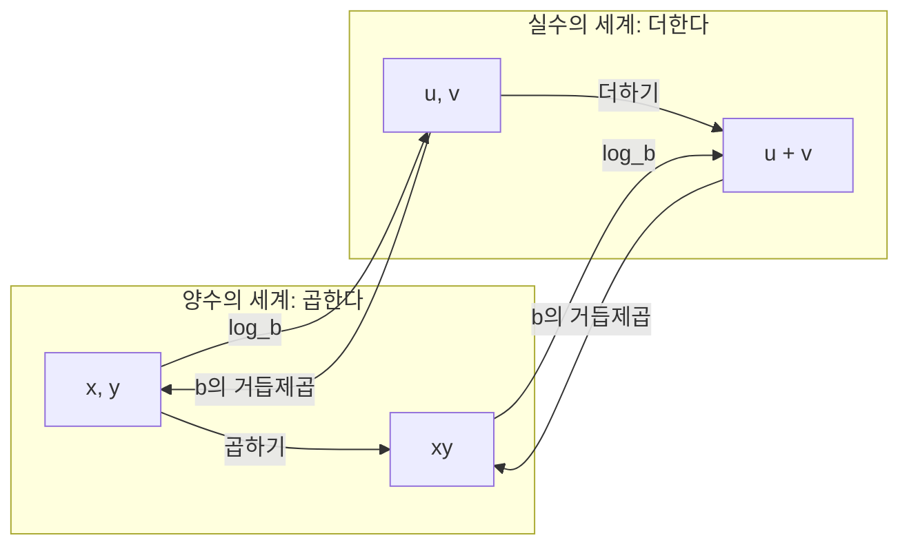



요약

로그는 "몇 번 곱해야 이 수가 되나"에 답하는 수다. 1000을 만들려면 10을 세 번 곱해야 하니 답은 3이다. 로그를 쓰면 곱셈이 덧셈으로, 거듭제곱이 곱셈으로 바뀌어 아주 크거나 작은 수를 다루기 쉬워진다. 다만 곱하는 수는 양수이고 1이 아니어야 하며, 0이나 음수의 로그는 없다.

## 예시로 보기

정렬된 100만 개 자료에서 이진 탐색을 하면 비교할 때마다 후보가 반으로 준다. 한 개가 남을 때까지 몇 번 반으로 나눠야 할까? $$2^{20} = 1{,}048{,}576$$이 $$10^6$$보다 조금 크므로 약 20번이다. "2를 몇 번 곱하면 $$10^6$$인가"의 답이 $$\log_2 10^6 \approx 19.93$$이다.

| $$x$$ | 1 | 2 | 8 | 1024 | $$10^6$$ | $$10^9$$ |
|---|---|---|---|---|---|---|
| $$\log_2 x$$ | 0 | 1 | 3 | 10 | 약 19.93 | 약 29.9 |

곱셈이 덧셈이 되는 것도 표에서 보인다. $$8 \times 32 = 256$$에서 곱하는 횟수는 $$3 + 5 = 8$$이고, 실제로 $$\log_2 256 = 8$$이다. 2를 세 번 곱한 것에 다섯 번 곱한 것을 이어 곱했을 뿐이다.

## 정의

정의

$$b > 0$$, $$b \ne 1$$, $$x > 0$$일 때

$$\log_b x = y \iff b^y = x$$

로 정한다. $$b$$를 밑, $$x$$를 진수라 한다[^1]. $$\log_b: (0, \infty) \to \mathbb{R}$$($$\mathbb{R}$$은 실수 전체)은 지수함수 $$b^x: \mathbb{R} \to (0, \infty)$$의 역함수다. 따라서

$$b^{\log_b x} = x \quad (x > 0), \qquad \log_b(b^y) = y \quad (y \in \mathbb{R})$$

자주 쓰는 밑에는 따로 이름이 있다. 문헌마다 밑을 생략한 $$\log$$의 뜻이 달라서, 이 볼트에서는 늘 밑을 적는다.

| 표기 | 밑 | 주로 쓰는 곳 |
|---|---|---|
| $$\lg x$$ | 2 | 알고리즘, 정보량(비트) |
| $$\ln x$$ | $$e$$ | 미적분, 확률, 파이썬 `math.log(x)` |
| $$\log_{10} x$$ | 10 | 한국 고교 교과서와 계산기의 $$\log$$, 데시벨 |

로그 법칙

$$b, c > 0$$, $$b, c \ne 1$$, $$x, y > 0$$, $$r \in \mathbb{R}$$일 때[^2]
1. $$\log_b(xy) = \log_b x + \log_b y$$
2. $$\log_b(x / y) = \log_b x - \log_b y$$
3. $$\log_b(x^r) = r \log_b x$$
4. (밑변환) $$\log_b x = \dfrac{\log_c x}{\log_c b}$$
5. $$\log_b 1 = 0$$, $$\log_b b = 1$$

왼쪽에서 두 양수를 곱한 결과와, 오른쪽으로 건너가 두 로그 $$u = \log_b x$$, $$v = \log_b y$$를 더한 결과는 같은 자리에서 만난다. 법칙 1이 이 그림이다. 오른쪽에서 왼쪽으로 돌아오는 화살표는 [지수함수](/Hongs_Blog/studies/college-math/exponential-function/) $$b^u$$이고, 두 방향은 서로 역함수다[^s2].

**설계 이유.** 로그의 조건은 모두 지수함수에서 물려받는다. $$b^y$$는 늘 양수이므로 $$x \le 0$$이면 $$b^y = x$$인 $$y$$가 없다. $$b = 1$$이면 $$1^y = 1$$이라 "몇 번 곱해야 5가 되나"에 답이 없다.

**동치인 다른 정의.**

| 정의 | 근거 |
|---|---|
| $$\ln x = \displaystyle\int_1^x \frac{1}{t}\,dt$$ ($$x > 0$$) | [증명 생략: [미적분의 기본정리](/Hongs_Blog/studies/calculus/ftc/)] |
| 연속이고 $$f(xy) = f(x) + f(y)$$, $$f(b) = 1$$인 $$f: (0, \infty) \to \mathbb{R}$$ | [증명 스케치] $$g(t) = f(b^t)$$로 두면 $$g(s + t) = g(s) + g(t)$$이고 연속이다. 이런 함수는 $$g(t) = g(1)\,t = t$$뿐이므로 $$f(b^t) = t$$, 즉 $$f = \log_b$$다 |

**해당하는 예:** $$\log_2 8 = 3$$, $$\log_{10} 0.001 = -3$$, $$\ln 1 = 0$$. **해당하지 않는 예:** $$\log_2 0$$($$2^y = 0$$인 $$y$$가 없다), $$\log_2(-4)$$(양수가 아니다), $$\log_1 5$$(밑이 1이다).

## 증명

모든 로그 법칙은 지수법칙을 지수 쪽에서 읽은 것이다.

증명 펼치기

$$u = \log_b x$$, $$v = \log_b y$$로 두면 로그의 정의로 $$x = b^u$$, $$y = b^v$$다.
1. $$xy = b^u b^v = b^{u+v}$$ — 지수법칙. 로그의 정의로 $$\log_b(xy) = u + v$$.
2. $$x / y = b^u / b^v = b^{u-v}$$ — 지수법칙. 따라서 $$\log_b(x/y) = u - v$$.
3. $$x^r = (b^u)^r = b^{ur}$$ — 지수법칙. 따라서 $$\log_b(x^r) = ru$$.
4. $$x = b^{\log_b x}$$의 양변에 $$\log_c$$를 취하고 3을 쓰면 $$\log_c x = \log_b x \cdot \log_c b$$. $$b \ne 1$$이므로 $$\log_c b \ne 0$$이고, 나누면 된다.
5. $$b^0 = 1$$, $$b^1 = b$$. ∎

### 스스로 설명해 보기

1. "xy = bᵘbᵛ = bᵘ⁺ᵛ"의 두 번째 등호는 어디서 나오나?

지수법칙 $$a^m a^n = a^{m+n}$$이다. 곱해진 횟수끼리 더했다.

2. 밑변환 증명에서 "log_c b ≠ 0"이 왜 필요하고, 왜 참인가?

그 수로 나눠야 하기 때문이다. $$\log_c b = 0$$이면 $$b = c^0 = 1$$인데 밑은 1이 아니므로 0이 아니다.

이 증명들의 핵심 아이디어는?

로그를 지수로 바꿔 쓰고($$x = b^u$$), 지수법칙을 적용한 뒤, 다시 로그로 읽는다.

같은 아이디어를 쓰는 다른 상황은?

계산자(slide rule)는 눈금을 로그로 매겨 곱셈을 길이의 덧셈으로 했다. 확률을 많이 곱해야 할 때 로그 확률을 더하는 것도 같다(카드 C4).

## 예제

**지수 방정식 풀기.** $$2^x = 1000$$.

1. *양변에 로그:* $$\ln 2^x = \ln 1000$$.
2. *지수 끌어내리기:* $$x \ln 2 = \ln 1000$$. — 법칙 3
3. *계산:* $$x = \dfrac{\ln 1000}{\ln 2} \approx 9.966$$. $$2^{10} = 1024$$가 1000보다 조금 크니 맞다.

**두 배 시간.** 매달 20%씩 느는 양이 두 배가 되는 때는 $$1.2^t = 2$$에서 $$t = \dfrac{\ln 2}{\ln 1.2} \approx 3.80$$개월이다. 처음 양과 무관하다.

**식 줄이기.** $$\log_2 48 - \log_2 3 = \log_2 16 = 4$$. — 법칙 2

**지수와 밑 바꾸기.** $$a^{\log_b c} = c^{\log_b a}$$이다. 양변에 $$\log_b$$를 취하면 둘 다 $$\log_b a \cdot \log_b c$$가 된다. 그래서 $$3^{\lg n} = n^{\lg 3} \approx n^{1.585}$$다. 분할 정복 알고리즘의 비용을 $$n$$의 거듭제곱으로 읽을 때 쓴다.

연습: [로그 계산 예제 사다리](/Hongs_Blog/studies/college-math/logarithm-ladder/)

검증: 로그 법칙과 밑변환(무작위 5,000세트, 밑 5종), 예시 표, 예제 네 개, 카드 C3·C4, 파이썬 `math.log`의 동작, 오해의 수치 — [07_logarithm_verify.py](/Hongs_Blog/studies/college-math/code/07_logarithm_verify/)

## 활용

- **반씩 줄이는 알고리즘.** 이진 탐색, 균형 이진 트리의 높이, 병합 정렬의 단계 수가 모두 $$\lg n$$에 비례한다. $$n$$이 $$10^9$$이어도 $$\lg n \approx 30$$이다[^3].
- **비트 수.** 양의 정수 $$n$$을 2진수로 쓰는 데 드는 자릿수는 $$\lfloor \lg n \rfloor + 1$$($$\lfloor\ \rfloor$$는 소수점 아래를 버린 정수)이다. [진법과 자릿수](/Hongs_Blog/studies/college-math/positional-notation/)에서 증명한다.
- **로그 확률.** 작은 확률을 수천 번 곱하면 컴퓨터에서 0이 된다(카드 C4). 음성 인식, 언어 모델, 나이브 베이즈는 확률 대신 로그 확률을 더한다[^s1].
- **파이썬 주의점.** `math.log(x)`는 자연로그다. `math.log(1000, 10)`은 밑변환을 부동소수점으로 계산해 `3.0`이 아니라 `2.9999999999999996`을 낸다. 10과 2가 밑이면 `math.log10`, `math.log2`를 쓴다.
- 알고리즘에서: [이분 탐색](/Hongs_Blog/studies/algorithms/binary-search/)은 정렬된 자료 $$n$$개에서 많아야 $$\lceil \lg(n + 1) \rceil$$($$\lceil\ \rceil$$는 소수점 아래를 올린 정수)번 돈다. [매개변수 탐색](/Hongs_Blog/studies/algorithms/parametric-search/)은 답이 될 수 있는 값 $$m$$개를 반씩 줄여, 많아야 $$\lceil \lg m \rceil$$번만 판정한다. [힙과 우선순위 큐](/Hongs_Blog/studies/algorithms/heap/)의 힙은 원소 $$n$$개를 $$\lfloor \lg n \rfloor + 1$$층에 담아, 넣기·꺼내기 한 번에 자리를 많아야 층수만큼 바꾼다. 그 밖에 [정렬과 정렬 기준](/Hongs_Blog/studies/algorithms/sorting/), [시간 복잡도로 방법 고르기](/Hongs_Blog/studies/algorithms/complexity-budget/)에서도 쓴다.

## 연결

- 선수: [지수함수](/Hongs_Blog/studies/college-math/exponential-function/), [역함수](/Hongs_Blog/studies/college-math/inverse-function/)
- 이어지는 개념: [로그함수와 로그 스케일](/Hongs_Blog/studies/college-math/log-scale/), [진법과 자릿수](/Hongs_Blog/studies/college-math/positional-notation/)
- 나중에 쓰이는 곳: 이산수학의 [점근 표기](/Hongs_Blog/studies/discrete-math/asymptotic-notation/)와 [마스터 정리](/Hongs_Blog/studies/discrete-math/master-theorem/), 확률과 통계의 [최대가능도 추정](/Hongs_Blog/studies/probability-statistics/mle/)과 [엔트로피](/Hongs_Blog/studies/probability-statistics/entropy/)

## 자주 하는 오해

"log(x + y) = log x + log y"

틀렸다. 로그 법칙이 "로그 안의 연산을 바깥으로 꺼내는" 규칙처럼 외워지면 덧셈에도 쓰고 싶어진다. 실제로 로그가 바꿔 주는 것은 **곱**이다: $$\log_b(xy) = \log_b x + \log_b y$$. 합의 로그에는 간단한 공식이 없다. $$\log_{10}(1 + 1) = \log_{10} 2 \approx 0.301$$이지만 $$\log_{10} 1 + \log_{10} 1 = 0$$이다.

## 확인 문제

**C1** 로그의 정의를 지수로 바꿔 쓰고, 밑과 진수의 조건과 그 이유를 쓰라.

**답:** $$\log_b x = y \iff b^y = x$$. 밑은 $$b > 0$$, $$b \ne 1$$, 진수는 $$x > 0$$이다. 밑 조건은 지수함수에서 물려받는다. $$b^y$$는 늘 양수라서 $$x \le 0$$이면 $$y$$가 없다.

**흔한 오답:** 진수 조건 $$x > 0$$을 빠뜨리거나, $$\log_b 0 = 0$$이라고 하는 것. $$b^y = 0$$인 $$y$$는 없다.

**C2** log_b(xy) = log_b x + log_b y를 지수법칙으로 증명하고, 각 단계의 근거를 쓰라.

**답:** $$u = \log_b x$$, $$v = \log_b y$$로 두면 $$x = b^u$$, $$y = b^v$$(로그의 정의). $$xy = b^u b^v = b^{u+v}$$(지수법칙). 다시 로그의 정의로 $$\log_b(xy) = u + v = \log_b x + \log_b y$$.

**C3** (a) 2ˣ = 1000을 풀라. (b) log₂ 48 − log₂ 3을 계산하라.

**답:** (a) $$x = \dfrac{\ln 1000}{\ln 2} \approx 9.966$$. (b) $$\log_2 (48/3) = \log_2 16 = 4$$.

**흔한 오답:** (a)에서 $$x = 1000/2 = 500$$. 지수를 푸는 것은 나눗셈이 아니라 로그다. (b)에서 $$\log_2 48 / \log_2 3$$으로 나누는 것.

**C4** 확률 0.01을 1000번 곱하는 계산을 파이썬으로 그대로 하면 0.0이 나온다. 왜 그런가? 로그로 어떻게 해결하는가?

**답:** 참값은 $$10^{-2000}$$인데 배정밀도가 나타낼 수 있는 가장 작은 양수(약 $$5 \times 10^{-324}$$)보다 작아 0으로 떨어진다(언더플로). 로그를 취하면 곱이 합이 되어 $$1000 \ln 0.01 \approx -4605.17$$로 안전하게 계산된다. 두 후보를 비교할 때는 로그 값끼리 비교하면 된다. 로그는 순증가 함수라 크기 순서가 그대로다.

[^1]: OpenStax, *Precalculus 2e*, 4.3절 "Logarithmic Functions"
[^2]: OpenStax, *Precalculus 2e*, 4.5절 "Logarithmic Properties", 4.6절 "Exponential and Logarithmic Equations"
[^3]: Cormen, Leiserson, Rivest, Stein, *Introduction to Algorithms* 3판, 3.2절 "Standard notations and common functions"의 로그 표기와 성질
[^s1]: 에이전트 보충. 로그 확률은 확률 모델을 계산할 때의 표준 기법이다. 배정밀도의 가장 작은 양수(비정규수) 약 $$4.9 \times 10^{-324}$$는 IEEE 754 형식에서 나온다. 파이썬 `math.log`의 동작은 검증 코드로 확인했다.
[^s2]: 에이전트 보충. 다이어그램 1개는 원본에 없다. `정의`의 $$\log_b: (0, \infty) \to \mathbb{R}$$과 $$b^x: \mathbb{R} \to (0, \infty)$$가 서로 역함수라는 진술과 로그 법칙 1을 근거로 그렸다(OpenStax, *Precalculus 2e*, 4.3절, 4.5절).

