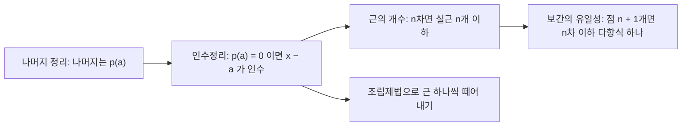


<div class="callout callout-summary" markdown="1">
<div class="callout-title callout-title--default" markdown="span">요약</div>

다항식은 변수를 몇 번 곱한 항들에 수를 곱해 더한, 가장 단순한 함수다. 값이 0이 되는 곳(근)과 인수는 짝을 이룬다. 어떤 수가 근이면 식이 그 수에 대한 일차식으로 나누어떨어진다. 그래서 근은 차수보다 많을 수 없고, 점 몇 개만 알면 다항식이 하나로 정해진다. 다만 교과서의 근의 공식을 컴퓨터로 그대로 계산하면 크게 틀릴 수 있다.

</div>


## 예시로 보기

$$p(x) = x^3 - 6x^2 + 11x - 6$$에 $$x = 1$$을 넣으면 $$1 - 6 + 11 - 6 = 0$$이다. $$1$$이 근이므로 $$p(x)$$는 $$(x - 1)$$로 나누어떨어진다. 나눗셈은 계수만 써서 하는 조립제법이 빠르다.

```
 1 |  1   -6   11   -6        ← p의 계수 (높은 차수부터)
   |        1   -5    6        ← 바로 아래 값에 1을 곱해 올린 것
   +---------------------
      1   -5    6 |   0        ← 몫 x² − 5x + 6, 나머지 0
```

몫 $$x^2 - 5x + 6$$은 $$(x - 2)(x - 3)$$으로 인수분해된다. 그래서 $$p(x) = (x - 1)(x - 2)(x - 3)$$이고 근은 $$1, 2, 3$$이다. 3차식이 근 세 개를 다 썼으니 더는 근이 없다.


그래프가 가로축을 1, 2, 3에서 지나고, 근을 하나 지날 때마다 값의 부호가 바뀐다[^s3].

## 정의

<div class="callout callout-definition" markdown="1">
<div class="callout-title callout-title--default" markdown="span">정의</div>

계수 $$a_0, \dots, a_n \in \mathbb{R}$$($$\in$$은 "~에 속한다"), $$a_n \ne 0$$인 $$p(x) = a_n x^n + a_{n-1}x^{n-1} + \dots + a_1 x + a_0$$을 **$$n$$차 다항식**이라 하고 $$\deg p = n$$으로 쓴다. $$p(r) = 0$$인 수 $$r$$을 $$p$$의 **근**(root, zero)이라 한다[^1].

</div>


<div class="callout callout-theorem" markdown="1">
<div class="callout-title callout-title--default" markdown="span">정리</div>

1. **나머지 정리.** $$p(x)$$를 $$(x - a)$$로 나눈 나머지는 $$p(a)$$다.
2. **인수정리.** $$p(a) = 0$$이면 $$(x - a)$$는 $$p(x)$$의 인수이고, 그 역도 맞는다.
3. **근의 개수.** $$n \ge 1$$차 다항식의 서로 다른 실근은 많아야 $$n$$개다.
4. **근의 공식.** $$ax^2 + bx + c = 0$$ ($$a \ne 0$$)의 근은 $$x = \dfrac{-b \pm \sqrt{b^2 - 4ac}}{2a}$$다. 판별식 $$D = b^2 - 4ac$$가 양수면 서로 다른 실근이 둘, $$0$$이면 중근 하나, 음수면 실근이 없다[^1].

</div>


<details class="callout callout-proof" markdown="1">
<summary class="callout-title" markdown="span">증명</summary>

1. $$(x - a)$$는 1차이므로 나머지는 상수 $$r$$이다. $$p(x) = (x - a)q(x) + r$$에 $$x = a$$를 넣으면 $$p(a) = r$$이다.
2. 1에서 $$p(a) = 0$$이면 $$p(x) = (x - a)q(x)$$다. 거꾸로 $$p(x) = (x - a)q(x)$$이면 $$p(a) = 0 \cdot q(a) = 0$$이다.
3. [증명 스케치] 서로 다른 근 $$r_1, \dots, r_k$$가 있다고 하자. 인수정리로 $$(x - r_1)$$을 떼어 내면 몫 $$q_1$$이 남는다. $$r_2 \ne r_1$$이므로 $$0 = p(r_2) = (r_2 - r_1)q_1(r_2)$$에서 $$q_1(r_2) = 0$$이다. 같은 방법으로 $$(x - r_2), \dots, (x - r_k)$$를 차례로 떼면 $$p(x) = (x - r_1)\cdots(x - r_k)\,q(x)$$이고 $$q \ne 0$$이다. 차수를 비교하면 $$k \le n$$이다.
4. 완전제곱으로 바꾼다. $$a \ne 0$$으로 나누고 정리하면 $$\left(x + \dfrac{b}{2a}\right)^2 = \dfrac{b^2 - 4ac}{4a^2}$$이다. 양변의 제곱근을 취하면 공식이 나온다. ∎

</details>




화살표는 "앞의 사실을 써서 뒤의 사실을 보인다"는 뜻이다. 근을 찾아 식을 쪼개는 계산과, 근이 너무 많을 수 없다는 사실이 모두 인수정리 하나에서 갈라져 나온다[^s4].

복소수까지 허용하면 $$n$$차 다항식은 중복을 세어 정확히 $$n$$개의 근을 가진다(대수학의 기본정리)[^2]. [증명 생략: 복소해석의 결과] 판별식이 음수인 이차방정식도 복소수 근은 두 개다.


세 포물선은 모양이 같고 높이만 다르다. 판별식이 양수면 가로축과 두 번 만나고, 0이면 한 번 닿고, 음수면 가로축 위에 떠 있어서 실근이 없다[^s3].

## 예제

**보간의 유일성.** 세 점 $$(0, 1)$$, $$(1, 3)$$, $$(2, 7)$$을 지나는 2차 이하 다항식을 찾는다.

1. *틀 세우기:* $$p(x) = ax^2 + bx + c$$.
2. *점 대입:* $$c = 1$$, $$a + b + c = 3$$, $$4a + 2b + c = 7$$.
3. *풀기:* $$a + b = 2$$, $$4a + 2b = 6$$에서 $$a = 1$$, $$b = 1$$. 그래서 $$p(x) = x^2 + x + 1$$.
4. *하나뿐인 이유:* 같은 세 점을 지나는 2차 이하 다항식 $$q$$가 또 있으면 $$p - q$$는 2차 이하인데 근이 $$0, 1, 2$$로 세 개다. 정리 3에 따라 $$p - q$$는 0이 아닌 다항식일 수 없으므로 $$p = q$$다.

일반적으로 $$x$$좌표가 서로 다른 $$n + 1$$개 점을 지나는 $$n$$차 이하 다항식은 정확히 하나다.

<div class="callout callout-check" markdown="1">
<div class="callout-title" markdown="span">검증: 예시의 조립제법과 근, 무작위 다항식 2,000개에서 나머지 = $$p(a)$$, 무작위 300세트에서 라그랑주 보간과 연립방정식 풀이의 계수 일치(실험으로 확인됨), 호너 계산 과정, 근의 공식의 수치 오차 — [04_polynomial_verify.py](/Hongs_Blog/studies/college-math/code/04_polynomial_verify/)</div>

</div>


## 활용

- **호너 방법.** $$2x^3 - 3x^2 + 4x - 5 = ((2x - 3)x + 4)x - 5$$로 묶으면 곱셈 $$n$$번과 덧셈 $$n$$번으로 값을 구한다. 문자열 해시(롤링 해시)는 문자 코드를 계수로 둔 다항식을 이 방법으로 계산한다[^s1].
- **보간.** $$n + 1$$개 점이 다항식을 하나로 정한다는 성질은 비밀 분산(샤미르)과 오류 정정 부호(리드-솔로몬, QR 코드에 쓰임)의 바탕이다. 실제로는 실수 대신 유한체 위에서 계산한다[^s1].
- **복잡도 식.** $$3n^2 + 5n + 7$$처럼 비용이 다항식으로 나오면, $$n$$이 클 때 최고차항이 지배한다. 이것이 [점근 표기](/Hongs_Blog/studies/discrete-math/asymptotic-notation/)의 출발점이다.
- 5차 이상 방정식에는 사칙연산과 거듭제곱근만으로 된 일반 근의 공식이 없다(아벨-루피니 정리)[^s2]. 그래서 [뉴턴 방법](/Hongs_Blog/studies/calculus/linear-approx-newton/) 같은 수치 해법을 쓴다.

## 연결

- 선수: [함수](/Hongs_Blog/studies/college-math/function/)
- 이어지는 개념: [거듭제곱함수와 지수함수 비교](/Hongs_Blog/studies/college-math/power-vs-exponential/), [복소수](/Hongs_Blog/studies/college-math/complex-numbers/), 선형대수학의 [고윳값](/Hongs_Blog/studies/linear-algebra/eigenvalues/)(특성다항식의 근), 이산수학의 [선형 점화식](/Hongs_Blog/studies/discrete-math/linear-recurrences/)(특성방정식)

## 자주 하는 오해

<div class="callout callout-misconception" markdown="1">
<div class="callout-title" markdown="span">"근의 공식을 코드로 그대로 옮기면 정확한 답이 나온다"</div>

틀렸다. 수학적으로 맞는 공식이니 컴퓨터도 맞게 계산할 것 같다. 실제로는 $$b^2$$이 $$4ac$$보다 훨씬 크면 $$-b$$와 $$\sqrt{b^2 - 4ac}$$가 거의 같은 수가 되고, 둘을 빼는 순간 유효숫자가 사라진다. $$x^2 + 10^8 x + 1 = 0$$의 작은 근은 약 $$-1.0 \times 10^{-8}$$인데, 공식 그대로 배정밀도로 계산하면 $$-7.45 \times 10^{-9}$$이 나와 25% 틀린다. 빼기가 없는 쪽 근 $$x_1 = \dfrac{-b - \operatorname{sign}(b)\sqrt{D}}{2a}$$를 먼저 구하고, 근의 곱이 $$c/a$$라는 성질로 $$x_2 = \dfrac{c}{a x_1}$$을 구하면 정확하다.

</div>


## 확인 문제

<details class="callout callout-question" markdown="1">
<summary class="callout-title" markdown="span">**C1** p(x) = x³ − 2x² − 5x + 6의 근을 모두 구하라.</summary>

**답:** $$p(1) = 1 - 2 - 5 + 6 = 0$$이므로 $$(x - 1)$$로 나누면 $$x^2 - x - 6 = (x - 3)(x + 2)$$. 근은 $$-2, 1, 3$$이다.

**흔한 오답:** 조립제법에서 계수의 부호를 잘못 옮기는 것. 빠진 차수가 있으면 계수 $$0$$을 적어야 한다.

</details>


<details class="callout callout-question" markdown="1">
<summary class="callout-title" markdown="span">**C2** x좌표가 서로 다른 세 점을 지나는 2차 이하 다항식이 둘일 수 없는 이유를 인수정리로 설명하라.</summary>

**답:** 두 개 $$p$$, $$q$$가 있으면 $$p - q$$는 2차 이하이고 세 점의 $$x$$좌표에서 모두 $$0$$이다. 0이 아닌 2차 이하 다항식은 근이 많아야 2개이므로 $$p - q$$는 0이고 $$p = q$$다.

</details>


<details class="callout callout-question" markdown="1">
<summary class="callout-title" markdown="span">**C3** 호너 방법으로 2x³ − 3x² + 4x − 5의 x = 2에서의 값을 구하라. 각 단계의 중간값을 쓰라.</summary>

**답:** $$2 \to 2 \cdot 2 - 3 = 1 \to 1 \cdot 2 + 4 = 6 \to 6 \cdot 2 - 5 = 7$$. 값은 $$7$$이고 곱셈은 3번이다. 전개식으로도 $$16 - 12 + 8 - 5 = 7$$이다.

</details>


[^1]: OpenStax, *Precalculus 2e*, 3.2절 "Quadratic Functions", 3.3절 "Power Functions and Polynomial Functions", 3.5절 "Dividing Polynomials", 3.6절 "Zeros of Polynomial Functions"
[^2]: OpenStax, *Precalculus 2e*, 3.6절 "Zeros of Polynomial Functions"(대수학의 기본정리와 일차 인수 분해 정리)
[^s1]: <span class="fn-tag" title="수업 자료에 없고 따로 보탠 내용">보충</span> 호너 방법, 롤링 해시, 샤미르 비밀 분산, 리드-솔로몬 부호는 다항식이 컴퓨터공학에서 쓰이는 곳을 보이려고 넣었다. 롤링 해시는 라빈-카프 문자열 탐색에서 쓴다.
[^s2]: <span class="fn-tag" title="수업 자료에 없고 따로 보탠 내용">보충</span> 아벨-루피니 정리는 5차 이상 방정식의 **일반** 공식이 없다는 뜻이다. 특정한 5차 방정식은 근호로 풀리기도 한다. 증명은 갈루아 이론의 범위다.
[^s3]: <span class="fn-tag" title="수업 자료에 없고 따로 보탠 내용">보충</span> 그림 두 장은 원본에 없다. [04_polynomial_plot.py](/Hongs_Blog/studies/college-math/code/04_polynomial_plot/)로 그렸고, 그림에 쓴 값($$p(1) = p(2) = p(3) = 0$$, $$p(x) = (x - 1)(x - 2)(x - 3)$$, 판별식 16, 0, −8과 첫 식의 근 −1, 3)을 같은 코드로 확인했다.
[^s4]: <span class="fn-tag" title="수업 자료에 없고 따로 보탠 내용">보충</span> 다이어그램 1개는 원본에 없다. `정의`의 정리 1~3과 그 증명, `예시로 보기`의 조립제법, `예제`의 보간 유일성 논증이 서로 무엇을 쓰는지를 근거로 그렸다(OpenStax, *Precalculus 2e*, 3.5~3.6절).

