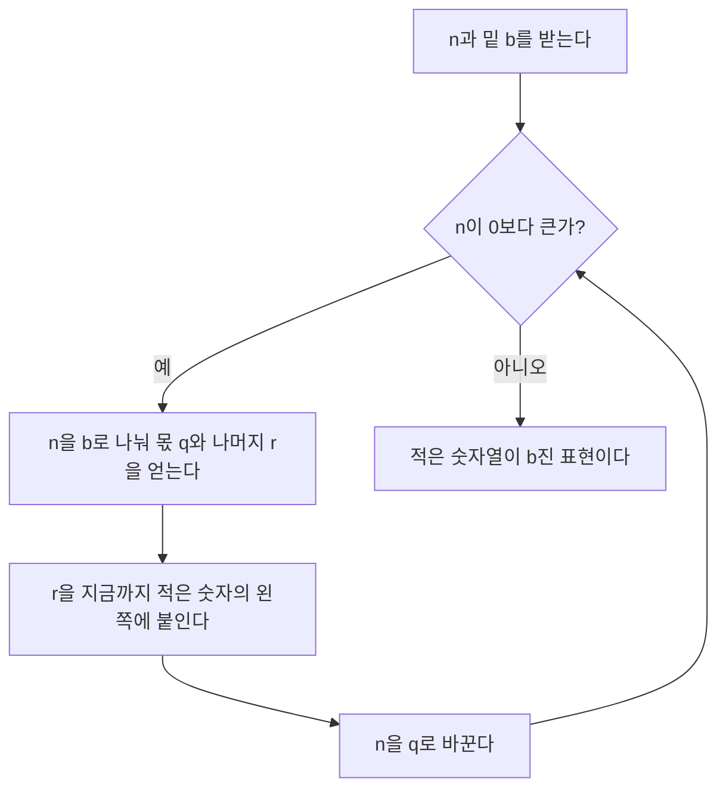
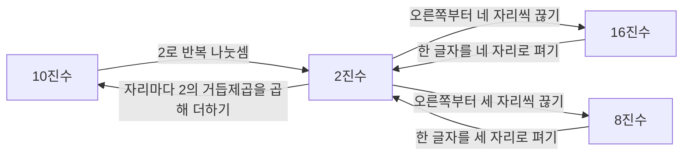


<div class="callout callout-summary" markdown="1">
<div class="callout-title callout-title--default" markdown="span">요약</div>

우리가 쓰는 수는 자리마다 10의 거듭제곱을 곱해 더한 것이고, 10 대신 2를 쓰면 컴퓨터의 2진법이 된다. 자리 하나를 늘릴 때마다 적을 수 있는 수가 밑의 배수로 늘어나므로, 어떤 수를 적는 데 드는 자릿수는 로그로 정해진다. 16진법은 2진수 네 자리를 한 글자로 줄여 쓴 것이다. 다만 자릿수를 부동소수점 로그로 계산하면 경계에서 틀릴 수 있다.

</div>


## 예시로 보기

$$2025 = 2 \cdot 10^3 + 0 \cdot 10^2 + 2 \cdot 10^1 + 5 \cdot 10^0$$이다. 같은 방식으로 밑을 2로 두면 $$13 = 1 \cdot 8 + 1 \cdot 4 + 0 \cdot 2 + 1 \cdot 1 = 1101_2$$다.

10진수를 2진수로 바꿀 때는 2로 계속 나누고, 나머지를 아래에서 위로 읽는다.

```
13 ÷ 2 = 6 … 1   ← 1의 자리
 6 ÷ 2 = 3 … 0
 3 ÷ 2 = 1 … 1
 1 ÷ 2 = 0 … 1   ← 8의 자리
            읽는 방향 ↑ : 1101₂
```



나머지는 1의 자리부터 나오므로, 새 나머지를 늘 왼쪽에 붙인다. 위 표에서 "아래에서 위로 읽는" 것과 같은 일이다. 몫이 매번 줄어들어 언젠가 0이 되므로 반복은 반드시 끝난다[^s2].

16은 $$2^4$$이므로 2진수를 오른쪽부터 네 자리씩 끊으면 16진수 한 자리가 된다. $$255 = 1111\,1111_2 = \text{FF}_{16}$$이다. 16진수의 A~F는 10~15를 뜻한다.



10진수와 2진수 사이는 나눗셈과 곱셈으로 계산해야 한다. 16진수와 8진수는 밑이 $$2^4$$, $$2^3$$이라서 2진수를 끊거나 펴기만 하면 된다[^s2].

자릿수는 로그와 맞물린다. 네 자리 10진수는 $$1000$$부터 $$9999$$까지다. 즉 $$10^3 \le n < 10^4$$이다. 양변에 $$\log_{10}$$을 취하면 $$3 \le \log_{10} n < 4$$이니, 자릿수는 $$\log_{10} n$$의 정수 부분에 1을 더한 값이다.

## 정의

$$\lfloor t \rfloor$$(바닥)는 $$t$$ 이하의 가장 큰 정수, $$\lceil t \rceil$$(천장)는 $$t$$ 이상의 가장 작은 정수다.

<div class="callout callout-definition" markdown="1">
<div class="callout-title callout-title--default" markdown="span">정의</div>

정수 $$b \ge 2$$를 밑으로 할 때, 모든 양의 정수 $$n$$은

$$n = \sum_{i=0}^{m-1} d_i\, b^i = d_{m-1} b^{m-1} + \dots + d_1 b + d_0, \qquad d_i \in \{0, 1, \dots, b - 1\},\ d_{m-1} \ne 0$$

으로 **한 가지 방법으로만** 쓸 수 있다[^1]. $$d_{m-1} \dots d_1 d_0$$을 $$n$$의 $$b$$진 표현, $$m$$을 $$b$$진 자릿수라 한다.

</div>


<div class="callout callout-theorem" markdown="1">
<div class="callout-title callout-title--default" markdown="span">정리</div>

1. 양의 정수 $$n$$의 $$b$$진 자릿수는 $$m = \lfloor \log_b n \rfloor + 1$$이다.
2. 서로 다른 값 $$N$$개($$N \ge 1$$)를 $$b$$진 $$m$$자리로 모두 구별하려면 $$b^m \ge N$$, 즉 $$m \ge \lceil \log_b N \rceil$$이어야 한다.

</div>


<details class="callout callout-proof" markdown="1">
<summary class="callout-title" markdown="span">증명</summary>

1. $$m$$자리 수 중 가장 작은 것은 $$1\underbrace{0\cdots0}_{m-1} = b^{m-1}$$, 가장 큰 것은 모든 자리가 $$b - 1$$인 $$b^m - 1$$이다. 따라서 $$n$$이 $$m$$자리이면 $$b^{m-1} \le n < b^m$$이다. $$\log_b$$는 순증가이므로 $$m - 1 \le \log_b n < m$$이고, $$m - 1$$은 $$\log_b n$$ 이하의 가장 큰 정수 $$\lfloor \log_b n \rfloor$$다.
2. $$m$$자리로 만들 수 있는 서로 다른 표현은 자리마다 $$b$$가지씩 $$b^m$$개다. 이것이 $$N$$ 이상이어야 하고, $$b^m \ge N \iff m \ge \log_b N$$이다. $$m$$은 정수이므로 $$m \ge \lceil \log_b N \rceil$$. ∎

</details>


표현이 있고 하나뿐이라는 사실은 위의 반복 나눗셈이 늘 끝나고 나머지가 하나로 정해진다는 데서 나온다. [증명 스케치] 엄밀한 증명은 이산수학의 [나눗셈 정리](/Hongs_Blog/studies/discrete-math/modular-arithmetic/)를 쓴다.


계단(2진 자릿수)은 $$n$$이 2의 거듭제곱 1, 2, 4, 8, …에 닿을 때마다 한 칸 오른다. 곡선 $$\lg n$$은 늘 계단보다 아래에 있고, 2의 거듭제곱에서는 정확히 1 모자란다[^s1].

## 예제

**값의 개수와 수의 크기 구별하기.** 0부터 999까지 서로 다른 값 1,000개를 저장하려면 몇 비트가 필요한가?

1. *필요한 표현 수:* $$N = 1000$$.
2. *정리 2 적용:* $$\lceil \lg 1000 \rceil = \lceil 9.97 \rceil = 10$$비트. 실제로 $$2^{10} = 1024 \ge 1000$$이다.
3. *가장 큰 값으로 확인:* $$999$$의 비트 수는 정리 1로 $$\lfloor \lg 999 \rfloor + 1 = 9 + 1 = 10$$. 두 방법이 같다.

값이 1,024개(0~1023)이면 필요한 비트는 여전히 10이다. 그런데 수 $$1024$$ 자체는 $$10000000000_2$$로 11비트다. "값 $$N$$개"와 "수 $$N$$"은 다르다.

<div class="callout callout-check" markdown="1">
<div class="callout-title" markdown="span">검증: 반복 나눗셈 변환과 왕복 20,000건, 자릿수 공식을 정수 연산으로 전수 확인($$b = 2, 3$$은 $$n < 100{,}000$$, $$b = 4$$~$$16$$은 $$n < 20{,}000$$), 파이썬 `int.bit_length()`와의 일치, 예제와 카드 C1·C2, 부동소수점 반례 — [10_positional-notation_verify.py](/Hongs_Blog/studies/college-math/code/10_positional-notation_verify/)</div>

</div>


## 활용

- **주소와 색.** IPv4 주소는 32비트라 $$2^{32} \approx 4.3 \times 10^9$$개다. 웹 색상 `#1E5FD0`은 빨강·초록·파랑 각 8비트를 16진수 두 자리씩 쓴 것이고, 모두 $$2^{24} = 16{,}777{,}216$$가지다.
- **권한.** 유닉스 파일 권한 `755`는 8진수다. 8진수 한 자리가 2진수 세 자리이므로 $$7 = 111_2$$(rwx), $$5 = 101_2$$(r-x)가 되어 `rwxr-xr-x`다.
- **자릿수는 정수로 센다.** `math.floor(math.log10(n)) + 1`은 $$n = 10^{15} - 1$$에서 16을 낸다. 실제로는 15자리다. $$\log_{10} n$$이 부동소수점에서 15.0으로 반올림되기 때문이다. 정수의 2진 자릿수는 `n.bit_length()`, 10진 자릿수는 `len(str(n))`으로 정확히 센다.
- $$d_{m-1}b^{m-1} + \dots + d_0$$은 $$x = b$$를 넣은 다항식이다. 그래서 숫자 문자열 "2025"를 수로 바꾸는 가장 간단한 방법이 [다항식](/Hongs_Blog/studies/college-math/polynomial/)의 호너 방법 $$((2 \cdot 10 + 0) \cdot 10 + 2) \cdot 10 + 5$$다. 왼쪽 자리부터 읽으며 "지금까지 값 × 10 + 새 숫자"를 되풀이한다.
- 알고리즘에서: 원소 $$k$$개의 부분집합 $$2^k$$개를 0부터 $$2^k - 1$$까지의 $$k$$자리 2진수로 나타내는 것이 [비트마스크](/Hongs_Blog/studies/algorithms/bit-operations/)다. 정렬된 $$n$$칸에서 값이 들어갈 자리 $$n + 1$$가지를 예·아니오 비교로 가르려면 정리 2에 따라 가장 나쁜 경우 $$\lceil \lg(n + 1) \rceil$$번은 물어야 하고, [이분 탐색](/Hongs_Blog/studies/algorithms/binary-search/)이 딱 그만큼 묻는다. 수를 $$b$$진수로 바꾸는 위의 반복 나눗셈은 [k진수에서 소수 개수 구하기](/Hongs_Blog/studies/algorithms/pg92335/)와 [n진수 게임](/Hongs_Blog/studies/algorithms/pg17687/)에서 쓰고, 시·분을 60진법 두 자리로 보는 [시간·날짜 계산](/Hongs_Blog/studies/algorithms/time-conversion/)의 `divmod(x, 60)`도 같은 계산이다. 그 밖에 [힙과 우선순위 큐](/Hongs_Blog/studies/algorithms/heap/), [세그먼트 트리와 스위핑](/Hongs_Blog/studies/algorithms/segment-tree-sweep/), [문자열 파싱과 정규 표현식](/Hongs_Blog/studies/algorithms/string-parsing/), [동영상 재생기](/Hongs_Blog/studies/algorithms/pg340213/), [파일명 정렬](/Hongs_Blog/studies/algorithms/pg17686/), [문자열 압축](/Hongs_Blog/studies/algorithms/pg60057/), [가사 검색](/Hongs_Blog/studies/algorithms/pg60060/)에서도 쓴다.
- 브리지: [트리 칸 번호 ↔ 2진법 자릿수](/Hongs_Blog/studies/algorithms/tree-index-binary/)

## 연결

- 선수: [로그](/Hongs_Blog/studies/college-math/logarithm/), [거듭제곱과 지수법칙](/Hongs_Blog/studies/college-math/exponent-laws/)
- 나중에 쓰이는 곳: 이산수학의 [나눗셈 정리와 합동](/Hongs_Blog/studies/discrete-math/modular-arithmetic/)(표현의 유일성), 확률과 통계의 [엔트로피](/Hongs_Blog/studies/probability-statistics/entropy/)(평균적으로 필요한 비트 수).

## 자주 하는 오해

<div class="callout callout-misconception" markdown="1">
<div class="callout-title" markdown="span">"n을 2진수로 쓰려면 lg n비트가 필요하다"</div>

틀렸다. "2를 몇 번 곱하면 $$n$$인가"가 자릿수처럼 느껴지지만 하나가 모자란다. $$8 = 1000_2$$은 4비트인데 $$\lg 8 = 3$$이다. $$2^k$$은 1 뒤에 0이 $$k$$개 붙은 수라서 $$k + 1$$자리다. 정확한 비트 수는 $$\lfloor \lg n \rfloor + 1$$이다. 거꾸로, 값 $$N$$개를 구별하는 데는 $$\lceil \lg N \rceil$$비트면 된다. 둘을 섞으면 1비트씩 틀린다.

</div>


## 확인 문제

<details class="callout callout-question" markdown="1">
<summary class="callout-title" markdown="span">**C1** 45를 2진수와 16진수로 바꾸라.</summary>

**답:** $$45 = 32 + 8 + 4 + 1 = 101101_2$$. 네 자리씩 끊으면 $$0010\ 1101_2$$이고 $$2$$와 $$13$$이므로 $$\text{2D}_{16}$$이다.

**흔한 오답:** 반복 나눗셈의 나머지를 위에서부터 읽어 $$101101$$을 거꾸로 적는 것. 이 수는 좌우가 같아 티가 안 나지만, $$13$$이면 $$1011$$로 틀린다.

</details>


<details class="callout callout-question" markdown="1">
<summary class="callout-title" markdown="span">**C2** (a) 서로 다른 값 1,000개를 구별하는 데 필요한 비트 수와 수 1000의 2진 자릿수 (b) 값 1,024개를 구별하는 비트 수와 수 1024의 2진 자릿수를 각각 구하라.</summary>

**답:** (a) $$\lceil \lg 1000 \rceil = 10$$, $$\lfloor \lg 1000 \rfloor + 1 = 10$$. (b) $$\lceil \lg 1024 \rceil = 10$$, $$\lfloor \lg 1024 \rfloor + 1 = 11$$. 값이 $$N$$개면 가장 큰 값은 $$N - 1$$이라서, $$N$$이 2의 거듭제곱일 때 둘이 갈린다.

</details>


<details class="callout callout-question" markdown="1">
<summary class="callout-title" markdown="span">**C3** 자릿수 공식 m = ⌊log_b n⌋ + 1의 증명에서 핵심이 되는 부등식은 무엇이고, 그것은 어디서 나오는가?</summary>

**답:** $$b^{m-1} \le n < b^m$$이다. $$m$$자리 수 중 가장 작은 수가 $$b^{m-1}$$(1 뒤에 0이 $$m - 1$$개), 가장 큰 수가 $$b^m - 1$$이기 때문이다. 여기에 순증가인 $$\log_b$$를 취하면 $$m - 1 = \lfloor \log_b n \rfloor$$이 된다.

</details>


[^1]: Knuth, *The Art of Computer Programming*, Vol. 2 *Seminumerical Algorithms*, 4.1절 "Positional Number Systems"
[^s1]: 에이전트 보충. 그림은 원본에 없다. [10_positional-notation_plot.py](/Hongs_Blog/studies/college-math/code/10_positional-notation_plot/)로 그렸고, 그림에 쓴 값($$n < 5{,}000$$에서 $$2^{m-1} \le n < 2^m$$($$m$$은 2진 자릿수), $$8$$은 4비트이고 $$\lg 8 = 3$$)을 같은 코드로 확인했다.
[^s2]: 에이전트 보충. 다이어그램 2개는 원본에 없다. `예시로 보기`의 반복 나눗셈과 16진수 묶기, `활용`의 8진수 한 자리 = 2진수 세 자리, `정의`의 자릿값 합 $$\sum d_i b^i$$를 근거로 그렸다. 진법 표현의 출처는 Knuth, *The Art of Computer Programming*, Vol. 2, 4.1절이다.

