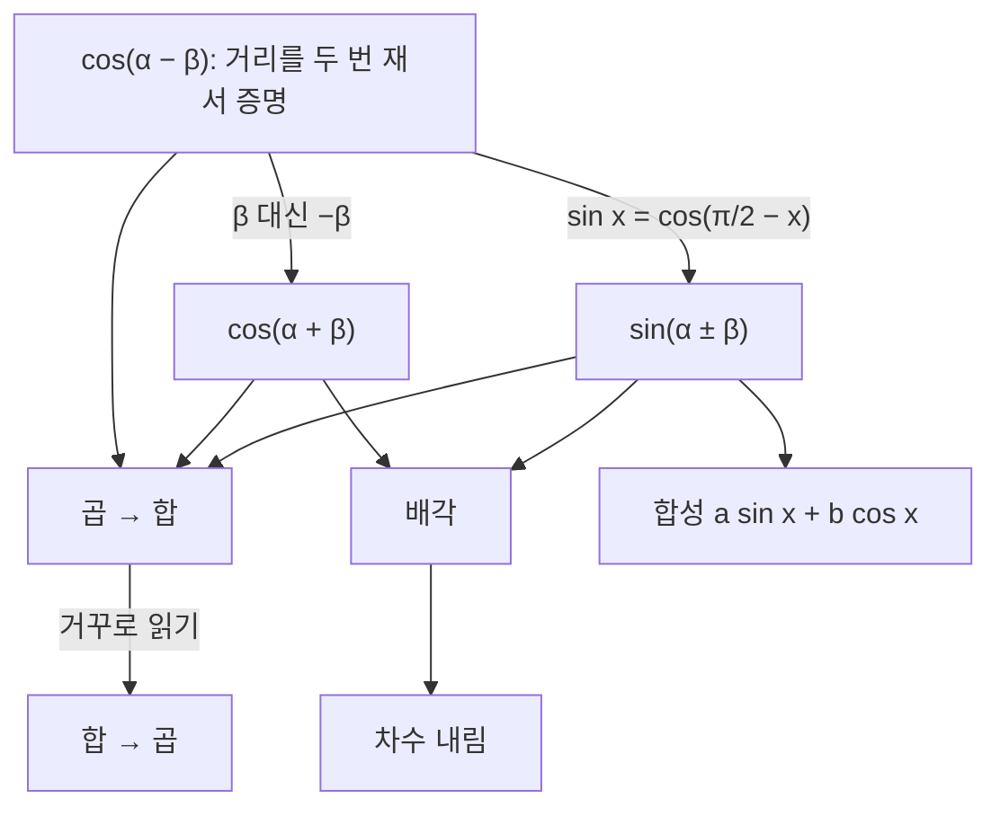



요약

삼각함수 공식은 외울 것이 많아 보이지만, 사실은 덧셈정리 두 개에서 배각·반각·곱을 합으로 바꾸는 공식이 모두 나온다. 덧셈정리는 "두 번 돌린 것 = 두 각을 더해 한 번 돌린 것"을 좌표로 적은 것이다. 이 공식들 덕분에 신호를 곱해 주파수를 옮기는 변조, 사인파의 합성, 회전의 합성을 계산할 수 있다. 다만 항등식은 모든 각에서 맞아야 하므로, 값 몇 개를 넣어 맞는 것만으로는 증명이 되지 않는다.

## 예시로 보기

$$\cos 75°$$는 특수각이 아니지만 $$75° = 45° + 30°$$로 쪼개면 계산된다.

$$\cos 75° = \cos 45° \cos 30° - \sin 45° \sin 30° = \frac{\sqrt2}{2}\cdot\frac{\sqrt3}{2} - \frac{\sqrt2}{2}\cdot\frac12 = \frac{\sqrt6 - \sqrt2}{4} \approx 0.2588$$

그림으로는 이렇다. 단위원에서 $$(1, 0)$$을 $$45°$$ 돌리고 다시 $$30°$$ 돌린 점은 한 번에 $$75°$$ 돌린 점과 같다. 두 번째 회전은 첫 번째 회전의 결과 $$(\cos 45°, \sin 45°)$$를 통째로 돌린다. 그 좌표를 계산하면 덧셈정리가 나온다. 선형대수학에서 이 계산을 회전 행렬의 곱으로 다시 만난다.

## 정의

삼각함수 항등식

모든 실수 $$\alpha$$, $$\beta$$, $$\theta$$, $$x$$에 대해(탄젠트는 분모가 0이 아닐 때)[^1]
1. **덧셈정리:** $$\sin(\alpha \pm \beta) = \sin\alpha\cos\beta \pm \cos\alpha\sin\beta$$, $$\ \cos(\alpha \pm \beta) = \cos\alpha\cos\beta \mp \sin\alpha\sin\beta$$, $$\ \tan(\alpha + \beta) = \dfrac{\tan\alpha + \tan\beta}{1 - \tan\alpha\tan\beta}$$
2. **배각:** $$\sin 2\theta = 2\sin\theta\cos\theta$$, $$\ \cos 2\theta = \cos^2\theta - \sin^2\theta = 2\cos^2\theta - 1 = 1 - 2\sin^2\theta$$
3. **차수 내림(반각):** $$\sin^2\theta = \dfrac{1 - \cos 2\theta}{2}$$, $$\ \cos^2\theta = \dfrac{1 + \cos 2\theta}{2}$$
4. **곱 → 합:** $$\sin\alpha\sin\beta = \tfrac12[\cos(\alpha - \beta) - \cos(\alpha + \beta)]$$, $$\ \cos\alpha\cos\beta = \tfrac12[\cos(\alpha - \beta) + \cos(\alpha + \beta)]$$, $$\ \sin\alpha\cos\beta = \tfrac12[\sin(\alpha + \beta) + \sin(\alpha - \beta)]$$
5. **합 → 곱:** $$\sin\alpha + \sin\beta = 2\sin\dfrac{\alpha + \beta}{2}\cos\dfrac{\alpha - \beta}{2}$$
6. **합성:** $$a\sin x + b\cos x = R\sin(x + \varphi)$$. 여기서 $$R = \sqrt{a^2 + b^2}$$이고 $$\varphi$$는 $$\cos\varphi = a/R$$, $$\sin\varphi = b/R$$인 각이다.

가정은 "모든 각에서"라는 것 하나다. 항등식은 방정식과 다르다. $$\sin x = \frac12$$은 특정한 $$x$$에서만 참인 방정식이고, $$\sin^2 x + \cos^2 x = 1$$은 모든 $$x$$에서 참인 항등식이다.

## 증명

$$\cos(\alpha - \beta)$$ 하나를 거리 계산으로 증명하고, 나머지는 모두 거기서 대수로 끌어낸다.

맨 위의 공식 하나만 기하로 보이고, 아래는 모두 대입과 대칭으로 이어진다. 화살표를 거슬러 올라가면 어떤 공식이든 출발점이 어디인지 찾을 수 있다[^s3].

증명 펼치기

1. *거리 두 번 재기:* 단위원 위 두 점 $$P(\alpha) = (\cos\alpha, \sin\alpha)$$, $$P(\beta) = (\cos\beta, \sin\beta)$$ 사이 거리의 제곱은

$$(\cos\alpha - \cos\beta)^2 + (\sin\alpha - \sin\beta)^2 = 2 - 2(\cos\alpha\cos\beta + \sin\alpha\sin\beta)$$

이다. — 전개하고 $$\sin^2 + \cos^2 = 1$$을 두 번 씀

{: start="2"}
2. *돌려서 다시 재기:* 두 점을 함께 $$-\beta$$만큼 돌리면 $$P(\alpha - \beta)$$와 $$P(0) = (1, 0)$$이 된다. 회전은 거리를 바꾸지 않으므로 거리 제곱은 $$(\cos(\alpha - \beta) - 1)^2 + \sin^2(\alpha - \beta) = 2 - 2\cos(\alpha - \beta)$$와 같다.
3. *비교:* $$\cos(\alpha - \beta) = \cos\alpha\cos\beta + \sin\alpha\sin\beta$$.
4. *$$\cos(\alpha + \beta)$$:* 3에 $$\beta$$ 대신 $$-\beta$$를 넣고 $$\cos(-\beta) = \cos\beta$$, $$\sin(-\beta) = -\sin\beta$$를 쓴다.
5. *$$\sin(\alpha \pm \beta)$$:* $$\sin x = \cos(\pi/2 - x)$$이므로 $$\sin(\alpha + \beta) = \cos\big((\pi/2 - \alpha) - \beta\big)$$에 3을 적용한다.
6. *배각:* 덧셈정리에 $$\beta = \alpha$$. $$\cos 2\theta$$의 나머지 두 꼴은 $$\sin^2 = 1 - \cos^2$$를 넣는다.
7. *차수 내림:* 6의 $$\cos 2\theta = 1 - 2\sin^2\theta$$를 $$\sin^2\theta$$에 대해 푼다.
8. *곱 → 합:* $$\cos(\alpha - \beta)$$와 $$\cos(\alpha + \beta)$$의 식을 빼거나 더하고 2로 나눈다. 합 → 곱은 $$u = \frac{\alpha + \beta}{2}$$, $$v = \frac{\alpha - \beta}{2}$$로 두고 곱 → 합을 거꾸로 읽는다.
9. *합성:* $$R\sin(x + \varphi) = R\sin x\cos\varphi + R\cos x\sin\varphi = a\sin x + b\cos x$$. $$(a/R)^2 + (b/R)^2 = 1$$이라 그런 $$\varphi$$가 있다. ∎

### 스스로 설명해 보기

1. 2단계 "회전은 거리를 바꾸지 않는다"는 왜 써도 되는가?

회전은 도형을 모양 그대로 옮기는 변환(강체 운동)이라 두 점 사이 거리가 그대로다. 증명 전체가 이 기하학적 사실 하나에 기대고 있다.

2. 4단계에서 부호가 바뀌는 곳은 어디이고, 왜 바뀌나?

$$\sin\alpha\sin(-\beta) = -\sin\alpha\sin\beta$$라서 가운데 부호가 $$+$$에서 $$-$$로 바뀐다. 사인은 홀함수, 코사인은 짝함수이기 때문이다.

이 증명의 핵심 아이디어는?

같은 양(거리)을 두 가지 방법으로 계산해 같다고 놓는다. 그리고 공식 하나를 증명한 뒤, 나머지는 대입과 대칭으로 끌어낸다.

같은 방법을 쓸 수 있는 다른 상황은?

같은 것을 두 번 세어 등식을 얻는 방법은 이산수학의 [조합적 증명](/Hongs_Blog/studies/discrete-math/binomial-theorem/)에서 다시 쓴다. 공식 하나에서 나머지를 끌어내는 방식은 [오일러 공식](/Hongs_Blog/studies/college-math/euler-formula/)으로 더 짧아진다. $$e^{i(\alpha+\beta)} = e^{i\alpha}e^{i\beta}$$의 실수부와 허수부가 덧셈정리다.

## 예제

**교류의 평균 전력.** 전압 $$A\sin\omega t$$가 저항에 걸리면 전력은 $$\sin^2\omega t$$에 비례한다. 한 주기 평균은 얼마인가?

1. *차수 내림:* $$\sin^2\omega t = \frac12 - \frac12\cos 2\omega t$$.
2. *평균 내기:* $$\cos 2\omega t$$는 한 주기 동안 위아래가 같아 평균이 0이다. 그래서 평균은 $$\frac12$$이다.
3. *해석:* 진폭 $$A$$인 교류는 크기 $$A/\sqrt2$$인 직류와 같은 일을 한다(실효값). 가정용 220 V가 실효값이다.

$$\sin^2\omega t$$(파랑)는 $$\sin\omega t$$보다 두 배 빠르게 0과 1 사이를 오간다. 1/2 위로 솟은 부분과 아래로 꺼진 부분의 넓이가 같아서 평균이 1/2이다[^s2].

**변조.** 64 kHz 반송파 $$\cos(2\pi \cdot 64000\,t)$$에 1 kHz 음성 $$\cos(2\pi \cdot 1000\,t)$$을 곱하면 무엇이 나오는가?

1. *곱 → 합:* $$\cos\alpha\cos\beta = \frac12[\cos(\alpha - \beta) + \cos(\alpha + \beta)]$$.
2. *대입:* $$\frac12\cos(2\pi \cdot 63000\,t) + \frac12\cos(2\pi \cdot 65000\,t)$$.
3. *해석:* 음성이 1 kHz 자리에서 63·65 kHz 자리로 옮겨졌다. 이렇게 채널마다 다른 반송파를 곱해 주파수 구간을 나눠 쓰는 것이 [주파수 분할 다중화](/Hongs_Blog/studies/computer-communication/frequency-division-multiplexing/)다[^s1].

**합성.** $$\sin x + \sqrt3\cos x$$를 사인파 하나로 쓴다. $$R = \sqrt{1 + 3} = 2$$, $$\cos\varphi = \frac12$$, $$\sin\varphi = \frac{\sqrt3}{2}$$이므로 $$\varphi = \frac{\pi}{3}$$, 즉 $$2\sin\left(x + \frac{\pi}{3}\right)$$이다.

연습: [삼각함수 항등식 예제 사다리](/Hongs_Blog/studies/college-math/trig-identities-ladder/)

검증: 모든 항등식을 무작위 각 2만 쌍에서 확인(실험으로 확인됨. 증명은 위), 거리 불변, $$\cos 75°$$, $$\sin^2$$ 평균 0.5, 변조 3,000점, 합성, 반례, 사다리의 답 — [14_trig-identities_verify.py](/Hongs_Blog/studies/college-math/code/14_trig-identities_verify/)

## 활용

- **통신.** 변조(곱 → 합)와 복조가 곱셈으로 주파수를 옮긴다.
- **소리.** 주파수가 조금 다른 두 음을 함께 울리면 $$\sin\alpha + \sin\beta = 2\sin\frac{\alpha+\beta}{2}\cos\frac{\alpha-\beta}{2}$$에 따라 소리가 주기적으로 커졌다 작아진다(맥놀이). 조율할 때 맥놀이가 사라지면 두 음의 주파수가 같다.

주파수가 20 Hz와 22 Hz인 두 사인파를 더한 것이다. 21 Hz로 빠르게 떨리면서, 그 떨림의 크기가 점선을 따라 1초에 두 번 커졌다 작아진다[^s2].

- **그래픽.** 점을 $$\alpha$$ 돌린 뒤 $$\beta$$ 돌리는 것이 $$\alpha + \beta$$ 한 번 돌리는 것과 같다는 사실이 회전을 누적하는 코드의 근거다.
- **빠른 푸리에 변환.** FFT는 덧셈정리로 $$\cos$$, $$\sin$$ 값을 서로에게서 만들어 계산을 아낀다([이산 푸리에 변환과 FFT](/Hongs_Blog/studies/linear-algebra/dft/)).
- 알고리즘에서: 길이가 $$r_1$$, $$r_2$$인 두 벡터 $$p = r_1(\cos\alpha, \sin\alpha)$$, $$q = r_2(\cos\beta, \sin\beta)$$로 $$p_x q_y - p_y q_x$$(외적)를 계산하면, 덧셈정리로 $$r_1 r_2 \sin(\beta - \alpha)$$가 나온다. 그래서 각을 구하지 않고 이 값의 부호만 보고 $$q$$가 $$p$$의 왼쪽인지 오른쪽인지 안다([계산 기하 기초](/Hongs_Blog/studies/algorithms/geometry-ccw/)).

## 연결

- 선수: [삼각함수](/Hongs_Blog/studies/college-math/trig-functions/)
- 이어지는 개념: [사인파](/Hongs_Blog/studies/college-math/sinusoid/)의 합성, [복소수의 극형식과 오일러 공식](/Hongs_Blog/studies/college-math/euler-formula/), 선형대수학의 브리지 문서 [덧셈정리 ↔ 복소수 곱 ↔ 회전 행렬](/Hongs_Blog/studies/linear-algebra/rotation-bridge/)

## 자주 하는 오해

"sin(α + β) = sin α + sin β"

틀렸다. 괄호를 푸는 분배법칙 $$k(a + b) = ka + kb$$처럼 보여서 그럴듯하다. 하지만 $$\sin$$은 곱하는 수가 아니라 함수라 분배되지 않는다. $$\alpha = \beta = \frac{\pi}{2}$$이면 $$\sin\pi = 0$$인데 $$\sin\frac{\pi}{2} + \sin\frac{\pi}{2} = 2$$다. 올바른 식에는 $$\cos$$이 섞여 들어간다: $$\sin(\alpha + \beta) = \sin\alpha\cos\beta + \cos\alpha\sin\beta$$.

## 확인 문제

**C1** sin(α + β)와 cos(α + β)의 덧셈정리를 쓰라.

**답:** $$\sin(\alpha + \beta) = \sin\alpha\cos\beta + \cos\alpha\sin\beta$$, $$\cos(\alpha + \beta) = \cos\alpha\cos\beta - \sin\alpha\sin\beta$$.

**흔한 오답:** 코사인 쪽 부호를 $$+$$로 쓰는 것. $$\alpha = \beta = \pi/2$$를 넣어 $$\cos\pi = -1$$이 나오는지로 확인한다.

**C2** 덧셈정리에서 cos 2θ의 세 가지 꼴을 끌어내라.

**답:** $$\beta = \alpha = \theta$$를 넣으면 $$\cos 2\theta = \cos^2\theta - \sin^2\theta$$. 여기에 $$\sin^2\theta = 1 - \cos^2\theta$$를 넣으면 $$2\cos^2\theta - 1$$, $$\cos^2\theta = 1 - \sin^2\theta$$를 넣으면 $$1 - 2\sin^2\theta$$.

**C3** (a) cos 75°의 정확한 값을 구하라. (b) sin²x의 한 주기 평균은 얼마인가?

**답:** (a) $$\cos(45° + 30°) = \frac{\sqrt6 - \sqrt2}{4} \approx 0.2588$$. (b) $$\sin^2 x = \frac{1 - \cos 2x}{2}$$이고 $$\cos 2x$$의 평균이 0이므로 $$\frac12$$.

**C4** 64 kHz 반송파에 1 kHz 신호를 곱하면 어떤 주파수 성분이 생기는가? 어느 항등식으로 알 수 있는가?

**답:** 63 kHz와 65 kHz 성분이 절반 크기로 생긴다. 곱 → 합 공식 $$\cos\alpha\cos\beta = \frac12[\cos(\alpha - \beta) + \cos(\alpha + \beta)]$$ 때문이다. 곱셈이 주파수를 더하고 뺀 자리로 옮긴다.

[^1]: OpenStax, *Precalculus 2e*, 7.1절 "Simplifying and Verifying Trigonometric Identities", 7.2절 "Sum and Difference Identities", 7.3절 "Double-Angle, Half-Angle, and Reduction Formulas", 7.4절 "Sum-to-Product and Product-to-Sum Formulas". 단위원 위 두 점의 거리를 두 번 재는 덧셈정리 증명은 표준적인 증명 방법 중 하나다.
[^s1]: 에이전트 보충. 반송파를 곱하는 진폭 변조와 실효값 $$A/\sqrt2$$은 통신·전기 공학의 표준 내용이다. 실제 주파수 분할 다중화는 한쪽 옆띠만 남기는 등 더 다듬은 변조를 쓴다.
[^s2]: 에이전트 보충. 그림 두 장은 원본에 없다. [14_trig-identities_plot.py](/Hongs_Blog/studies/college-math/code/14_trig-identities_plot/)로 그렸고, 그림에 쓴 값($$\sin^2$$의 한 주기 평균 0.5, 합 → 곱 공식으로 두 사인파의 합이 $$2\sin(2\pi \cdot 21t)\cos(2\pi \cdot 1 \cdot t)$$)을 같은 코드로 확인했다.
[^s3]: 에이전트 보충. 다이어그램 1개는 원본에 없다. `증명`의 1~9단계가 각각 앞의 어느 공식을 쓰는지를 근거로 그렸다(OpenStax, *Precalculus 2e*, 7.2~7.4절).

