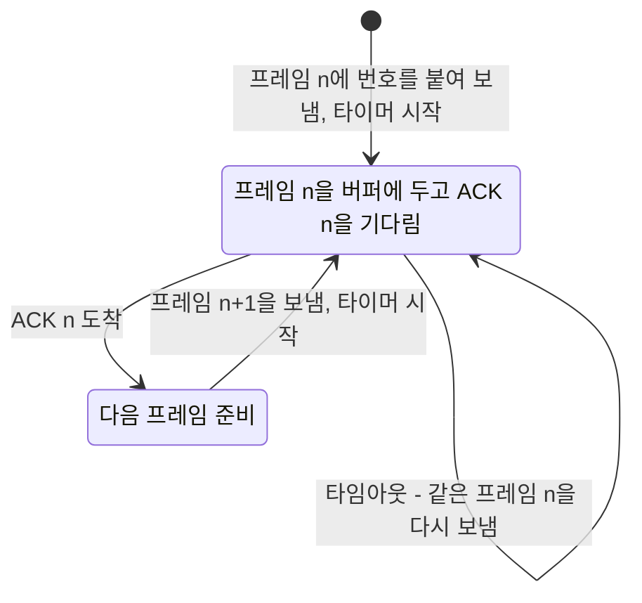
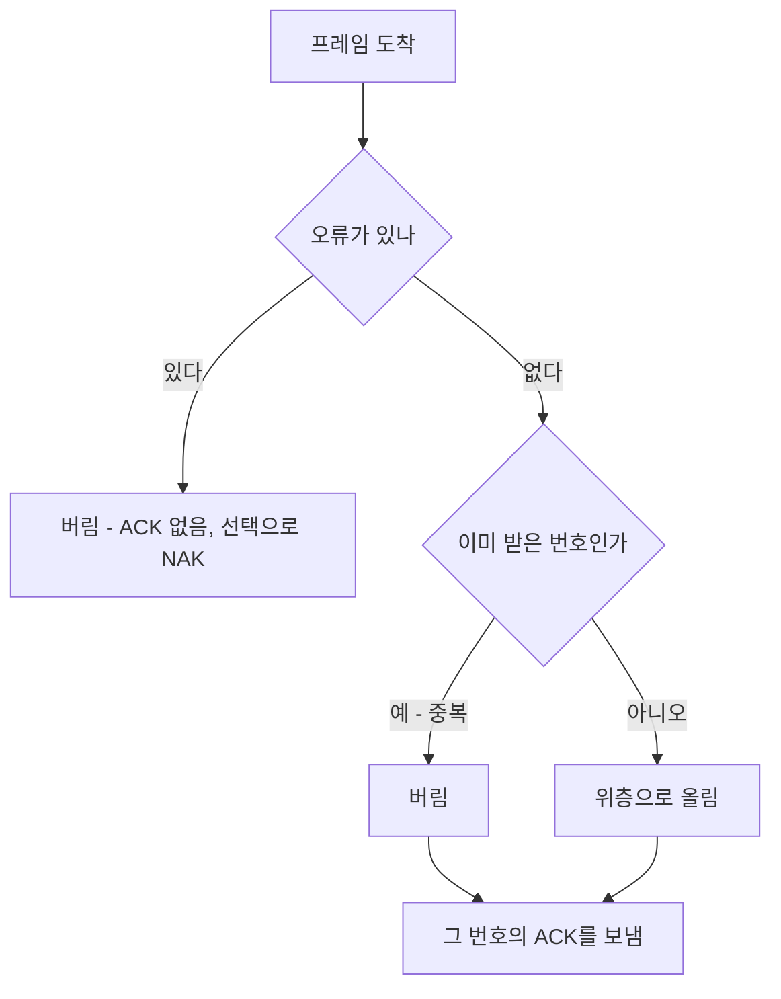



요약

보내는 쪽은 프레임을 보내고, 받는 쪽은 제대로 받으면 "받았다(ACK)"고 답한다. 정해 둔 시간(타임아웃) 안에 ACK가 오지 않으면 보내는 쪽이 같은 프레임을 다시 보낸다. 그런데 ACK가 사라져도 다시 보내게 되므로, 받는 쪽은 같은 프레임을 두 번 받을 수 있다. 그래서 프레임마다 번호(순서 번호)를 붙여 중복을 알아보고 버린다. 양쪽은 서로의 상태를 볼 수 없으므로, 상대가 보낸 메시지만 보고 원칙대로 움직여야 한다.

## 예시로 보기

송신자와 수신자를 동시에 보는 것은 현실에서 불가능하다. 각자 상대에게서 온 메시지로만 상대의 상태를 짐작한다. 그래서 송신자 동작과 수신자 동작을 따로 정리한다[^1].

슬라이드의 네 경우를 순서 번호 없이 따라가 보자[^2][^s1].

| 경우 | 일어난 일 | 송신자 | 수신자 | 결과 |
|---|---|---|---|---|
| (a) | 프레임과 ACK 모두 도착 | ACK를 받고 다음 프레임 | 한 번 받음 | 정상 |
| (b) | 프레임 분실 | 타임아웃 → 재전송 | 재전송된 것만 받음 | 정상 |
| (c) | ACK 분실 | 타임아웃 → 재전송 | 같은 프레임을 두 번 받음 | **중복** |
| (d) | ACK가 타임아웃보다 늦게 도착 | 타임아웃 → 재전송 | 같은 프레임을 두 번 받음 | **중복** |

(c)와 (d)에서 수신자는 다시 온 프레임이 재전송인지 새 프레임인지 알 수 없다. 프레임에 번호가 있으면 "방금 받은 0번이 또 왔다"고 알아 버린다[^3].

검증: 네 경우를 순서 번호 없이/있게 시뮬레이션해 (c)·(d)의 중복이 번호로 사라짐, 정지 대기에는 0과 1 두 번호로 충분, 카드 C2 — [53_arq_impl.py](/Hongs_Blog/studies/computer-communication/code/53_arq_impl/)

## 정의

**ARQ(Automatic Repeat Request)**는 오류 검출, 응답(ACK), 타임아웃 뒤 재전송으로 오류를 복구한다. 부정 응답(NAK)은 선택 사항이다[^4].

**입력:** 보낼 프레임들. **출력:** 수신자 쪽에 순서대로 한 번씩 전달된 프레임들.

- **송신자:** 모든 데이터 프레임에 식별자(순서 번호)를 붙여 보낸다. 보낸 프레임을 버퍼에 두고 타이머를 건다. 그 번호의 ACK가 오면 다음 프레임으로 가고, 타임아웃이 나면 같은 프레임을 다시 보낸다[^5].
- **수신자:** 오류 없이 받은 프레임마다 ACK를 보내며, 받은 데이터의 식별자를 표시한다. 이미 받은 번호의 프레임(중복)은 버리지만 ACK는 반드시 다시 보낸다[^3][^5].

위는 송신자, 아래는 수신자다. 송신자는 ACK가 오지 않는 한 같은 프레임을 되풀이해 보낸다. 수신자는 오류 없는 프레임에는 중복이든 아니든 ACK로 답하고, 위층에는 처음 받은 번호만 올린다[^s2].

순서 번호는 거의 모든 프로토콜에서 메시지에 붙고, 프레임과 ACK 모두에 헤더의 일부로 붙는다. ACK에 $$n$$ 대신 $$n + 1$$을 쓰기도 한다. "$$n$$번까지 잘 받았고 다음은 $$n + 1$$번"이라는 뜻이다[^3].

중복 프레임에도 ACK를 다시 보내야 하는 이유는, 송신자가 아직 ACK를 받지 못해 재전송했을 수 있기 때문이다. ACK를 보내지 않으면 송신자는 같은 프레임을 영원히 다시 보낸다[^s1].

원본 오류 의심

원문: "수신자가 송신자에게 ACK를 보냄(오류시)" (6주차 필기 131행) / 문제점: ACK는 프레임을 오류 없이 받았을 때 보내는 응답이다. 오류가 있는 프레임은 버리고 아무것도 보내지 않거나(그러면 타임아웃으로 재전송), 선택적으로 NAK를 보낸다 / 수정안: "수신자는 프레임을 제대로 받으면 ACK를 보낸다. 오류면 버린다(선택: NAK)" / 근거: 슬라이드 62~66의 ACK·타임아웃 그림과 슬라이드 66의 "Negative Acknowledgment (optional)", 필기 162행 "NAK는 optional이다"[^4][^6]

### 시간 진행 (성능 분석 기초)

한 프레임을 보내는 시간은 프레임을 링크에 싣는 시간 $$t_{\text{frame}}$$(프레임 크기 ÷ 전송률)과 신호가 건너가는 시간 $$t_{\text{prop}}$$(거리 ÷ 신호 속도)로 나뉜다. 데이터가 오류로 망가지면 수신자가 NAK를 보내 재전송을 앞당길 수 있다[^4]. 필기의 말대로 구간마다 걸리는 시간, 비트 수, 변수(전파 지연 등)를 익혀 두어야 한다[^6]. 링크를 얼마나 쓰는지(사용률)의 분석은 다음 회차의 정지 대기 분석으로 이어진다[^s1].

### 실행 추적

프레임 F0, F1을 보낸다. F0의 ACK가 사라진다(경우 c)[^s1].

| 순서 | 송신자 | 링크 | 수신자 |
|---|---|---|---|
| 1 | F0(번호 0) 보냄, 타이머 시작 | → | 0번 받음, 위로 전달, ACK 0 |
| 2 | | ✕ ACK 0 분실 | |
| 3 | 타임아웃 → F0(0) 다시 보냄 | → | 0번 또 옴 → 중복이라 버림, ACK 0 다시 |
| 4 | ACK 0 받음 → F1(번호 1) 보냄 | → | 1번 받음, 위로 전달, ACK 1 |

정지 대기에서는 한 번에 한 프레임만 다니므로, 번호는 0과 1을 번갈아 쓰면 충분하다.

## 활용

- 정지 대기 ARQ는 블루투스 같은 단순한 링크와 많은 프로토콜의 기본 틀이다. 여러 프레임을 한꺼번에 보내는 슬라이딩 윈도우와 TCP도 같은 ACK·타임아웃·순서 번호 위에 선다[^s1].
- 흔한 실수: 중복 프레임을 받았을 때 ACK를 보내지 않는 것. 또 타임아웃을 왕복 시간보다 짧게 잡는 것(경우 d처럼 쓸데없는 재전송이 생긴다).

## 연결

- 선수: [오류 복구와 FEC](/Hongs_Blog/studies/computer-communication/error-recovery-fec/)(재전송이라는 선택), [CRC](/Hongs_Blog/studies/computer-communication/crc/)(오류 검출)
- 시간 분석: [소요시간](/Hongs_Blog/studies/computer-communication/latency/)(전송 시간과 전파 지연), [대역폭-지연 곱](/Hongs_Blog/studies/computer-communication/bandwidth-delay-product/)

## 확인 문제

<b>C1</b> ARQ의 네 요소를 쓰고, 송신자와 수신자의 동작을 각각 한 줄로 쓰라.

**답:** 오류 검출, ACK, 타임아웃 뒤 재전송, (선택) NAK. 송신자는 번호를 붙여 보내고 ACK가 오면 다음, 타임아웃이면 재전송. 수신자는 오류 없이 받으면 ACK를 보내고, 중복이면 버리되 ACK는 다시 보낸다.

<b>C2</b> 프레임 F0, F1, F2를 정지 대기로 보낸다. F0을 처음 보낼 때 프레임이 사라지고, F1의 ACK가 한 번 사라진다. 송신자가 보내는 프레임은 모두 몇 번인가?

**답:** 5번. F0 두 번(처음 분실, 재전송), F1 두 번(ACK 분실로 재전송, 수신자는 두 번째를 중복으로 버림), F2 한 번.

<b>C3</b> 순서 번호가 없으면 ACK 분실이 왜 문제가 되는가?

**답:** 송신자는 ACK가 오지 않아 같은 프레임을 다시 보낸다. 수신자는 다시 온 프레임이 재전송인지 새 프레임인지 구별할 수 없어 같은 데이터를 두 번 위로 넘긴다. 번호가 있으면 이미 받은 번호라 버린다.

<b>C4</b> 수신자 규칙 "중복된 데이터는 버리지만 ACK는 반드시 보낸다"가 하는 일을 한 문장으로 쓰라.

**답:** 중복 데이터가 위로 두 번 올라가는 것을 막으면서, ACK를 받지 못해 재전송하고 있는 송신자가 다음 프레임으로 넘어갈 수 있게 해 준다.

[^1]: 4-1학기/컴퓨터 통신/1.수업자료/04.2장-1.pptx, 슬라이드 62~63 "ARQ: 응답(ACK) 및 타임아웃"
[^2]: 같은 자료, 슬라이드 65 "ARQ 완성: 순서번호 포함 + 다음 프레임 전송" (4-1학기/pasted_images/Pasted image 20261009005501.png, 20261009005843.png)
[^3]: 같은 자료, 슬라이드 64 "ARQ: 순서번호"
[^4]: 같은 자료, 슬라이드 66 "ARQ - 세부 시간 진행" (4-1학기/pasted_images/Pasted image 20261009005940.png)
[^5]: 같은 자료, 슬라이드 65. 필기 154행 "미완성의 그림, 순서 번호를 붙힌다"
[^6]: 4-1학기/컴퓨터 통신/2.필기노트/06.6주차.md, 130~132행, 159~162행
[^s1]: 에이전트 보충. 네 경우 표의 정리, 중복에도 ACK를 보내는 이유, 실행 추적, 다음 회차와의 연결, 쓰임, 흔한 실수, 카드 C2~C4는 원본에 없다. 구현 코드로 확인했다.
[^s2]: 에이전트 보충. 다이어그램 2개는 원본에 없다. 이 문서 '정의' 절의 송신자·수신자 동작(슬라이드 64·65)과 원본 오류 의심 상자의 수정안(오류면 버림, 선택으로 NAK)을 바탕으로 그렸다.

