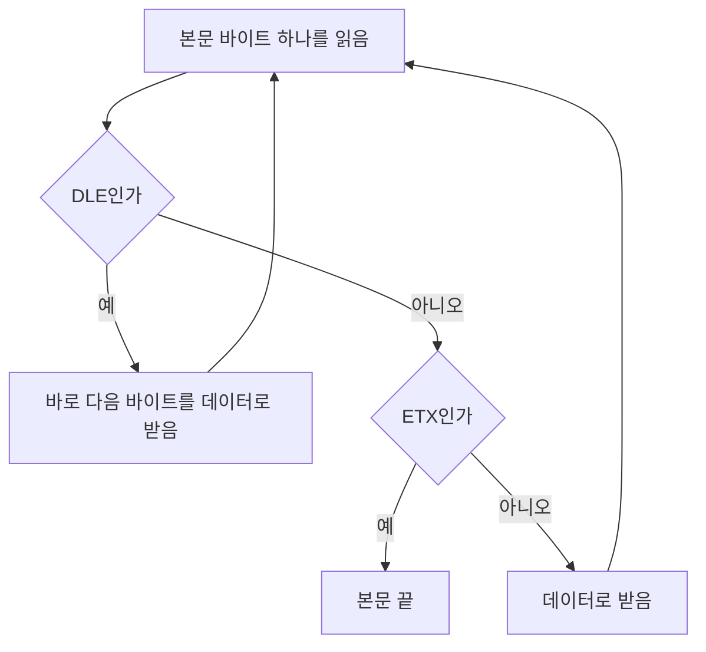


<div class="callout callout-summary" markdown="1">
<div class="callout-title callout-title--default" markdown="span">요약</div>

링크로는 비트가 끝없이 흘러온다. 받는 쪽이 "여기서부터 여기까지가 한 덩어리(프레임)"라고 알 수 있게, 보내는 쪽이 덩어리의 처음과 끝에 표시를 단다. 바이트 중심 방법은 두 가지다. 정해 둔 글자(보초)로 끝을 표시하거나, 맨 앞에 길이를 적어 둔다. 보초 방법은 본문에 같은 글자가 우연히 나오면 거기서 끊기므로 앞에 특별한 글자를 붙여 피하고, 길이 방법은 길이 칸이 깨지면 엉뚱한 곳에서 자른다.

</div>


## 예시로 보기

편지 여러 통을 이어 붙여 한 줄로 보낸다고 하자. 편지마다 끝에 "끝."이라고 쓰기로 약속하면, 본문에 "끝."이라는 말이 들어 있는 편지는 중간에서 잘려 버린다.

BISYNC는 본문 끝에 ETX(End of Text) 글자를 붙인다. 본문 바이트가 `41 03 42`이면 가운데 `03`이 ETX와 같아서, 받는 쪽은 `41`까지만 본문으로 읽는다[^1][^s1]. 그래서 본문에 ETX가 나오면 그 앞에 DLE(Data Link Escape) 글자를 하나 붙인다. "다음 글자는 보초가 아니라 그냥 데이터"라는 표시다. 본문의 DLE도 같은 이유로 앞에 DLE를 하나 더 붙인다[^1].

| 본문 | 보내는 바이트(슬라이드 방식) |
|---|---|
| `41 ETX 42 DLE ETX 43` | `41 DLE ETX 42 DLE DLE DLE ETX 43 ETX` |

맨 끝의 ETX는 앞에 DLE가 없으니 진짜 끝이다.

<div class="callout callout-check" markdown="1">
<div class="callout-title" markdown="span">검증: 위 표, 채우기 없으면 잘림, 무작위 본문 2,000개를 두 방식으로 보내고 되돌리기, 길이 칸이 깨진 경우, 카드 C2 — [44_framing_impl.py](/Hongs_Blog/studies/computer-communication/code/44_framing_impl/)</div>

</div>


## 정의

**프레이밍**은 비트의 연속을 프레임이라는 묶음으로 자르는 일이다. 받는 쪽이 프레임을 알아볼 수 있게 봉투를 씌운다. 프레임의 처음과 끝을 표시하고, 다른 정보도 적는다. 보통 네트워크 어댑터(NIC)가 한다. 보낼 때 어댑터는 호스트 메모리에서 데이터와 헤더를 가져와 프레임을 만든다(캡슐화)[^2]. 링크에는 비트가 흐르지만 어댑터 사이에서는 프레임이 오간다[^3].

주고받는 메시지의 형식(PDU, Protocol Data Unit)이 같은 계층끼리의 약속, 곧 "피어 사이 인터페이스"의 실체다[^1].

### 보초 방법 (BISYNC)

```
| SYN | SYN | SOH | Header | STX | Body | ETX | CRC |
   8     8     8               8            8    16   (비트)
```

SYN은 동기 글자, SOH는 헤더 시작, STX는 본문 시작, ETX는 본문 끝이다[^1][^4]. 본문에 ETX가 나오는 문제는 확장 문자로 푼다. BISYNC는 ETX 앞에 DLE를 붙이고, IMP-IMP는 DLE 앞에 DLE를 붙인다[^1]. 두 규칙을 함께 쓰면 받는 쪽은 "DLE 다음 글자는 그대로 데이터, 앞에 DLE가 없는 ETX는 끝"으로 읽는다[^s1].



DLE를 만나면 그 뒤 한 바이트는 무엇이든 데이터로 넘긴다. 그래서 앞에 DLE가 붙은 ETX는 끝으로 읽히지 않는다[^s2].

필기는 같은 생각을 다른 짝으로 적었다. 끝을 `DLE ETX` 두 글자로 표시하고, 본문의 DLE만 두 번 쓴다[^5]. 이것은 BISYNC의 투명 모드 방식이다. 본문에 `DLE ETX`가 있으면 `DLE DLE ETX`가 되어 받는 쪽이 "DLE 하나 + ETX"로 되돌린다. 두 방식 모두 검증 코드에서 무작위 본문을 정확히 되돌렸다[^s1].

### 바이트 수 방법 (DDCMP)

```
| SYN | SYN | Class | Count | Header | Body | CRC |
   8     8      8      14      42             16   (비트)
```

본문 앞에 바이트 수(Count)를 적어 끝을 따로 표시하지 않는다[^1][^6]. 받는 쪽은 Count만큼 읽고 자른다. 문제는 Count 칸이 전송 중에 깨지는 경우다(프레이밍 오류). 그러면 엉뚱한 곳에서 자르지만, 끝의 CRC가 맞지 않아 오류로 드러난다[^1].

## 활용

- PPP(인터넷 접속용 점대점 프로토콜)도 보초 방법과 확장 문자를 쓴다[^1].
- 흔한 실수: 확장 문자 앞에도 확장 문자가 필요하다는 것을 잊는 것. 본문의 DLE를 그대로 두면 받는 쪽이 그 다음 글자를 데이터로 오해한다.
- 오버헤드: 본문이 ETX와 DLE로만 되어 있으면 보초 방법은 본문 길이가 두 배가 된다. 바이트 수 방법은 늘 Count 칸 하나만 더한다.

## 연결

- 선수: [4B/5B](/Hongs_Blog/studies/computer-communication/4b5b/)(비트를 보내는 1계층), [캡슐화](/Hongs_Blog/studies/computer-communication/encapsulation/)(PDU, 헤더 붙이기)
- 비트 단위로 하는 방법: [비트 채우기](/Hongs_Blog/studies/computer-communication/bit-stuffing/)
- 세 방법 비교: [프레이밍 방식 비교](/Hongs_Blog/studies/computer-communication/framing-compared/)

## 확인 문제

<details markdown="1"><summary markdown="span"><b>C1</b> BISYNC 프레임의 칸을 순서대로 쓰고, 본문에 ETX가 나올 때의 해결책을 쓰라.</summary>


**답:** SYN, SYN, SOH, Header, STX, Body, ETX, CRC. 본문의 ETX 앞에 DLE를 붙이고, 본문의 DLE 앞에도 DLE를 붙인다. 받는 쪽은 DLE 다음 글자를 데이터로 읽고, 앞에 DLE가 없는 ETX를 끝으로 본다.

</details>

<details markdown="1"><summary markdown="span"><b>C2</b> 본문이 `DLE ETX` 두 바이트다. 슬라이드 방식으로 보내는 바이트열을 쓰라.</summary>


**답:** `DLE DLE DLE ETX ETX`. 본문의 DLE 앞에 DLE, 본문의 ETX 앞에 DLE, 마지막에 진짜 끝 ETX.

</details>

<details markdown="1"><summary markdown="span"><b>C3</b> 바이트 수 방법에서 Count가 깨지면 받는 쪽은 어떻게 알아채는가?</summary>


**답:** Count대로 자르면 본문과 CRC의 경계가 틀어져, 받은 데이터로 계산한 CRC가 프레임의 CRC와 맞지 않는다. 그래서 오류로 검출된다. 다만 다음 프레임의 시작도 잃으므로 다시 동기를 맞춰야 한다.

</details>

[^1]: 4-1학기/컴퓨터 통신/1.수업자료/04.2장-1.pptx, 슬라이드 44 "바이트 중심 프로토콜" (4-1학기/pasted_images/Pasted image 20261008194610.png)
[^2]: 같은 자료, 슬라이드 43 "프레이밍: 개요" (4-1학기/pasted_images/Pasted image 20261008194032.png)
[^3]: 4-1학기/컴퓨터 통신/2.필기노트/06.6주차.md, 3~6행
[^4]: 같은 필기, 14~24행
[^5]: 같은 필기, 25~31행
[^6]: 같은 필기, 33~44행
[^s1]: 에이전트 보충. 편지 비유, 바이트 예와 표, 두 규칙을 함께 읽는 방법, 필기의 방식이 BISYNC 투명 모드라는 설명(Peterson & Davie, *Computer Networks: A Systems Approach*, 2.3절), 흔한 실수와 오버헤드, 카드 C2·C3은 원본에 없다. 구현 코드로 확인했다.
[^s2]: 에이전트 보충. 다이어그램 1개는 원본에 없다. 이 문서 '보초 방법' 절의 읽는 규칙(슬라이드 44의 BISYNC·IMP-IMP 확장 문자)을 받는 쪽 순서도로 옮겼다. 구현 코드의 되돌리기와 같은 순서다.

