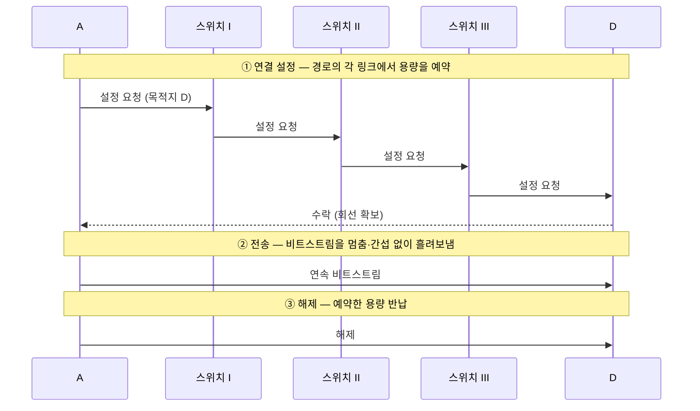



요약

전화를 걸면 통화가 끝날 때까지 두 사람 사이의 길이 통째로 예약되는 것처럼, 통신을 시작하기 전에 목적지까지 가는 길의 용량을 미리 잡아 두는 방식이다. 잡아 둔 뒤에는 다른 사람과 부딪히지 않고 멈춤 없이 보낼 수 있어 단순하다. 대신 쉬는 동안에도 그 용량은 남이 쓸 수 없다. 그래서 잠깐 몰아서 보내고 오래 쉬는 컴퓨터 통신에는 낭비가 크다.

## 예시로 보기

슬라이드 그림에서 A가 D에게 전화한다. 교환기 I, II, III이 차례로 A–I–II–III–D 경로를 이어 준다(빨간 선). 통화가 끝날 때까지 이 경로는 A와 D 전용이다[^1]. 전화기 A, D를 호스트로, 교환기를 스위치로 옮겨 시간 순서로 그리면 다음과 같다.

빨간 선의 링크 하나하나가 아래 정의의 $$(v_{i-1}, v_i)$$이고, "전용"이 "전송률 $$r$$을 연결 기간 내내 배정"이 된다. 목소리인지 데이터인지는 버리고 비트 수와 시간만 남긴다[^s1].

"선로를 한 열차에 통째로 비워 준다"는 비유는 부정확하다. 실제 회선은 링크 전체가 아니라 링크 용량의 일부를 잡는 경우가 많다. 예를 들어 시분할 다중화의 시간 칸 하나나 주파수 분할 다중화의 주파수 대역 하나를 잡는다[^s2].

## 정의

정의

경로 $$h_1 = v_0, v_1, \dots, v_k = h_2$$와 연결 기간 $$[t_s, t_e]$$가 주어졌다고 하자. 회선 스위칭은 각 링크 $$(v_{i-1}, v_i)$$에서 전송률 $$r$$(bps)을 이 기간 동안 이 연결에만 배정한다. 링크 $$(v_{i-1}, v_i)$$의 전송률을 $$R_i$$라 하면, 어느 순간이든 그 링크에 배정된 연결들의 $$r$$의 합은 $$R_i$$를 넘지 않는다. 넘게 되는 새 연결은 거절한다[^s1].

보장하는 것과 보장하지 않는 것은 다음과 같다.

| 보장한다 | 보장하지 않는다 |
|---|---|
| 연결 중에는 전송률 $$r$$을 늘 쓸 수 있다. 다른 연결과 경쟁하지 않는다[^1] | 연결 설정의 성공. 경로의 어느 링크든 남은 용량이 없으면 거절된다(전화의 "통화 중")[^s1] |
| 경로가 고정되어 데이터가 보낸 순서대로, 일정한 지연으로 도착한다[^s1] | 쉬는 시간의 용량 재사용. 아무것도 보내지 않아도 $$r$$은 묶여 있다 |

통화 중에 경로의 스위치나 링크가 고장 나면 회선이 끊겨 다시 설정해야 한다[^s1].

## 예제

모든 링크가 1.536 Mbps이고 시간 칸 24개로 나뉜다. 회선 설정에 0.5초가 걸린다. 640,000비트 파일을 보내는 데 걸리는 시간은? (전파 지연은 무시)[^s2]

1. *회선 하나의 전송률:* 회선 하나가 칸 하나를 쓰므로 $$1{,}536{,}000 / 24 = 64{,}000$$ bps.
2. *전송 시간:* $$640{,}000 / 64{,}000 = 10$$초.
3. *설정 시간 더하기:* $$10 + 0.5 = 10.5$$초.

쉬는 시간의 낭비도 수치로 보인다. 1 Mbps 링크에서 사용자마다 100 kbps 회선을 잡으면 사용자는 10명까지다. 사용자들이 시간의 10%만 실제로 보내도 여전히 10명까지다. 예약한 용량의 90%는 대부분의 시간에 비어 있다. 이 낭비를 줄이는 방법이 [통계적 다중화](/Hongs_Blog/studies/computer-communication/statistical-multiplexing/)다.

검증: 10.5초, 10명, 카드 C3의 12.75초 — [06_circuit-switching_verify.py](/Hongs_Blog/studies/computer-communication/code/06_circuit-switching_verify/)

## 활용

- 전화 네트워크가 이 방식이다[^1]. 일정한 전송률로 오래 이어지는 통신에 맞다. 설정 시간이 긴 통신 시간에 묻힌다.
- 몰렸다 끊겼다 하는 컴퓨터 통신([버스티 트래픽](/Hongs_Blog/studies/computer-communication/bursty-traffic/))에는 맞지 않는다. 안 쓰는 시간에 망이 낭비된다[^2].

## 연결

- 선수: [스위칭 네트워크](/Hongs_Blog/studies/computer-communication/switched-network/), [전송 속도와 대역폭](/Hongs_Blog/studies/computer-communication/rate-and-bandwidth/)
- 짝이 되는 개념: [패킷 스위칭](/Hongs_Blog/studies/computer-communication/packet-switching/) → [회선 스위칭과 패킷 스위칭 비교](/Hongs_Blog/studies/computer-communication/contrast--circuit-switching--packet-switching/)
- 링크 용량을 미리 떼어 놓는 구조는 [시분할 다중화](/Hongs_Blog/studies/computer-communication/time-division-multiplexing/)의 고정 할당과 같다.
- 설정·전송·해제 구간을 시간 흐름 그림으로 계산하는 방법: [소요시간 분석](/Hongs_Blog/studies/computer-communication/timing-analysis/)

## 자주 하는 오해

"회선을 잡으면 전선 한 가닥을 통째로 차지한다"

틀렸다. "회선"이라는 이름과 "점대점 연결처럼 전용 회선을 확보한다"는 설명이 물리적인 선을 떠올리게 한다[^2]. 실제로 잡는 것은 각 링크의 용량 일부다. 슬라이드도 "전용 회선(용량) 확보"라고 쓴다[^1]. 링크 하나를 시간 칸이나 주파수 대역으로 나누면 여러 회선이 동시에 지나갈 수 있다. 위 예제에서 1.536 Mbps 링크 하나에 64 kbps 회선 24개가 함께 지나간다.

## 확인 문제

<b>C1</b> 슬라이드에 나온 회선 스위칭의 특징 세 가지를 쓰라.

**답:** ① 스위치가 사전에 output link에 전용 회선(용량)을 확보한다. ② 비트스트림을 중단·간섭 없이 송수신한다(흘려보냄). ③ 기본적으로 point-to-point 연결이다.

<b>C2</b> 회선 스위칭이 컴퓨터 통신에 비효율적인 이유를 트래픽의 성질과 연결해 설명하라.

**답:** 컴퓨터 트래픽은 버스티하다. 잠깐 몰려서 보내고 오래 쉰다. 회선 스위칭은 용량을 미리 전용으로 잡아 두므로, 쉬는 동안에도 그 용량을 다른 사용자가 쓸 수 없어 낭비된다. 
**흔한 오답:** "회선 설정이 느려서". 설정 시간도 비용이지만 핵심은 쉬는 시간의 낭비다.

<b>C3</b> 링크 3.072 Mbps, 시간 칸 48개, 회선 설정 0.25초일 때 800,000비트 파일의 전송 시간은? (전파 지연 무시)

**답:** 회선 전송률 $$3{,}072{,}000 / 48 = 64{,}000$$ bps. 전송 $$800{,}000 / 64{,}000 = 12.5$$초. 합계 12.75초. 
**흔한 오답:** 링크 전체 전송률로 나눠 약 0.26초에 0.25초를 더한 0.51초. 회선은 칸 하나만 쓴다.

[^1]: 4-1학기/pasted_images/Pasted image 20260924200141.png — 슬라이드 "간접 연결 방법: 스위칭 정책", 회선 스위칭(circuit switching): 전화 네트워크
[^2]: 4-1학기/컴퓨터 통신/2.필기노트/01.1주차.md, 30~34행
[^s1]: 에이전트 보충. 설정·전송·해제의 세 단계, 수식 정의, 보장하지 않는 것과 고장 시나리오는 원본에 없다. 슬라이드의 "사전 확보"와 "중단·간섭 없이 송수신"을 모델로 옮긴 것이다.
[^s2]: 에이전트 보충. 시간 칸이나 주파수 대역으로 회선을 구현한다는 설명과 예제 수치는 Kurose & Ross, *Computer Networking: A Top-Down Approach*, 1.3절의 예제와 같다.

