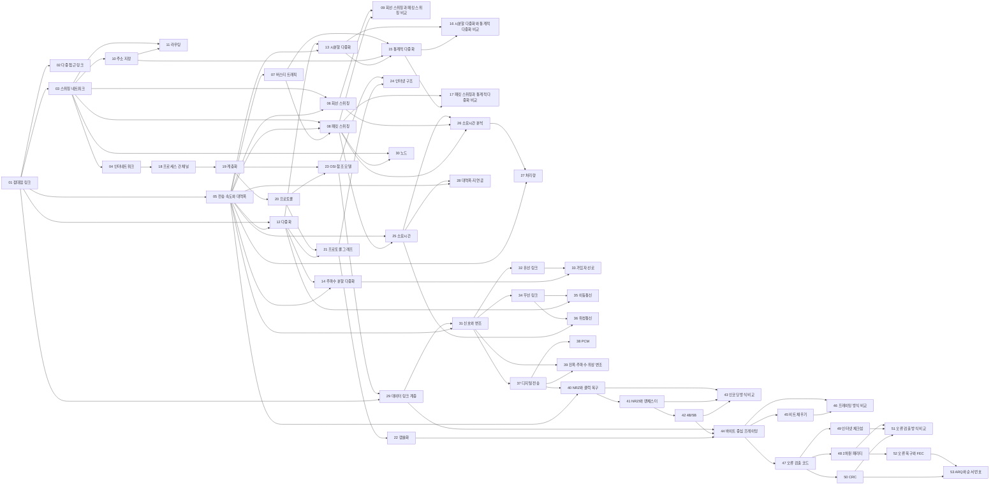


## 먼저 알아야 할 것
- 따로 필요한 선수 과목은 없다. 통계적 다중화의 계산에 확률통계의 이항분포를 쓴다.
- 신호의 진폭·주파수·파장은 [사인파](/Hongs_Blog/studies/college-math/sinusoid/) (공학수학 대학수학)에서 다룬 양과 같다.

## 1회 · 연결과 자원 공유

읽기 전에

1. 기기 100대를 서로 모두 선으로 직접 이으려면 선이 대략 몇 개 필요할까? → [점대점 링크](/Hongs_Blog/studies/computer-communication/point-to-point-link/)
2. 전화처럼 길을 미리 잡아 두는 방식이 컴퓨터 통신에는 왜 손해일까? → [회선 스위칭](/Hongs_Blog/studies/computer-communication/circuit-switching/)
3. 여러 사람이 선 하나를 나눠 쓸 때, 받는 쪽은 어떤 조각이 누구 것인지 어떻게 알까? → [다중화](/Hongs_Blog/studies/computer-communication/multiplexing/)

| 번호 | 개념 | 한 줄 | 개념 코드 | 연습 |
|---|---|---|---|---|
| 01 | [점대점 링크](/Hongs_Blog/studies/computer-communication/point-to-point-link/) | 두 기기를 전용선 하나로 바로 잇는 연결. 모두 이으면 선이 $$n(n-1)/2$$개 (강조)[^1] | [검증](/Hongs_Blog/studies/computer-communication/code/01_point-to-point-link_verify/) · [그림 코드](/Hongs_Blog/studies/computer-communication/code/01_point-to-point-link_plot/) · [그림1](/Hongs_Blog/assets/notes/computer-communication/01_point-to-point-link_fig1.svg) | — |
| 02 | [다중 접근 링크](/Hongs_Blog/studies/computer-communication/multiple-access-link/) | 여러 기기가 선 하나를 함께 씀. 동시에 보내면 충돌 | — | — |
| 03 | [스위칭 네트워크](/Hongs_Blog/studies/computer-communication/switched-network/) | 중계 장치(스위치)를 거쳐 잇는 간접 연결 | — | — |
| 04 | [인터네트워크](/Hongs_Blog/studies/computer-communication/internetwork/) | 네트워크들을 라우터로 이은 네트워크들의 네트워크 | — | — |
| 05 | [전송 속도와 대역폭](/Hongs_Blog/studies/computer-communication/rate-and-bandwidth/) | 싣는 시간 $$L/R$$과 선을 건너는 시간은 다르다. 대역폭의 두 뜻, 비트 폭 | [검증](/Hongs_Blog/studies/computer-communication/code/05_rate-and-bandwidth_verify/) · [그림 코드](/Hongs_Blog/studies/computer-communication/code/05_rate-and-bandwidth_plot/) · [그림1](/Hongs_Blog/assets/notes/computer-communication/05_rate-and-bandwidth_fig1.svg) | — |
| 06 | [회선 스위칭](/Hongs_Blog/studies/computer-communication/circuit-switching/) | 통신 전에 경로의 용량을 전용으로 잡아 둠. 쉬는 동안 낭비 (강조)[^2] | [검증](/Hongs_Blog/studies/computer-communication/code/06_circuit-switching_verify/) | — |
| 07 | [버스티 트래픽](/Hongs_Blog/studies/computer-communication/bursty-traffic/) | 짧게 몰리고 오래 쉬는 트래픽. 최대가 평균보다 훨씬 큼 | [검증](/Hongs_Blog/studies/computer-communication/code/07_bursty-traffic_verify/) | — |
| 08 | [패킷 스위칭](/Hongs_Blog/studies/computer-communication/packet-switching/) | 잡아 두지 않고 패킷마다 저장 후 전달. 지연 $$(H+P-1)L/R$$, 버퍼가 넘치면 혼잡 (강조)[^3] | [검증](/Hongs_Blog/studies/computer-communication/code/08_packet-switching_verify/) | [패킷 스위칭 예제 사다리](/Hongs_Blog/studies/computer-communication/packet-switching-ladder/) |
| 09 | [회선 스위칭과 패킷 스위칭 비교](/Hongs_Blog/studies/computer-communication/contrast--circuit-switching--packet-switching/) | 가르는 질문: 자원을 미리 잡아 두는가 | — | — |
| 10 | [주소 지정](/Hongs_Blog/studies/computer-communication/addressing/) | 상대를 가리키는 이름표. 유니·브로드·멀티캐스트 | — | — |
| 11 | [라우팅](/Hongs_Blog/studies/computer-communication/routing/) | 지정된 상대까지 가는 경로 찾기 | [검증](/Hongs_Blog/studies/computer-communication/code/11_routing_verify/) | — |
| 12 | [다중화](/Hongs_Blog/studies/computer-communication/multiplexing/) | 여러 연결이 링크 하나를 나눠 씀. DEMUX 키가 반드시 있어야 함. 반대 방향은 다채널 분할 (강조)[^4] | [검증](/Hongs_Blog/studies/computer-communication/code/12_multiplexing_verify/) | — |
| 13 | [시분할 다중화](/Hongs_Blog/studies/computer-communication/time-division-multiplexing/) | 시간 칸을 정해진 순서로 돌아가며 씀. 칸 위치가 키 (강조)[^5] | [검증](/Hongs_Blog/studies/computer-communication/code/13_time-division-multiplexing_verify/) | — |
| 14 | [주파수 분할 다중화](/Hongs_Blog/studies/computer-communication/frequency-division-multiplexing/) | 주파수 구간을 나눠 동시에 씀. 보호 대역 낭비. DSL이 이 방식 | [검증](/Hongs_Blog/studies/computer-communication/code/14_frequency-division-multiplexing_verify/) | — |
| 15 | [통계적 다중화](/Hongs_Blog/studies/computer-communication/statistical-multiplexing/) | 보낼 것이 있는 입력에만 링크를 줌. 주소 오버헤드 (강조)[^6] | [검증](/Hongs_Blog/studies/computer-communication/code/15_statistical-multiplexing_verify/) · [그림 코드](/Hongs_Blog/studies/computer-communication/code/15_statistical-multiplexing_plot/) · [그림1](/Hongs_Blog/assets/notes/computer-communication/15_statistical-multiplexing_fig1.svg) · [그림2](/Hongs_Blog/assets/notes/computer-communication/15_statistical-multiplexing_fig2.svg) | — |
| 16 | [시분할 다중화와 통계적 다중화 비교](/Hongs_Blog/studies/computer-communication/contrast--tdm--statistical-multiplexing/) | 가르는 질문: 칸을 미리 정해 두는가 | — | — |

자료: 0장 슬라이드 · 1장 슬라이드 (1~3회) · 직접 링크 · 간접 연결 · 인터네트워킹 · 스위칭 정책 · 스위칭 정책(같은 파일) · 패킷 스위칭 · 자원 공유 · 다중화 · 시분할 다중화 · TDM 그림 · 주파수 분할 스펙트럼 · FDM 그림 · 통계적 다중화 · 다채널 분할
필기: 1주차 필기
떠올려 보기: 노트를 닫고 연결 방식, 스위칭 정책, 다중화 방식 세 가지와, 버스티 트래픽이 스위칭과 다중화에서 각각 어떤 선택을 이끌었는지 써 본다.

## 2회 · 패킷 스위칭과 네트워크 구조

읽기 전에

1. 패킷 스위칭을 하면 링크는 저절로 통계적 다중화가 될까? 둘은 같은 말일까? → [패킷 스위칭과 통계적 다중화 비교](/Hongs_Blog/studies/computer-communication/contrast--packet-switching--statistical-multiplexing/)
2. 편지를 봉투에 넣고 다시 상자에 넣듯, 데이터가 아래층으로 내려갈 때마다 무엇이 붙을까? → [캡슐화](/Hongs_Blog/studies/computer-communication/encapsulation/)
3. 통신의 일을 7층으로 나누면, 중간에 있는 라우터는 몇 층까지 볼까? → [OSI 참조 모델](/Hongs_Blog/studies/computer-communication/osi-reference-model/)

| 번호 | 개념 | 한 줄 | 개념 코드 | 연습 |
|---|---|---|---|---|
| 17 | [패킷 스위칭과 통계적 다중화 비교](/Hongs_Blog/studies/computer-communication/contrast--packet-switching--statistical-multiplexing/) | 가르는 질문: 링크를 나누는 방법인가, 노드가 넘기는 방법인가 | — | — |
| 18 | [프로세스 간 채널](/Hongs_Blog/studies/computer-communication/process-to-process-channel/) | 호스트 사이 연결을 프로세스 사이 통로로. 망의 장애를 메워야 함 (강조)[^7] | — | — |
| 19 | [계층화](/Hongs_Blog/studies/computer-communication/layering/) | 아래층을 믿고 위층을 쌓는 추상화. 논리적 통신과 물리적 통신 (강조)[^8] | — | — |
| 20 | [프로토콜](/Hongs_Blog/studies/computer-communication/protocol/) | 양쪽이 맞춘 약속. 서비스 인터페이스와 동료 인터페이스 | — | — |
| 21 | [프로토콜 그래프](/Hongs_Blog/studies/computer-communication/protocol-graph/) | 프로토콜의 의존 관계 그림. 공유하면 demux key (강조)[^9] | — | — |
| 22 | [캡슐화](/Hongs_Blog/studies/computer-communication/encapsulation/) | 층마다 헤더를 붙여 내려보내고 떼어 올려보냄 | [검증](/Hongs_Blog/studies/computer-communication/code/22_encapsulation_verify/) | — |
| 23 | [OSI 참조 모델](/Hongs_Blog/studies/computer-communication/osi-reference-model/) | 통신의 일을 나눈 7층 지도. 중간 노드는 아래 3층만 (강조)[^10] | — | — |

자료: 통계적 다중화와 패킷스위칭 · 통신 서비스 제공 · 통신 장애 극복 · 1장 기본 개념 · 계층화 · 4층 그림 · 4층 그림(같은 캡처) · 프로토콜 계층/개체 · 프로토콜 그래프 · RRP·HHP · RRP·HHP 논리 통신 · 캡슐화 · 동작 원칙 · logical communication · physical communication · OSI 표준 구조 · OSI 손글씨 · OSI 손글씨(같은 캡처)
필기: 2주차 필기
떠올려 보기: 노트를 닫고 계층화, 프로토콜의 두 인터페이스, 프로토콜 그래프, 캡슐화가 서로 어떻게 이어지는지 한 장의 그림으로 그려 본다.

## 3회 · 인터넷 구조와 성능
전송 속도와 대역폭(05)은 1회 개념의 선수라 앞 번호에 있다. 슬라이드가 정식으로 다루는 것은 3회다.

읽기 전에

1. 전송률을 10배로 올리면, 지구 반대편으로 보내는 1바이트 메시지는 얼마나 빨라질까? → [소요시간](/Hongs_Blog/studies/computer-communication/latency/)
2. 파일을 패킷 5,000개로 나눠 스위치를 거쳐 보내면, 스위치는 5,000개를 다 받은 뒤에 보낼까? → [소요시간 분석](/Hongs_Blog/studies/computer-communication/timing-analysis/)
3. 대역폭이 10배인 링크는 같은 프레임을 보낼 때 더 알차게 쓰일까, 더 비어 있을까? → [대역폭-지연 곱](/Hongs_Blog/studies/computer-communication/bandwidth-delay-product/)

| 번호 | 개념 | 한 줄 | 개념 코드 | 연습 |
|---|---|---|---|---|
| 24 | [인터넷 구조](/Hongs_Blog/studies/computer-communication/internet-architecture/) | IP 하나로 좁은 모래시계. 계층을 엄격히 따르지 않음 (강조)[^11] | — | — |
| 25 | [소요시간](/Hongs_Blog/studies/computer-communication/latency/) | 전파 + 전송 + 큐잉 (+ 처리). RTT와 지터 | [검증](/Hongs_Blog/studies/computer-communication/code/25_latency_verify/) · [그림 코드](/Hongs_Blog/studies/computer-communication/code/25_latency_plot/) · [그림1](/Hongs_Blog/assets/notes/computer-communication/25_latency_fig1.svg) | — |
| 26 | [소요시간 분석](/Hongs_Blog/studies/computer-communication/timing-analysis/) | 시간 흐름 그림으로 회선·패킷의 소요시간 계산. 패킷은 파이프라인으로 겹침 (강조)[^12] | [검증](/Hongs_Blog/studies/computer-communication/code/26_timing-analysis_verify/) · [그림 코드](/Hongs_Blog/studies/computer-communication/code/26_timing-analysis_plot/) · [그림1](/Hongs_Blog/assets/notes/computer-communication/26_timing-analysis_fig1.svg) | 과제 2 · [소요시간 분석 예제 사다리](/Hongs_Blog/studies/computer-communication/timing-analysis-ladder/) |
| 27 | [처리량](/Hongs_Blog/studies/computer-communication/throughput/) | 실제로 낸 속도 = 크기 ÷ 전송 완료 시간. 작은 메시지는 소요시간이 지배 | [검증](/Hongs_Blog/studies/computer-communication/code/27_throughput_verify/) · [그림 코드](/Hongs_Blog/studies/computer-communication/code/27_throughput_plot/) · [그림1](/Hongs_Blog/assets/notes/computer-communication/27_throughput_fig1.svg) | — |
| 28 | [대역폭-지연 곱](/Hongs_Blog/studies/computer-communication/bandwidth-delay-product/) | 파이프의 부피 = 대역폭 × 지연. 빠른 링크일수록 채우기 어려움 | [검증](/Hongs_Blog/studies/computer-communication/code/28_bandwidth-delay-product_verify/) | — |

자료: 인터넷 구조 · 대역폭 · 소요시간 · Timing in Circuit Switching · Timing in Circuit Switching(표시 없음) · Timing of Packet Switching · Timing of Packet Switching(다른 캡처) · Pipelining · 성능 (3) · Frames 전송 · Frames 전송(같은 캡처) · 성능 기타
필기: 3주차 필기 · 과제 2 풀이 (사진 1쪽 · 2쪽 · 3쪽 · 4쪽)
떠올려 보기: 노트를 닫고 소요시간의 네 항을 쓰고, 회선과 패킷의 시간 흐름 그림을 그린 뒤, 처리량과 대역폭-지연 곱이 소요시간과 어떻게 이어지는지 써 본다.

## 4회 · 데이터 링크 네트워크: 링크의 실체

읽기 전에

1. 광케이블 속의 빛은 왜 밖으로 새지 않을까? → [유선 링크](/Hongs_Blog/studies/computer-communication/wired-links/)
2. 전화선 하나로 통화와 인터넷을 동시에 쓸 수 있는 이유는? → [가입자 선로](/Hongs_Blog/studies/computer-communication/last-mile-links/)
3. 휴대폰 기지국이 맡는 구역은 왜 세대가 올라갈수록 작아질까? → [이동통신](/Hongs_Blog/studies/computer-communication/cellular-networks/)

| 번호 | 개념 | 한 줄 | 개념 코드 | 연습 |
|---|---|---|---|---|
| 29 | [데이터 링크 계층](/Hongs_Blog/studies/computer-communication/data-link-layer/) | 링크 하나로 이은 두 노드의 프레임 교환. 비트 교환·프레이밍·오류 검출 | — | — |
| 30 | [노드](/Hongs_Blog/studies/computer-communication/node-hardware/) | 링크 끝의 컴퓨터. 유한한 버퍼, 오늘날의 병목 | — | — |
| 31 | [신호와 변조](/Hongs_Blog/studies/computer-communication/signal-and-modulation/) | 데이터를 신호로 바꾸고 되돌림(모뎀). 저주파는 멀리, 고주파는 빠르게 | [검증](/Hongs_Blog/studies/computer-communication/code/31_signal-and-modulation_verify/) | — |
| 32 | [유선 링크](/Hongs_Blog/studies/computer-communication/wired-links/) | UTP·동축·광케이블의 거리와 속도. 전반사, 멀티모드와 싱글모드 | [검증](/Hongs_Blog/studies/computer-communication/code/32_wired-links_verify/) | — |
| 33 | [가입자 선로](/Hongs_Blog/studies/computer-communication/last-mile-links/) | 집과 인터넷 회사 사이의 마지막 링크. DSL은 전화선에 FDM (강조)[^13] | — | — |
| 34 | [무선 링크](/Hongs_Blog/studies/computer-communication/wireless-links/) | 선 없이 이동성과 즉시성. 간섭·다중 경로·라이선스 | [검증](/Hongs_Blog/studies/computer-communication/code/34_wireless-links_verify/) · [그림 코드](/Hongs_Blog/studies/computer-communication/code/34_wireless-links_plot/) · [그림1](/Hongs_Blog/assets/notes/computer-communication/34_wireless-links_fig1.svg) | — |
| 35 | [이동통신](/Hongs_Blog/studies/computer-communication/cellular-networks/) | 셀과 기지국. 핸드오프, 공간 분할로 주파수 재사용 | — | — |
| 36 | [위성통신](/Hongs_Blog/studies/computer-communication/satellite-systems/) | 높이 띄울수록 넓게, 늦게. 휴대 기기의 양방향 통신은 저궤도 | [검증](/Hongs_Blog/studies/computer-communication/code/36_satellite-systems_verify/) | — |

자료: 2장-1 슬라이드 (4·5회) · 데이터 링크 계층 · 노드 · 링크 · 모듈레이션 · 전자기 스펙트럼 · 유선 링크의 종류 · 광케이블 · 가입자 선로 · DSL(1) · DSL(2) · 가입자 선로 발전 추세 · 무선 링크 일반 · 이동통신 · 고정 무선통신 · 위성통신 · 단거리 무선통신
필기: 4주차 필기
떠올려 보기: 노트를 닫고 점대점 링크 위에서 할 일 세 가지와, 유선·가입자 선로·무선·이동통신·위성을 거리와 속도 기준으로 비교하는 표를 만들어 본다.

## 5회 · 데이터 링크 네트워크: 인코딩

읽기 전에

1. 멀리 보내느라 약해진 신호를 중간에서 그냥 크게 키우면 무엇이 문제일까? → [디지털 전송](/Hongs_Blog/studies/computer-communication/digital-transmission/)
2. 0만 계속 보내면 받는 쪽은 0이 몇 개 왔는지 어떻게 셀까? → [NRZ와 클럭 복구](/Hongs_Blog/studies/computer-communication/nrz-clock-recovery/)
3. 데이터 신호 안에 시계 박자를 함께 실어 보낼 수 있을까? → [NRZI와 맨체스터](/Hongs_Blog/studies/computer-communication/nrzi-manchester/)

| 번호 | 개념 | 한 줄 | 개념 코드 | 연습 |
|---|---|---|---|---|
| 37 | [디지털 전송](/Hongs_Blog/studies/computer-communication/digital-transmission/) | 중계할 때 신호를 키우지 않고 0과 1을 되살려 다시 만듦(리피터). 잡음이 쌓이지 않음 | [그림 코드](/Hongs_Blog/studies/computer-communication/code/37_digital-transmission_plot/) · [그림1](/Hongs_Blog/assets/notes/computer-communication/37_digital-transmission_fig1.svg) | — |
| 38 | [PCM](/Hongs_Blog/studies/computer-communication/pcm/) | 값을 재고(표본화) 반올림해(양자화) 2진수로. 4 kHz 음성 → 64 kbps | [검증](/Hongs_Blog/studies/computer-communication/code/38_pcm_verify/) · [그림 코드](/Hongs_Blog/studies/computer-communication/code/38_pcm_plot/) · [그림1](/Hongs_Blog/assets/notes/computer-communication/38_pcm_fig1.svg) · [그림2](/Hongs_Blog/assets/notes/computer-communication/38_pcm_fig2.svg) | — |
| 39 | [진폭·주파수·위상 변조](/Hongs_Blog/studies/computer-communication/digital-modulation/) | 반송파의 높이·빠르기·시작 시점을 비트에 따라 바꿈. 심볼이 $$M$$가지면 $$\lg M$$비트 | [검증](/Hongs_Blog/studies/computer-communication/code/39_digital-modulation_verify/) · [그림 코드](/Hongs_Blog/studies/computer-communication/code/39_digital-modulation_plot/) · [그림1](/Hongs_Blog/assets/notes/computer-communication/39_digital-modulation_fig1.svg) · [그림2](/Hongs_Blog/assets/notes/computer-communication/39_digital-modulation_fig2.svg) | — |
| 40 | [NRZ와 클럭 복구](/Hongs_Blog/studies/computer-communication/nrz-clock-recovery/) | 1은 높게, 0은 낮게. 같은 값이 이어지면 받는 쪽이 박자를 잃음 (강조)[^14] | [검증](/Hongs_Blog/studies/computer-communication/code/40_nrz-clock-recovery_verify/) · [그림 코드](/Hongs_Blog/studies/computer-communication/code/40_nrz-clock-recovery_plot/) · [그림1](/Hongs_Blog/assets/notes/computer-communication/40_nrz-clock-recovery_fig1.svg) | — |
| 41 | [NRZI와 맨체스터](/Hongs_Blog/studies/computer-communication/nrzi-manchester/) | 1마다 뒤집기 / 비트마다 한가운데서 전이(데이터 ⊕ 클럭), 효율 50% (강조)[^15] | [구현](/Hongs_Blog/studies/computer-communication/code/41_nrzi-manchester_impl/) | — |
| 42 | [4B/5B](/Hongs_Blog/studies/computer-communication/4b5b/) | 4비트를 5비트 부호로 바꿔 0은 최대 3개, NRZI로 보냄. 효율 80% (강조)[^16] | [검증](/Hongs_Blog/studies/computer-communication/code/42_4b5b_verify/) | — |
| 43 | [인코딩 방식 비교](/Hongs_Blog/studies/computer-communication/contrast--line-coding/) | 가르는 질문: 어떤 비트열에서 평평해지나, 효율은 얼마인가 | — | [인코딩 예제 사다리](/Hongs_Blog/studies/computer-communication/line-coding-ladder/) · [문제 4 코드](/Hongs_Blog/studies/computer-communication/code/43_line-coding-ladder_p4/) |

자료: 2장-1 슬라이드 20~41 (4회 자료와 같은 파일) · 변조/인코딩 개요 · 아날로그 전송 · 데이터·신호·중계 · PCM · 진폭 변조 · 주파수 변조 · 위상 변조 · 위상 변조(같은 캡처) · AM 라디오 · 음성의 디지털 전송 · 인코딩 개요 · NRZ · NRZ 송수신과 클럭 · 빠른 클럭 · 빠른 클럭(같은 캡처) · 빠른 클럭(같은 캡처 2) · NRZ 클럭 복구 · NRZI와 맨체스터 · 중간 전이의 의미 · 4B/5B · 비트의 실체 정리
필기: 5주차 필기
떠올려 보기: 노트를 닫고 같은 비트열 하나를 NRZ, NRZI, 맨체스터, 4B/5B + NRZI로 그린 뒤, 각각 어떤 비트열에서 박자를 잃는지와 효율을 한 표로 정리해 본다.

## 6회 · 데이터 링크 네트워크: 프레이밍과 오류 제어

읽기 전에

1. 프레임 끝을 "ETX" 글자로 표시하면, 본문에 ETX가 우연히 들어 있을 때 어떻게 될까? → [바이트 중심 프레이밍](/Hongs_Blog/studies/computer-communication/byte-framing/)
2. 덧셈 대신 나눗셈의 나머지로 오류를 검사하면 무엇이 좋을까? → [CRC](/Hongs_Blog/studies/computer-communication/crc/)
3. 받았다는 응답(ACK)이 사라지면 보내는 쪽과 받는 쪽에 무슨 일이 생길까? → [ARQ와 순서 번호](/Hongs_Blog/studies/computer-communication/arq-sequence-number/)

| 번호 | 개념 | 한 줄 | 개념 코드 | 연습 |
|---|---|---|---|---|
| 44 | [바이트 중심 프레이밍](/Hongs_Blog/studies/computer-communication/byte-framing/) | 끝을 보초 글자(ETX)로 표시하고 본문의 같은 글자 앞엔 DLE, 또는 앞에 길이를 적기 | [구현](/Hongs_Blog/studies/computer-communication/code/44_framing_impl/) | — |
| 45 | [비트 채우기](/Hongs_Blog/studies/computer-communication/bit-stuffing/) | 깃발 01111110, 1이 다섯 개면 0을 끼워 본문에 깃발이 안 생김 | [구현](/Hongs_Blog/studies/computer-communication/code/45_bit-stuffing_impl/) | — |
| 46 | [프레이밍 방식 비교](/Hongs_Blog/studies/computer-communication/framing-compared/) | 가르는 질문: 데이터를 글자로 보나 비트로 보나, 끝 표시가 깨지면 어떻게 되나 | — | — |
| 47 | [오류 검출 코드](/Hongs_Blog/studies/computer-communication/error-detecting-code/) | 데이터로 계산한 짧은 값을 붙여 받는 쪽이 다시 계산해 비교. 완벽하진 않다 | [검증](/Hongs_Blog/studies/computer-communication/code/47_error-detection_verify/) | — |
| 48 | [2차원 패리티](/Hongs_Blog/studies/computer-communication/two-dimensional-parity/) | 줄과 칸에 패리티. 1~3비트 오류 검출, 1비트는 위치까지 찾아 고침 | [구현](/Hongs_Blog/studies/computer-communication/code/48_two-dimensional-parity_impl/) | — |
| 49 | [인터넷 체크섬](/Hongs_Blog/studies/computer-communication/internet-checksum/) | 16비트씩 1의 보수로 더해 뒤집기. 빠르지만 순서 바뀜·상쇄는 놓침 | [구현](/Hongs_Blog/studies/computer-communication/code/49_internet-checksum_impl/) | — |
| 50 | [CRC](/Hongs_Blog/studies/computer-communication/crc/) | 프레임 전체가 젯수로 나누어떨어지게 꼬리를 붙임. XOR 나눗셈, 하드웨어, CRC-32 (강조)[^17] | [구현](/Hongs_Blog/studies/computer-communication/code/50_crc_impl/) | [CRC 예제 사다리](/Hongs_Blog/studies/computer-communication/crc-ladder/) · [문제 코드](/Hongs_Blog/studies/computer-communication/code/50_crc-ladder_p4/) |
| 51 | [오류 검출 방식 비교](/Hongs_Blog/studies/computer-communication/error-detection-compared/) | 가르는 질문: 무엇으로 계산하나(세기·더하기·XOR 나누기), 무엇을 놓치나 | [검증](/Hongs_Blog/studies/computer-communication/code/51_error-detection-compared_verify/) | — |
| 52 | [오류 복구와 FEC](/Hongs_Blog/studies/computer-communication/error-recovery-fec/) | 받는 쪽이 고치기(FEC) 대 다시 받기(ARQ). 실시간이면 FEC | — | — |
| 53 | [ARQ와 순서 번호](/Hongs_Blog/studies/computer-communication/arq-sequence-number/) | ACK·타임아웃·재전송. ACK가 사라지면 중복이 생겨 번호로 구별 | [구현](/Hongs_Blog/studies/computer-communication/code/53_arq_impl/) | — |

자료: 2장-1 슬라이드 42~66 (4회 자료와 같은 파일) · 프레이밍 개요 · 바이트 중심 · 비트 중심 · 오류 검출 코드 · 검출율 · 2차원 패리티 · 인터넷 체크섬 · CRC · CRC 성능 · CRC 송신자 · CRC 코드 · CRC 하드웨어 · CRC 설명 · 오류 복구 개요 · 오류 수정 코드 · 재전송 · ARQ · ARQ 송수신 · ARQ 순서번호 · ARQ 완성 · ARQ 완성(필기) · ARQ 시간 진행
필기: 6주차 필기
떠올려 보기: 노트를 닫고 프레이밍 세 방법을 "끝을 아는 방법, 겹침을 피하는 방법"으로, 오류 검출 세 방법을 "계산, 놓치는 오류, 쓰는 계층"으로 표를 그리고, ACK가 사라진 경우의 정지 대기 ARQ를 시간 그림으로 그려 본다.

## 아직 배우지 않은 자료
- 2장-2 슬라이드 · 3장 슬라이드 · 4장 슬라이드 (배우는 회차가 정해지면 그 회차 번호를 붙인다)
- 2장-1 슬라이드 67~99(정지 대기 분석, 슬라이딩 윈도우, 동시 논리 채널)는 다음 회차 필기와 함께 정리한다.

## 다른 과목과의 연결
- [PCM](/Hongs_Blog/studies/computer-communication/pcm/) ↔ [표본화와 양자화](/Hongs_Blog/studies/signals-and-systems/sampling-quantization/) (3-1학기 신호 및 시스템): 같은 두 단계(재기, 반올림). 통신은 음성의 64 kbps로, 신호 및 시스템은 사진의 화소와 밝기 단계로 보인다
- [진폭·주파수·위상 변조](/Hongs_Blog/studies/computer-communication/digital-modulation/) ↔ [곱셈 성질과 진폭 변조](/Hongs_Blog/studies/signals-and-systems/multiplication-modulation/) (3-1학기 신호 및 시스템): 반송파를 곱하면 신호가 반송파 주파수 자리로 옮겨 간다
- [CRC](/Hongs_Blog/studies/computer-communication/crc/) ↔ [나눗셈과 합동](/Hongs_Blog/studies/discrete-math/modular-arithmetic/) (공학수학 이산수학): 나머지로 확인하는 같은 생각. CRC는 자리올림 없는 XOR 나눗셈이라 하드웨어로 거의 공짜다
- [NRZI와 맨체스터](/Hongs_Blog/studies/computer-communication/nrzi-manchester/) ↔ [명제와 논리 연산](/Hongs_Blog/studies/discrete-math/propositional-logic/) (공학수학 이산수학): 맨체스터 = 데이터 ⊕ 클럭, 같은 값을 두 번 XOR하면 사라진다
- [신호와 변조](/Hongs_Blog/studies/computer-communication/signal-and-modulation/) ↔ [파동과 빛](/Hongs_Blog/studies/human-interface-media/wave-and-light/) (4-1학기 휴먼 인터페이스 미디어): 같은 전자기파 스펙트럼의 다른 구간. 통신은 전파와 적외선을, 눈은 가시광을 쓴다
- [주파수 분할 다중화](/Hongs_Blog/studies/computer-communication/frequency-division-multiplexing/) ↔ [삼각함수 항등식](/Hongs_Blog/studies/college-math/trig-identities/), [푸리에 변환과 합성곱](/Hongs_Blog/studies/calculus/fourier-transform/) (공학수학): 반송파를 곱하면 신호가 다른 주파수 자리로 옮겨진다
- [점대점 링크](/Hongs_Blog/studies/computer-communication/point-to-point-link/) ↔ [거듭제곱함수와 지수함수 비교](/Hongs_Blog/studies/college-math/power-vs-exponential/) (공학수학 대학수학): 완전 연결의 링크 수 $$n(n-1)/2$$는 거듭제곱 증가

## 흐름

## 시험 대비
- 아직 없다.

[^1]: 슬라이드 "연결: 직접 링크"(Pasted image 20260924184222.png): "직접" 동그라미, "점대점 연결"과 "가장 간단한 네트워크" 밑줄
[^2]: 슬라이드 "간접 연결 방법: 스위칭 정책"(Pasted image 20260924200141.png): "스위칭 정책", "회선", "circuit" 동그라미와 A→D 경로의 빨간 선. 슬라이드 원문의 빨간 글씨: 사전, 전용, 비트스트림
[^3]: 슬라이드 "패킷 스위칭"(Pasted image 20260924201830.png): "사전 할당" 동그라미. 원문의 빨간 글씨: store-and-forward의 "and". 옆의 빨간 손글씨는 [판독불확실: "고정"에 X 표시]. 2회 슬라이드 "통계적 다중화와 패킷스위칭"(Pasted image 20260925012109.png)에 다시 나온다
[^4]: 슬라이드 "자원 공유"(Pasted image 20260924203046.png)의 "요구 사항 2", "자원 공유" 밑줄, 슬라이드 "Multiplexing"(Pasted image 20260924203902.png)의 "Multiplexing" 밑줄과 MUX·DEMUX 동그라미
[^5]: 슬라이드 "시분할 다중화"(Pasted image 20260924204450.png): "시분할", "Time Division Multiplexing" 밑줄
[^6]: 슬라이드 "통계적 다중화"(Pasted image 20260924204837.png) 원문의 빨간 글씨: 시분할 방법, 동적, address, overhead
[^7]: 슬라이드 "통신 서비스 제공"(Pasted image 20260925013630.png) 원문의 빨간 글씨: 호스트 간, 프로세스 간. 슬라이드 "통신 서비스: 통신 장애 극복"(Pasted image 20260925014952.png) 원문의 빨간 글씨: 장애 극복
[^8]: 슬라이드 "1장. 기본 개념"(Pasted image 20260925015219.png) 원문의 빨간 글씨: 계층화에 기초한 표준. 필기 2주차 51행 "계층화가 핵심 기법"
[^9]: 슬라이드 "(전체) 프로토콜 정의: 프로토콜 그래프"(Pasted image 20260925024434.png) 원문의 빨간 글씨: 그래프, 스택, 간접적으로
[^10]: 슬라이드 "표준 구조 (1)"(Pasted image 20260925032023.png) 원문의 빨간 글씨: 표준, Open, Standard, 참조 모델. 2주차와 3주차 필기에 모두 나온다
[^11]: 슬라이드 "표준 구조 (2)"(Pasted image 20260925225050.png) 원문의 빨간 글씨: IP
[^12]: 필기 3주차 63행 "교수님은 그림으로 성능을 분석하기를 원하신다". 슬라이드 "성능 (3)"(Pasted image 20260926012124.png)은 패킷 스위칭의 계산을 과제로 낸다
[^13]: 슬라이드 "가입자 선로"(Pasted image 20260926030111.png) 원문의 빨간 글씨: "음성과 data를 FDM 방식으로 동시에". 슬라이드 "DSL"(Pasted image 20260926030258.png) 원문의 빨간 글씨: existing, dedicated
[^14]: 2장-1 슬라이드 37 (Pasted image 20261006181613.png) 원문의 빨간 글씨: 클럭(clock) 복구, 수신자가 송신자의 클럭에 자신의 클럭을 맞추는 작업. 필기 캡처의 빨간 동그라미와 밑줄
[^15]: 2장-1 슬라이드 38 (Pasted image 20261006181743.png) 원문의 빨간 글씨: 중앙 지점에서 전이(mid-transition). 초록 글씨 "mid-transition의 의미는?"에 이어 슬라이드 39 한 장을 그 답에 쓴다
[^16]: 2장-1 슬라이드 40 (Pasted image 20261008004222.png): 제목 "4B/5B", "5-bit", "NRZI 인코딩"에 빨간 동그라미와 밑줄
[^17]: 2장-1 슬라이드 53 "세부 사항은 옵션. 송신/수신 쪽에서의 CRC 동작 정리는 필수!"와 슬라이드 57의 시험형 질문 "CRC에 대해 간단히 설명하시오" (Pasted image 20261009002927.png). 필기 101행 "CRC 이해가 필요".

