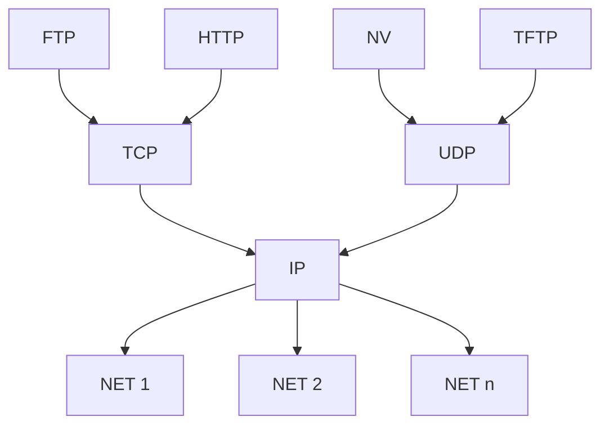



요약

인터넷 구조는 실제로 인터넷을 운영하며 다듬어진 계층 구조다. 모래시계처럼 가운데가 IP 하나로 좁고, 위로는 여러 응용이, 아래로는 여러 종류의 네트워크가 넓게 퍼진다. 가운데가 하나뿐이라 어떤 응용이든 어떤 네트워크 위에서든 돌 수 있다. 대신 OSI처럼 층을 엄격하게 지키지는 않는다.

## 예시로 보기

인터넷의 프로토콜 그래프는 다음과 같다[^1].

위쪽 응용 프로토콜이 넷, 가운데 트랜스포트가 둘, 그 아래 IP가 하나, 맨 아래 네트워크가 $$n$$개다. 폭이 넓다가 IP에서 하나로 좁아진 뒤 다시 넓어진다. 이것이 모래시계 모양이다. 웹(HTTP)이 이더넷 위에서든 와이파이 위에서든 도는 것은 둘 다 IP 아래에 있기 때문이다[^s1].

## 정의

인터넷 구조는 IETF(Internet Engineering Task Force)가 관리하는 표준 구조다[^1]. OSI와 비교하면 다음과 같다[^2].

| 인터넷 구조 | 예 | OSI에서는 |
|---|---|---|
| 응용 (Application) | FTP, HTTP, NV, TFTP | 7층. 5·6층의 일은 필요하면 응용 안에서 한다 |
| TCP / UDP | TCP, UDP | 4층 트랜스포트 |
| IP | IP | 3층 네트워크. 서로 다른 네트워크들을 하나로 묶는 층 |
| Network (NET) | 각 망 사업자의 네트워크 | 1~2층 (각 네트워크 내부의 방식은 망마다 다르다) |

슬라이드가 든 특징은 셋이다[^1].

1. 계층화를 그대로 따르지는 않는다[^3]. 응용이 TCP·UDP를 건너뛰고 IP를 바로 쓸 수도 있다[^s1].
2. 모래시계 모양이다.
3. 설계와 구현을 함께 한다. 표준을 먼저 다 정하고 만드는 OSI와 반대로, 돌아가는 구현을 보며 표준을 다듬는다[^s1].

원본 오류 의심

원문: "4 <-> 3,2,1 계층 사이에 있는 것이 IP... IP는 계층에 속하지 않는다." (3주차 필기 11~13행) 
문제점: 슬라이드 오른쪽 그림은 IP를 TCP·UDP와 Network 사이의 한 층으로 그린다. OSI로 옮기면 네트워크 계층(3층)의 일, 즉 여러 링크를 건너 호스트 사이에 패킷을 보내는 일을 한다. 
수정안: "IP는 개별 네트워크(NET)의 계층이 아니라, 그 위에서 모든 네트워크를 하나로 묶는 층이다." 
근거: 슬라이드의 계층 그림(Application / TCP·UDP / IP / Network)[^1]. Peterson & Davie, *Computer Networks: A Systems Approach*, 1.3절도 IP를 인터넷 구조의 한 층으로 둔다. 강의에서 "어느 한 네트워크 기술에도 속하지 않는다"는 뜻으로 말했다면 필기의 뜻은 수정안과 같다.

## 활용

- 새 네트워크 기술(예: 5G)은 IP만 실어 나를 수 있으면 곧바로 모든 인터넷 응용을 쓸 수 있다. 새 응용은 TCP나 UDP만 쓰면 모든 네트워크 위에서 돈다[^s1].
- 흔한 실수는 인터넷 구조를 "OSI 7층 중 몇 층을 뺀 것"으로 외우는 것이다. 인터넷 구조는 OSI를 줄여 만든 것이 아니라, 운영 경험에서 따로 자라났다[^2].

## 연결

- 선수: [OSI 참조 모델](/Hongs_Blog/studies/computer-communication/osi-reference-model/), [프로토콜 그래프](/Hongs_Blog/studies/computer-communication/protocol-graph/)
- IP가 묶는 "네트워크들의 네트워크": [인터네트워크](/Hongs_Blog/studies/computer-communication/internetwork/)

## 확인 문제

<b>C1</b> 슬라이드가 든 인터넷 구조의 특징 세 가지를 쓰라.

**답:** ① 계층화를 그대로 따르지 않는다. ② 모래시계 모양이다. ③ 설계와 구현을 병행한다.

<b>C2</b> FTP, HTTP, NV, TFTP, TCP, UDP, IP, NET을 인터넷 구조의 층에 배치하고, OSI의 몇 층에 대응하는지 쓰라. 그림으로 그렸을 때 모래시계의 가장 좁은 곳은 어디인가?

**답:** 응용: FTP, HTTP, NV, TFTP (OSI 5~7). 트랜스포트: TCP, UDP (OSI 4). IP (OSI 3). NET (OSI 1~2). 가장 좁은 곳은 IP다.

<b>C3</b> 가운데를 IP 하나로 좁힌 설계가 왜 유리한가? 위쪽(응용)과 아래쪽(네트워크) 각각의 입장에서 쓰라.

**답:** 위쪽: 응용은 IP 하나만 믿으면 아래가 어떤 네트워크든 신경 쓰지 않아도 된다. 아래쪽: 새 네트워크는 IP 하나만 실어 나르면 기존 응용이 모두 그 위에서 돈다. 가운데가 여럿이면 응용 수 × 네트워크 수만큼 맞춰야 하지만, 하나면 각자 IP에만 맞추면 된다[^s1].

[^1]: 4-1학기/pasted_images/Pasted image 20260925225050.png — 슬라이드 "표준 구조 (Standard Architectures) (2)", 인터네트 구조. 원문의 빨간 글씨: IP
[^2]: 4-1학기/컴퓨터 통신/2.필기노트/03.3주차.md, 1~13행
[^3]: 4-1학기/컴퓨터 통신/2.필기노트/03.3주차.md, 3행은 "OSI 모델과 계층 구조를 그대로 따른다"고 적어 슬라이드의 "그대로 따르지는 않음"과 반대다 [확인필요]
[^s1]: 에이전트 보충. 이더넷·와이파이·5G 예, 응용이 IP를 바로 쓰는 경우, 좁은 허리의 이점, OSI의 표준 우선 방식은 원본에 없다. Peterson & Davie, *Computer Networks: A Systems Approach*, 1.3절의 내용이다.

