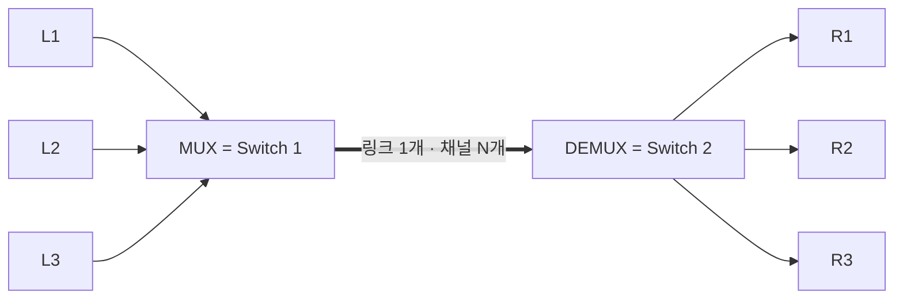
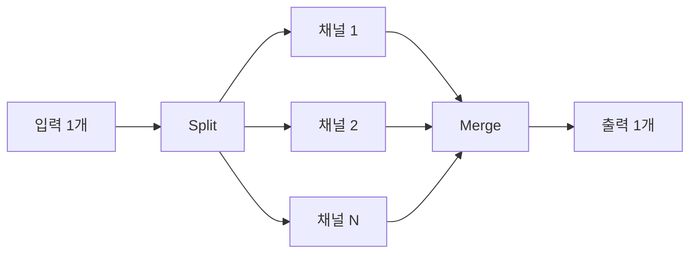



요약

여러 사람의 통신이 선 하나를 나눠 쓰게 하는 방법이다. 이삿짐 여러 집 것을 트럭 한 대에 섞어 싣는 것과 같다. 선을 계속 새로 깔지 않고 있는 자원을 아껴 쓸 수 있다. 대신 받는 쪽에서 다시 나누려면 각 조각이 누구 것인지 알아낼 단서가 반드시 있어야 한다.

## 예시로 보기

슬라이드에서 L1→R1, L2→R2, L3→R3 세 연결이 Switch 1과 Switch 2 사이의 링크 하나를 함께 쓴다[^3]. 이 그림을 MUX/DEMUX 그림으로 옮기면 Switch 1이 합치는 장치 MUX(멀티플렉서), Switch 2가 나누는 장치 DEMUX(디멀티플렉서), 둘 사이 링크가 "1 link, N channels"가 된다($$N = 3$$)[^2].

아래 정의에서는 연결 하나하나를 입력 흐름 $$x_i$$($$i$$번째 입력)라 부른다. "이 조각이 누구 것인지" 알아내는 방법은 키 함수 $$\kappa$$(카파)라 부른다. 이삿짐 비유가 다른 곳도 있다. 상자에 집 이름을 적는 것은 키를 보내는 한 방법일 뿐이다. 트럭 칸을 집마다 정해 두면 이름을 적지 않아도 된다.

## 정의

노드와 링크는 한정된 자원이다. 사용자는 계속 늘어나므로 자원을 계속 늘리지 않고 비용 효율적으로 나눠 써야 한다(자원 공유)[^1][^3]. 다중화는 여러 연결이 하나의 링크를 함께 쓰는 것이다[^1].

정의

입력 $$N$$개를 섞어 링크 하나로 보내고, 받는 쪽에서 다시 나눈다. 다시 나누려면 받는 쪽이 조각마다 "몇 번 입력 것인지" 계산해 낼 방법이 있어야 한다. 이 방법이 DEMUX 키다. 그리고 아무리 섞어도 링크가 1초에 실을 수 있는 양 $$R$$은 넘을 수 없다.

**기호로 쓰면.** 입력 흐름 $$x_1, \dots, x_N$$($$N \in \mathbb{Z}^+$$, 1 이상의 정수)이 전송률 $$R$$(bps)인 링크 하나를 함께 쓴다. MUX는 이들을 링크의 신호 $$y$$로 합치고, DEMUX는 $$y$$를 조각으로 나눠 각 조각을 출력 $$1, \dots, N$$ 중 하나로 보낸다. 올바르게 되돌리려면 수신 측이 계산할 수 있는 함수

$$\kappa : \{y\text{의 조각}\} \to \{1, \dots, N\}$$

(**DEMUX 키**. 조각 하나를 넣으면 입력 번호 하나를 내놓는 함수)가 있어서, 조각 $$u$$가 $$x_i$$에서 왔다면 $$\kappa(u) = i$$여야 한다. 어느 순간에도 링크가 실제로 실어 나르는 전송률의 합은 $$R$$을 넘지 못한다.

| 방식 | 나누는 자원 | 할당 | DEMUX 키 | 키를 데이터와 함께 보내나 |
|---|---|---|---|---|
| [시분할 다중화](/Hongs_Blog/studies/computer-communication/time-division-multiplexing/) | 시간 | 고정 | 몇 번째 칸인가 | 아니다. 양쪽 시간만 맞추면 된다 |
| [주파수 분할 다중화](/Hongs_Blog/studies/computer-communication/frequency-division-multiplexing/) | 주파수 | 고정 | 어느 주파수 대역인가 | 아니다 |
| [통계적 다중화](/Hongs_Blog/studies/computer-communication/statistical-multiplexing/) | 시간 | 요구에 따라 | 조각에 붙인 주소 | 그렇다. 그래서 오버헤드가 생긴다 |

원본 오류 의심

원문: "Multiplex 시, DEMUX 키를 항상 함께 주어야 한다." (1주차 필기 60행) 
문제점: DEMUX 키는 항상 **있어야** 하지만, 항상 데이터와 **함께 보내야** 하는 것은 아니다. 같은 필기 72행도 시분할 다중화에서는 "시간이 곧 DEMUX 키"라고 쓴다. 
수정안: "다중화할 때는 수신 측이 각 조각의 주인을 알아낼 방법(DEMUX 키)이 항상 있어야 한다. 시분할·주파수 분할 다중화는 시간 위치와 주파수가 키라서 따로 보내지 않고, 통계적 다중화는 주소를 붙여 보낸다." 
근거: 검증 코드에서 시분할 다중화는 위치만으로, 주파수 분할 다중화는 주파수만으로 입력을 되살렸다. 주소를 뗀 통계적 다중화 스트림은 위치로 나누면 틀렸다. 슬라이드도 "Demux key/select?"와 "address 필요"를 통계적 다중화에서만 묻는다[^4].

검증: 세 방식의 DEMUX 키, 다채널 분할의 순서 되살리기 — [12_multiplexing_verify.py](/Hongs_Blog/studies/computer-communication/code/12_multiplexing_verify/)

## 예제

- 다중화인 것: 슬라이드의 Switch 1–Switch 2 링크 공유[^3], 전화망의 시분할 회선, FM 라디오 방송국들의 주파수 나눠 쓰기[^s1]
- 아닌 것: 연결마다 따로 깐 링크(완전 연결, 공유가 없음), 다채널 분할(한 연결이 여러 링크를 쓰는 반대 방향)

## 활용

- 트래픽이 일정하면 고정 할당(시분할·주파수 분할)도 낭비가 작다. 트래픽이 몰렸다 끊겼다 하면([버스티 트래픽](/Hongs_Blog/studies/computer-communication/bursty-traffic/)) 고정 할당은 낭비가 커서 [통계적 다중화](/Hongs_Blog/studies/computer-communication/statistical-multiplexing/)가 필요하다[^6].
- 오늘날은 방향이 반대인 경우도 있다. **다채널 분할**은 입력 하나를 채널 $$N$$개로 나눠(Split) 보내고 받는 쪽에서 합친다(Merge)[^5]. 한 사용자의 트래픽이 링크 하나보다 클 때 쓴다[^7]. 채널마다 지연이 달라 도착 순서가 뒤바뀔 수 있어서, 조각에 순서 번호를 붙여 되살린다[^s2].

위의 MUX 그림을 거꾸로 뒤집은 모양이다. 입력 하나가 Split에서 여러 채널로 갈라졌다가 Merge에서 다시 하나로 모인다[^s3].

## 연결

- 선수: [점대점 링크](/Hongs_Blog/studies/computer-communication/point-to-point-link/), [전송 속도와 대역폭](/Hongs_Blog/studies/computer-communication/rate-and-bandwidth/)
- 하위 방식: [시분할 다중화](/Hongs_Blog/studies/computer-communication/time-division-multiplexing/), [주파수 분할 다중화](/Hongs_Blog/studies/computer-communication/frequency-division-multiplexing/), [통계적 다중화](/Hongs_Blog/studies/computer-communication/statistical-multiplexing/)
- 스위칭 방식과 다중화 방식은 "자원을 미리 떼어 줄까, 필요할 때 줄까"라는 같은 질문에 답한다. [회선 스위칭](/Hongs_Blog/studies/computer-communication/circuit-switching/)이 고정 할당에, [패킷 스위칭](/Hongs_Blog/studies/computer-communication/packet-switching/)이 통계적 다중화에 대응한다.
- 같은 구조가 프로토콜 사이에도 있다. 아래 프로토콜 하나를 여러 위 프로토콜이 나눠 쓰고, 머리말의 demux key로 나눠 준다: [프로토콜 그래프](/Hongs_Blog/studies/computer-communication/protocol-graph/)
- 공간(셀)으로 나누는 다중화: [이동통신](/Hongs_Blog/studies/computer-communication/cellular-networks/)

## 자주 하는 오해

"다중화하면 조각마다 누구 것인지 적어서 보내야 한다"

틀렸다. 편지에 주소를 쓰듯 섞인 데이터를 나누려면 이름표가 필요할 것 같아서 그럴듯하다. 실제로는 키가 데이터의 위치나 성질에 이미 들어 있으면 따로 적지 않아도 된다. 시분할 다중화는 칸의 순서가, 주파수 분할 다중화는 주파수 대역이 키다. 이름표(주소)를 붙이는 것은 칸을 고정하지 않는 통계적 다중화뿐이다. 슬라이드의 동기식 시분할 그림은 1 2 3 4 5 6 1 2 …처럼 칸 순서만 있고, 통계적 다중화 그림에만 주소(Address) 칸이 있다[^4][^8].

## 확인 문제

<b>C1</b> 다중화를 정의하고, MUX와 DEMUX가 각각 하는 일과 다중화가 필요한 이유를 쓰라.

**답:** 여러 연결이 하나의 링크를 함께 쓰게 하는 것이다. MUX는 여러 입력을 링크 하나로 합치고, DEMUX는 받은 것을 입력별 출력으로 다시 나눈다. 사용자는 늘지만 노드·링크는 한정된 자원이라, 계속 늘리지 않고 비용 효율적으로 나눠 써야 하기 때문이다.

<b>C2</b> 시분할 다중화, 주파수 분할 다중화, 통계적 다중화에서 각각 DEMUX 키는 무엇인가? 그중 키를 데이터와 함께 실어 보내야 하는 방식은?

**답:** 시분할: 시간 위치(몇 번째 칸). 주파수 분할: 주파수 대역. 통계적: 조각에 붙인 주소. 키를 함께 보내야 하는 방식은 통계적 다중화뿐이다. 
**흔한 오답:** "모든 방식이 키를 함께 보낸다". 시분할과 주파수 분할은 위치와 주파수 자체가 키다.

<b>C4</b> 다중화와 다채널 분할을 입력 수, 링크(채널) 수, 출력 수로 비교하고, 각각이 해결하는 문제를 쓰라.

**답:** 다중화: 입력 $$N$$개 → 링크 1개(채널 $$N$$개) → 출력 $$N$$개. 사용자는 많은데 링크가 모자란 문제를 푼다. 다채널 분할: 입력 1개 → 채널 $$N$$개 → 출력 1개. 한 사용자의 트래픽이 링크 하나보다 큰 문제를 푼다.

[^1]: 4-1학기/컴퓨터 통신/2.필기노트/01.1주차.md, 55~60행
[^2]: 4-1학기/pasted_images/Pasted image 20260924203902.png — 슬라이드 "Multiplexing" (N inputs, MUX, 1 link / N channels, DEMUX, N outputs)
[^3]: 4-1학기/pasted_images/Pasted image 20260924203046.png — 슬라이드 "비용 효율적인 자원 공유 (Resource Sharing)", 1장. 기본 개념: 요구 사항 2
[^4]: 4-1학기/pasted_images/Pasted image 20260924204837.png — 슬라이드 "통계적 다중화 (Statistical Multiplexing)"
[^5]: 4-1학기/pasted_images/Pasted image 20260924205725.png — 슬라이드 "(Multi-Channel) Splitting" (1 inputs, Split, N channels, Merge, 1 outputs)
[^6]: 4-1학기/컴퓨터 통신/2.필기노트/01.1주차.md, 68~70행
[^7]: 4-1학기/컴퓨터 통신/2.필기노트/01.1주차.md, 73~74행
[^8]: 4-1학기/pasted_images/Pasted image 20260924204450.png — 슬라이드 "시분할 다중화", 동기식 시분할 다중화 그림
[^s1]: 에이전트 보충. 방식별 비교표는 슬라이드와 필기의 내용을 표로 모은 것이다. 전화망과 FM 라디오 예는 원본에 없다.
[^s2]: 에이전트 보충. 순서 번호로 되살리는 방법은 원본에 없다. 역다중화(inverse multiplexing)라고도 하며, 이더넷 링크 묶음(IEEE 802.1AX)이나 MPTCP(RFC 8684)가 실제 사례다.
[^s3]: 에이전트 보충. 다이어그램 1개는 원본에 없다. 슬라이드 "(Multi-Channel) Splitting"(1 inputs, Split, N channels, Merge, 1 outputs)을 위 MUX 그림과 같은 모양으로 옮겼다.

