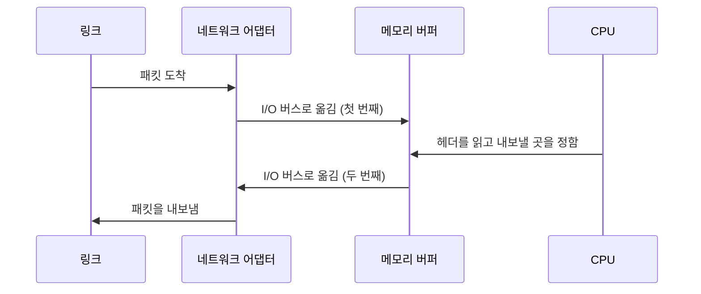


<div class="callout callout-summary" markdown="1">
<div class="callout-title callout-title--default" markdown="span">요약</div>

노드는 링크 끝에 붙은 장치다. 단말(호스트)이든 스위치(라우터)든 속은 보통의 컴퓨터로, CPU와 메모리와 선을 이어 주는 네트워크 어댑터로 이루어진다. 메모리가 유한해서 패킷을 쌓아 둘 버퍼도 유한하다. 프로세서는 빠르고 메모리는 느려서, 요즘은 링크보다 노드가, 노드 안에서는 메모리가 병목이다.

</div>


## 예시로 보기

노드 안은 다음과 같이 이어져 있다[^1].

```
CPU
 │
Cache
 │
Memory ──┬── I/O bus ── Network adaptor ──→ (To network)
```

패킷이 링크에서 들어오면 네트워크 어댑터가 받아 I/O 버스를 거쳐 메모리의 버퍼에 쌓는다. CPU가 헤더를 보고 내보낼 곳을 정하면, 다시 메모리에서 버스를 거쳐 어댑터로 나간다. 패킷 하나가 버스와 메모리를 두 번 지난다[^s1]. 링크가 아무리 빨라도 이 길이 막히면 노드가 따라가지 못한다.



패킷은 I/O 버스를 두 번 건너고, CPU가 헤더를 읽는 동안 메모리에 머문다. 링크 쪽 화살표는 처음과 끝 두 개뿐이다[^s2].

## 정의

노드는 단말(호스트)과 스위치(라우터)를 가리킨다. 범용, 즉 프로그래밍할 수 있는 컴퓨터(예: PC)로 이루어진다고 가정한다. 때때로 특수한 목적의 하드웨어로 대신하기도 한다[^1].

| 구성 요소 | 네트워크에서의 뜻 |
|---|---|
| 유한한 메모리 | 버퍼 공간이 제한되어 있다. 넘치면 패킷을 버린다([패킷 스위칭](/Hongs_Blog/studies/computer-communication/packet-switching/)의 혼잡) |
| 네트워크 어댑터(NIC, 랜카드) | 노드를 네트워크에 잇는다 |
| 프로세서와 메모리 | 프로세서는 빠르고 메모리는 느리다 |

단말·터미널·호스트는 같은 말이고, 스위치와 라우터도 비슷하게 쓴다. 요즘은 둘의 경계가 흐려져서 단말이 라우터 역할을 하기도 한다[^2]. 선이 실어 나르는 것은 신호이므로, 노드에는 신호를 데이터로 바꾸는 모뎀이 들어 있어야 한다[^3].

## 활용

- 통신망(링크 + 노드)의 병목은 오늘날 노드다(서버 병목)[^4]. 노드가 병목일 때 노드 안에서는 메모리가, 그리고 버스가 병목이다[^3].
- 거리가 짧고 고속인 통신에서는 노드의 소프트웨어 처리 부하가 소요시간의 중요한 몫이 된다[^5]. [소요시간](/Hongs_Blog/studies/computer-communication/latency/)의 처리 지연이다.

## 연결

- 선수: [스위칭 네트워크](/Hongs_Blog/studies/computer-communication/switched-network/)(스위치), [패킷 스위칭](/Hongs_Blog/studies/computer-communication/packet-switching/)(버퍼)
- 노드가 담당하는 층: [데이터 링크 계층](/Hongs_Blog/studies/computer-communication/data-link-layer/)
- 노드 안의 모뎀이 하는 일: [신호와 변조](/Hongs_Blog/studies/computer-communication/signal-and-modulation/)

## 확인 문제

<details markdown="1"><summary markdown="span"><b>C1</b> 슬라이드의 노드 구성 요소를 쓰고, "유한한 메모리"가 네트워크에서 무엇을 뜻하는지 쓰라.</summary>


**답:** CPU, 캐시, 메모리, I/O 버스, 네트워크 어댑터(NIC). 유한한 메모리는 패킷을 쌓아 둘 버퍼 공간이 제한되어 있다는 뜻이다. 한꺼번에 몰리면 버퍼가 넘쳐 패킷을 버린다.

</details>

<details markdown="1"><summary markdown="span"><b>C2</b> 링크가 광케이블로 빨라진 오늘날, 병목이 링크가 아니라 노드, 그중에서도 메모리인 이유를 설명하라.</summary>


**답:** 광케이블로 링크의 속도는 크게 올랐다. 노드는 들어온 패킷마다 메모리에 쓰고, 처리하고, 다시 읽어 내보내야 한다. 프로세서는 빠르지만 메모리는 느리고, 패킷은 버스와 메모리를 여러 번 지난다. 그래서 링크가 실어 오는 속도를 노드의 메모리가 따라가지 못한다[^s1].

</details>

[^1]: 수업 슬라이드 캡처 — 슬라이드 "하드웨어 구성요소 : 노드(Nodes)"
[^2]: 컴퓨터 통신 2회 필기 「2주차」, 26~29행
[^3]: 컴퓨터 통신 4회 필기 「4주차」, 5행, 10행
[^4]: 컴퓨터 통신 3회 필기 「3주차」, 115~117행
[^5]: 수업 슬라이드 캡처 — 슬라이드 "성능: 기타 사항". 초록 글씨: "통신망 (links + nodes) 에서 병목 지점은 어디?"
[^s1]: <span class="fn-tag" title="수업 자료에 없고 따로 보탠 내용">보충</span> 패킷이 버스와 메모리를 두 번 지난다는 설명은 원본에 없다. Peterson & Davie, *Computer Networks: A Systems Approach*, 2.1절(노드)의 내용이다.
[^s2]: <span class="fn-tag" title="수업 자료에 없고 따로 보탠 내용">보충</span> 다이어그램 1개는 원본에 없다. 슬라이드 "하드웨어 구성요소 : 노드(Nodes)"의 구성도와 이 문서 '예시로 보기'의 패킷 경로 설명(Peterson & Davie, *Computer Networks: A Systems Approach*, 2.1절)을 바탕으로 그렸다.

