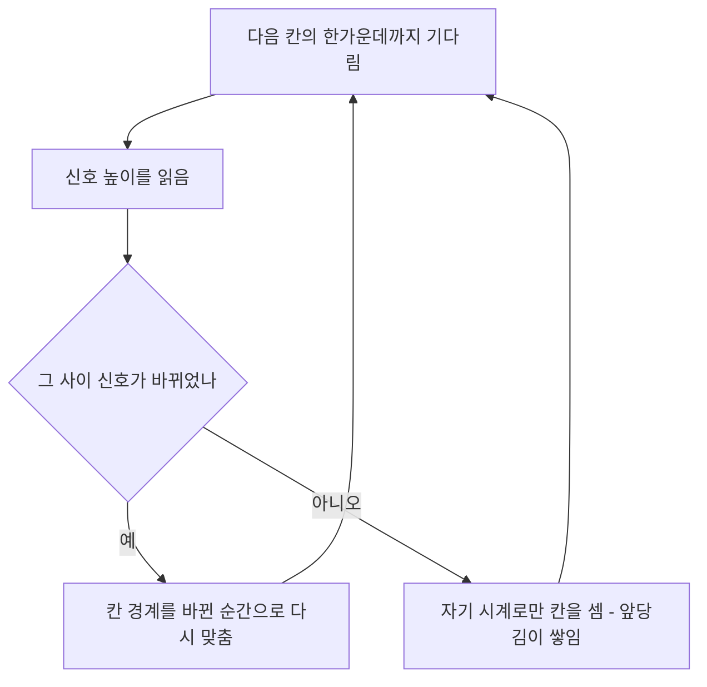


<div class="callout callout-summary" markdown="1">
<div class="callout-title callout-title--default" markdown="span">요약</div>

받는 쪽은 자기 시계의 박자(클럭)에 맞춰 비트 한 칸마다 신호가 높은지 낮은지를 읽는다. 가장 단순한 방법(NRZ)은 1이면 높게, 0이면 낮게 그대로 보낸다. 그런데 같은 값이 길게 이어지면 신호가 평평해서, 받는 쪽은 칸이 몇 개 지나갔는지 자기 시계로만 세야 한다. 두 시계가 조금만 달라도 비트를 하나 더 세거나 빠뜨리므로, 받는 쪽이 신호가 바뀌는 순간을 보고 자기 박자를 보내는 쪽에 맞추는 일(클럭 복구)이 꼭 필요하다.

</div>


## 예시로 보기

선 위로 오는 것은 높고 낮은 전압뿐이다. "여기서부터 다음 비트"라는 표시는 없다. 그래서 받는 쪽은 비트 하나가 얼마 동안 이어지는지(비트 폭)를 알고, 칸마다 한가운데서 높이를 잰다[^1]. 한가운데서 재는 이유는 그곳이 높이가 바뀌는 칸 경계에서 가장 멀어, 박자가 조금 어긋나도 같은 칸을 읽기 때문이다[^s1].

슬라이드의 비트열 `0010111101000010`을 NRZ로 보낸다. 1은 높음(‾), 0은 낮음(_)이다[^1].

```
비트       0 0 1 0 1 1 1 1 0 1 0 0 0 0 1 0
NRZ        _ _ ‾ _ ‾ ‾ ‾ ‾ _ ‾ _ _ _ _ ‾ _
```

받는 쪽 시계가 같으면 칸마다 한 번씩 정확히 읽는다. 받는 쪽 시계가 빠르면 받는 쪽은 비트 폭을 실제보다 좁게 잡는다. 아래는 받는 쪽이 비트 폭을 $$15/16$$으로 잡고 16번 읽은 결과다[^s2].

| 읽기 | 1 | 2 | 3 | 4 | 5 | 6 | 7 | 8 | 9 | 10 | 11 | 12 | 13 | 14 | 15 | 16 |
|---|---|---|---|---|---|---|---|---|---|---|---|---|---|---|---|---|
| 읽는 시각 (보낸 칸 단위) | 0.47 | 1.41 | 2.34 | 3.28 | 4.22 | 5.16 | 6.09 | 7.03 | 7.97 | 8.91 | 9.84 | 10.8 | 11.7 | 12.7 | 13.6 | 14.5 |
| 읽힌 보낸 칸 | 1 | 2 | 3 | 4 | 5 | 6 | 7 | 8 | **8** | 9 | 10 | 11 | 12 | 13 | 14 | 15 |
| 읽은 비트 | 0 | 0 | 1 | 0 | 1 | 1 | 1 | 1 | **1** | 0 | 1 | 0 | 0 | 0 | 0 | 1 |

읽는 시각이 칸마다 $$1/16$$씩 앞당겨진다. 9번째 읽기에서 앞당김이 반 칸을 넘어, 8번째 칸(1)을 한 번 더 읽는다. 그 뒤로는 모든 비트가 한 칸씩 밀린다. 받는 쪽은 `0010111110100001`을 받았다고 믿는다.


파란 선이 보낸 NRZ 신호이고, 주황 세로선이 받는 쪽이 읽는 순간이다. 주황 선은 처음에는 칸 한가운데에 있다가 조금씩 왼쪽으로 밀린다. 8번째 칸(1)을 두 번 읽은 뒤로는 읽은 비트가 보낸 비트보다 한 칸씩 늦다[^s5].

이 오류는 1이 네 개 이어진 구간에서 생겼다. 신호가 평평하니 받는 쪽은 "1이 네 개인지 다섯 개인지"를 신호에서 알아낼 단서가 없다. 반대로 신호가 바뀌는 순간마다 받는 쪽이 칸 경계를 그 순간으로 다시 맞추면, 시계가 10% 틀려도 이 비트열을 그대로 읽는다[^s2]. 이렇게 신호의 변화를 보고 박자를 맞추는 일이 클럭 복구다[^2].



신호가 바뀔 때마다 '다시 맞춤' 상자를 지나며 쌓인 오차가 0으로 돌아간다. 같은 높이가 길게 이어지면 '자기 시계로만' 길만 되풀이되고, 앞당김이 반 칸을 넘는 순간 비트를 잘못 읽는다[^s6].

<div class="callout callout-warning" markdown="1">
<div class="callout-title" markdown="span">원본 오류 의심</div>

원문: 슬라이드 36 "수신 (빠른 clock) ⇒ 비트폭↓"의 수신열 `0010111110100010` / 문제점: 보낸 열과 비교하면 1이 4개에서 5개로 늘었고, 0이 4개에서 3개로 줄었다. 받는 쪽 시계가 일정하게 빠르면 같은 비트를 두 번 읽을 수는 있어도 비트를 건너뛸 수는 없다. 그래서 0이 줄 수 없다 / 수정안: 일정하게 빠른 시계의 예로는 위 표의 `0010111110100001`(비트 폭 15/16). 슬라이드의 결론 "비트 폭이 줄면 비트 오류"는 그대로 맞다 / 근거: 비트 폭 $$n/d$$($$d \le 60$$)와 시작 위치 20가지를 모두 넣어도 슬라이드 수신열이 나오지 않는다 — [40_nrz-clock-recovery_verify.py](/Hongs_Blog/studies/computer-communication/code/40_nrz-clock-recovery_verify/)

</div>


<div class="callout callout-check" markdown="1">
<div class="callout-title" markdown="span">검증: 같은 클럭이면 그대로, 15/16이면 9번째 읽기에서 중복, 빠른 시계는 비트를 건너뛰지 않음(w = 0.01~0.99), 다시 맞추기를 하면 w = 0.9~1.1에서 정확, 1% 빠르면 51번째 읽기에서 첫 오류 — [40_nrz-clock-recovery_verify.py](/Hongs_Blog/studies/computer-communication/code/40_nrz-clock-recovery_verify/)</div>

</div>


## 정의

**인코딩**은 디지털 데이터를 디지털 신호로 바꾸는 일이다. 변조의 한 종류이고, 주로 유선 링크에서 쓴다. 노드의 네트워크 어댑터(NIC) 안에서 한다[^3]. 보내는 쪽이 인코딩하고, 받는 쪽이 신호를 다시 비트로 되돌린다(디코딩).

**NRZ**(Non-Return to Zero)는 1을 높은 신호, 0을 낮은 신호로 보낸다. 노드 안에서 데이터를 나타내는 방식과 같아서 따로 인코딩할 것이 없다[^1]. 이름은 "비트 칸 안에서 0 V로 돌아가지 않는다"는 뜻이다. 1이 이어지면 신호가 높은 채로 계속 머문다[^s3].

NRZ는 1이나 0이 이어질 때 문제가 생긴다[^1].

1. 낮은 신호(0)가 이어지면 받는 쪽은 신호가 아예 없다고 오해할 수 있다.
2. 높은 신호(1)가 이어지면 전류가 계속 흐르고, 높고 낮음을 가르는 기준 전압이 흔들린다(기저 전압의 혼돈). 받는 쪽은 최근 받은 신호의 평균을 기준으로 삼는데, 1이 길게 오면 평균이 올라가 기준이 따라 올라가기 때문이다[^s3].
3. 클럭 복구를 할 수 없다. 보내는 쪽과 받는 쪽의 클럭이 맞지 않으면 비트를 잘못 읽는다. 예: 받는 쪽 클럭이 빠르면 비트 폭이 줄어들어 비트 오류가 난다.

그래서 **클럭 복구**, 즉 받는 쪽이 보내는 쪽의 클럭에 자기 클럭을 맞추는 일이 반드시 필요하다[^1][^2].

기호로 쓰면 다음과 같다[^s2]. 보내는 쪽의 비트 폭을 1로 놓고, 받는 쪽이 믿는 비트 폭을 $$w$$(1보다 작으면 받는 쪽 시계가 빠르다)라 한다. 받는 쪽은 $$k$$번째 칸($$k = 0, 1, 2, \dots$$)을 시각 $$(k + \tfrac{1}{2})w$$에 읽는다. 그 시각에 지나가는 것은 보낸 쪽의 $$i_k$$번째 칸이다($$\lfloor x \rfloor$$는 $$x$$ 이하의 가장 큰 정수).

$$i_k = \left\lfloor \left(k + \tfrac{1}{2}\right) w \right\rfloor$$


받는 쪽 시계가 $$\varepsilon$$만큼 빠르면($$w = 1 - \varepsilon$$, $$0 < \varepsilon < 1$$), 처음으로 같은 칸을 두 번 읽는 것은 다음 조건을 처음 만족하는 $$k$$다.

$$\left(k + \tfrac{1}{2}\right)\varepsilon > \tfrac{1}{2}, \qquad \text{즉 } k > \frac{1}{2\varepsilon} - \frac{1}{2}$$


말로 하면, 칸마다 $$\varepsilon$$씩 쌓이는 앞당김이 반 칸을 넘는 순간 첫 오류가 난다. $$\varepsilon = 1\%$$를 넣으면 $$k > 49.5$$, 즉 $$k = 50$$(51번째 읽기)에서 50번째 칸을 한 번 더 읽는다.

## 증명

$$w < 1$$일 때 받는 쪽은 칸을 건너뛰지 않고, 앞당김이 반 칸을 넘을 때 처음 같은 칸을 다시 읽는다는 것을 보인다. 읽는 시각의 간격이 1보다 짧다는 것만 쓴다.

<details markdown="1"><summary markdown="span">증명 펼치기</summary>


1. **칸 번호는 0 또는 1씩 는다.** 이웃한 두 읽기 시각의 차이는 $$w$$이고 $$0 < w < 1$$이다. 바닥 함수는 입력이 1보다 적게 늘면 출력이 0 또는 1만 는다. 따라서 $$i_{k} - i_{k-1} \in \{0, 1\}$$이다. — 바닥 함수의 성질
2. **앞당김이 반 칸 이하이면 제자리다.** $$w = 1 - \varepsilon$$이면 $$(k + \tfrac12)w = k + \tfrac12 - (k + \tfrac12)\varepsilon$$이다. $$(k + \tfrac12)\varepsilon \le \tfrac12$$이면 이 값은 $$[k, k + \tfrac12]$$ 안에 있으므로 $$i_k = k$$다. — 대수 정리
3. **반 칸을 넘는 첫 순간 중복이 생긴다.** 조건을 처음 만족하는 $$k$$에서 $$(k + \tfrac12)\varepsilon > \tfrac12$$이고, 2단계에 따라 $$i_{k-1} = k - 1$$이다. $$\varepsilon$$이 작아 $$(k + \tfrac12)\varepsilon < \tfrac32$$이면 $$(k + \tfrac12)w \in (k - 1, k)$$이므로 $$i_k = k - 1 = i_{k-1}$$이다. — 2단계와 같은 계산 ∎

1단계 때문에, 일정하게 빠른 시계는 비트를 더 읽을 수만 있고 빠뜨릴 수는 없다. 비트를 빠뜨리는 것은 받는 쪽 시계가 느린 경우($$w > 1$$)다.

</details>

### 스스로 설명해 보기

1. 1단계에서 $$w < 1$$이 필요한 이유
   <details class="inline-fold" markdown="1"><summary markdown="span">근거</summary>
   읽는 간격이 1보다 짧아야 두 읽기 사이에 칸 경계가 많아야 하나만 지나간다. $$w > 1$$이면 경계를 두 개 넘어 칸 하나를 건너뛸 수 있다.
   </details>
2. 2단계의 "반 칸"
   <details class="inline-fold" markdown="1"><summary markdown="span">근거</summary>
   받는 쪽은 칸의 한가운데(시작점에서 반 칸)에서 읽는다. 앞당김이 반 칸이면 읽는 시각이 칸의 시작점에 닿는다. 그보다 더 앞당겨지면 앞 칸으로 넘어간다.
   </details>
3. 다시 맞추기가 효과 있는 이유
   <details class="inline-fold" markdown="1"><summary markdown="span">근거</summary>
   앞당김은 마지막으로 박자를 맞춘 순간부터 쌓인다. 신호가 바뀔 때마다 0으로 되돌리면, 같은 높이가 이어지는 길이 $$L$$에서 쌓이는 앞당김은 약 $$L\varepsilon$$뿐이다. $$L\varepsilon < \tfrac12$$이면 틀리지 않는다.
   </details>
- 이 논증의 핵심 아이디어는?
  <details class="inline-fold" markdown="1"><summary markdown="span">답</summary>
  작은 오차가 칸마다 쌓이고, 쌓인 오차가 허용 범위(반 칸)를 넘는 순간 틀린다. 그래서 "얼마나 오래 단서 없이 버티는가"가 오류를 정한다.
  </details>
- 이 방법을 쓸 수 있는 다른 상황은?
  <details class="inline-fold" markdown="1"><summary markdown="span">답</summary>
  시계 두 개를 따로 돌리는 모든 일. 예: 컴퓨터 시계가 하루에 몇 초씩 틀어져 인터넷 시간 서버로 주기적으로 맞추는 것, 숫자를 반올림해 더할 때 오차가 쌓이는 것.
  </details>

## 예제

**해당하는 예** (클럭 복구가 필요한 상황)

1. NRZ로 0이 길게 이어지는 데이터(예: 0으로 채운 파일)를 보낼 때. 신호가 계속 낮다.
2. NRZ로 1이 길게 이어지는 데이터를 보낼 때. 신호가 계속 높다.
3. 보내는 쪽과 받는 쪽이 각자 시계를 가진 모든 링크. 두 시계는 물리적으로 완전히 같을 수 없다[^2].

**해당하지 않는 예** (따로 클럭을 맞출 필요가 없는 상황)

1. 보내는 쪽이 클럭을 별도의 선으로 함께 보낼 때. 받는 쪽은 그 선의 박자로 읽는다. 칩 사이 짧은 연결(SPI의 클럭 선)이 이렇다[^s4].
2. 한 번에 보내는 비트가 아주 적을 때. 시계 오차가 1%라도 약 50비트까지는 틀리지 않는다. 그래서 시리얼 포트(UART)는 10비트 남짓마다 시작 표시로 박자를 새로 맞추는 것만으로 충분하다[^s4].

## 연결

- 선수: [디지털 전송](/Hongs_Blog/studies/computer-communication/digital-transmission/), [전송 속도와 대역폭](/Hongs_Blog/studies/computer-communication/rate-and-bandwidth/)(비트 폭)
- 클럭 복구 문제를 푸는 인코딩: [NRZI와 맨체스터](/Hongs_Blog/studies/computer-communication/nrzi-manchester/), [4B/5B](/Hongs_Blog/studies/computer-communication/4b5b/)
- 네 방식을 고르는 기준: [인코딩 방식 비교](/Hongs_Blog/studies/computer-communication/contrast--line-coding/)
- 연습: [인코딩 예제 사다리](/Hongs_Blog/studies/computer-communication/line-coding-ladder/)

## 자주 하는 오해

<div class="callout callout-misconception" markdown="1">
<div class="callout-title" markdown="span">"시계를 아주 정확하게 만들면 클럭 복구는 필요 없다"</div>

아니다. 오차를 줄이면 첫 오류가 늦어질 뿐 사라지지 않는다. 시계 오차가 백만분의 1이어도 약 50만 비트 뒤에 첫 오류가 난다. 1 Gbps 링크에서는 0.5 ms 만이다[^s2]. 그럴듯해 보이는 이유는 오차 1%나 백만분의 1이 작게 느껴져서다. 하지만 비트는 1초에 수억 개씩 지나가므로 작은 오차가 금방 반 칸만큼 쌓인다. 그래서 받는 쪽은 신호의 변화에서 계속 박자를 다시 맞춰야 한다.

</div>


## 확인 문제

<details markdown="1"><summary markdown="span"><b>C1</b> NRZ에서 1이나 0이 길게 이어질 때 생기는 문제 세 가지를 쓰라.</summary>


**답:** ① 0이 이어지면 신호가 없는 것으로 오해할 수 있다. ② 1이 이어지면 전류가 계속 흘러 높고 낮음을 가르는 기준 전압이 흔들린다. ③ 신호가 바뀌지 않아 클럭 복구를 할 수 없고, 두 시계가 조금만 달라도 비트를 잘못 읽는다.

</details>

<details markdown="1"><summary markdown="span"><b>C2</b> 받는 쪽은 왜 비트 칸의 한가운데서 높이를 재는가? 그리고 같은 높이가 길게 이어지는 것이 왜 문제인가?</summary>


**답:** 한가운데는 높이가 바뀌는 칸 경계에서 가장 멀어서, 박자가 반 칸 가까이 어긋나도 같은 칸을 읽는다. 같은 높이가 길게 이어지면 받는 쪽은 박자를 다시 맞출 단서(신호가 바뀌는 순간)가 없어, 시계 오차가 칸마다 쌓인다. 쌓인 오차가 반 칸을 넘으면 비트를 하나 더 읽거나 빠뜨린다.<br>
**흔한 오답:** "신호가 약해져서". 문제는 신호의 세기가 아니라 박자다.

</details>

<details markdown="1"><summary markdown="span"><b>C3</b> 받는 쪽 시계가 보내는 쪽보다 1% 빠르다. 신호가 한 번도 바뀌지 않는다면, 받는 쪽은 몇 번째 읽기에서 처음으로 같은 칸을 두 번 읽는가?</summary>


**답:** 51번째 읽기($$k = 50$$). 앞당김 $$(k + \tfrac12) \times 0.01$$이 처음 $$\tfrac12$$을 넘는 $$k$$는 $$k > 49.5$$에서 $$k = 50$$이다. 이때 50번째 칸을 한 번 더 읽는다[^s2].

</details>

<details markdown="1"><summary markdown="span"><b>C4</b> `0010111101000010`을 NRZ로 보냈다. 받는 쪽이 비트 폭을 15/16으로 잡고 칸 한가운데서 16번 읽으면 무엇을 받는가?</summary>


**답:** `0010111110100001`. 읽는 시각이 매번 1/16씩 앞당겨져 9번째 읽기(시각 7.97)에서 8번째 칸의 1을 한 번 더 읽는다. 그 뒤는 한 칸씩 밀리고, 마지막 칸의 0은 읽지 못한다[^s2].

</details>

<details markdown="1"><summary markdown="span"><b>C5</b> 받는 쪽 시계가 일정하게 빠를 때, 받은 비트열에서 어떤 비트가 빠질 수는 없다. 그 이유를 대라.</summary>


**답:** 읽는 간격 $$w$$가 1보다 짧아서, 이웃한 두 읽기 사이에 칸 경계는 많아야 하나 지나간다. 그래서 읽는 칸 번호는 0 또는 1씩만 늘고, 건너뛰는 칸이 없다. 비트가 빠지려면 칸 번호가 2 이상 뛰어야 하고, 그것은 시계가 느릴 때($$w > 1$$) 생긴다.

</details>

[^1]: 4-1학기/컴퓨터 통신/1.수업자료/04.2장-1.pptx, 슬라이드 35·37 "Non-Return to Zero(NRZ)" (4-1학기/pasted_images/Pasted image 20261006180810.png, Pasted image 20261006181613.png). 슬라이드 37은 "클럭(clock) 복구"와 "수신자가 송신자의 클럭에 자신의 클럭을 맞추는 작업"을 빨간 글씨로 적고, 필기 캡처에 빨간 동그라미와 밑줄이 있다
[^2]: 4-1학기/컴퓨터 통신/2.필기노트/05.5주차.md, 97~107행. "물리적으로 완벽하게 동일한 클락은 불가능하다"(101행)
[^3]: 4-1학기/컴퓨터 통신/1.수업자료/04.2장-1.pptx, 슬라이드 33 "정리"(마지막 주제: Data ⇒ D-Signal, Encoding! (Modulation의 일종))와 슬라이드 34 "인코딩(Encoding): 개요" (4-1학기/pasted_images/Pasted image 20261006180649.png)
[^s1]: 에이전트 보충. 한가운데서 재는 이유는 원본에 없다. 슬라이드는 "수신자는 비트폭의 중앙에서 신호 level 측정"만 적는다.
[^s2]: 에이전트 보충. 비트 폭 15/16의 수신 표, 칸 번호 식 $$i_k$$, 첫 오류 조건과 증명, 다시 맞추기 실험, 1% 예, 백만분의 1 예, 카드 C3·C4·C5는 원본에 없다. 슬라이드 36 그림(4-1학기/pasted_images/Pasted image 20261006181146.png, Pasted image 20261006181416.png)의 "빠른 clock ⇒ 비트폭↓"를 수로 옮긴 것이다. 검증 코드로 확인했다.
[^s3]: 에이전트 보충. NRZ 이름의 뜻과 기준 전압이 흔들리는 원리(기저선 변동, baseline wander)는 Peterson & Davie, *Computer Networks: A Systems Approach*, 2.2절의 설명이다.
[^s4]: 에이전트 보충. SPI의 별도 클럭 선과 UART의 시작 비트는 원본에 없다. SPI는 클럭 선(SCLK)을 데이터 선과 함께 쓰고, UART는 프레임마다 시작 비트의 하강 모서리에서 박자를 다시 맞춘다.
[^s5]: 에이전트 보충. 그림 한 장은 원본에 없다. [40_nrz-clock-recovery_plot.py](/Hongs_Blog/studies/computer-communication/code/40_nrz-clock-recovery_plot/)로 그렸고, 9번째 읽기 시각 7.97(8번째 칸), 받은 열 `0010111110100001`, 식 $$k > 1/(2\varepsilon) - 1/2$$이 $$\varepsilon = 1/16$$에서 주는 첫 중복 $$k = 8$$을 같은 코드로 확인했다.
[^s6]: 에이전트 보충. 다이어그램 1개는 원본에 없다. 이 문서 '예시로 보기'의 다시 맞추기 설명과 '정의' 절의 첫 오류 조건, 슬라이드 37 "클럭(clock) 복구"를 바탕으로 그렸다.

