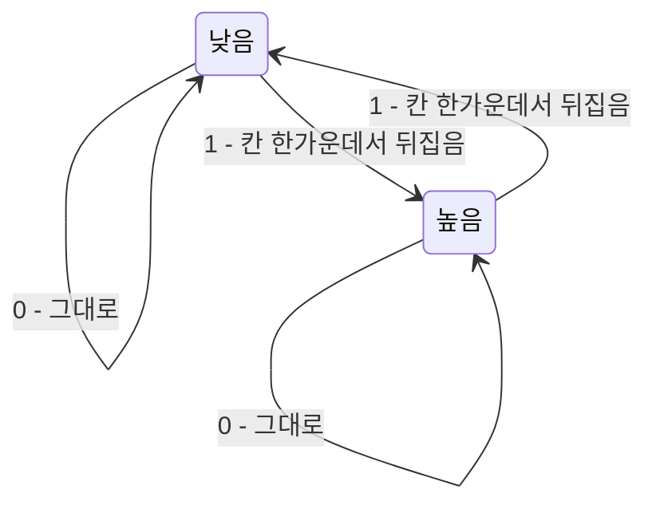


<div class="callout callout-summary" markdown="1">
<div class="callout-title callout-title--default" markdown="span">요약</div>

NRZ는 같은 값이 이어지면 신호가 평평해져 받는 쪽이 박자를 잃는다. NRZI는 1이 올 때마다 신호를 뒤집어서, 1이 아무리 이어져도 신호가 계속 바뀐다. 다만 0이 이어지면 여전히 평평하다. 맨체스터는 모든 비트의 한가운데서 반드시 신호를 바꿔 어떤 비트열에서도 박자를 잃지 않는다. 대신 신호를 두 배로 자주 바꿔야 해서, 같은 선으로 데이터는 절반만 보낸다(효율 50%).

</div>


## 예시로 보기

[NRZ](/Hongs_Blog/studies/computer-communication/nrz-clock-recovery/)의 문제는 "신호가 바뀌지 않는 구간"이다. 받는 쪽은 신호가 바뀌는 순간에만 박자를 맞출 수 있다. 그렇다면 비트를 높이로 나타내지 말고 "바뀌었는가"로 나타내면 된다. 두 방법 모두 비트 칸 하나를 앞 절반과 뒤 절반으로 나눠 그 사이(한가운데)에서 바꾼다.

슬라이드의 비트열을 네 줄로 그리면 다음과 같다. 칸 하나에 글자 두 개(앞 절반, 뒤 절반)이고, `_`는 낮음, `‾`는 높음이다[^1].

```
비트       0  0  1  0  1  1  1  1  0  1  0  0  0  0  1  0
NRZ        __ __ ‾‾ __ ‾‾ ‾‾ ‾‾ ‾‾ __ ‾‾ __ __ __ __ ‾‾ __
클럭       _‾ _‾ _‾ _‾ _‾ _‾ _‾ _‾ _‾ _‾ _‾ _‾ _‾ _‾ _‾ _‾
맨체스터   _‾ _‾ ‾_ _‾ ‾_ ‾_ ‾_ ‾_ _‾ ‾_ _‾ _‾ _‾ _‾ ‾_ _‾
NRZI       __ __ _‾ ‾‾ ‾_ _‾ ‾_ _‾ ‾‾ ‾_ __ __ __ __ _‾ ‾‾
```

- **맨체스터** 줄은 모든 칸 한가운데서 바뀐다. 0은 올라가고(`_‾`), 1은 내려간다(`‾_`).
- **NRZI** 줄은 1인 칸에서만 한가운데서 뒤집힌다. 1이 네 개 이어지는 5~8번째 칸에서도 계속 바뀐다. 하지만 0이 네 개 이어지는 11~14번째 칸에서는 한 번도 바뀌지 않는다.
- NRZ 줄과 클럭 줄을 칸마다 비교해 보면, 맨체스터 줄은 둘이 같으면 낮음, 다르면 높음이다. 이것이 둘의 배타적 논리합(XOR)이다.

<div class="callout callout-check" markdown="1">
<div class="callout-title" markdown="span">검증: 위 네 줄이 슬라이드 그림과 같음, 1~10비트 모든 열에서 복호 일치, 받은 맨체스터 ⊕ 데이터 = 클럭 — [41_nrzi-manchester_impl.py](/Hongs_Blog/studies/computer-communication/code/41_nrzi-manchester_impl/)</div>

</div>


## 정의

슬라이드의 규칙은 다음과 같다[^1].

- **NRZI**(Non-return to Zero Inverted): 1을 보낼 때는 지금 신호에서 한가운데서 뒤집는다(중간 전이, mid-transition). 0을 보낼 때는 지금 신호를 그대로 둔다. 이어지는 1의 문제를 푼다.
- **맨체스터**(Manchester): 0은 올라가는 전이, 1은 내려가는 전이다. NRZ로 나타낸 데이터와 클럭을 배타적 논리합(XOR)한 것이다. 효율이 50%라는 문제가 있다.



NRZI는 지금 높이 하나만 기억한다. 1이 오면 반대 상태로 넘어가고, 0이 오면 제자리에 머문다. 0이 이어지면 제자리 화살표만 돌아서 신호가 평평해진다[^s3].

배타적 논리합 $$\oplus$$는 두 값이 다르면 1, 같으면 0을 낸다. 슬라이드는 다음 세 성질을 쓴다[^2].

$$X \oplus 0 = X, \qquad X \oplus 1 = X', \qquad X \oplus X = 0$$


($$X'$$는 $$X$$를 뒤집은 값이다.) 이 성질로 맨체스터 신호의 뜻을 다시 읽을 수 있다[^2]. 비트 $$i$$에서 보내는 쪽의 클럭을 $$\mathit{Clock}^S_i$$, 데이터를 $$\mathit{Data}_i$$, 맨체스터 신호를 $$M_i$$라 하면

$$M_i = \mathit{Data}_i \oplus \mathit{Clock}^S_i$$


받는 쪽은 받은 신호 $$M'_i$$에서 먼저 $$\mathit{Data}_i$$를 알아낸다. 전송 중 오류가 없다면($$M'_i = M_i$$), 받은 신호에 데이터를 한 번 더 XOR해서 보내는 쪽의 클럭을 꺼낸다.

$$M'_i \oplus \mathit{Data}_i = (\mathit{Data}_i \oplus \mathit{Clock}^S_i) \oplus \mathit{Data}_i = \mathit{Clock}^S_i$$


받는 쪽은 보내는 쪽의 클럭을 손에 넣었으므로 박자를 맞출 수 있다. 맨체스터 코드는 데이터에 클럭을 얹어서 같이 보내는 것이다. 넓게 보면, 박자 정보를 따로 보내지 않고 데이터 신호 안에 함께 싣는 방식(in-band signaling)이다[^2].

### 입출력과 의사코드

입력은 비트열 $$b_1 b_2 \cdots b_n$$, 출력은 반 칸 단위의 높이 $$2n$$개(0은 낮음, 1은 높음)다. 클럭은 칸마다 앞 절반 0, 뒤 절반 1이다[^s1].

```
NRZI(b, 처음 높이 h):          맨체스터(b):
  for i = 1..n:                   for i = 1..n:
    앞 절반 ← h                      앞 절반 ← b_i ⊕ 0 = b_i
    if b_i = 1: h ← 1 - h            뒤 절반 ← b_i ⊕ 1 = 1 - b_i
    뒤 절반 ← h
```

되돌리기(디코딩)는 더 간단하다. NRZI는 "칸의 앞 절반과 뒤 절반이 다르면 1, 같으면 0"이다. 맨체스터는 "앞 절반의 높이가 곧 데이터"다. 앞 절반의 클럭이 0이라 $$b_i \oplus 0 = b_i$$이기 때문이다[^s1].

### 실행 추적

비트열 `10110`, NRZI의 처음 높이는 낮음(0)이다[^s1].

| 칸 | 비트 | NRZI: 앞 절반 | 1이면 뒤집기 | NRZI: 뒤 절반 | 맨체스터 (앞, 뒤) |
|---|---|---|---|---|---|
| 1 | 1 | 0 | 0 → 1 | 1 | (1, 0) 내려감 |
| 2 | 0 | 1 | 그대로 | 1 | (0, 1) 올라감 |
| 3 | 1 | 1 | 1 → 0 | 0 | (1, 0) 내려감 |
| 4 | 1 | 0 | 0 → 1 | 1 | (1, 0) 내려감 |
| 5 | 0 | 1 | 그대로 | 1 | (0, 1) 올라감 |

NRZI 신호는 `_‾ ‾‾ ‾_ _‾ ‾‾`, 맨체스터 신호는 `‾_ _‾ ‾_ ‾_ _‾`다.

### 정확성

NRZI 디코딩이 맞다는 것은 다음 불변식으로 보인다[^s1].

> 칸 $$i$$를 처리한 뒤의 높이 $$h$$는 (처음 높이) $$\oplus$$ (지금까지 나온 1의 개수를 2로 나눈 나머지)다.


- **초기화:** 아무 칸도 처리하지 않았을 때 1의 개수는 0이므로 $$h$$는 처음 높이다.
- **유지:** $$b_i = 1$$이면 $$h$$를 뒤집고 1의 개수도 하나 는다. 둘의 짝홀이 함께 바뀌므로 식은 계속 맞다. $$b_i = 0$$이면 둘 다 그대로다.
- **종료:** 칸마다 앞 절반은 처리 전 $$h$$, 뒤 절반은 처리 후 $$h$$다. 둘이 다른 것은 정확히 $$b_i = 1$$일 때다. 그래서 디코딩 규칙이 원래 비트를 되돌린다. 처음 높이가 무엇이든 상관없다.

맨체스터 디코딩은 앞 절반 $$= b_i \oplus 0 = b_i$$라는 한 줄로 맞다.

### 복잡도

두 방법 모두 비트마다 일을 한 번씩 하므로 시간은 $$O(n)$$이다. 신호는 반 칸 $$2n$$개다. 맨체스터는 칸마다 반드시 한 번 바뀌고, 칸 경계에서도 바뀔 수 있다. 그래서 신호가 바뀌는 빠르기는 NRZ의 최대 두 배다. 같은 선이 감당하는 신호 변화 속도로 보내는 데이터는 절반이 되므로 효율이 50%다[^1][^3].

## 증명

맨체스터 신호에서 받는 쪽이 클럭을 꺼낼 수 있다는 것(슬라이드 39)을 XOR의 성질로 보인다. 전략은 "같은 값을 두 번 XOR하면 사라진다"이다.

<details markdown="1"><summary markdown="span">증명 펼치기</summary>


1. 보내는 쪽은 $$M_i = \mathit{Data}_i \oplus \mathit{Clock}^S_i$$를 보낸다. — 맨체스터의 정의
2. 전송 중 오류가 없으면 $$M'_i = M_i$$다. — 가정
3. 받는 쪽은 $$M'_i$$의 앞 절반에서 $$\mathit{Data}_i$$를 읽는다. 앞 절반의 클럭은 0이므로 앞 절반 $$= \mathit{Data}_i \oplus 0 = \mathit{Data}_i$$다. — $$X \oplus 0 = X$$
4. $$M'_i \oplus \mathit{Data}_i = (\mathit{Data}_i \oplus \mathit{Clock}^S_i) \oplus \mathit{Data}_i$$. — 2단계
5. XOR는 순서를 바꾸고 묶음을 바꿔도 값이 같으므로 $$= (\mathit{Data}_i \oplus \mathit{Data}_i) \oplus \mathit{Clock}^S_i = 0 \oplus \mathit{Clock}^S_i = \mathit{Clock}^S_i$$. — 교환·결합 법칙, $$X \oplus X = 0$$, $$X \oplus 0 = X$$ ∎

</details>

### 스스로 설명해 보기

1. 3단계에서 앞 절반을 읽는 이유
   <details class="inline-fold" markdown="1"><summary markdown="span">근거</summary>
   클럭의 앞 절반이 0이라서, 앞 절반 높이가 데이터와 같다. 뒤 절반을 읽으면 뒤집힌 데이터가 나온다.
   </details>
2. 5단계의 $$X \oplus X = 0$$
   <details class="inline-fold" markdown="1"><summary markdown="span">근거</summary>
   데이터가 두 번 들어가 서로 지워진다. 그래서 데이터가 무엇이든 클럭만 남는다.
   </details>
3. 2단계의 가정이 깨지면
   <details class="inline-fold" markdown="1"><summary markdown="span">근거</summary>
   받은 신호가 틀리면 꺼낸 클럭도 그 자리에서 틀린다. 다만 맨체스터는 칸마다 반드시 바뀌어야 하므로, 한가운데서 바뀌지 않은 칸은 오류로 알아챌 수 있다.
   </details>
- 이 증명의 핵심 아이디어는?
  <details class="inline-fold" markdown="1"><summary markdown="span">답</summary>
  XOR는 자기 자신의 역연산이다. 같은 값으로 한 번 더 XOR하면 원래대로 돌아간다. 그래서 데이터를 알면 클럭을, 클럭을 알면 데이터를 꺼낼 수 있다.
  </details>
- 이 방법을 쓸 수 있는 다른 상황은?
  <details class="inline-fold" markdown="1"><summary markdown="span">답</summary>
  XOR 암호(평문 ⊕ 키 = 암호문, 암호문 ⊕ 키 = 평문), RAID의 패리티 디스크(나머지 디스크와 XOR해서 잃은 디스크를 되살림), 두 변수를 임시 변수 없이 맞바꾸는 XOR 교환.
  </details>

## 활용

- 구현: [41_nrzi-manchester_impl.py](/Hongs_Blog/studies/computer-communication/code/41_nrzi-manchester_impl/)에 인코딩, 디코딩, 클럭 꺼내기가 있다.
- 맨체스터는 초기 10 Mbps 이더넷(10BASE-T 등)이 쓴다. 칸마다 바뀌어서 박자는 확실하지만, 10 Mbps를 보내려고 신호를 최대 20 M번 바꾼다[^s2].
- NRZI는 USB가 쓴다. USB는 1이 아니라 0에서 뒤집는다. 그래서 1이 이어지면 평평해지는데, 1이 여섯 개 이어지면 0을 하나 끼워 넣어 신호를 억지로 바꾼다(비트 스터핑)[^s2].
- NRZI의 남은 약점(0이 이어지는 경우)은 [4B/5B](/Hongs_Blog/studies/computer-communication/4b5b/)가 데이터를 미리 바꿔서 막는다.
- 흔한 실수: NRZI에서 "1은 높음"으로 그리는 것. NRZI의 1은 높이가 아니라 "한가운데서 뒤집힘"이다. 같은 비트열이라도 처음 높이에 따라 그림이 반대가 된다.

## 연결

- 선수: [NRZ와 클럭 복구](/Hongs_Blog/studies/computer-communication/nrz-clock-recovery/)
- XOR의 정의와 성질: 이산수학 [명제와 논리 연산](/Hongs_Blog/studies/discrete-math/propositional-logic/)
- 맨체스터의 효율 문제를 푸는 방법: [4B/5B](/Hongs_Blog/studies/computer-communication/4b5b/)
- 네 방식 비교: [인코딩 방식 비교](/Hongs_Blog/studies/computer-communication/contrast--line-coding/)
- 연습: [인코딩 예제 사다리](/Hongs_Blog/studies/computer-communication/line-coding-ladder/)

## 자주 하는 오해

<div class="callout callout-misconception" markdown="1">
<div class="callout-title" markdown="span">"NRZI가 클럭을 복구할 수 있는 것은 비트 칸의 한가운데서 신호를 읽기 때문이다"</div>

아니다. 한가운데서 읽는 것은 NRZ도 똑같다. NRZI가 다른 점은 1마다 신호가 바뀐다는 것이다. 받는 쪽은 신호가 바뀌는 순간을 보고 "지금이 칸의 한가운데"라고 박자를 다시 맞춘다. 그럴듯해 보이는 이유는 NRZI의 전이가 마침 칸의 한가운데서 일어나서 "한가운데"라는 말이 두 번 나오기 때문이다[^4]. 확인하는 법: 0만 이어지는 비트열을 NRZI로 그려 보면 신호가 평평하다. 이때는 한가운데서 읽어도 박자를 맞출 수 없다.

</div>


<div class="callout callout-misconception" markdown="1">
<div class="callout-title" markdown="span">"맨체스터는 클럭을 따로 보내니까 선이 두 가닥 필요하다"</div>

아니다. 맨체스터는 클럭과 데이터를 XOR해서 신호 하나로 만든다. 선은 하나다. 효율이 떨어지는 것은 선이 늘어서가 아니라, 같은 선에서 신호를 두 배로 자주 바꿔야 해서다[^3].

</div>


## 확인 문제

<details markdown="1"><summary markdown="span"><b>C1</b> NRZI와 맨체스터가 0과 1을 각각 어떻게 나타내는지 쓰라.</summary>


**답:** NRZI: 1이면 비트 한가운데서 지금 신호를 뒤집고, 0이면 그대로 둔다. 맨체스터: 0은 한가운데서 올라가고(낮음 → 높음), 1은 내려간다(높음 → 낮음). 맨체스터는 NRZ 데이터와 클럭의 XOR이다.<br>
**흔한 오답:** 맨체스터의 0과 1을 반대로 쓰는 것. 클럭이 앞 절반 0, 뒤 절반 1이므로 0 ⊕ 클럭 = (0, 1), 즉 올라감이다.

</details>

<details markdown="1"><summary markdown="span"><b>C2</b> NRZI는 0이 이어질 때 박자를 잃지만 맨체스터는 잃지 않는다. 그 이유를 두 방법의 규칙으로 설명하라. 그 대가로 맨체스터가 잃는 것은?</summary>


**답:** NRZI는 1에서만 신호가 바뀌므로 0이 이어지면 신호가 평평하다. 맨체스터는 비트가 0이든 1이든 한가운데서 반드시 바뀌므로 칸마다 박자 단서가 있다. 대가는 효율이다. 칸마다 신호가 바뀌어 신호 변화가 최대 두 배로 잦아지므로, 같은 선으로 데이터를 절반만 보낸다(50%).

</details>

<details markdown="1"><summary markdown="span"><b>C3</b> 비트열 `11110000`을 맨체스터와 NRZI(처음 낮음)로 그리라. 칸 하나에 반 칸 두 개, 낮음 `_`, 높음 `‾`.</summary>


**답:**
- 맨체스터: `‾_ ‾_ ‾_ ‾_ _‾ _‾ _‾ _‾`
- NRZI: `_‾ ‾_ _‾ ‾_ __ __ __ __`

NRZI는 앞의 1 네 개에서 계속 바뀌다가 뒤의 0 네 개에서 평평해진다. 맨체스터는 끝까지 칸마다 바뀐다.

</details>

<details markdown="1"><summary markdown="span"><b>C4</b> 받는 쪽이 계산하는 $$M'_i \oplus \mathit{Data}_i$$가 하는 일을 한 문장으로 쓰라.</summary>


**답:** 받은 신호에서 데이터를 지워 내고 보내는 쪽의 클럭만 남겨, 받는 쪽이 그 클럭에 박자를 맞추게 한다.

</details>

<details markdown="1"><summary markdown="span"><b>C5</b> NRZI를 디코딩할 때 받는 쪽은 신호의 처음 높이를 몰라도 된다. 이유를 대라.</summary>


**답:** 디코딩 규칙은 "한 칸의 앞 절반과 뒤 절반이 다른가"만 본다. 처음 높이를 반대로 바꾸면 모든 반 칸의 높이가 함께 뒤집히지만, 같은 칸 안의 두 값이 다른지 같은지는 그대로다.

</details>

[^1]: 4-1학기/컴퓨터 통신/1.수업자료/04.2장-1.pptx, 슬라이드 38 "NRZI and Manchester" (4-1학기/pasted_images/Pasted image 20261006181743.png). 원문의 빨간 글씨: 중앙 지점에서 전이(mid-transition). 슬라이드 옆의 초록 글씨: "mid-transition의 의미는?"
[^2]: 4-1학기/컴퓨터 통신/1.수업자료/04.2장-1.pptx, 슬라이드 39 "Mid-transition의 의미 (Manchester 코드 다른 해석)" (4-1학기/pasted_images/Pasted image 20261007220722.png). 필기 134~139행
[^3]: 4-1학기/컴퓨터 통신/2.필기노트/05.5주차.md, 126행 "NRZ에 비해 두배 느리다", 139행 "클락을 별도 링크를 활용하는 것이 아니라, 데이터로 같이 보내는 것이다"
[^4]: 4-1학기/컴퓨터 통신/2.필기노트/05.5주차.md, 118행
[^s1]: 에이전트 보충. 의사코드, 클럭을 "앞 절반 0, 뒤 절반 1"로 정한 것, 디코딩 규칙, `10110` 추적 표, NRZI 불변식과 정확성 논증, 카드 C3~C5는 원본에 없다. 클럭의 모양은 슬라이드 38 그림(클럭이 칸마다 낮음으로 시작)과 "0: up transition"에 맞췄다. 구현 코드의 자체 테스트로 확인했다.
[^s2]: 에이전트 보충. 10 Mbps 이더넷의 맨체스터(IEEE 802.3, 10BASE-T)와 USB의 NRZI·비트 스터핑(USB 2.0 규격)은 원본에 없다.
[^s3]: 에이전트 보충. 다이어그램 1개는 원본에 없다. 슬라이드 38 "NRZI and Manchester"의 NRZI 규칙(1이면 중간 전이, 0이면 그대로)을 상태 두 개로 옮겼다.

