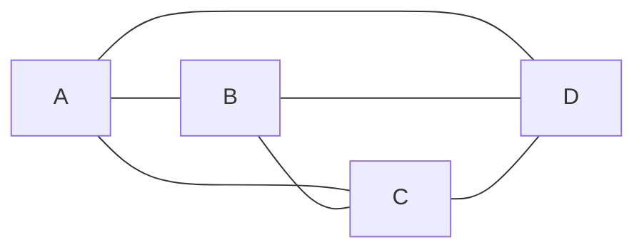



요약

두 기기를 전용선 하나로 바로 잇는 연결이다. 두 사람만 쓰는 직통 전화와 같다. 단순하고 서로 간섭이 없다. 대신 모든 기기를 이렇게 이으면 기기가 늘어날 때 선이 감당할 수 없이 늘어난다.

## 예시로 보기

통신망은 두 가지로 이루어진다. 통신하는 기기 하나하나를 **노드**(단말)라 부르고, 노드를 잇는 케이블이나 채널을 **링크**라 부른다[^1]. 점대점 링크는 끝에 노드가 딱 둘뿐인 링크다. 그래서 보낸 데이터는 언제나 반대편 한 곳으로 간다.

방 4개를 인터폰으로 서로 모두 잇는다고 하자. 방 A에는 B·C·D로 가는 선 3개가 필요하다. 방마다 선 끝이 3개이니 모두 12개다. 선 하나에는 끝이 2개이므로 선은 6개다.

네트워크 말로 하면 방 하나하나가 노드, 인터폰 선 하나하나가 링크다. 노드 수를 $$n$$, 링크 수를 $$m$$이라 쓰면 여기서는 $$n = 4$$, $$m = 6$$이다. 선이 얼마나 긴지, 무엇으로 만들었는지는 따지지 않는다. 누가 누구와 직접 이어졌는지만 본다. 이렇게 모든 쌍을 하나씩 이은 모양을 **완전 연결**이라 한다.

## 정확히 말하면

정의

링크 하나에 붙은 노드가 **딱 2개**이면 그 링크를 **점대점 링크**라 한다. 
노드 $$n$$개의 모든 쌍을 점대점 링크로 하나씩 이은 모양이 **완전 연결**이다. 이산수학의 완전 그래프 $$K_n$$과 같은 모양이다. 완전 연결에는 다음이 필요하다.
- 링크 수: $$m = \binom{n}{2} = \dfrac{n(n-1)}{2}$$($$\binom{\ }{\ }$$은 위의 수만큼 있는 것에서 아래의 수만큼 고르는 경우의 수)
- 노드 하나에 필요한 포트(선을 꽂는 자리) 수: $$n - 1$$
- $$n \ge 2$$이면 $$\dfrac{n^2}{4} \le m \le \dfrac{n^2}{2}$$. 즉 링크 수는 $$n^2$$에 비례해 늘어난다[^s1].

**기호로 쓰면.** 링크 $$e$$에 붙은 노드가 정확히 2개이면 $$e$$는 점대점이다. 노드 집합을 $$V$$, 노드 수를 $$n = \vert V\vert  \in \mathbb{N}$$($$\vert V\vert $$는 $$V$$의 원소 개수, $$\mathbb{N}$$은 0 이상의 정수)이라 하자. 완전 연결은 $$V$$의 서로 다른 모든 쌍을 각각 점대점 링크로 이은 것이다.

왜 $$n(n-1)/2$$일까? 노드마다 나머지 $$n-1$$개와 이어지니 포트를 모두 세면 $$n(n-1)$$개다. 그런데 링크 하나는 양 끝 포트에서 한 번씩, 모두 두 번 세어졌다. 그래서 링크 수는 그 절반이다. 숫자로 보면 노드 10개는 45개, 100개는 4,950개다[^s1]. 노드가 10배가 되면 링크는 약 100배가 된다[^s1].

n²/4 ≤ m ≤ n²/2 유도

1. $$n \ge 2$$이면 $$n - 1 \ge n/2$$이다. 양변에 $$n/2$$를 곱하면 $$m = n(n-1)/2 \ge n^2/4$$.
2. $$n - 1 < n$$이므로 $$m < n^2/2$$.

**링크는 실제로 무엇인가.** 링크는 신호가 실제로 지나가는 통로(물리적 매체)다. 케이블일 수도 있고 공기일 수도 있다. 그래서 유선과 무선으로 나뉜다. 그런데 링크를 꼭 눈에 보이는 선 하나로만 볼 필요는 없다. 케이블 한 가닥 위에 통로(논리적 링크)를 여러 개 실을 수도 있다. 예를 들어 ADSL은 전화선 한 가닥으로 전화와 인터넷을 함께 쓴다. 당분간은 링크 하나를 케이블 하나로 본다[^4].

**전송 모드.** 링크 위에서 데이터가 어느 방향으로 흐를 수 있는지에 따라 셋으로 나눈다[^4].

| 모드 | 방향 | 예[^s3] |
|---|---|---|
| 단방향 (Simplex) | 한쪽으로만 | TV 방송 |
| 반이중 (Half-duplex) | 양쪽 모두, 한 번에 한쪽만 | 무전기 (말할 때 버튼을 누름) |
| 전이중 (Full-duplex) | 양쪽 모두, 동시에 | 전화 |

검증: $$n = 0, \dots, 20$$에서 노드 쌍을 직접 나열해 센 값이 $$n(n-1)/2$$와 같고, 노드별 포트 수 $$n-1$$과 $$n^2/4 \le m \le n^2/2$$도 맞는다 (실험으로 확인. 모든 $$n$$에서 맞는 이유는 위의 두 번 세기) — [01_point-to-point-link_verify.py](/Hongs_Blog/studies/computer-communication/code/01_point-to-point-link_verify/)

## 예제

- 점대점인 것: 슬라이드 그림 (a)의 두 상자를 선 하나로 이은 point-to-point 네트워크[^2], 회선 스위칭으로 확보한 A–D 사이의 회선("기본적으로 point-to-point 연결")[^3], 두 라우터를 직접 잇는 광케이블 한 가닥[^s2]
- 아닌 것: 슬라이드 그림 (b)의 다중 접근 버스(링크 하나에 노드가 여럿)[^2], 스위치를 거쳐 이어진 두 호스트(사이에 중계 노드가 있음)
- 아주 작은 경우: $$n = 0$$이나 $$n = 1$$이면 링크는 0개다. $$n = 2$$이면 링크 1개가 곧 완전 연결이다.

## 활용

- 링크가 $$n^2$$에 비례해 늘고 노드마다 포트가 $$n-1$$개 필요하다. 그래서 큰 네트워크는 완전 연결로 만들지 않는다[^1]. 대안은 선 하나를 함께 쓰는 [다중 접근 링크](/Hongs_Blog/studies/computer-communication/multiple-access-link/)와 중계 장치를 두는 [스위칭 네트워크](/Hongs_Blog/studies/computer-communication/switched-network/)다.
- 점대점 연결 네트워크는 가장 간단한 네트워크이고, 더 큰 네트워크를 쌓는 기본 벽돌이다. 그 위에서 할 일(비트 교환, 프레이밍, 오류 검출)은 [데이터 링크 계층](/Hongs_Blog/studies/computer-communication/data-link-layer/)이 맡는다[^5].
- 매체의 종류는 [유선 링크](/Hongs_Blog/studies/computer-communication/wired-links/)와 [무선 링크](/Hongs_Blog/studies/computer-communication/wireless-links/)에 있다.
- 장거리 구간에서 두 장비를 직접 잇는 링크에 쓴다. 점대점 링크 전용 프로토콜로 PPP(RFC 1661)가 있다[^s2].

## 연결

- 이어지는 개념: [다중 접근 링크](/Hongs_Blog/studies/computer-communication/multiple-access-link/), [스위칭 네트워크](/Hongs_Blog/studies/computer-communication/switched-network/), [다중화](/Hongs_Blog/studies/computer-communication/multiplexing/)
- 이산수학의 완전 그래프 $$K_n$$과 차수 합 공식 $$\sum_{v \in V} \deg(v) = 2\vert E\vert $$($$\sum$$은 차례로 모두 더한다는 기호)가 같은 두 번 세기다.

## 자주 하는 오해

"직접 링크는 곧 점대점 링크다"

틀렸다. 슬라이드 "연결: 직접 링크"에서 점대점 연결이 먼저 나오고, 둘 다 중간 장치 없이 잇는다는 느낌을 줘서 같은 말처럼 보인다. 실제로 "직접"은 사이에 중계 노드가 없다는 뜻이고, "점대점"은 끝점이 둘뿐이라는 뜻이다. 다중 접근도 중계 노드가 없으므로 직접 링크다[^1]. 슬라이드에서 (a) 점대점과 (b) 다중 접근이 모두 "직접 링크" 제목 아래에 있는 것으로 확인할 수 있다[^2].

## 확인 문제

<b>C1</b> 통신망을 이루는 두 가지 요소를 쓰고, 점대점 링크를 정의하라.

**답:** 노드(단말)와 링크(케이블, 채널 등). 점대점 링크는 끝점이 정확히 두 개인 링크로, 두 기기를 중계 장치 없이 곧장 잇는다. 
**흔한 오답:** "중계 장치 없이 잇는 링크"만 쓰는 것. 다중 접근 링크에도 맞는 설명이라 둘을 가르지 못한다. "끝점이 둘"이 핵심이다.

<b>C2</b> 노드 8개를 모든 쌍끼리 점대점으로 이으려면 링크 몇 개, 노드당 포트 몇 개가 필요한가?

**답:** 링크 $$8 \cdot 7 / 2 = 28$$개, 노드당 포트 7개. 
**이유:** 포트를 모두 세면 $$8 \cdot 7 = 56$$이다. 링크마다 양 끝에서 두 번 세어졌으므로 2로 나눈다. 
**흔한 오답:** 56(2로 나누지 않음), 64(증가 속도 $$n^2$$과 정확한 값을 혼동).

<b>C4</b> "직접 링크 = 점대점 링크"가 틀린 이유를 슬라이드의 예로 설명하라.

**답:** 슬라이드의 다중 접근(multiple access) 버스도 "직접 링크"에 속한다. 사이에 중계 노드가 없기 때문이다. 하지만 끝점이 여럿이라 점대점은 아니다. 직접 링크는 점대점과 다중 접근을 모두 포함한다.

<b>C5</b> (a) 무전기 (b) 전화 통화 (c) TV 방송의 전송 모드는 각각 무엇인가? 반이중과 전이중을 가르는 기준은?

**답:** (a) 반이중. (b) 전이중. (c) 단방향(simplex). 반이중은 양쪽 모두 보낼 수 있지만 한 번에 한쪽만 보낸다. 전이중은 양쪽이 동시에 보낸다. 
**흔한 오답:** 무전기를 단방향으로 보는 것. 무전기도 양쪽 모두 말할 수 있다. 다만 동시에 말할 수 없다.

[^1]: 4-1학기/컴퓨터 통신/2.필기노트/01.1주차.md, 12~24행
[^2]: 4-1학기/pasted_images/Pasted image 20260924184222.png — 슬라이드 "연결: 직접 링크 (Direct Links)"
[^3]: 4-1학기/pasted_images/Pasted image 20260924200141.png — 슬라이드 "간접 연결 방법: 스위칭 정책"
[^4]: 4-1학기/pasted_images/Pasted image 20260926022517.png — 슬라이드 "링크 (Link)" (2장. 데이터 링크 네트워크: 점대점 링크)
[^5]: 4-1학기/pasted_images/Pasted image 20260926021332.png — 슬라이드 "데이터 링크 계층"
[^s1]: 에이전트 보충. 필기 21행은 증가 차수 "$$n^2$$"만 적는다. 정확한 개수 $$n(n-1)/2$$와 부등식의 근거는 두 번 세기 논증과 검증 코드다. 본문의 45, 4,950은 이 공식에 $$n = 10, 100$$을 넣은 값이다.
[^s2]: 에이전트 보충. 광케이블 예와 PPP는 원본에 없는 실제 사용처다. PPP는 RFC 1661(1994)에 정의되어 있다.
[^s3]: 에이전트 보충. 전송 모드의 예(TV 방송, 무전기, 전화)는 원본에 없다. 슬라이드는 세 모드의 이름과 화살표 그림만 준다.

